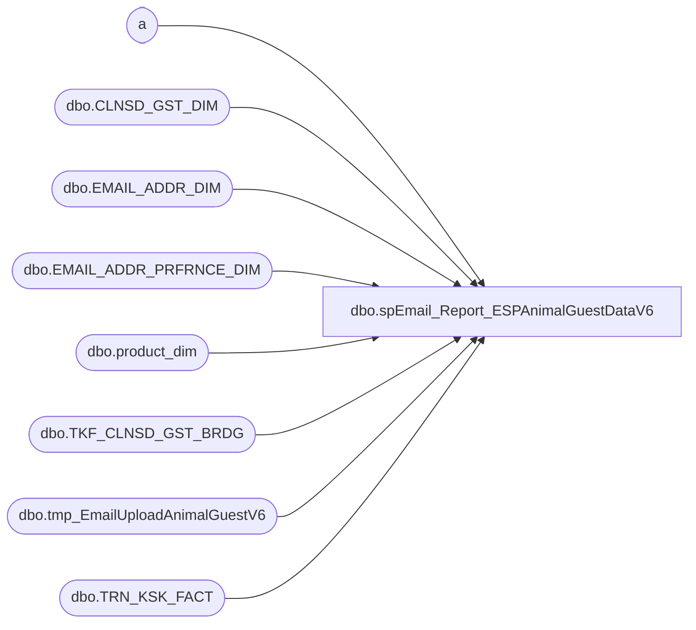

# dbo.spEmail_Report_ESPAnimalGuestDataV6

**Database:** dw  
**Server:** papamart  

## Architecture Diagram



## Table Dependencies

| Referenced Table |
|---|
| a |
| dbo.CLNSD_GST_DIM |
| dbo.EMAIL_ADDR_DIM |
| dbo.EMAIL_ADDR_PRFRNCE_DIM |
| dbo.product_dim |
| dbo.TKF_CLNSD_GST_BRDG |
| dbo.tmp_EmailUploadAnimalGuestV6 |
| dbo.TRN_KSK_FACT |

## Stored Procedure Code

```sql
CREATE PROC [dbo].[spEmail_Report_ESPAnimalGuestDataV6]
-- =============================================================================================================
-- Name: [dbo].[spEmail_Report_ESPAnimalGuestDataV6]
--
-- Description:	selects data and sends to ESP via FTP text file
--
-- Input:	@ad_date	datetime		grabs records updated since this date
--			@reload		bit				if 1, reload all records
--
-- Output: N/A
--
-- Dependencies: 
--
-- Revision History
--		Name:			Date:			Comments:
--		Gary Derikito	07/29/2012		Created
--		GaryD			09/26/2012		Change to send email to email animal is registered to.
--		GaryD			10/16/2012		Add email to exclude and remove test code.
--		GaryD			10/26/2012		Limit data to first and last record because of unzip error at Responsys.
--		GaryD			10/29/2012		Update file path

/*
DECLARE @date datetime
SET @date = CONVERT(VARCHAR, DATEADD(DAY, -3, GETDATE()), 101)
Exec spEmail_Report_ESPAnimalGuestDataV6 @ad_date = @date,  @reload = 1

DECLARE @date datetime
SET @date = CONVERT(VARCHAR, DATEADD(DAY, -3000, GETDATE()), 101)
Exec spEmail_Report_ESPAnimalGuestDataV6 @ad_date = @date,  @reload = 0
*/
-- =============================================================================================================
@ad_date datetime=NULL,
@reload bit=0
AS 
    SET NOCOUNT ON

IF @ad_date IS NULL
	SET @ad_date = CONVERT(VARCHAR, DATEADD(DAY, -1, GETDATE()), 101)

CREATE TABLE #tmpemailids
(
	email_addr_id int
)

--Exclude bad emails
SELECT EMAIL_ADDR_ID
INTO #tmp_ExcludeEmails
FROM dbo.EMAIL_ADDR_DIM e WITH (NOLOCK)
WHERE e.email_addr_txt LIKE '%BABWTEST.com%'
    
CREATE INDEX IX_tmp_ExcludeEmails_emailaddrid
ON #tmp_ExcludeEmails (email_addr_id);

IF @reload = 0
BEGIN
--Only need to know when a registration is new for this procedure

   --GRAB NEW REGISTRATION DATA
    INSERT #tmpemailids
    SELECT DISTINCT
            e.email_addr_id
    FROM    dw.dbo.[TRN_KSK_FACT] tkf WITH (NOLOCK)
		INNER JOIN dw.dbo.[TKF_CLNSD_GST_BRDG] b WITH (NOLOCK) ON tkf.[TKF_ID] = b.[TKF_ID]
		INNER JOIN dw.dbo.[CLNSD_GST_DIM] g WITH (NOLOCK) ON b.[CLNSD_GST_ID] = g.[CLNSD_GST_ID]
		INNER JOIN dw.dbo.[EMAIL_ADDR_DIM] e WITH (NOLOCK) ON g.[EMAIL_ADDR_ID] = e.[EMAIL_ADDR_ID]
		INNER JOIN dw.dbo.EMAIL_ADDR_PRFRNCE_DIM ep WITH (NOLOCK) ON e.EMAIL_ADDR_ID = ep.EMAIL_ADDR_ID
    WHERE  tkf.[INS_DT] >= @ad_date AND e.email_addr_id > 0 AND RTRIM(LTRIM(email_stat_cd)) = 'VALID' --if the email is not valid, we probably do not want to send up new registration data
		AND (ep.promo_pref = 'Y' OR ep.sfspnts_pref = 'Y' OR ep.sfscert_pref = 'Y')
		AND e.EMAIL_ADDR_ID NOT IN (SELECT email_addr_id FROM #tmp_ExcludeEmails)
--Testing filter
--and e.EMAIL_ADDR_ID in (select email_addr_id from dbo.tmp_TestCases)
--Testing filter
	
--select * from #tmpemailids return
		
	
END
ELSE ---start of full load section
BEGIN
--A.  Get all valid emails that have at least one opt-in
	INSERT #tmpemailids
		SELECT DISTINCT e.email_addr_id
    FROM    dw.dbo.[EMAIL_ADDR_DIM] e WITH ( NOLOCK )
		INNER JOIN dw.dbo.EMAIL_ADDR_PRFRNCE_DIM ep WITH (NOLOCK) ON e.EMAIL_ADDR_ID = ep.EMAIL_ADDR_ID
    WHERE  RTRIM(LTRIM(email_stat_cd)) = 'VALID' 
    		AND (ep.promo_pref = 'Y' OR ep.sfspnts_pref = 'Y' OR ep.sfscert_pref = 'Y')
    		AND e.EMAIL_ADDR_ID NOT IN (SELECT email_addr_id FROM #tmp_ExcludeEmails)
--testing filter
    		--and e.EMAIL_ADDR_ID in (select email_addr_id from dbo.tmp_TestCases)
--testing filter

END

CREATE INDEX IX_tmpemailids_emailaddrid
    ON #tmpemailids (email_addr_id); 

--select top 300 * from #tmpemailids return
		
--X1.  Find all guests who live at a physical address ids that are associated with these emails
SELECT DISTINCT g.CLNSD_ADDR_ID, g.CLNSD_GST_ID
INTO #tmpPhysAddr
FROM #tmpemailids e
	INNER JOIN dw.dbo.clnsd_gst_dim g WITH (NOLOCK) ON e.email_addr_id = g.EMAIL_ADDR_ID
WHERE g.CLNSD_ADDR_ID > 0
--where  CLNSD_ADDR_ID   =128631

--testing query
--select g.*
--select distinct g.EMAIL_ADDR_ID
-- from #tmpPhysAddr t
-- join dw.dbo.clnsd_gst_dim g
-- on (t.CLNSD_GST_ID = g.CLNSD_GST_ID)
-- --where  t.CLNSD_ADDR_ID   =128631 
-- --order by g.clnsd_addr_id
-- return
--testing query


CREATE INDEX IX_tmpPhysAddr_addrud_gstid
    ON #tmpPhysAddr (CLNSD_ADDR_ID, clnsd_gst_id); 

CREATE INDEX IX_tmpPhysAddr_gstid
    ON #tmpPhysAddr (clnsd_gst_id); 

--X2.  Find animals associated with people who live in a house
CREATE TABLE [#tmpanimal](
	customer_id int NOT NULL,
	clnsd_gst_id INT NULL,
	first_name VARCHAR(60) NULL,
	last_name VARCHAR(60) NULL,
	animal_name VARCHAR(50) NULL,
	sku BIGINT  NULL,
	class VARCHAR(20) NULL,
	animal_bday DATETIME NULL,
	guest_bday DATETIME NULL,
	KSK_REGIS_START_DT DATETIME,
	TKF_ID INT NULL,
	Tx	CHAR(3) NULL,
	clnsd_addr_id INT NULL)
	
	 
INSERT INTO #tmpanimal(customer_id, clnsd_gst_id, first_name, last_name, animal_name, sku, class, animal_bday, guest_bday, KSK_REGIS_START_DT, TKF_ID, clnsd_addr_id)
SELECT DISTINCT
c.email_addr_id AS 'customer_id'
,c.CLNSD_GST_ID
,c.FRST_NM 
,c.LAST_NM
,tkf.ANML_NM
,p.sku 
,p.class
,tkf.ANML_BRTH_DT
,c.BRTH_DT
,tkf.KSK_REGIS_START_DT
,tkf.TKF_ID
,a.CLNSD_ADDR_ID
--,*
FROM #tmpPhysAddr a
	INNER JOIN dw.dbo.[CLNSD_GST_DIM] c WITH ( NOLOCK ) on (a.CLNSD_GST_ID = c.CLNSD_GST_ID)
	INNER JOIN dw.dbo.tkf_clnsd_gst_brdg b WITH (NOLOCK) ON b.CLNSD_GST_ID = c.clnsd_gst_id
	INNER JOIN dw.dbo.trn_ksk_fact tkf WITH (NOLOCK) ON b.tkf_id = tkf.tkf_id
	INNER JOIN dw.dbo.product_dim p WITH (NOLOCK) ON (tkf.PRDCT_ID = p.product_key)
--where  a.CLNSD_ADDR_ID   =128631 Gary address
--where a.CLNSD_ADDR_ID  = 1287600 --Keiths
order by a.CLNSD_ADDR_ID
--return


CREATE INDEX IX_#tmpanimal_TKF_ID
    ON #tmpanimal (TKF_ID); 

CREATE INDEX IX_#tmpanimal_KSK_REGIS_START_DT
    ON #tmpanimal (KSK_REGIS_START_DT);

--select * from #tmpanimal  return
--select distinct t.customer_id from #tmpanimal t return
--where first_name = 'Alex'
--order by KSK_REGIS_START_DT
--return

SELECT a.clnsd_gst_id, 
MIN(a.KSK_REGIS_START_DT) fday, 
(SELECT MIN(TKF_ID) FROM #tmpanimal af WHERE af.CLNSD_GST_ID = a.CLNSD_GST_ID AND af.KSK_REGIS_START_DT = MIN(a.KSK_REGIS_START_DT)) AS   'fid', 
MAX(a.KSK_REGIS_START_DT) lday, 
(SELECT MAX(TKF_ID) FROM #tmpanimal al WHERE al.CLNSD_GST_ID = a.CLNSD_GST_ID AND al.KSK_REGIS_START_DT = MAX(a.KSK_REGIS_START_DT)) AS   'lid'  
INTO #tmpfirstlast
FROM #tmpanimal a
GROUP BY a.customer_id, a.clnsd_gst_id

--select * from #tmpfirstlast return

UPDATE a
SET Tx = 'F'
FROM #tmpanimal a JOIN #tmpfirstlast fl ON (a.clnsd_gst_id = fl.clnsd_gst_id)
WHERE a.tkf_id = fl.fid

UPDATE a
SET Tx = 'F&L'
FROM #tmpanimal a JOIN #tmpfirstlast fl ON (a.clnsd_gst_id = fl.clnsd_gst_id)
WHERE a.tkf_id = fl.lid
AND a.Tx = 'F'

UPDATE a
SET Tx = 'L'
FROM #tmpanimal a JOIN #tmpfirstlast fl ON (a.clnsd_gst_id = fl.clnsd_gst_id)
WHERE a.tkf_id = fl.lid
AND a.Tx IS NULL


--select * from #tmpanimal return


--SAVE EVERYTHING TO PHYSICAL TABLE
if (Object_ID('dw.dbo.tmp_EmailUploadAnimalGuestV6') IS NOT NULL) DROP TABLE dw.dbo.tmp_EmailUploadAnimalGuestV6

CREATE TABLE [dbo].[tmp_EmailUploadAnimalGuestV6](
	[customer_id] [int] NOT NULL,
	[clnsd_gst_id] [int] NOT NULL,
	[sequence] [int] NULL,
	[guest_fname] [varchar] (60) NULL,
	[guest_lname] [varchar] (60) NULL,
	[animal_name] [varchar] (50) NULL,
	[animal_sku] [varchar](100) NULL,
	[animal_category] [varchar](100) NULL,
	[animal_bday] [datetime] NULL,
	[guest_bday] [datetime] NULL,
	[reg_dt] [datetime] NULL,
	[tx] [char](3) NULL,
	clnsd_addr_id INT NULL)

INSERT dw.dbo.tmp_EmailUploadAnimalGuestV6
SELECT
	customer_id,
	clnsd_gst_id,
	ROW_NUMBER() OVER(PARTITION BY customer_id, clnsd_gst_id ORDER BY  KSK_REGIS_START_DT) AS Row,
	first_name,
	last_name,
	animal_name,
	sku,
	class,
	animal_bday,
	guest_bday,
	KSK_REGIS_START_DT,
	Tx,
	clnsd_addr_id
FROM #tmpanimal
WHERE tx IS NOT NULL


--select * from dw.dbo.tmp_EmailUploadAnimalGuestV6 
--where clnsd_gst_id in (9697541, 10774822,17668449,30675386) --gary's fam
--where clnsd_gst_id in (30900589, 31943281, 38999758) -- keiths
--where clnsd_gst_id in (33107338) --carla
--where customer_id = 13435824
--order by customer_id

--one cleansed guest can have multiple emails
--select * 
--from dw.dbo.tmp_EmailUploadAnimalGuestV6 g1 join  dw.dbo.tmp_EmailUploadAnimalGuestV6 g2
--on (g1.clnsd_gst_id = g2.clnsd_gst_id)
--and g1.customer_id <> g2.customer_id
--order by g1.clnsd_gst_id , g2.clnsd_gst_id
--


    DECLARE @cmd varchar(1000),
        @filename varchar(100),
		@filename_header varchar(100),
        @path varchar(200),
        @filedate varchar(20),
        @selectstmnt varchar(5000),
        @bcpsql varchar(500),
		@columnheaders varchar(4000), 
		@tablename varchar(128)

--CREATE TABLE CONTAINING COLUMN HEADERS FOR FILE EXPORT
SET @columnheaders = ''
SET @tablename='tmp_EmailUploadAnimalGuestV6'

SELECT @columnheaders = @columnheaders + c.name + '| '
 FROM syscolumns c INNER JOIN sysobjects o ON o.id = c.id
 WHERE o.name = @tablename
 ORDER BY colid

SELECT @columnheaders = Substring(@columnheaders, 1, Datalength(@columnheaders) - 2)

if (Object_ID('dw.dbo.tmp_EmailUploadAnimalGuest_HeaderV6') IS NOT NULL) DROP TABLE dw.dbo.tmp_EmailUploadAnimalGuest_HeaderV6

SELECT @columnheaders AS columnheader
INTO dw.dbo.tmp_EmailUploadAnimalGuest_HeaderV6

    SET @path = 'I:\Responsys\Upload\V6\'
	SET @filedate = CONVERT(VARCHAR(20), GETDATE(), 112)
    SET @filename = 'BABW_OPTINEMAILV6_ANIMALGUEST_' + @filedate + '.txt'
	SET @filename_header = 'BABW_OPTINEMAIL_ANIMALGUEST_HEADERV6.txt'

--CREATE FILE CONTAINING EMAILS USING BCP COMMAND
    SET @selectstmnt = 'SELECT * FROM dw.dbo.tmp_EmailUploadAnimalGuestV6'
    SET @bcpsql = 'bcp "' + @selectstmnt + '" queryout "' + @path + @filename
        + '.data" -t "|" -T -c'
    EXEC master..xp_cmdshell @bcpsql--, no_output

    SET @selectstmnt = 'SELECT * FROM dw.dbo.tmp_emailuploadAnimalGuest_headerV6'
    SET @bcpsql = 'bcp "' + @selectstmnt + '" queryout "' + @path + @filename_header
        + '" -t "|" -T -c'
    EXEC master..xp_cmdshell @bcpsql--, no_output

    SET @cmd = 'copy ' + @path + @filename_header + '+' + @path + @filename
            + '.data ' + @path + @filename 
    EXEC master..xp_cmdshell @cmd, no_output

--COMPRESS FILE
    SELECT  @cmd = '"C:\Program Files\7-zip\7z.exe" a -tzip '
            + @path + REPLACE(@filename, '.txt', '') + '.zip ' + @path
            + @filename 
    EXEC master..xp_cmdshell @cmd--, no_output

--DELETE TEXT FILE
    SELECT  @cmd = 'del ' + @path + '*.txt /Q /F'
    EXEC master..xp_cmdshell @cmd, no_output

	SELECT  @cmd = 'del ' + @path + '*.data /Q /F'
    EXEC master..xp_cmdshell @cmd, no_output

dbo,spGuestLoad_Generate_EMail_Statistics,-- =============================================================================================================
-- Name: spGuestLoad_Generate_EMail_Statistics
--
-- Description:	
--		This process updates the statistics on the batch record with the number of records that should be
--		processed and the number processed.
--
--		A batch is considered to be closed when we get the same number of records two times in a row
--		and there was something to be posted and there was something posted.
--
-- Input:
--		@batchID			int	
--			The batch number to process
--
-- Output: 
--		None
--
-- Dependencies: 
--
-- EXAMPLE:
--		exec dw.dbo.spGuestLoad_Generate_EMail_Statistics @batchID = ?
--
-- Revision History
--		Name:				Date:			Comments:
--		Gary Murrish		2/25/2011		created
--		Edin Pehilj			3/27/2014		added isnull to data gathering statement
-- =============================================================================================================
CREATE PROCEDURE [dbo].[spGuestLoad_Generate_EMail_Statistics] @batchID int
AS
BEGIN
	-- SET NOCOUNT ON added to prevent extra result sets from
	-- interfering with SELECT statements.
    SET NOCOUNT ON ;

    DECLARE @numGuestsToProcess integer
    DECLARE @numGuestsProcessed integer
    DECLARE @numGuestsToInvalidate integer
    DECLARE @numGuestsInvalidated integer
    DECLARE @numAttrsToProcess integer
    DECLARE @numAttrsProcessed integer

    SELECT
        @numGuestsToInvalidate = ISNULL([# Emails to Invalidate],0)
       ,@numGuestsInvalidated = ISNULL([# Emails Invalidated],0)
       ,@numGuestsToProcess = ISNULL([# Customers to Update],0)
       ,@numGuestsProcessed = ISNULL([# Customers Updated],0)
       ,@numAttrsToProcess = ISNULL([# Attributes to Update],0)
       ,@numAttrsProcessed = ISNULL([# Attributes Updated],0)
    FROM
        crmdb02.crm.dbo.vwDW_GuestLoad_EMail_Verify
    WHERE
    BATCH_ID = @batchID

    DECLARE @GuestsToPost integer
    DECLARE @GuestsPosted integer
    SET @GuestsToPost = @numGuestsToProcess + @numGuestsToInvalidate
    SET @GuestsPosted = @numGuestsProcessed + @numGuestsInvalidated

    DECLARE @wasGuestsToPost integer
    DECLARE @wasGuestsPosted integer
    DECLARE @wasAttrToPost integer
    DECLARE @wasAttrPosted integer
    DECLARE @wasBatch_Status integer
    DECLARE @CMPL_DT datetime

    SELECT
        @wasGuestsToPost = NUM_GUESTS_TO_CHANGE + NUM_GUESTS_TO_INVALIDATE
       ,@wasGuestsPosted = NUM_GUESTS_CHANGED + NUM_GUESTS_INVALIDATED
       ,@wasAttrToPost = NUM_ATTRS_TO_CHANGE
       ,@wasAttrPosted = NUM_ATTRS_CHANGED
       ,@wasBatch_Status = BATCH_Status
       ,@CMPL_DT = CMPLT_DT
    FROM
        dbo.GuestLoad_CRM_Update_Batch_Email
    WHERE
    batch_id = @batchID

-- Figure out what the status should be.
    DECLARE @newBatch_Status integer

    SET @newBatch_Status = @wasBatch_Status

    IF @guestsToPost = @wasGuestsToPost	-- Same number of records to post since the last time
    AND @numAttrsToProcess = @wasAttrToPost
    AND @guestsPosted = @wasGuestsPosted
    AND @numAttrsProcessed = @wasAttrPosted
        BEGIN
	-- See if there has been some posting activity (that the file is not hung)
            IF (@guestsToPost <> 0
                AND @guestsPosted <> 0)
            AND (@numAttrsToProcess <> 0
                 AND @NumAttrsProcessed <> 0)
                BEGIN
                    SET @newBatch_Status = 900
                    SET @CMPL_DT = GETDATE()
                END
        END


    UPDATE
        dbo.GuestLoad_CRM_Update_Batch_Email
    SET
        NUM_GUESTS_TO_CHANGE = isnull(@numGuestsToProcess,0)
       ,NUM_GUESTS_TO_INVALIDATE = isnull(@numGuestsToInvalidate,0)
       ,NUM_ATTRS_TO_CHANGE = isnull(@numAttrsToProcess,0)
       ,NUM_GUESTS_CHANGED = isnull(@numGuestsProcessed,0)
       ,NUM_GUESTS_INVALIDATED = isnull(@numGuestsInvalidated,0)
       ,NUM_ATTRS_CHANGED = isnull(@numAttrsProcessed,0)
       ,BATCH_Status = @newBatch_Status
       ,CMPLT_DT = @CMPL_DT
    WHERE
    batch_id = @batchID

END
```

