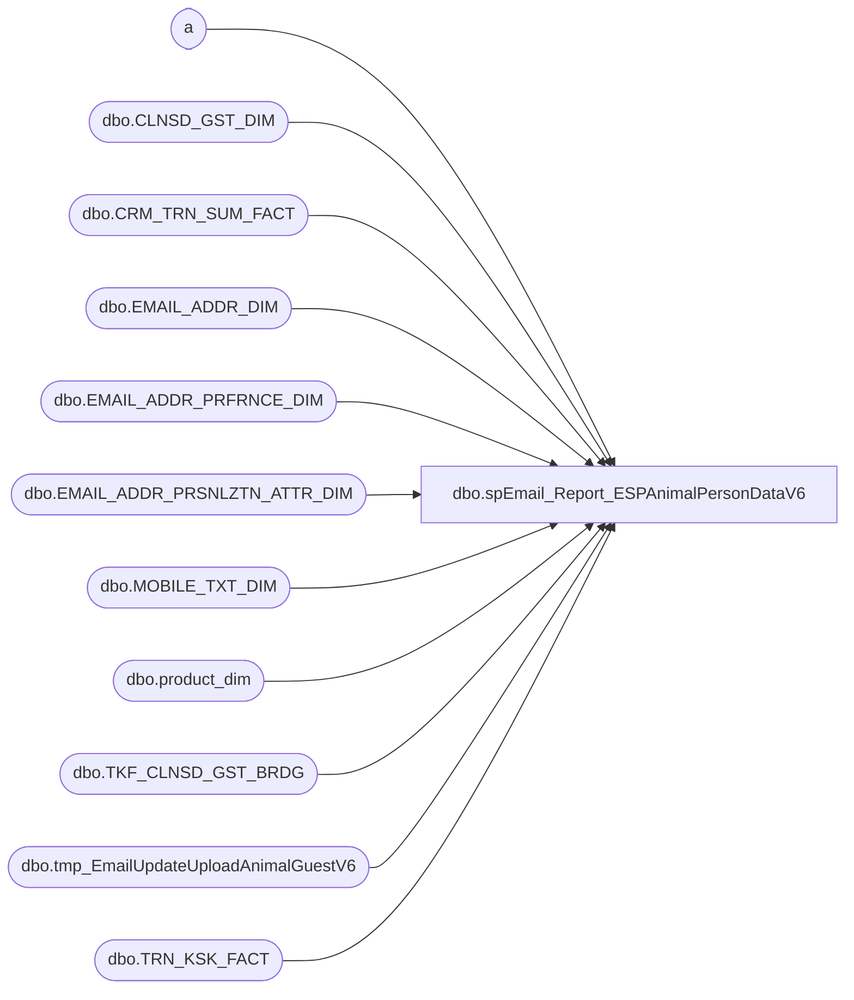

# dbo.spEmail_Report_ESPAnimalPersonDataV6

**Database:** dw  
**Server:** papamart  

## Architecture Diagram



## Table Dependencies

| Referenced Table |
|---|
| a |
| dbo.CLNSD_GST_DIM |
| dbo.CRM_TRN_SUM_FACT |
| dbo.EMAIL_ADDR_DIM |
| dbo.EMAIL_ADDR_PRFRNCE_DIM |
| dbo.EMAIL_ADDR_PRSNLZTN_ATTR_DIM |
| dbo.MOBILE_TXT_DIM |
| dbo.product_dim |
| dbo.TKF_CLNSD_GST_BRDG |
| dbo.tmp_EmailUpdateUploadAnimalGuestV6 |
| dbo.TRN_KSK_FACT |

## Stored Procedure Code

```sql
CREATE PROC [dbo].[spEmail_Report_ESPAnimalPersonDataV6]
-- =============================================================================================================
-- Name: [dbo].[spEmail_Report_ESPAnimalPersonDataV6]
--
-- Description:	selects data and sends to ESP via FTP text file
--
-- Input:	@ad_date	datetime		grabs records updated since this date
--			@reload		bit				if 1, reload all records
--
-- Output: N/A
--
-- Dependencies: 
--
-- Revision History
--		Name:			Date:			Comments:
--		Gary Derikito	07/29/2012		Created
/*
DECLARE @date datetime
SET @date = CONVERT(VARCHAR, DATEADD(DAY, -1, GETDATE()), 101)
Exec spEmail_Report_ESPAnimalPersonDataV6 @ad_date = @date,  @reload = 1
*/
-- =============================================================================================================
@ad_date datetime=NULL,
@reload bit=0
AS 
    SET NOCOUNT ON

IF @ad_date IS NULL
	SET @ad_date = CONVERT(VARCHAR, DATEADD(DAY, -1, GETDATE()), 101)

CREATE TABLE #tmpemailids
(
	email_addr_id int
)

IF @reload = 0
BEGIN
--GRAB ALL UPDATED EMAIL IDS
	INSERT #tmpemailids
    SELECT DISTINCT email_addr_id
    FROM    dw.dbo.[EMAIL_ADDR_DIM] WITH ( NOLOCK )
    WHERE  [UPDT_DT] >= @ad_date 
    
    UNION
    --GRAB E-MAILS WERE PERSONALIZATION DATA HAS CHANGED
    SELECT DISTINCT e.email_addr_id
    FROM    dw.dbo.[EMAIL_ADDR_PRSNLZTN_ATTR_DIM] p WITH ( NOLOCK )
		INNER JOIN dw.dbo.email_addr_dim e WITH (NOLOCK) ON e.email_addr_id = p.email_addr_id
    WHERE  p.[UPDT_DT] >= @ad_date AND RTRIM(LTRIM(email_stat_cd)) = 'VALID'
    
    --GRAB E-MAILS THAT HAVE CHANGED STATUS
    UNION 
    
    SELECT DISTINCT e.email_addr_id
    FROM    dw.dbo.[EMAIL_ADDR_DIM] e WITH ( NOLOCK )
    		INNER JOIN dw.dbo.EMAIL_ADDR_PRFRNCE_DIM ep WITH (NOLOCK) ON e.EMAIL_ADDR_ID = ep.EMAIL_ADDR_ID
    WHERE  ep.[UPDT_DT] >= @ad_date AND RTRIM(LTRIM(email_stat_cd)) = 'VALID' 


   --GRAB NEW REGISTRATION DATA
    INSERT #tmpemailids
    SELECT DISTINCT
            e.email_addr_id
    FROM    dw.dbo.[TRN_KSK_FACT] tkf WITH (NOLOCK)
		INNER JOIN dw.dbo.[TKF_CLNSD_GST_BRDG] b WITH (NOLOCK) ON tkf.[TKF_ID] = b.[TKF_ID]
		INNER JOIN dw.dbo.[CLNSD_GST_DIM] g WITH (NOLOCK) ON b.[CLNSD_GST_ID] = g.[CLNSD_GST_ID]
		INNER JOIN dw.dbo.[EMAIL_ADDR_DIM] e WITH (NOLOCK) ON g.[EMAIL_ADDR_ID] = e.[EMAIL_ADDR_ID]
		INNER JOIN dw.dbo.EMAIL_ADDR_PRFRNCE_DIM ep WITH (NOLOCK) ON e.EMAIL_ADDR_ID = ep.EMAIL_ADDR_ID
    WHERE  tkf.[INS_DT] >= @ad_date AND e.email_addr_id > 0 AND RTRIM(LTRIM(email_stat_cd)) = 'VALID' 
		AND (ep.promo_pref = 'Y' OR ep.sfspnts_pref = 'Y' OR ep.sfscert_pref = 'Y')
		AND e.EMAIL_ADDR_ID NOT IN (SELECT email_addr_id FROM #tmpemailids)
	
	--GRAB UPDATED SALES DATA	
	INSERT #tmpemailids
    SELECT DISTINCT
            e.email_addr_id
    FROM    dw.dbo.[CRM_TRN_SUM_FACT] crm WITH (NOLOCK)
		INNER JOIN dw.dbo.[CLNSD_GST_DIM] g WITH (NOLOCK) ON crm.[CLNSD_GST_ID] = g.[CLNSD_GST_ID]
		INNER JOIN dw.dbo.[EMAIL_ADDR_DIM] e WITH (NOLOCK) ON g.[EMAIL_ADDR_ID] = e.[EMAIL_ADDR_ID]
		INNER JOIN dw.dbo.EMAIL_ADDR_PRFRNCE_DIM ep WITH (NOLOCK) ON e.EMAIL_ADDR_ID = ep.EMAIL_ADDR_ID
    WHERE  crm.[INS_DT] >= @ad_date AND e.email_addr_id > 0 AND RTRIM(LTRIM(email_stat_cd)) = 'VALID' 
		AND (ep.promo_pref = 'Y' OR ep.sfspnts_pref = 'Y' OR ep.sfscert_pref = 'Y')
		AND e.EMAIL_ADDR_ID NOT IN (SELECT email_addr_id FROM #tmpemailids)
		
	--get changes to mobile data
	INSERT #tmpemailids
    SELECT DISTINCT
			e.email_addr_id
    FROM    dw.dbo.[EMAIL_ADDR_DIM] e WITH ( NOLOCK )
            INNER JOIN dw.dbo.[CLNSD_GST_DIM] c WITH ( NOLOCK ) ON e.[EMAIL_ADDR_ID] = c.[EMAIL_ADDR_ID] 
			INNER JOIN dw.dbo.MOBILE_TXT_DIM m WITH (NOLOCK) ON (c.MOBILE_TXT_ID = m.MOBILE_TXT_ID)
			INNER JOIN dw.dbo.EMAIL_ADDR_PRFRNCE_DIM ep WITH (NOLOCK) ON e.EMAIL_ADDR_ID = ep.EMAIL_ADDR_ID
	WHERE m.UPDT_DT	>= @ad_date 
		AND e.email_addr_id > 0 
		AND RTRIM(LTRIM(e.email_stat_cd)) = 'VALID' 
		AND (ep.promo_pref = 'Y' OR ep.sfspnts_pref = 'Y' OR ep.sfscert_pref = 'Y')
		AND e.EMAIL_ADDR_ID NOT IN (SELECT email_addr_id FROM #tmpemailids)
		
		
END
ELSE ---start of full load section
BEGIN
--A.  Get all valid emails that have at least one opt-in
	INSERT #tmpemailids
		SELECT DISTINCT e.email_addr_id
    FROM    dw.dbo.[EMAIL_ADDR_DIM] e WITH ( NOLOCK )
		INNER JOIN dw.dbo.EMAIL_ADDR_PRFRNCE_DIM ep WITH (NOLOCK) ON e.EMAIL_ADDR_ID = ep.EMAIL_ADDR_ID
    WHERE  RTRIM(LTRIM(email_stat_cd)) = 'VALID' 
    		AND (ep.promo_pref = 'Y' OR ep.sfspnts_pref = 'Y' OR ep.sfscert_pref = 'Y')
--testing filter
    		--and e.EMAIL_ADDR_ID between 100000 and 105000
    		--and e.EMAIL_ADDR_ID = 12293213
    		--and e.EMAIL_ADDR_ID = 16667397
    		and e.EMAIL_ADDR_ID in (16667397, 12293213)
--testing filter
--select * from #tmpemailids return
END

CREATE INDEX IX_tmpemailids_emailaddrid
    ON #tmpemailids (email_addr_id); 


--have all valid emails to this point

--select top 100 * from #tmpemailids return
		
--MATCH ALL SFS GUEST DATA WITH ANY E-MAIL THEY ARE ASSOCIATED WITH
--FIND FIRST GUEST RECORD ASSOCIATED WITH E-MAIL ADDRESS.  THIS IS THE GUEST DATA WE WILL USE.

--B.  Get all guests, SFS and nonSFS, who live at same address as the email
--
SELECT 
e.email_addr_id, 
g2.clnsd_gst_id, 
g2.FRST_NM,
g2.LAST_NM, 
g.CLNSD_ADDR_ID
--INTO #tmpsfsemails
INTO #tmpallemails
FROM #tmpemailids e
	INNER JOIN dw.dbo.clnsd_gst_dim g WITH (NOLOCK) ON e.email_addr_id = g.EMAIL_ADDR_ID
	INNER JOIN dw.dbo.clnsd_gst_dim g2 WITH (NOLOCK) ON g.CLNSD_ADDR_ID = g2.CLNSD_ADDR_ID
--WHERE g.lylty_gst_nbr IS NOT NULL
WHERE g2.CLNSD_GST_ID > 0

--Thursday.  Have all cleansed guest ids for an email.  Now get all animals to those guest ids.

--select * from clnsd_gst_dim where CLNSD_ADDR_ID = 128631

--select * from #tmpallemails return
--return

CREATE INDEX IX_tmpallemails_emailaddrid_gstid
    ON #tmpallemails (email_addr_id, clnsd_gst_id); 


--SELECT e.email_addr_id, MIN(clnsd_gst_id) AS clnsd_gst_id
--INTO #tmpsfsemails
--FROM #tmpemailids e
--	INNER JOIN dw.dbo.clnsd_gst_dim g WITH (NOLOCK) ON e.email_addr_id = g.EMAIL_ADDR_ID
--WHERE g.lylty_gst_nbr IS NOT NULL
--GROUP BY e.email_addr_id

--CREATE INDEX IX_tmpsfsemails_emailaddrid_lyltygstnbr
--    ON #tmpsfsemails (email_addr_id, clnsd_gst_id); 

/*
CREATE TABLE [#tmpemail](
	clnsd_gst_id INT NOT NULL,
	[customer_id] [int] NOT NULL
)

INSERT #tmpemail
    SELECT  
			c.clnsd_gst_id, 
			e.email_addr_id AS customer_id 
    FROM    dw.dbo.[EMAIL_ADDR_DIM] e WITH ( NOLOCK )
            INNER JOIN #tmpemailids t ON e.[EMAIL_ADDR_ID] = t.email_addr_id
            INNER JOIN #tmpsfsemails se ON e.email_addr_id = se.email_addr_id
            INNER JOIN dw.dbo.[CLNSD_GST_DIM] c WITH ( NOLOCK ) ON e.[EMAIL_ADDR_ID] = c.[EMAIL_ADDR_ID] 
						AND se.clnsd_gst_id = c.clnsd_gst_id
	WHERE c.lylty_gst_nbr IS NOT NULL 
		--and c.LYLTY_GST_NBR = 700053729
		--and c.[LAST_NM] = 'DERIKITO' 

--select * from #tmpemail return
--return

--MATCH REST OF DATA WITH INFORMATION IN PERSONALIZATION DIM IF NOT A SFS MEMBER
INSERT #tmpemail
 SELECT  ISNULL(c.clnsd_gst_id, -2), 
		e.email_addr_id AS customer_id 
    FROM    dw.dbo.[EMAIL_ADDR_DIM] e WITH ( NOLOCK )
            INNER JOIN #tmpemailids t ON e.[EMAIL_ADDR_ID] = t.email_addr_id
            LEFT JOIN dw.dbo.[CLNSD_GST_DIM] c WITH ( NOLOCK ) ON e.[EMAIL_ADDR_ID] = c.[EMAIL_ADDR_ID]                                                                  
	WHERE lylty_gst_nbr IS NULL AND e.email_addr_id NOT IN (SELECT customer_id FROM #tmpemail)
	--and c.[last_nm] = 'DERIKITO'
	--and  c.clnsd_gst_id  = 802517
			
CREATE INDEX IX_tmpemail_customerid
    ON #tmpemail (customer_id); 
 */   

--At this point have clnsd_gst_id for SFS and non-SFS guests

--now get all the animal data 
/*
SELECT e.customer_id, 
	(SELECT TOP 1 ANML_NM 
	FROM dw.dbo.trn_ksk_fact ftkf WITH (NOLOCK) WHERE (ftkf.tkf_id = tkf.tkf_id)
	ORDER BY KSK_REGIS_START_DT DESC, ANML_BRTH_DT) AS 'first_animal_name'
--INTO #tmpfirstlast
FROM #tmpemail e
	INNER JOIN dw.dbo.tkf_clnsd_gst_brdg b WITH (NOLOCK) ON e.CLNSD_GST_ID = b.clnsd_gst_id
	INNER JOIN dw.dbo.trn_ksk_fact tkf WITH (NOLOCK) ON b.tkf_id = tkf.tkf_id
	inner join dw.dbo.[CLNSD_GST_DIM] c WITH ( NOLOCK ) on (c.CLNSD_GST_ID = b.CLNSD_GST_ID)
--group by e.customer_id

return
*/

CREATE TABLE [#tmpanimal](
	customer_id int NOT NULL,
	clnsd_gst_id INT NULL,
	first_name VARCHAR(60) NULL,
	last_name VARCHAR(60) NULL,
	animal_name VARCHAR(50) NULL,
	sku BIGINT  NULL,
	class VARCHAR(20) NULL,
	animal_bday DATETIME NULL,
	guest_bday DATETIME NULL,
	KSK_REGIS_START_DT DATETIME,
	TKF_ID INT NULL,
	fTran	TINYINT NULL,
	lTran	TINYINT NULL)
	
--need to #tmpemail to include all clnsd_gst_ids associated with an email_addr_id
	 
INSERT INTO #tmpanimal(customer_id, clnsd_gst_id, first_name, last_name, animal_name, sku, class, animal_bday, guest_bday, KSK_REGIS_START_DT, TKF_ID)
SELECT
e.email_addr_id AS 'customer_id'
,c.CLNSD_GST_ID
,c.FRST_NM 
,c.LAST_NM
,tkf.ANML_NM
,p.sku 
,p.class
,tkf.ANML_BRTH_DT
,c.BRTH_DT
,tkf.KSK_REGIS_START_DT
,tkf.TKF_ID
--,*
--FROM #tmpemail e 
FROM #tmpallemails e
	INNER JOIN dw.dbo.tkf_clnsd_gst_brdg b WITH (NOLOCK) ON e.CLNSD_GST_ID = b.clnsd_gst_id
	INNER JOIN dw.dbo.trn_ksk_fact tkf WITH (NOLOCK) ON b.tkf_id = tkf.tkf_id
	inner join dw.dbo.[CLNSD_GST_DIM] c WITH ( NOLOCK ) on (c.CLNSD_GST_ID = b.CLNSD_GST_ID)
	INNER JOIN dw.dbo.product_dim p WITH (NOLOCK) ON (tkf.PRDCT_ID = p.product_key)
--where c.FRST_NM = 'Alex'

--select * from #tmpanimal 
--where first_name = 'Alex'
--order by KSK_REGIS_START_DT
--return

SELECT a.clnsd_gst_id, 
MIN(a.KSK_REGIS_START_DT) fday, 
(SELECT MIN(TKF_ID) FROM #tmpanimal af WHERE af.CLNSD_GST_ID = a.CLNSD_GST_ID AND af.KSK_REGIS_START_DT = MIN(a.KSK_REGIS_START_DT)) AS   'fid', 
MAX(a.KSK_REGIS_START_DT) lday, 
(SELECT MAX(TKF_ID) FROM #tmpanimal al WHERE al.CLNSD_GST_ID = a.CLNSD_GST_ID AND al.KSK_REGIS_START_DT = MAX(a.KSK_REGIS_START_DT)) AS   'lid'  
INTO #tmpfirstlast
FROM #tmpanimal a
GROUP BY a.customer_id, a.clnsd_gst_id

--select * from #tmpfirstlast return

/*
clnsd_gst_id	fday	fid	lday	lid
9697541	2004-03-28 11:34:00.000	10217196	2011-02-17 08:31:08.000	77243762
10774822	2004-03-28 11:34:00.000	10217197	2012-07-04 20:39:59.000	89300886
17668449	2012-04-28 20:14:24.000	87941733	2012-04-28 20:14:24.000	87941733
21707619	2006-07-22 17:12:37.000	27648150	2011-10-28 13:19:07.000	82956266
21712310	2006-07-22 17:21:21.000	27648157	2006-07-22 17:21:21.000	27648157
21714839	2006-07-22 17:21:07.000	27648156	2006-07-22 17:21:07.000	27648156
30675386	2009-02-17 13:45:26.000	49827382	2009-02-17 13:45:26.000	49827382
*/


UPDATE a
SET fTran = 1
FROM #tmpanimal a JOIN #tmpfirstlast fl ON (a.clnsd_gst_id = fl.clnsd_gst_id)
WHERE a.tkf_id = fl.fid

UPDATE a
SET lTran = 1
FROM #tmpanimal a JOIN #tmpfirstlast fl ON (a.clnsd_gst_id = fl.clnsd_gst_id)
WHERE a.tkf_id = fl.lid

--select * from #tmpanimal return


--SAVE EVERYTHING TO PHYSICAL TABLE
if (Object_ID('dw.dbo.tmp_EmailUpdateUploadAnimalGuestV6') IS NOT NULL) DROP TABLE dw.dbo.tmp_EmailUpdateUploadAnimalGuestV6

CREATE TABLE [dbo].[tmp_EmailUpdateUploadAnimalGuestV6](
	[customer_id] [int] NOT NULL,
	[guest_fname] [varchar] (60) NULL,
	[guest_lname] [varchar] (60) NULL,
	[animal_name] [varchar] (50) NULL,
	[animal_sku] [varchar](100) NULL,
	[animal_category] [varchar](100) NULL,
	[animal_bday] [datetime] NULL,
	[guest_bday] [datetime] NULL,
	[reg_dt] [datetime] NULL,
	[fTran] [tinyint] NULL,
	[lTran] [tinyint] NULL)

INSERT dw.dbo.tmp_EmailUpdateUploadAnimalGuestV6
SELECT
	customer_id,
	first_name,
	last_name,
	animal_name,
	sku,
	class,
	animal_bday,
	guest_bday,
	KSK_REGIS_START_DT,
	fTran,
	lTran
FROM #tmpanimal


select * from dw.dbo.tmp_EmailUpdateUploadAnimalGuestV6 order by customer_id
return


    DECLARE @cmd varchar(1000),
        @filename varchar(100),
		@filename_header varchar(100),
        @path varchar(200),
        @filedate varchar(20),
        @selectstmnt varchar(5000),
        @bcpsql varchar(500),
		@columnheaders varchar(4000), 
		@tablename varchar(128)

--CREATE TABLE CONTAINING COLUMN HEADERS FOR FILE EXPORT
SET @columnheaders = ''
SET @tablename='tmp_EmailUpdateUploadAnimalV6'

SELECT @columnheaders = @columnheaders + c.name + '| '
 FROM syscolumns c INNER JOIN sysobjects o ON o.id = c.id
 WHERE o.name = @tablename
 ORDER BY colid

SELECT @columnheaders = Substring(@columnheaders, 1, Datalength(@columnheaders) - 2)

if (Object_ID('dw.dbo.tmp_EmailUpdateUploadAnimal_HeaderV6') IS NOT NULL) DROP TABLE dw.dbo.tmp_EmailUpdateUploadAnimal_HeaderV6

SELECT @columnheaders AS columnheader
INTO dw.dbo.tmp_EmailUpdateUploadAnimal_HeaderV6

    SET @path = 'I:\Responsys\Upload\'
	SET @filedate = CONVERT(VARCHAR(20), GETDATE(), 112)
    SET @filename = 'BABW_OPTINEMAILV6_ANIMAL_' + @filedate + '.txt'
	SET @filename_header = 'BABW_OPTINEMAIL_ANIMAL_HEADERV6.txt'

--CREATE FILE CONTAINING EMAILS USING BCP COMMAND
    SET @selectstmnt = 'SELECT * FROM dw.dbo.tmp_EmailUpdateUploadAnimalV6'
    SET @bcpsql = 'bcp "' + @selectstmnt + '" queryout "' + @path + @filename
        + '.data" -t "|" -T -c'
    EXEC master..xp_cmdshell @bcpsql--, no_output

    SET @selectstmnt = 'SELECT * FROM dw.dbo.tmp_emailupdateuploadAnimal_headerV6'
    SET @bcpsql = 'bcp "' + @selectstmnt + '" queryout "' + @path + @filename_header
        + '" -t "|" -T -c'
    EXEC master..xp_cmdshell @bcpsql--, no_output

    SET @cmd = 'copy ' + @path + @filename_header + '+' + @path + @filename
            + '.data ' + @path + @filename 
    EXEC master..xp_cmdshell @cmd, no_output

--COMPRESS FILE
    SELECT  @cmd = '"C:\Program Files\7-zip\7z.exe" a -tzip '
            + @path + REPLACE(@filename, '.txt', '') + '.zip ' + @path
            + @filename 
    EXEC master..xp_cmdshell @cmd--, no_output

--DELETE TEXT FILE
    SELECT  @cmd = 'del ' + @path + '*.txt /Q /F'
    EXEC master..xp_cmdshell @cmd, no_output

	SELECT  @cmd = 'del ' + @path + '*.data /Q /F'
    EXEC master..xp_cmdshell @cmd, no_output
```

