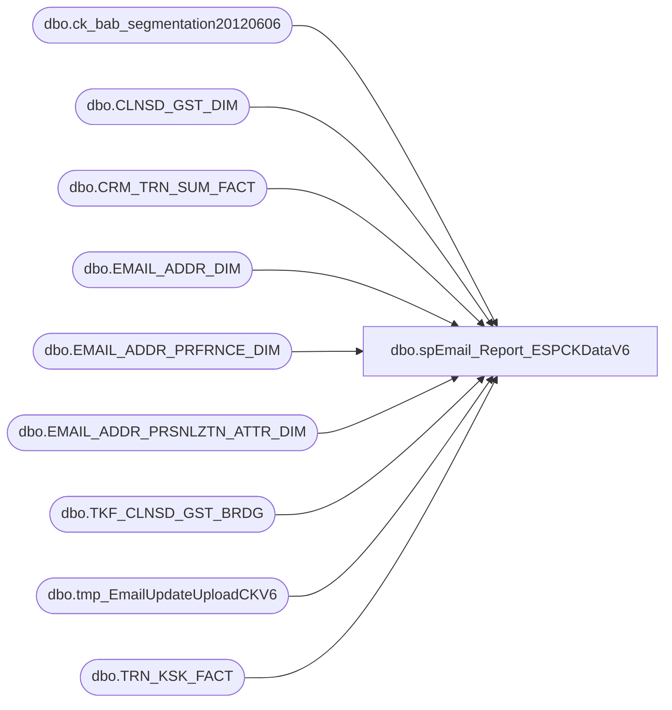

# dbo.spEmail_Report_ESPCKDataV6

**Database:** dw  
**Server:** papamart  

## Architecture Diagram



## Table Dependencies

| Referenced Table |
|---|
| dbo.ck_bab_segmentation20120606 |
| dbo.CLNSD_GST_DIM |
| dbo.CRM_TRN_SUM_FACT |
| dbo.EMAIL_ADDR_DIM |
| dbo.EMAIL_ADDR_PRFRNCE_DIM |
| dbo.EMAIL_ADDR_PRSNLZTN_ATTR_DIM |
| dbo.TKF_CLNSD_GST_BRDG |
| dbo.tmp_EmailUpdateUploadCKV6 |
| dbo.TRN_KSK_FACT |

## Stored Procedure Code

```sql
CREATE PROC [dbo].[spEmail_Report_ESPCKDataV6]
-- =============================================================================================================
-- Name: [dbo].[spEmail_Report_ESPCKDataV6]
--
-- Description:	selects data and sends to ESP via FTP text file
--
-- Input:	@ad_date	datetime		grabs records updated since this date
--			@reload		bit				if 1, reload all records
--
-- Output: N/A
--
-- Dependencies: 
--
-- Revision History
--		Name:			Date:			Comments:
--		Gary Derikito	7/29/2012		created
/*
DECLARE @date datetime
SET @date = CONVERT(VARCHAR, DATEADD(DAY, -1, GETDATE()), 101)
Exec spEmail_Report_ESPCKDataV6 @ad_date = @date,  @reload = 1
*/
-- =============================================================================================================
@ad_date datetime=NULL,
@reload bit=0
AS 
    SET NOCOUNT ON

IF @ad_date IS NULL
	SET @ad_date = CONVERT(VARCHAR, DATEADD(DAY, -1, GETDATE()), 101)

CREATE TABLE #tmpemailids
(
	email_addr_id int
)

IF @reload = 0
BEGIN
--GRAB ALL UPDATED EMAIL IDS
	INSERT #tmpemailids
    SELECT DISTINCT email_addr_id
    FROM    dw.dbo.[EMAIL_ADDR_DIM] WITH ( NOLOCK )
    WHERE  [UPDT_DT] >= @ad_date 
    
    UNION
    --GRAB E-MAILS WERE PERSONALIZATION DATA HAS CHANGED
    SELECT DISTINCT e.email_addr_id
    FROM    dw.dbo.[EMAIL_ADDR_PRSNLZTN_ATTR_DIM] p WITH ( NOLOCK )
		INNER JOIN dw.dbo.email_addr_dim e WITH (NOLOCK) ON e.email_addr_id = p.email_addr_id
    WHERE  p.[UPDT_DT] >= @ad_date AND RTRIM(LTRIM(email_stat_cd)) = 'VALID'
    
    --GRAB E-MAILS THAT HAVE CHANGED STATUS
    UNION 
    
    SELECT DISTINCT e.email_addr_id
    FROM    dw.dbo.[EMAIL_ADDR_DIM] e WITH ( NOLOCK )
    		INNER JOIN dw.dbo.EMAIL_ADDR_PRFRNCE_DIM ep WITH (NOLOCK) ON e.EMAIL_ADDR_ID = ep.EMAIL_ADDR_ID
    WHERE  ep.[UPDT_DT] >= @ad_date AND RTRIM(LTRIM(email_stat_cd)) = 'VALID' 


   --GRAB NEW REGISTRATION DATA
    INSERT #tmpemailids
    SELECT DISTINCT
            e.email_addr_id
    FROM    dw.dbo.[TRN_KSK_FACT] tkf WITH (NOLOCK)
		INNER JOIN dw.dbo.[TKF_CLNSD_GST_BRDG] b WITH (NOLOCK) ON tkf.[TKF_ID] = b.[TKF_ID]
		INNER JOIN dw.dbo.[CLNSD_GST_DIM] g WITH (NOLOCK) ON b.[CLNSD_GST_ID] = g.[CLNSD_GST_ID]
		INNER JOIN dw.dbo.[EMAIL_ADDR_DIM] e WITH (NOLOCK) ON g.[EMAIL_ADDR_ID] = e.[EMAIL_ADDR_ID]
		INNER JOIN dw.dbo.EMAIL_ADDR_PRFRNCE_DIM ep WITH (NOLOCK) ON e.EMAIL_ADDR_ID = ep.EMAIL_ADDR_ID
    WHERE  tkf.[INS_DT] >= @ad_date AND e.email_addr_id > 0 AND RTRIM(LTRIM(email_stat_cd)) = 'VALID' 
		AND (ep.promo_pref = 'Y' OR ep.sfspnts_pref = 'Y' OR ep.sfscert_pref = 'Y')
		AND e.EMAIL_ADDR_ID NOT IN (SELECT email_addr_id FROM #tmpemailids)
	
	--GRAB UPDATED SALES DATA	
	INSERT #tmpemailids
    SELECT DISTINCT
            e.email_addr_id
    FROM    dw.dbo.[CRM_TRN_SUM_FACT] crm WITH (NOLOCK)
		INNER JOIN dw.dbo.[CLNSD_GST_DIM] g WITH (NOLOCK) ON crm.[CLNSD_GST_ID] = g.[CLNSD_GST_ID]
		INNER JOIN dw.dbo.[EMAIL_ADDR_DIM] e WITH (NOLOCK) ON g.[EMAIL_ADDR_ID] = e.[EMAIL_ADDR_ID]
		INNER JOIN dw.dbo.EMAIL_ADDR_PRFRNCE_DIM ep WITH (NOLOCK) ON e.EMAIL_ADDR_ID = ep.EMAIL_ADDR_ID
    WHERE  crm.[INS_DT] >= @ad_date AND e.email_addr_id > 0 AND RTRIM(LTRIM(email_stat_cd)) = 'VALID' 
		AND (ep.promo_pref = 'Y' OR ep.sfspnts_pref = 'Y' OR ep.sfscert_pref = 'Y')
		AND e.EMAIL_ADDR_ID NOT IN (SELECT email_addr_id FROM #tmpemailids)
END
ELSE ---start of full load section
BEGIN
	INSERT #tmpemailids
		SELECT DISTINCT e.email_addr_id
    FROM    dw.dbo.[EMAIL_ADDR_DIM] e WITH ( NOLOCK )
		INNER JOIN dw.dbo.EMAIL_ADDR_PRFRNCE_DIM ep WITH (NOLOCK) ON e.EMAIL_ADDR_ID = ep.EMAIL_ADDR_ID
    WHERE  RTRIM(LTRIM(email_stat_cd)) = 'VALID' 
    		AND (ep.promo_pref = 'Y' OR ep.sfspnts_pref = 'Y' OR ep.sfscert_pref = 'Y')
    		
--testing filter
  		and e.EMAIL_ADDR_ID between 100000 and 105000
--testing filter

END

CREATE INDEX IX_tmpemailids_emailaddrid
    ON #tmpemailids (email_addr_id); 

--select top 100 * from #tmpemailids return
		
--MATCH ALL SFS GUEST DATA WITH ANY E-MAIL THEY ARE ASSOCIATED WITH
--FIND FIRST GUEST RECORD ASSOCIATED WITH E-MAIL ADDRESS.  THIS IS THE GUEST DATA WE WILL USE.

SELECT e.email_addr_id, MIN(clnsd_gst_id) AS clnsd_gst_id
INTO #tmpsfsemails
FROM #tmpemailids e
	INNER JOIN dw.dbo.clnsd_gst_dim g WITH (NOLOCK) ON e.email_addr_id = g.EMAIL_ADDR_ID
WHERE g.lylty_gst_nbr IS NOT NULL
GROUP BY e.email_addr_id

CREATE INDEX IX_tmpsfsemails_emailaddrid_lyltygstnbr
    ON #tmpsfsemails (email_addr_id, clnsd_gst_id); 

CREATE TABLE [#tmpemail](
	clnsd_gst_id INT NOT NULL,
	[customer_id] [int] NOT NULL
)

INSERT #tmpemail
    SELECT  
			c.clnsd_gst_id, 
			e.email_addr_id AS customer_id 
    FROM    dw.dbo.[EMAIL_ADDR_DIM] e WITH ( NOLOCK )
            INNER JOIN #tmpemailids t ON e.[EMAIL_ADDR_ID] = t.email_addr_id
            INNER JOIN #tmpsfsemails se ON e.email_addr_id = se.email_addr_id
            INNER JOIN dw.dbo.[CLNSD_GST_DIM] c WITH ( NOLOCK ) ON e.[EMAIL_ADDR_ID] = c.[EMAIL_ADDR_ID] 
						AND se.clnsd_gst_id = c.clnsd_gst_id
	WHERE c.lylty_gst_nbr IS NOT NULL 
		--and c.LYLTY_GST_NBR = 700053729
		--and c.[LAST_NM] = 'DERIKITO' 

--select * from #tmpemail return

--return


--MATCH REST OF DATA WITH INFORMATION IN PERSONALIZATION DIM IF NOT A SFS MEMBER
INSERT #tmpemail
 SELECT  ISNULL(c.clnsd_gst_id, -2), 
		e.email_addr_id AS customer_id 
    FROM    dw.dbo.[EMAIL_ADDR_DIM] e WITH ( NOLOCK )
            INNER JOIN #tmpemailids t ON e.[EMAIL_ADDR_ID] = t.email_addr_id
            LEFT JOIN dw.dbo.[CLNSD_GST_DIM] c WITH ( NOLOCK ) ON e.[EMAIL_ADDR_ID] = c.[EMAIL_ADDR_ID]                                                                  
	WHERE lylty_gst_nbr IS NULL AND e.email_addr_id NOT IN (SELECT customer_id FROM #tmpemail)
	--and c.[last_nm] = 'DERIKITO'
	--and  c.clnsd_gst_id  = 802517
			
CREATE INDEX IX_tmpemail_customerid
    ON #tmpemail (customer_id); 
    
    
 --select * from #tmpemail return   
    


--MATCH TIER INFORMATION FROM C+K DATA
/*
    SELECT  email_addr_id,
            tier
    INTO    #tmpck
    FROM    queries.dbo.ck_bab_segmentation s WITH ( NOLOCK )
            INNER JOIN #tmpemail e ON e.customer_id = s.email_addr_id
*/
--20120606, modify the above statement with the statement below for Friday
    SELECT  email_addr_id,      
            --EMAIL, 
            TIER AS 'cktier', 
            --DISTANCE_LT30, 
            --DISTANCE_GT100, 
            ONLINEORDERS AS 'ckonlineorders', 
            USONLINE AS 'ckusonline', 
            CAONLINE AS 'ckcaonline', 
            UKONLINE AS 'ckukonline', 
            --FEMALE , 
            --MALE, 
            --AGE, 
            --AGE@LASTPURCHASE, 
            --AGE@FIRSTPURCHASE, 
            --AGE@LASTREGISTRATION, 
            --AGE@FIRSTREGISTRATION, 
            --SPENT_LT30, 
            --SPENT_30TO50, 
            --SPENT_50TO100, 
            --SPENT_GE100, 
            PARTY_PURCHASE AS 'ckparty_purchase', 
            --VALENTINEDAY , 
            --SPRINGEASTER, 
            --SUMMER, 
            --BACKTOSCHOOL, 
            --HOLIDAY, 
            --HALLOWEEN, 
            --MOTHERSDAY, 
            --FATHERSDAY, 
            VISITS_1 AS 'ckvisit_1', 
            VISITS_2 AS 'ckvisit_2', 
            VISITS_3PLUS AS 'ckvisit_3plus', 
            --RECENCY_3, 
            --RECENCY_4TO6, 
            --RECENCY_7TO9, 
            --RECENCY_9TO12, 
            --RECENCY_12PLUS, 
            --SPECIALSTORE, 
            --STADIUMSTORE, 
            --GIANTSTADIUMSTORE, 
            --DISNEYSTORE, 
            --CITIZENSBANKPARKSTORE, 
            --MOBILESTORE, 
            --CLEVELANDINDIANSTORE, 
            --CINCINNATIREDSSTORE, 
            --NYFLAGSHIPSTORE, 
            --STLOUISZOOSTORE, 
            --BUSHSTADIUMSTORE, 
            --STLOUISSCIENCESTORE, 
            --WASHINGTONNATIONALSSTORE, 
            --ORLANDOAIRPORTSTORE, 
            LICENSE AS 'cklicense', 
            ACCESSORIES AS 'ckaccessories', 
            LOTSACCESSORIES AS 'cklotsaccessories', 
            BEAR AS 'ckbear', 
            NONBEAR AS 'cknonbear', 
            SMALLFRYS AS 'cksmallfrys', 
            SPORTS AS 'cksports', 
            BLIZZARD AS 'ckblizzard', 
            ARMY AS 'ckarmy', 
            SMURF AS 'cksmurf', 
            JUSTICE AS 'ckjustice', 
            DISNEY AS 'ckdisney', 
            DONATION AS 'ckdonation', 
            GIFTCARD AS 'ckgiftcard', 
            COUPON AS 'ckcoupon', 
            HUGACUB AS 'ckhugacub', 
            DOGS AS 'ckdogs', 
            BUNNIES AS 'ckbunnies', 
            CAT AS 'ckcat', 
            WWF AS 'ckwwf', 
            HELLOKITTY AS 'ckhellokitty', 
            --RECEIVED_0_5_EMAIL, 
            --RECEIVED_6_10_EMAIL, 
            --RECEIVED_11_20_EMAIL, 
            --RECEIVED_21_30_EMAIL, 
            --RECEIVED_31_PLUS_EMAIL, 
            INS_DT AS 'cktier_update_dt'  
            
    INTO    #tmpck
    FROM    queries.dbo.ck_bab_segmentation20120606 s WITH ( NOLOCK )
            INNER JOIN #tmpemail e ON e.customer_id = s.email_addr_id
--------------------------------------------------------------


CREATE INDEX IX_tmpck_emailid
    ON #tmpck (email_addr_id); 

    --SELECT  f.email_addr_id,
    --        MAX([EMAIL_DLVRY_DT]) AS delivered_date,
    --        MAX(f.[GST_OPEN_DT]) AS open_date,
    --        MAX(f.[GST_CLICK_THRU_DT]) AS clickthru_date
    --INTO    #tmpstatus
    --FROM    dw.[dbo].[EMAIL_ADDR_STAT_FACT] f WITH ( NOLOCK )
    --        INNER JOIN #tmpemailids t ON t.email_addr_id = f.[EMAIL_ADDR_ID]
    --GROUP BY f.[EMAIL_ADDR_ID]
--	
--    SELECT  *
--    FROM    #tmpstatus

--UPDATE #tmpemail SET email_channel_status = emailchnlstat
--FROM #tmpemail t INNER JOIN queries.dbo.kmiss_emailoptin_firstround ON customer_id = email_addr_id
--	WHERE [email_channel_status] = 'V' AND optinstatus = 'Y'
	
--UPDATE #tmpemail SET email_channel_status = 'R0'
--FROM #tmpemail t INNER JOIN queries.dbo.kmiss_emailoptin_firstround ON customer_id = email_addr_id
--	WHERE email_channel_status IN ('R4', 'R5') AND postal_country = 'GBR'


--SAVE EVERYTHING TO PHYSICAL TABLE
if (Object_ID('dw.dbo.tmp_EmailUpdateUploadCKV6') IS NOT NULL) DROP TABLE dw.dbo.tmp_EmailUpdateUploadCKV6
 
CREATE TABLE [dbo].[tmp_EmailUpdateUploadCKV6](
	[customer_id] [int] NOT NULL,
	cktier VARCHAR(10) NULL,
	ckonlineorders VARCHAR(10) NULL, 
	ckusonline VARCHAR(10) NULL, 
    ckcaonline VARCHAR(10) NULL, 
	ckukonline VARCHAR(10) NULL, 
	ckparty_purchase VARCHAR(10) NULL, 
	ckvisit_1 VARCHAR(10) NULL, 
	ckvisit_2 VARCHAR(10) NULL, 
	ckvisit_3plus VARCHAR(10) NULL, 
	cklicense VARCHAR(10) NULL, 
	ckaccessories VARCHAR(10) NULL, 
	cklotsaccessories VARCHAR(10) NULL, 
	ckbear VARCHAR(10) NULL, 
	cknonbear VARCHAR(10) NULL, 
	cksmallfrys VARCHAR(10) NULL, 
	cksports VARCHAR(10) NULL, 
	ckblizzard VARCHAR(10) NULL, 
	ckarmy VARCHAR(10) NULL, 
	cksmurf VARCHAR(10) NULL, 
	ckjustice VARCHAR(10) NULL, 
	ckdisney VARCHAR(10) NULL, 
	ckdonation VARCHAR(10) NULL, 
	ckgiftcard VARCHAR(10) NULL, 
	ckcoupon VARCHAR(10) NULL, 
	ckhugacub VARCHAR(10) NULL, 
	ckdogs VARCHAR(10) NULL, 
	ckbunnies VARCHAR(10) NULL, 
	ckcat VARCHAR(10) NULL, 
	ckwwf VARCHAR(10) NULL, 
	ckhellokitty VARCHAR(10) NULL,
	cktier_update_dt VARCHAR(10) NULL
)

INSERT dw.dbo.tmp_EmailUpdateUploadCKV6
SELECT 
	e.customer_id,
	ck.cktier,
	ck.ckonlineorders, 
	ck.ckusonline, 
    ck.ckcaonline, 
	ck.ckukonline, 
	ck.ckparty_purchase, 
	ck.ckvisit_1, 
	ck.ckvisit_2, 
	ck.ckvisit_3plus, 
	ck.cklicense, 
	ck.ckaccessories, 
	ck.cklotsaccessories, 
	ck.ckbear, 
	ck.cknonbear, 
	ck.cksmallfrys, 
	ck.cksports, 
	ck.ckblizzard, 
	ck.ckarmy, 
	ck.cksmurf, 
	ck.ckjustice, 
	ck.ckdisney, 
	ck.ckdonation, 
	ck.ckgiftcard, 
	ck.ckcoupon, 
	ck.ckhugacub, 
	ck.ckdogs, 
	ck.ckbunnies, 
	ck.ckcat, 
	ck.ckwwf, 
	ck.ckhellokitty,
	convert(varchar(10), ck.cktier_update_dt, 121)
    FROM    #tmpemail e
			JOIN #tmpck ck ON e.customer_id = ck.email_addr_id
--GROUP BY e.customer_id, email_address, first_name, last_name


--select * from dw.dbo.tmp_EmailUpdateUploadCKV6
--return

--
--
--select COUNT(*) 
--from dw.dbo.tmp_EmailUpdateUpload 
--select COUNT(DISTINCT email_address) 
--from dw.dbo.tmp_EmailUpdateUpload
--
--SELECT email_address, COUNT(*)
--SELECT * FROM dw.dbo.tmp_EmailUpdateUpload
--GROUP BY email_address
--HAVING count(*) > 1
--
--SELECT * FROM clnsd_gst_dim WITH (NOLOCK) WHERE email_addr_id = 231250
--SELECT * FROM email_addr_dim WITH (NOLOCK) WHERE email_addr_id = 231250
--SELECT * FROM EMAIL_ADDR_PRSNLZTN_ATTR_DIM WITH (NOLOCK) WHERE email_addr_id = 231250
--SELECT * FROM dw.dbo.tmp_emailupdateupload WHERE customer_id = 231250
--
--SELECT * FROM dw.dbo.email_addr_dim WHERE email_addr_txt = 'TIFFANEGERNAND@MSN.COM'
--SELECT * FROM dw.dbo.tmp_emailupdateupload where email_address = 'TIFFANEGERNAND@MSN.COM'
--SELECT * FROM #tmpemail WHERE email_address = 'TIFFANEGERNAND@MSN.COM'

--UPDATE dw.dbo.tmp_emailupdateupload SET email_channel_status = 'I' 
--	FROM dw.dbo.tmp_emailupdateupload t 
--	INNER JOIN #tmpemail f ON t.customer_id = f.customer_id
--WHERE t.email_channel_status = 'V' AND t.promo_preference = 'Y'


    DECLARE @cmd varchar(1000),
        @filename varchar(100),
		@filename_header varchar(100),
        @path varchar(200),
        @filedate varchar(20),
        @selectstmnt varchar(5000),
        @bcpsql varchar(500),
		@columnheaders varchar(4000), 
		@tablename varchar(128)

--CREATE TABLE CONTAINING COLUMN HEADERS FOR FILE EXPORT
SET @columnheaders = ''
SET @tablename='tmp_EmailUpdateUploadCKV6'

SELECT @columnheaders = @columnheaders + c.name + '| '
 FROM syscolumns c INNER JOIN sysobjects o ON o.id = c.id
 WHERE o.name = @tablename
 ORDER BY colid

SELECT @columnheaders = Substring(@columnheaders, 1, Datalength(@columnheaders) - 2)

if (Object_ID('dw.dbo.tmp_EmailUpdateUpload_HeaderCKV6') IS NOT NULL) DROP TABLE dw.dbo.tmp_EmailUpdateUpload_HeaderCKV6

SELECT @columnheaders AS columnheader
INTO dw.dbo.tmp_EmailUpdateUpload_HeaderCKV6

    SET @path = 'I:\Responsys\Upload\'
	SET @filedate = CONVERT(VARCHAR(20), GETDATE(), 112)
    SET @filename = 'BABW_OPTINEMAILV6_CK_' + @filedate + '.txt'
	SET @filename_header = 'BABW_OPTINEMAIL_HEADERCKV6.txt'

--CREATE FILE CONTAINING EMAILS USING BCP COMMAND
    SET @selectstmnt = 'SELECT * FROM dw.dbo.tmp_EmailUpdateUploadCKV6'
    SET @bcpsql = 'bcp "' + @selectstmnt + '" queryout "' + @path + @filename
        + '.data" -t "|" -T -c'
    EXEC master..xp_cmdshell @bcpsql--, no_output

    SET @selectstmnt = 'SELECT * FROM dw.dbo.tmp_emailupdateupload_headerCKV6'
    SET @bcpsql = 'bcp "' + @selectstmnt + '" queryout "' + @path + @filename_header
        + '" -t "|" -T -c'
    EXEC master..xp_cmdshell @bcpsql--, no_output

    SET @cmd = 'copy ' + @path + @filename_header + '+' + @path + @filename
            + '.data ' + @path + @filename 
    EXEC master..xp_cmdshell @cmd, no_output

--COMPRESS FILE
    SELECT  @cmd = '"C:\Program Files\7-zip\7z.exe" a -tzip '
            + @path + REPLACE(@filename, '.txt', '') + '.zip ' + @path
            + @filename 
    EXEC master..xp_cmdshell @cmd--, no_output

--DELETE TEXT FILE
    SELECT  @cmd = 'del ' + @path + '*.txt /Q /F'
    EXEC master..xp_cmdshell @cmd, no_output

	SELECT  @cmd = 'del ' + @path + '*.data /Q /F'
    EXEC master..xp_cmdshell @cmd, no_output
```

