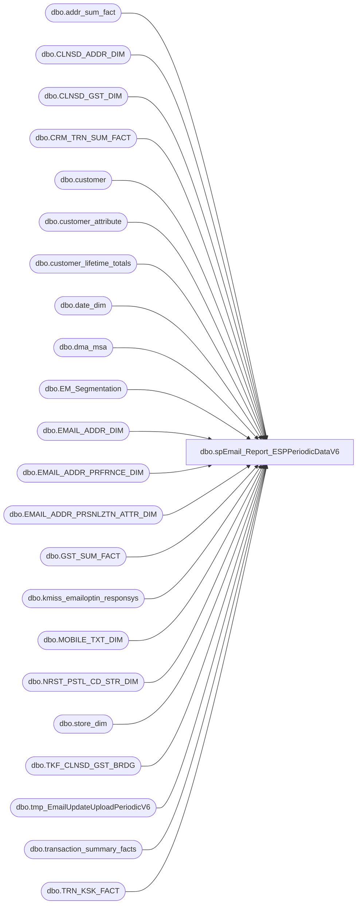

# dbo.spEmail_Report_ESPPeriodicDataV6

**Database:** dw  
**Server:** papamart  

## Architecture Diagram



## Table Dependencies

| Referenced Table |
|---|
| dbo.addr_sum_fact |
| dbo.CLNSD_ADDR_DIM |
| dbo.CLNSD_GST_DIM |
| dbo.CRM_TRN_SUM_FACT |
| dbo.customer |
| dbo.customer_attribute |
| dbo.customer_lifetime_totals |
| dbo.date_dim |
| dbo.dma_msa |
| dbo.EM_Segmentation |
| dbo.EMAIL_ADDR_DIM |
| dbo.EMAIL_ADDR_PRFRNCE_DIM |
| dbo.EMAIL_ADDR_PRSNLZTN_ATTR_DIM |
| dbo.GST_SUM_FACT |
| dbo.kmiss_emailoptin_responsys |
| dbo.MOBILE_TXT_DIM |
| dbo.NRST_PSTL_CD_STR_DIM |
| dbo.store_dim |
| dbo.TKF_CLNSD_GST_BRDG |
| dbo.tmp_EmailUpdateUploadPeriodicV6 |
| dbo.transaction_summary_facts |
| dbo.TRN_KSK_FACT |

## Stored Procedure Code

```sql
CREATE PROC [dbo].[spEmail_Report_ESPPeriodicDataV6]
-- =============================================================================================================
-- Name: [dbo].[spEmail_Report_ESPPeriodicDataV6]
--
-- Description:	The goal of this procedure is to put regularly changing fields into a PET so it can be truncated
--				and reloaded on a regular basis and updates to the contacts table can be avoided.
--
-- Input:	@ad_date	datetime		grabs records updated since this date
--			@reload		bit				if 1, reload all records
--
-- Output: N/A
--
-- Dependencies: 
--
-- Revision History
--		Name:			Date:			Comments:
--		Gary Derikito	08/07/2012		created
--		GaryD			09/27/2012		Put cktier back in
--		GaryD			10/16/2012		Remove test code
--		GaryD			10/18/2012		Update destination path.
--		GaryD			10/22/2012		Remove columns to get down to 20 so can go into PET.
--		GaryD			12/11/2012		Replace cktier with EM_segmentation tier.
--		GaryD			02/12/2013		Add leading zeros to nearest store numbers.
--		GaryD			03/28/2013		Change nearest store name from store_name to Legal_Description.
--		KeithM			04/18/2013		updated nearest store name to pull ad hoc in the final query; 
--										we were getting the wrong name using the MAX function
--		KeithM			04/19/2013		updated table location for Tiers
--		EdinP			06/17/2013		changed the segmentation table lookup to queries.dbo.EM_Segmentation,
--										which RobG was use going forward for segmentation changes

/*
DECLARE @date datetime
SET @date = CONVERT(VARCHAR, DATEADD(DAY, -1, GETDATE()), 101)
Exec spEmail_Report_ESPPeriodicDataV6 @ad_date = @date,  @reload = 1

DECLARE @date datetime
SET @date = CONVERT(VARCHAR, DATEADD(DAY, -10000, GETDATE()), 101)
Exec spEmail_Report_ESPPeriodicDataV6TEST @ad_date = @date,  @reload = 0
*/
-- =============================================================================================================
@ad_date datetime=NULL,
@reload bit=0
AS 
    SET NOCOUNT ON

IF @ad_date IS NULL
	SET @ad_date = CONVERT(VARCHAR, DATEADD(DAY, -1, GETDATE()), 101)

CREATE TABLE #tmpemailids
(
	email_addr_id int
)

--Exclude bad emails
SELECT EMAIL_ADDR_ID
INTO #tmp_ExcludeEmails
FROM dbo.EMAIL_ADDR_DIM e WITH (NOLOCK)
WHERE e.email_addr_txt LIKE '%BABWTEST.com%'
    
CREATE INDEX IX_tmp_ExcludeEmails_emailaddrid
ON #tmp_ExcludeEmails (email_addr_id);


IF @reload = 0
BEGIN
--GRAB ALL UPDATED EMAIL IDS
	INSERT #tmpemailids
    SELECT DISTINCT email_addr_id
    FROM    dw.dbo.[EMAIL_ADDR_DIM] WITH ( NOLOCK )
    WHERE  [UPDT_DT] >= @ad_date 
  --and EMAIL_ADDR_ID in (select email_addr_id from dbo.tmp_TestCases)
	AND EMAIL_ADDR_ID NOT IN (SELECT email_addr_id FROM #tmp_ExcludeEmails)


    UNION
    --GRAB E-MAILS WERE PERSONALIZATION DATA HAS CHANGED
    SELECT DISTINCT e.email_addr_id
    FROM    dw.dbo.[EMAIL_ADDR_PRSNLZTN_ATTR_DIM] p WITH ( NOLOCK )
		INNER JOIN dw.dbo.email_addr_dim e WITH (NOLOCK) ON e.email_addr_id = p.email_addr_id
    WHERE  p.[UPDT_DT] >= @ad_date AND RTRIM(LTRIM(email_stat_cd)) = 'VALID'
--and e.EMAIL_ADDR_ID in (select email_addr_id from dbo.tmp_TestCases)
	AND e.EMAIL_ADDR_ID NOT IN (SELECT email_addr_id FROM #tmp_ExcludeEmails)
    
    --GRAB E-MAILS THAT HAVE CHANGED STATUS
    UNION 
    
    SELECT DISTINCT e.email_addr_id
    FROM    dw.dbo.[EMAIL_ADDR_DIM] e WITH ( NOLOCK )
    		INNER JOIN dw.dbo.EMAIL_ADDR_PRFRNCE_DIM ep WITH (NOLOCK) ON e.EMAIL_ADDR_ID = ep.EMAIL_ADDR_ID
    WHERE  ep.[UPDT_DT] >= @ad_date AND RTRIM(LTRIM(email_stat_cd)) = 'VALID' 
--and e.EMAIL_ADDR_ID in (select email_addr_id from dbo.tmp_TestCases)
	AND e.EMAIL_ADDR_ID NOT IN (SELECT email_addr_id FROM #tmp_ExcludeEmails)

   --GRAB NEW REGISTRATION DATA
    INSERT #tmpemailids
    SELECT DISTINCT
            e.email_addr_id
    FROM    dw.dbo.[TRN_KSK_FACT] tkf WITH (NOLOCK)
		INNER JOIN dw.dbo.[TKF_CLNSD_GST_BRDG] b WITH (NOLOCK) ON tkf.[TKF_ID] = b.[TKF_ID]
		INNER JOIN dw.dbo.[CLNSD_GST_DIM] g WITH (NOLOCK) ON b.[CLNSD_GST_ID] = g.[CLNSD_GST_ID]
		INNER JOIN dw.dbo.[EMAIL_ADDR_DIM] e WITH (NOLOCK) ON g.[EMAIL_ADDR_ID] = e.[EMAIL_ADDR_ID]
		INNER JOIN dw.dbo.EMAIL_ADDR_PRFRNCE_DIM ep WITH (NOLOCK) ON e.EMAIL_ADDR_ID = ep.EMAIL_ADDR_ID
    WHERE  tkf.[INS_DT] >= @ad_date AND e.email_addr_id > 0 AND RTRIM(LTRIM(email_stat_cd)) = 'VALID' 
		AND (ep.promo_pref = 'Y' OR ep.sfspnts_pref = 'Y' OR ep.sfscert_pref = 'Y')
		AND e.EMAIL_ADDR_ID NOT IN (SELECT email_addr_id FROM #tmpemailids)
--and e.EMAIL_ADDR_ID in (select email_addr_id from dbo.tmp_TestCases)
		AND e.EMAIL_ADDR_ID NOT IN (SELECT email_addr_id FROM #tmp_ExcludeEmails)
	
	--GRAB UPDATED SALES DATA	
	INSERT #tmpemailids
    SELECT DISTINCT
            e.email_addr_id
    FROM    dw.dbo.[CRM_TRN_SUM_FACT] crm WITH (NOLOCK)
		INNER JOIN dw.dbo.[CLNSD_GST_DIM] g WITH (NOLOCK) ON crm.[CLNSD_GST_ID] = g.[CLNSD_GST_ID]
		INNER JOIN dw.dbo.[EMAIL_ADDR_DIM] e WITH (NOLOCK) ON g.[EMAIL_ADDR_ID] = e.[EMAIL_ADDR_ID]
		INNER JOIN dw.dbo.EMAIL_ADDR_PRFRNCE_DIM ep WITH (NOLOCK) ON e.EMAIL_ADDR_ID = ep.EMAIL_ADDR_ID
    WHERE  crm.[INS_DT] >= @ad_date AND e.email_addr_id > 0 AND RTRIM(LTRIM(email_stat_cd)) = 'VALID' 
		AND (ep.promo_pref = 'Y' OR ep.sfspnts_pref = 'Y' OR ep.sfscert_pref = 'Y')
		AND e.EMAIL_ADDR_ID NOT IN (SELECT email_addr_id FROM #tmpemailids)
--and e.EMAIL_ADDR_ID in (select email_addr_id from dbo.tmp_TestCases)
		AND e.EMAIL_ADDR_ID NOT IN (SELECT email_addr_id FROM #tmp_ExcludeEmails)
	
	--get changes to mobile data
	INSERT #tmpemailids
    SELECT DISTINCT
			e.email_addr_id
    FROM    dw.dbo.[EMAIL_ADDR_DIM] e WITH ( NOLOCK )
            INNER JOIN dw.dbo.[CLNSD_GST_DIM] c WITH ( NOLOCK ) ON e.[EMAIL_ADDR_ID] = c.[EMAIL_ADDR_ID] 
			INNER JOIN dw.dbo.MOBILE_TXT_DIM m WITH (NOLOCK) ON (c.MOBILE_TXT_ID = m.MOBILE_TXT_ID)
			--INNER JOIN dw.dbo.EMAIL_ADDR_PRFRNCE_DIM ep WITH (NOLOCK) ON e.EMAIL_ADDR_ID = ep.EMAIL_ADDR_ID
	WHERE m.UPDT_DT	>= @ad_date 
		AND e.email_addr_id > 0 
		--AND RTRIM(LTRIM(e.email_stat_cd)) = 'VALID' 
		--AND (ep.promo_pref = 'Y' OR ep.sfspnts_pref = 'Y' OR ep.sfscert_pref = 'Y')
		AND e.EMAIL_ADDR_ID NOT IN (SELECT email_addr_id FROM #tmpemailids)
--and e.EMAIL_ADDR_ID in (select email_addr_id from dbo.tmp_TestCases)
		AND e.EMAIL_ADDR_ID NOT IN (SELECT email_addr_id FROM #tmp_ExcludeEmails)		
		
END
ELSE ---start of full load section
BEGIN
	INSERT #tmpemailids
		SELECT DISTINCT e.email_addr_id
    FROM    dw.dbo.[EMAIL_ADDR_DIM] e WITH ( NOLOCK )
		INNER JOIN dw.dbo.EMAIL_ADDR_PRFRNCE_DIM ep WITH (NOLOCK) ON e.EMAIL_ADDR_ID = ep.EMAIL_ADDR_ID
    WHERE  RTRIM(LTRIM(email_stat_cd)) = 'VALID' 
    		AND (ep.promo_pref = 'Y' OR ep.sfspnts_pref = 'Y' OR ep.sfscert_pref = 'Y')
    		AND e.EMAIL_ADDR_ID NOT IN (SELECT email_addr_id FROM #tmp_ExcludeEmails)
--testing filter
  		--and e.EMAIL_ADDR_ID in (select email_addr_id from dbo.tmp_TestCases)
  		--and e.EMAIL_ADDR_ID in (12293213, 735877, 27207918, 264655, 2834530, 26761265, 2598369, 16944956, 4458588, 27570304, 12472288,20963366, 16480790, 2879174, 9645904, 8347850, 7288251, 4675298, 12399506, 3767848 )
--testing filter

END

CREATE INDEX IX_tmpemailids_emailaddrid
    ON #tmpemailids (email_addr_id); 

--select * from #tmpemailids return
		
--MATCH ALL SFS GUEST DATA WITH ANY E-MAIL THEY ARE ASSOCIATED WITH
--FIND FIRST GUEST RECORD ASSOCIATED WITH E-MAIL ADDRESS.  THIS IS THE GUEST DATA WE WILL USE.
--V6 Note: We take a single email and associate with the lowest cleansed guest id.
--For V6, do we want to add a email/guest table?
SELECT e.email_addr_id, MIN(clnsd_gst_id) AS clnsd_gst_id
INTO #tmpsfsemails
FROM #tmpemailids e
	INNER JOIN dw.dbo.clnsd_gst_dim g WITH (NOLOCK) ON e.email_addr_id = g.EMAIL_ADDR_ID
WHERE g.lylty_gst_nbr IS NOT NULL
GROUP BY e.email_addr_id

CREATE INDEX IX_tmpsfsemails_emailaddrid_lyltygstnbr
    ON #tmpsfsemails (email_addr_id, clnsd_gst_id); 

CREATE TABLE [#tmpemail](
	clnsd_gst_id INT NOT NULL,
	[customer_id] [int] NOT NULL,
	[email_channel_status] [varchar](5) NULL,
	[email_acq_wkdiff] [int] NULL,
	[promo_preference] [char](1) NULL,
[sfscert_preference] [char](1) NULL,
[sfsacct_preference] [char](1) NULL,
[email_pref_ch_wkdiff] [int] NULL,
[nearest_store_no] [int] NULL,
[nearest_store_name] [varchar](50) NULL,
[dist_to_store] [decimal](12, 2) NULL,
[membership_type] [varchar](7) NULL,
[sfs_number] [varchar](20) NULL,
[membership_wkdiff] [int] NULL,
[optinstatus] [char](1) NULL,
[first_store_visited] [int] NULL
)

INSERT #tmpemail
    SELECT  
			c.clnsd_gst_id, 
			e.email_addr_id AS customer_id, 
	        CASE email_stat_cd
				WHEN 'VALID' THEN CAST('V' as varchar(5))
				WHEN 'INVALID' THEN CAST('IV' AS varchar(5))
				WHEN 'BOUNCE' THEN CAST('B' AS varchar(5))
				WHEN 'SPAM' THEN CAST('S' AS varchar(5))
				WHEN 'INACTIVE' THEN CAST('IA' AS varchar(5))
				ELSE CAST('U' AS varchar(5)) END AS email_channel_status,
			DATEDIFF(wk, e.ins_dt, GETDATE()) AS email_acq_wkdiff,
			ep.promo_pref AS promo_preference,
	        ep.sfscert_pref AS sfscert_preference,
	        ep.sfspnts_pref AS sfsacct_preference,
	        DATEDIFF(wk, ep.UPDT_DT, GETDATE()) AS email_pref_ch_wkdiff,
            ISNULL(s.store_id, 0) AS nearest_store_no,
            s.Legal_Description AS nearest_store_name,
            dstnc_to_str_qty AS dist_to_store,
            CASE 
				WHEN c.lylty_gst_nbr IS NULL THEN 'NON-SFS'
				ELSE 'SFS' END AS membership_type,
            c.[LYLTY_GST_NBR] AS sfs_number,
	        DATEDIFF(wk, crm_mbrshp_dt, GETDATE()) AS membership_wkdiff,
	        
			'N' AS optinstatus,
			s2.store_id AS first_store_visited
			
    FROM    dw.dbo.[EMAIL_ADDR_DIM] e WITH ( NOLOCK )
            INNER JOIN #tmpemailids t ON e.[EMAIL_ADDR_ID] = t.email_addr_id
            INNER JOIN #tmpsfsemails se ON e.email_addr_id = se.email_addr_id
            INNER JOIN dw.dbo.[EMAIL_ADDR_PRSNLZTN_ATTR_DIM] p WITH ( NOLOCK ) ON e.[EMAIL_ADDR_ID] = p.[EMAIL_ADDR_ID]
            INNER JOIN dw.dbo.EMAIL_ADDR_PRFRNCE_DIM ep WITH (NOLOCK) ON e.EMAIL_ADDR_ID = ep.EMAIL_ADDR_ID
            INNER JOIN dw.dbo.[CLNSD_GST_DIM] c WITH ( NOLOCK ) ON e.[EMAIL_ADDR_ID] = c.[EMAIL_ADDR_ID] 
						AND se.clnsd_gst_id = c.clnsd_gst_id
            LEFT JOIN dw.dbo.[CLNSD_ADDR_DIM] a WITH ( NOLOCK ) ON c.clnsd_addr_id = a.clnsd_addr_id
            LEFT JOIN dw.dbo.[NRST_PSTL_CD_STR_DIM] n WITH ( NOLOCK ) ON a.nrst_str_pstl_cd = n.pstl_cd AND a.[CNTRY_ABBRV] = n.[CNTRY_ABBRV]
            LEFT JOIN dw.dbo.store_dim s WITH ( NOLOCK ) ON s.store_key = n.str_id
            LEFT JOIN dw.dbo.dma_msa d WITH (NOLOCK) ON a.cntry_abbrv = d.cntry_abbrv AND a.[PSTL_CD] = d.[PSTL_CD]
			LEFT JOIN dw.dbo.addr_sum_fact af WITH (NOLOCK) ON c.clnsd_addr_id = af.clnsd_addr_id
			LEFT JOIN dw.dbo.MOBILE_TXT_DIM m WITH (NOLOCK) ON (c.MOBILE_TXT_ID = m.MOBILE_TXT_ID)
			LEFT JOIN dw.dbo.store_dim s2 WITH (NOLOCK) ON (s2.store_key = c.CRM_REGIS_STR_ID)
	WHERE c.lylty_gst_nbr IS NOT NULL 

--select * from #tmpemail return


--MATCH REST OF DATA WITH INFORMATION IN PERSONALIZATION DIM IF NOT A SFS MEMBER

INSERT #tmpemail
 SELECT  ISNULL(c.clnsd_gst_id, -2), 
		e.email_addr_id AS customer_id, 
	        CASE email_stat_cd
				WHEN 'VALID' THEN CAST('V' as varchar(5))
				WHEN 'INVALID' THEN CAST('IV' AS varchar(5))
				WHEN 'BOUNCE' THEN CAST('B' AS varchar(5))
				WHEN 'SPAM' THEN CAST('S' AS varchar(5))
				WHEN 'INACTIVE' THEN CAST('IA' AS varchar(5))
				ELSE CAST('U' AS varchar(5)) END AS email_channel_status,
	        DATEDIFF(wk, e.ins_dt, GETDATE()) AS email_acq_wkdiff,
	        ep.promo_pref AS promo_preference,
	        ep.sfscert_pref AS sfscert_preference,
	        ep.sfspnts_pref AS sfsacct_preference,
	        DATEDIFF(wk, ep.UPDT_DT, GETDATE()) AS email_pref_ch_wkdiff,
            ISNULL(store_id, 0) AS nearest_store_no,
            Legal_Description AS nearest_store_name,
            dstnc_to_str_qty AS dist_to_store,
            CASE 
				WHEN c.lylty_gst_nbr IS NULL THEN 'NON-SFS'
				ELSE 'SFS' END AS membership_type,
            c.[LYLTY_GST_NBR] AS sfs_number,
	        DATEDIFF(wk, crm_mbrshp_dt, GETDATE()) AS membership_wkdiff,
			'N',
			NULL AS first_store_visited
    FROM    dw.dbo.[EMAIL_ADDR_DIM] e WITH ( NOLOCK )
            INNER JOIN #tmpemailids t ON e.[EMAIL_ADDR_ID] = t.email_addr_id
            INNER JOIN dw.dbo.[EMAIL_ADDR_PRSNLZTN_ATTR_DIM] p WITH ( NOLOCK ) ON e.[EMAIL_ADDR_ID] = p.[EMAIL_ADDR_ID]
            INNER JOIN dw.dbo.EMAIL_ADDR_PRFRNCE_DIM ep WITH (NOLOCK) ON e.EMAIL_ADDR_ID = ep.EMAIL_ADDR_ID
            LEFT JOIN dw.dbo.[CLNSD_GST_DIM] c WITH ( NOLOCK ) ON e.[EMAIL_ADDR_ID] = c.[EMAIL_ADDR_ID]
                                                                  AND email_frst_nm = frst_nm
                                                                  AND email_last_nm = last_nm
            LEFT JOIN dw.dbo.[CLNSD_ADDR_DIM] a WITH ( NOLOCK ) ON c.clnsd_addr_id = a.clnsd_addr_id
            LEFT JOIN dw.dbo.[NRST_PSTL_CD_STR_DIM] n WITH ( NOLOCK ) ON a.nrst_str_pstl_cd = n.pstl_cd AND a.[CNTRY_ABBRV] = n.[CNTRY_ABBRV]
            LEFT JOIN dw.dbo.store_dim s WITH ( NOLOCK ) ON s.store_key = n.str_id
            LEFT JOIN dw.dbo.dma_msa d WITH (NOLOCK) ON a.cntry_abbrv = d.cntry_abbrv AND a.[PSTL_CD] = d.[PSTL_CD]
			LEFT JOIN dw.dbo.addr_sum_fact af WITH (NOLOCK) ON c.clnsd_addr_id = af.clnsd_addr_id
			LEFT JOIN dw.dbo.MOBILE_TXT_DIM m WITH (NOLOCK) ON (c.MOBILE_TXT_ID = m.MOBILE_TXT_ID)
	WHERE lylty_gst_nbr IS NULL AND e.email_addr_id NOT IN (SELECT customer_id FROM #tmpemail)

			
CREATE INDEX IX_tmpemail_customerid
    ON #tmpemail (customer_id); 
   
 --select * from #tmpemail  return       
 --select * from #tmpemail order by customer_id return    
  

UPDATE #tmpemail SET optinstatus = 'Y' 
	WHERE promo_preference = 'Y' OR sfsacct_preference = 'Y' OR sfscert_preference = 'Y'

--V6 Note: Emails have been associated with the lowest clnsd_gst_id and therefore the registration data is that of this 
--lowest clnsd_gst_id and not for all cleansed guest associated with an email
--RETRIEVE REGISTRATION DATA FOR NON-SFS MEMBERS
SELECT	customer_id, 
		f.[MNTH_01_03_VST_CNT] + f.[MNTH_04_06_VST_CNT] + f.[MNTH_07_09_VST_CNT] + f.[MNTH_10_12_VST_CNT] AS visitcount_1year,
            f.[MNTH_01_03_VST_CNT] + f.[MNTH_04_06_VST_CNT] + f.[MNTH_07_09_VST_CNT] + f.[MNTH_10_12_VST_CNT] 
				+ f.[MNTH_13_15_VST_CNT] + f.[MNTH_16_18_VST_CNT] + f.[MNTH_19_21_VST_CNT] + f.[MNTH_22_24_VST_CNT] AS visitcount_2year,
			f.[TTL_VST_CNT] AS totalvisits, 
			CONVERT(VARCHAR(10),actual_date,121) AS lastvisitdate,
			DATEPART(wk,actual_date) AS last_visit_wk, 
			MONTH(actual_date) AS last_visit_mth,
			YEAR(actual_date) AS last_visit_yr, 
			DATEDIFF(wk, actual_date, GETDATE()) AS last_visit_wkdiff,
			LAST_STR_VST_DT_ID, 
			c.CLNSD_GST_ID,
			f.FRST_STR_VST_DT_ID,
			f.NEW_VS_RPT_CD
	INTO #tmpregvisits
FROM [#tmpemail] e
	INNER JOIN dw.dbo.[CLNSD_GST_DIM] c WITH ( NOLOCK ) ON e.[customer_id] = c.[EMAIL_ADDR_ID]
                                                                  AND e.clnsd_gst_id = c.clnsd_gst_id
	INNER JOIN dw.dbo.GST_SUM_FACT f WITH (NOLOCK) ON c.[CLNSD_GST_ID] = f.[CLNSD_GST_ID]
	INNER JOIN dw.dbo.date_dim d ON [LAST_STR_VST_DT_ID] = date_key
WHERE e.sfs_number IS NULL AND e.email_channel_status = 'V' AND e.optinstatus = 'Y'

CREATE INDEX IX_tmpregvisits_customerid
    ON #tmpregvisits (customer_id); 

--select * from #tmpregvisits customer_id where customer_id  = 12293213 return

--GET LAST STORE VISITED FOR NON-SFS GUESTS
SELECT DISTINCT customer_id, store_id AS last_store_visited
INTO #tmpreglaststore
FROM #tmpregvisits r
	INNER JOIN dw.dbo.tkf_clnsd_gst_brdg b WITH (NOLOCK) ON r.CLNSD_GST_ID = b.clnsd_gst_id
	INNER JOIN dw.dbo.trn_ksk_fact tkf WITH (NOLOCK) ON b.tkf_id = tkf.tkf_id
				AND r.LAST_STR_VST_DT_ID = tkf.DT_ID
	INNER JOIN dw.dbo.store_dim ON STR_ID = store_key

CREATE INDEX IX_tmpreglaststore_customerid
    ON #tmpreglaststore (customer_id); 


--GET First STORE VISITED FOR NON-SFS GUESTS
SELECT DISTINCT customer_id, store_id AS first_store_visited
INTO #tmpregfirststore
FROM #tmpregvisits r
	INNER JOIN dw.dbo.tkf_clnsd_gst_brdg b WITH (NOLOCK) ON r.CLNSD_GST_ID = b.clnsd_gst_id
	INNER JOIN dw.dbo.trn_ksk_fact tkf WITH (NOLOCK) ON b.tkf_id = tkf.tkf_id
				AND r.FRST_STR_VST_DT_ID = tkf.DT_ID
	INNER JOIN dw.dbo.store_dim ON STR_ID = store_key

CREATE INDEX IX_tmpregfirststore_customerid
    ON #tmpregfirststore (customer_id); 


--DETERMINE IF REGISTERED ONLINE
SELECT DISTINCT customer_id, 'Y' AS ecommerce_visitor
INTO #tmpregweb
FROM #tmpregvisits r
	INNER JOIN dw.dbo.tkf_clnsd_gst_brdg b WITH (NOLOCK) ON r.CLNSD_GST_ID = b.clnsd_gst_id
	INNER JOIN dw.dbo.trn_ksk_fact tkf WITH (NOLOCK) ON b.tkf_id = tkf.tkf_id
	INNER JOIN dw.dbo.store_dim ON STR_ID = store_key
WHERE store_id IN (13,2013)

CREATE INDEX IX_tmpregweb_customerid
    ON #tmpregweb (customer_id); 

--RETRIEVE SALES DATA FOR SFS MEMBERS
SELECT customer_id, store_id, actual_date, MAX(tdf_trn_id) as tdf_trn_id, 
	SUM(gaap_sale) AS gaapsales,
	NEW_VS_RPT_CD
	INTO #tmpsfsvisits
FROM #tmpemail e
		INNER JOIN dw.dbo.crm_trn_sum_fact f WITH (NOLOCK) ON e.[CLNSD_GST_ID] = f.[CLNSD_GST_ID]
		INNER JOIN dw.dbo.date_dim ON dt_id = date_key
		INNER JOIN dw.dbo.store_dim ON str_id = store_key
		INNER JOIN dw.dbo.transaction_summary_facts v ON f.TDF_TRN_ID = v.transaction_id
WHERE sfs_number IS NOT NULL AND [email_channel_status] = 'V' AND optinstatus = 'Y'
GROUP BY customer_id, store_id, actual_date, NEW_VS_RPT_CD

SELECT customer_id, MAX(actual_date) AS lastvisitdate, COUNT(*) AS visitcount, MAX(tdf_trn_id) AS tdf_trn_id
	INTO #tmpsfstotal
FROM #tmpsfsvisits
GROUP BY customer_id

--select * from #tmpsfsvisits return

--compress new_vs_rpt
SELECT
customer_id,
NEW_VS_RPT_CD
INTO #tmpsfsrepeat
FROM #tmpsfsvisits r 
WHERE R.NEW_VS_RPT_CD = 'R'

SELECT
customer_id,
NEW_VS_RPT_CD
INTO #tmpsfsfirst
FROM #tmpsfsvisits f 
WHERE f.NEW_VS_RPT_CD = 'F'
AND customer_id NOT IN (SELECT customer_id FROM #tmpsfsrepeat)

SELECT 
customer_id,
NEW_VS_RPT_CD
INTO #tmpsfsnewguest
FROM #tmpsfsrepeat
UNION ALL
SELECT 
customer_id,
NEW_VS_RPT_CD
FROM #tmpsfsfirst


--AGGREGATE 1 year and 2 year TOTAL SPEND
SELECT customer_id, SUM(gaapsales) AS gaapsales_1year
	INTO #tmp1yearsales
FROM #tmpsfsvisits
WHERE actual_date >= DATEADD(YEAR, -1, GETDATE())
GROUP BY customer_id

--select * from #tmp1yearsales return

SELECT customer_id, SUM(gaapsales) AS gaapsales_2year
	INTO #tmp2yearsales
FROM #tmpsfsvisits
WHERE actual_date >= DATEADD(YEAR, -2, GETDATE())
GROUP BY customer_id

--select * from #tmp2yearsales return

--DETERMINE IF PURCHASED FROM WEB
SELECT DISTINCT customer_id, 'Y' AS ecommerce_visitor
INTO #tmpsfsweb
FROM #tmpsfsvisits
WHERE store_id IN (13,2013)

CREATE INDEX IX_tmpsfsweb_customerid
    ON #tmpsfsweb (customer_id); 

--GRAB DATA FROM LATEST TRANSACTION RECORD IN CRM SALES TABLE 
SELECT	DISTINCT customer_id, f.[MNTH_01_12_VST_CNT] AS visitcount_1year,
            f.[MNTH_01_24_VST_CNT] AS visitcount_2year,
			visitcount AS totalvisits, CONVERT(VARCHAR(10),lastvisitdate,121) AS lastvisitdate,
			DATEPART(wk,lastvisitdate) AS last_visit_wk, MONTH(lastvisitdate) AS last_visit_mth,
			YEAR(lastvisitdate) AS last_visit_yr, DATEDIFF(wk, lastvisitdate, GETDATE()) AS last_visit_wkdiff,
			store_id AS last_store_visited
	INTO #tmpsfsvisitstotal
	FROM [#tmpsfstotal] t
		INNER JOIN dw.dbo.crm_trn_sum_fact f WITH (NOLOCK) ON t.[tdf_trn_id] = f.[tdf_trn_id]
		INNER JOIN dw.dbo.store_dim s WITH (NOLOCK) ON f.STR_ID = store_key

CREATE INDEX IX_tmpsfsvisittotal_customerid
    ON #tmpsfsvisitstotal (customer_id); 

--select * from #tmpsfsvisitstotal return

--RETRIEVE POINTS DATA FOR SFS MEMBERS
    SELECT  customer_no,
            points_current_balance
    INTO    #tmpcrm
    FROM    crmdb01.crm.dbo.customer c WITH ( NOLOCK )
            INNER JOIN crmdb01.crm.dbo.[customer_lifetime_totals] clt WITH ( NOLOCK ) ON c.[customer_id] = clt.[customer_id]
    WHERE   customer_no IN ( SELECT sfs_number
                             FROM   [#tmpemail]
                             WHERE  [sfs_number] IS NOT NULL AND [email_channel_status] = 'V' AND optinstatus = 'Y')

CREATE INDEX IX_tmpcrm_customerid
    ON #tmpcrm (customer_no); 
    
--select * from  #tmpcrm return
    

--RETRIEVE SFS TIER FOR SFS MEMBERS
SELECT customer_no, attribute_code, attribute_value AS sfstier, attribute_date
INTO #tmpsfstier
FROM crmdb01.crm.dbo.customer c WITH (NOLOCK) 
	INNER JOIN crmdb01.crm.dbo.[customer_attribute] a WITH (NOLOCK) ON c.[customer_id] = a.[customer_id]
WHERE [attribute_grouping_code] = 'TIER' AND
	customer_no IN ( SELECT sfs_number
                             FROM   [#tmpemail]
                             WHERE  [sfs_number] IS NOT NULL AND [email_channel_status] = 'V' AND optinstatus = 'Y')

CREATE INDEX IX_tmpsfstier_customerid
    ON #tmpsfstier (customer_no); 
    
 --select * from    #tmpsfstier return

--Retrieve SFSB for SFS members
SELECT customer_no, attribute_code, attribute_value AS sfsb_points_level
,CASE
      WHEN attribute_value < 50 OR attribute_value IS NULL THEN 'RED HEART'
      WHEN attribute_value BETWEEN 50 and 149 THEN 'RED HEART'
      WHEN attribute_value BETWEEN 150 and 249 THEN 'BLUE BUTTON' 
      WHEN attribute_value >= 250 THEN 'GOLD PAW'
      ELSE 'RED HEART'
END AS 'sfs_reward_level'
, attribute_date
INTO #tmpsfspoints
FROM crmdb01.crm.dbo.customer c WITH (NOLOCK) 
	INNER JOIN crmdb01.crm.dbo.[customer_attribute] a WITH (NOLOCK) ON c.[customer_id] = a.[customer_id]
WHERE [attribute_grouping_code] = 'SFSB' AND
	customer_no IN ( SELECT sfs_number
                             FROM   [#tmpemail]
                             WHERE  [sfs_number] IS NOT NULL AND [email_channel_status] = 'V' AND optinstatus = 'Y')

CREATE INDEX IX_tmpsfspoints_customerid
    ON #tmpsfspoints (customer_no); 

--replace cktier with em_segmentation tier

--    SELECT  email_addr_id,
--            tier,
--            disneystore,
--            disney,
--            license
--    INTO    #tmpck
--    FROM    queries.dbo.ck_bab_segmentation20120606 s WITH ( NOLOCK )
--            INNER JOIN #tmpemail e ON e.customer_id = s.email_addr_id
--------------------------------------------------------------
--CREATE INDEX IX_tmpck_emailid
--    ON #tmpck (email_addr_id); 

SELECT  email_addr_id,
            tier
INTO    #EM_Segmentation
--FROM    queries.dbo.EM_Segmentation_201211 s WITH ( NOLOCK )
FROM    queries.dbo.EM_Segmentation s WITH ( NOLOCK )
            INNER JOIN #tmpemail e ON e.customer_id = s.email_addr_id

CREATE INDEX IX_tmpseg_emailid
    ON #EM_Segmentation (email_addr_id); 

--select * from #tmpck return


UPDATE #tmpemail SET email_channel_status = 'RES1'
FROM #tmpemail t INNER JOIN queries.dbo.kmiss_emailoptin_responsys r ON t.customer_id = r.customer_id

--SAVE EVERYTHING TO PHYSICAL TABLE
if (Object_ID('dw.dbo.tmp_EmailUpdateUploadPeriodicV6') IS NOT NULL) DROP TABLE dw.dbo.tmp_EmailUpdateUploadPeriodicV6

CREATE TABLE [dbo].[tmp_EmailUpdateUploadPeriodicV6](
	[customer_id] [int] NOT NULL,
[nearest_store_no] [varchar] (10) NULL,
[nearest_store_name] [varchar](50) NULL,
[dist_to_store] [decimal](12, 2) NULL,
[cert_points] [numeric](10, 0) NULL,
[visitcount_1year] [int] NULL,
[visitcount_2year] [int] NULL,
[totalvisits] [int] NULL,
[lastvisitdate] [varchar](10) NULL,
[last_store_visited] [int] NULL,
[gaapsales_1year] [decimal](38, 2) NULL,
[gaapsales_2year] [decimal](38, 2) NULL,
[ecommerce_visitor] [varchar](1) NULL,
tier VARCHAR(10) NULL,
sfstier VARCHAR(10) NULL,
sfsb_points_level [int] NULL,
sfs_reward_level [varchar](20) NULL,
babw_segment  [varchar](20) NULL,
first_store_visited  [int] NULL,
new_guest [char](1) NULL,
)

--select * from [#tmpregvisits]
--select * from #tmpsfsnewguest

INSERT dw.dbo.tmp_EmailUpdateUploadPeriodicV6
SELECT e.customer_id,
	CASE 
		WHEN LEN(MAX(e.nearest_store_no)) = 1 THEN '00' + CAST(MAX(e.nearest_store_no) AS VARCHAR(10))  
		WHEN LEN(MAX(e.nearest_store_no)) = 2 THEN '0' + CAST(MAX(e.nearest_store_no) AS VARCHAR(10))  
		ELSE CAST(MAX(e.nearest_store_no) AS VARCHAR(10))
	END AS nearest_store_no,
	MAX(e.nearest_store_name) AS nearest_store_name, 
	MAX(e.dist_to_store) AS dist_to_store,
	MAX(c.points_current_balance) as cert_points, --sfs_points,
	MAX(COALESCE(s.visitcount_1year, r.visitcount_1year)) AS visitcount_1year,
	MAX(COALESCE(s.visitcount_2year, r.visitcount_2year)) AS visitcount_2year,
	MAX(COALESCE(s.totalvisits, r.totalvisits)) AS totalvisits,
	MAX(COALESCE(s.lastvisitdate, r.lastvisitdate)) AS lastvisitdate,
	MAX(COALESCE(s.last_store_visited,rs.last_store_visited)) AS last_store_visited,
	MAX(s1.gaapsales_1year) AS gaapsales_1year, 
	MAX(s2.gaapsales_2year) AS gaapsales_2year,
	MAX(COALESCE(sw.ecommerce_visitor, rw.ecommerce_visitor, 'N')) AS ecommerce_visitor,
	MAX(seg.tier) AS tier,
	MAX(st.sfstier) AS sfstier,
	MAX(sfsb.sfsb_points_level) AS sfsb_points_level,
	MAX(sfsb.sfs_reward_level) AS sfs_reward_level,
	NULL AS babw_segment,  --Rob is developing this
	MAX(COALESCE(e.first_store_visited, rls.first_store_visited)) AS first_store_visited,
	CASE
		WHEN MAX(sn.NEW_VS_RPT_CD) = 'F' AND MAX(r.NEW_VS_RPT_CD) = 'F' THEN 'F'
		WHEN MAX(sn.NEW_VS_RPT_CD) = 'F' AND MAX(r.NEW_VS_RPT_CD) IS NULL THEN 'F'
		WHEN MAX(sn.NEW_VS_RPT_CD) IS NULL AND MAX(r.NEW_VS_RPT_CD) = 'F' THEN 'F'
		WHEN MAX(sn.NEW_VS_RPT_CD) = 'R' OR MAX(r.NEW_VS_RPT_CD) = 'R' THEN 'R'
	END	
	AS new_guest
    FROM    #tmpemail e
            LEFT JOIN [#tmpregvisits] r ON e.customer_id = r.customer_id
			LEFT JOIN [#tmpsfsvisitstotal] s ON e.customer_id = s.customer_id
			LEFT JOIN #tmpcrm c ON c.customer_no = e.sfs_number
			LEFT JOIN #tmpreglaststore rs ON e.customer_id = rs.customer_id
			LEFT JOIN #tmp1yearsales s1 ON e.customer_id = s1.customer_id
			LEFT JOIN #tmp2yearsales s2 ON e.customer_id = s2.customer_id
			LEFT JOIN #tmpregweb rw ON e.customer_id = rw.customer_id
			LEFT JOIN #tmpsfsweb sw ON e.customer_id = sw.customer_id
			--LEFT JOIN #tmpck ck ON e.customer_id = ck.email_addr_id
			LEFT JOIN #EM_Segmentation seg ON e.customer_id = seg.email_addr_id
			LEFT JOIN #tmpsfstier st ON st.customer_no = e.sfs_number
			LEFT JOIN #tmpsfspoints sfsb ON (sfsb.customer_no = e.sfs_number)
			LEFT JOIN #tmpregfirststore rls ON (e.customer_id = rls.customer_id)
			LEFT JOIN #tmpsfsnewguest sn ON (e.customer_id = sn.customer_id)
			LEFT JOIN dw.dbo.store_dim ON nearest_store_no = store_id
GROUP BY e.customer_id

--FIX ISSUE WHERE NEAREST STORE NAME WAS INCORRECT BASED ON USING THE MAX FUNCTION ABOVE
UPDATE dw.dbo.tmp_EmailUpdateUploadPeriodicV6
SET nearest_store_name = legal_description
FROM dw.dbo.store_dim 
	INNER JOIN dw.dbo.tmp_EmailUpdateUploadPeriodicV6 WITH (NOLOCK)
		ON nearest_store_no = store_id AND nearest_store_name <> Legal_Description


--select * from dw.dbo.tmp_EmailUpdateUploadPeriodicV6 order by  customer_id return
--where promo_preference = 'n' AND membership_type = 'non-sfs'
--return


--DELETE OPTED-OUT NON-SFS EMAILS
IF @reload = 1
BEGIN
	DELETE FROM dw.dbo.tmp_EmailUpdateUploadPeriodicV6 
	WHERE customer_id IN 
	(select e.customer_id
		FROM    #tmpemail e
		WHERE email_channel_status = 'v' AND promo_preference = 'n' AND membership_type = 'non-sfs')

END

--select * from dw.dbo.tmp_EmailUpdateUploadPeriodicV6 order by customer_id return
--select * from dw.dbo.tmp_EmailUpdateUploadPeriodicV6 v right join dbo.tmp_TestCases t on (v.customer_id = t.email_addr_id) where v.customer_id  is null order by  customer_id return

    DECLARE @cmd varchar(1000),
        @filename varchar(100),
		@filename_header varchar(100),
        @path varchar(200),
        @filedate varchar(20),
        @selectstmnt varchar(5000),
        @bcpsql varchar(500),
		@columnheaders varchar(4000), 
		@tablename varchar(128)

--CREATE TABLE CONTAINING COLUMN HEADERS FOR FILE EXPORT
SET @columnheaders = ''
SET @tablename='tmp_EmailUpdateUploadPeriodicV6'

SELECT @columnheaders = @columnheaders + c.name + '| '
 FROM syscolumns c INNER JOIN sysobjects o ON o.id = c.id
 WHERE o.name = @tablename
 ORDER BY colid

SELECT @columnheaders = Substring(@columnheaders, 1, Datalength(@columnheaders) - 2)

if (Object_ID('dw.dbo.tmp_EmailUpdateUploadPeriodic_HeaderV6') IS NOT NULL) DROP TABLE dw.dbo.tmp_EmailUpdateUploadPeriodic_HeaderV6

SELECT @columnheaders AS columnheader
INTO dw.dbo.tmp_EmailUpdateUploadPeriodic_HeaderV6

    SET @path = 'I:\Responsys\Upload\V6\'
	SET @filedate = CONVERT(VARCHAR(20), GETDATE(), 112)
    SET @filename = 'BABW_OPTINEMAILV6_PERIODIC_' + @filedate + '.txt'
	SET @filename_header = 'BABW_OPTINEMAIL_PERIODIC_HEADERV6.txt'

--CREATE FILE CONTAINING EMAILS USING BCP COMMAND
    SET @selectstmnt = 'SELECT * FROM dw.dbo.tmp_EmailUpdateUploadPeriodicV6'
    SET @bcpsql = 'bcp "' + @selectstmnt + '" queryout "' + @path + @filename
        + '.data" -t "|" -T -c'
    EXEC master..xp_cmdshell @bcpsql--, no_output

    SET @selectstmnt = 'SELECT * FROM dw.dbo.tmp_emailupdateuploadPeriodic_headerV6'
    SET @bcpsql = 'bcp "' + @selectstmnt + '" queryout "' + @path + @filename_header
        + '" -t "|" -T -c'
    EXEC master..xp_cmdshell @bcpsql--, no_output

    SET @cmd = 'copy ' + @path + @filename_header + '+' + @path + @filename
            + '.data ' + @path + @filename 
    EXEC master..xp_cmdshell @cmd, no_output

--COMPRESS FILE
    SELECT  @cmd = '"C:\Program Files\7-zip\7z.exe" a -tzip '
            + @path + REPLACE(@filename, '.txt', '') + '.zip ' + @path
            + @filename 
    EXEC master..xp_cmdshell @cmd--, no_output

--DELETE TEXT FILE
    SELECT  @cmd = 'del ' + @path + '*.txt /Q /F'
    EXEC master..xp_cmdshell @cmd, no_output

	SELECT  @cmd = 'del ' + @path + '*.data /Q /F'
    EXEC master..xp_cmdshell @cmd, no_output
```

