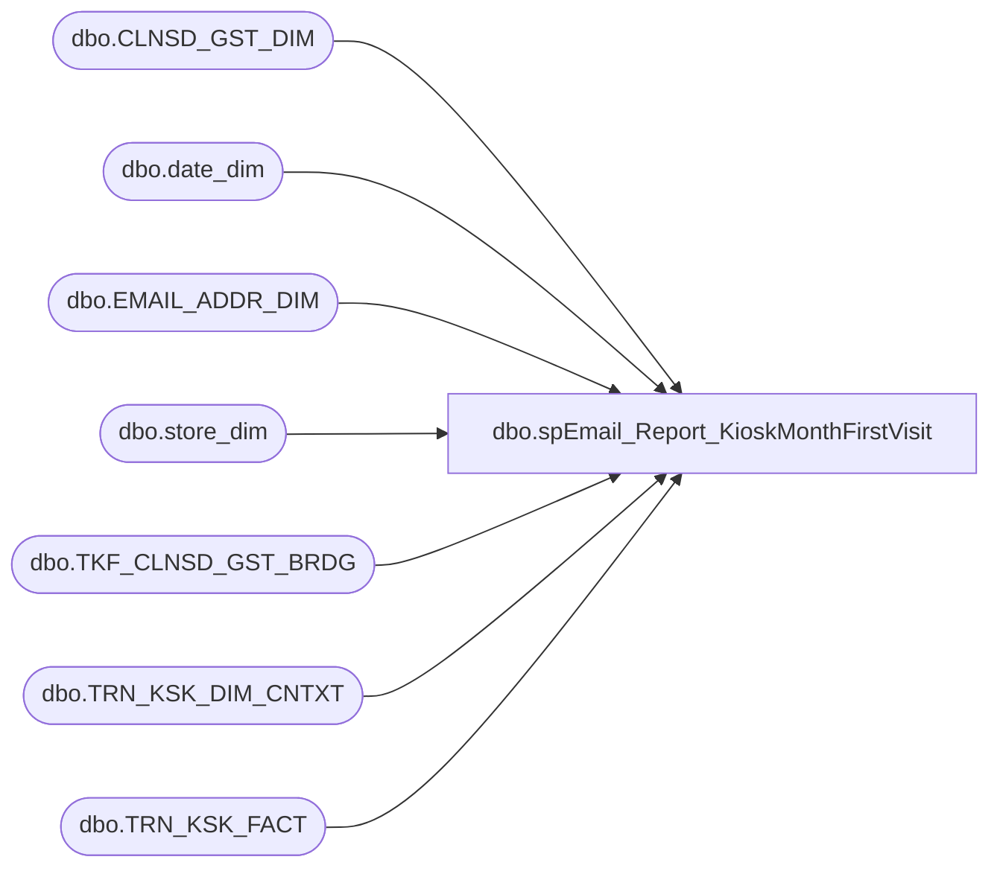

# dbo.spEmail_Report_KioskMonthFirstVisit

**Database:** dw  
**Server:** papamart  

## Architecture Diagram



## Table Dependencies

| Referenced Table |
|---|
| dbo.CLNSD_GST_DIM |
| dbo.date_dim |
| dbo.EMAIL_ADDR_DIM |
| dbo.store_dim |
| dbo.TKF_CLNSD_GST_BRDG |
| dbo.TRN_KSK_DIM_CNTXT |
| dbo.TRN_KSK_FACT |

## Stored Procedure Code

```sql
CREATE PROCEDURE [dbo].[spEmail_Report_KioskMonthFirstVisit]
-- =============================================================================================================
-- Name: [dbo].[spEmail_Report_KioskMonthFirstVisit]
--
-- Description:	returns e-mails from UK where opt-in date is in the month and year specified
--
-- Input:	@firstvisit_year		smallint
--			@firstvisit_month		smallint
--			@parameter				varchar(10) - valid values = 'NA, UK, TRecs, FR'
--
-- Output: N/A
--
-- Dependencies: 
--
-- Revision History
--		Name:			Date:			Comments:
--		Keith Missey	6/8/2009		created
-- =============================================================================================================
    @firstvisit_year SMALLINT,
    @firstvisit_month SMALLINT,
    @storeparameter VARCHAR(5)
AS 
    SET NOCOUNT ON
    
    IF @storeparameter = 'NA'	
    BEGIN
		SELECT UPPER(frst_nm) AS first_name, LOWER(email_addr_txt) AS email, actual_date AS regdate, store_id, c.gst_vst_recur_descr
		FROM dw.dbo.[EMAIL_ADDR_DIM] e WITH (NOLOCK)
			INNER JOIN dw.dbo.[CLNSD_GST_DIM] cgd WITH (NOLOCK) ON e.[EMAIL_ADDR_ID] = cgd.[EMAIL_ADDR_ID]
			INNER JOIN dw.dbo.[TKF_CLNSD_GST_BRDG] b WITH (NOLOCK) ON b.[CLNSD_GST_ID] = cgd.[CLNSD_GST_ID]
			INNER JOIN dw.dbo.[TRN_KSK_FACT] tkf WITH (NOLOCK) ON tkf.[TKF_ID] = b.[TKF_ID]
			INNER JOIN dw.dbo.[TRN_KSK_DIM_CNTXT] c WITH (NOLOCK) ON tkf.trn_ksk_cntxt_id = c.trn_ksk_cntxt_id
			INNER JOIN dw.dbo.[date_dim] dd ON dd.[date_key] = tkf.[DT_ID]
			INNER JOIN dw.dbo.store_dim sd ON sd.store_key = tkf.[STR_ID]
		WHERE cgd.email_addr_id > 0 AND dd.[month] = @firstvisit_month 
			AND dd.YEAR = @firstvisit_year 
			AND c.[GST_VST_RECUR_CD] = 'N' AND [EMAIL_STAT_CD] = 'OPT-IN' AND sd.country IN ('US','CA')
	END
	ELSE IF @storeparameter = 'UK'	
    BEGIN
		SELECT UPPER(frst_nm) AS first_name, LOWER(email_addr_txt) AS email, actual_date AS regdate, store_id, c.gst_vst_recur_descr
		FROM dw.dbo.[EMAIL_ADDR_DIM] e WITH (NOLOCK)
			INNER JOIN dw.dbo.[CLNSD_GST_DIM] cgd WITH (NOLOCK) ON e.[EMAIL_ADDR_ID] = cgd.[EMAIL_ADDR_ID]
			INNER JOIN dw.dbo.[TKF_CLNSD_GST_BRDG] b WITH (NOLOCK) ON b.[CLNSD_GST_ID] = cgd.[CLNSD_GST_ID]
			INNER JOIN dw.dbo.[TRN_KSK_FACT] tkf WITH (NOLOCK) ON tkf.[TKF_ID] = b.[TKF_ID]
			INNER JOIN dw.dbo.[TRN_KSK_DIM_CNTXT] c WITH (NOLOCK) ON tkf.trn_ksk_cntxt_id = c.trn_ksk_cntxt_id
			INNER JOIN dw.dbo.[date_dim] dd ON dd.[date_key] = tkf.[DT_ID]
			INNER JOIN dw.dbo.store_dim sd ON sd.store_key = tkf.[STR_ID]
		WHERE cgd.email_addr_id > 0 AND dd.[month] = @firstvisit_month 
			AND dd.YEAR = @firstvisit_year 
			AND c.[GST_VST_RECUR_CD] = 'N' AND [EMAIL_STAT_CD] = 'OPT-IN' AND sd.country = 'UK'
	END
	ELSE IF @storeparameter = 'FR'	
    BEGIN
		SELECT UPPER(frst_nm) AS first_name, LOWER(email_addr_txt) AS email, actual_date AS regdate, store_id, c.gst_vst_recur_descr
		FROM dw.dbo.[EMAIL_ADDR_DIM] e WITH (NOLOCK)
			INNER JOIN dw.dbo.[CLNSD_GST_DIM] cgd WITH (NOLOCK) ON e.[EMAIL_ADDR_ID] = cgd.[EMAIL_ADDR_ID]
			INNER JOIN dw.dbo.[TKF_CLNSD_GST_BRDG] b WITH (NOLOCK) ON b.[CLNSD_GST_ID] = cgd.[CLNSD_GST_ID]
			INNER JOIN dw.dbo.[TRN_KSK_FACT] tkf WITH (NOLOCK) ON tkf.[TKF_ID] = b.[TKF_ID]
			INNER JOIN dw.dbo.[TRN_KSK_DIM_CNTXT] c WITH (NOLOCK) ON tkf.trn_ksk_cntxt_id = c.trn_ksk_cntxt_id
			INNER JOIN dw.dbo.[date_dim] dd ON dd.[date_key] = tkf.[DT_ID]
			INNER JOIN dw.dbo.store_dim sd ON sd.store_key = tkf.[STR_ID]
		WHERE cgd.email_addr_id > 0 AND dd.[month] = @firstvisit_month 
			AND dd.YEAR = @firstvisit_year 
			AND c.[GST_VST_RECUR_CD] = 'N' AND [EMAIL_STAT_CD] = 'OPT-IN' AND sd.country = 'FR'
	END
	ELSE IF @storeparameter = 'TRECS'	
    BEGIN
		SELECT UPPER(frst_nm) AS first_name, LOWER(email_addr_txt) AS email, actual_date AS regdate, store_id, c.gst_vst_recur_descr
		FROM dw.dbo.[EMAIL_ADDR_DIM] e WITH (NOLOCK)
			INNER JOIN dw.dbo.[CLNSD_GST_DIM] cgd WITH (NOLOCK) ON e.[EMAIL_ADDR_ID] = cgd.[EMAIL_ADDR_ID]
			INNER JOIN dw.dbo.[TKF_CLNSD_GST_BRDG] b WITH (NOLOCK) ON b.[CLNSD_GST_ID] = cgd.[CLNSD_GST_ID]
			INNER JOIN dw.dbo.[TRN_KSK_FACT] tkf WITH (NOLOCK) ON tkf.[TKF_ID] = b.[TKF_ID]
			INNER JOIN dw.dbo.[TRN_KSK_DIM_CNTXT] c WITH (NOLOCK) ON tkf.trn_ksk_cntxt_id = c.trn_ksk_cntxt_id
			INNER JOIN dw.dbo.[date_dim] dd ON dd.[date_key] = tkf.[DT_ID]
			INNER JOIN dw.dbo.store_dim sd ON sd.store_key = tkf.[STR_ID]
		WHERE cgd.email_addr_id > 0 AND dd.[month] = @firstvisit_month 
			AND dd.YEAR = @firstvisit_year 
			AND c.[GST_VST_RECUR_CD] = 'N' AND [EMAIL_STAT_CD] = 'OPT-IN' AND store_id = 471
	END
```

