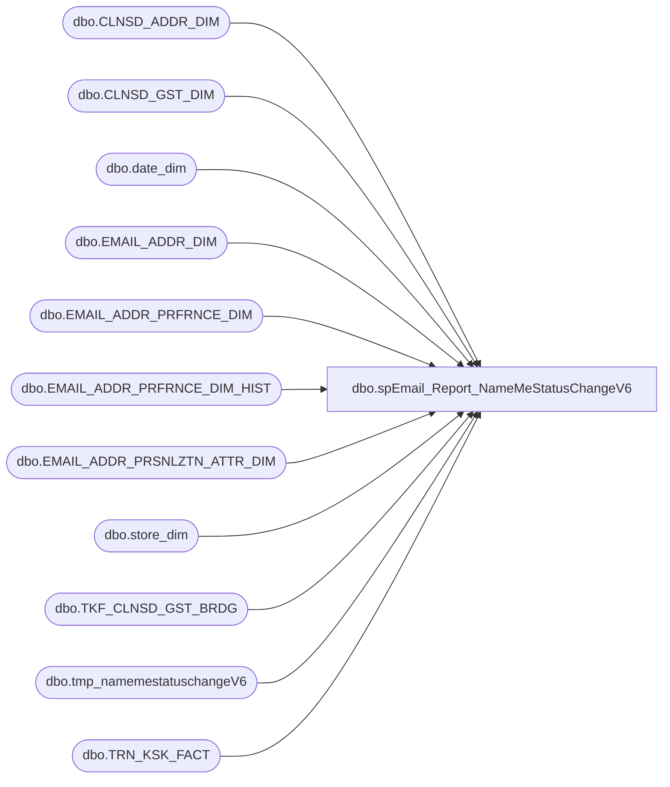

# dbo.spEmail_Report_NameMeStatusChangeV6

**Database:** dw  
**Server:** papamart  

## Architecture Diagram



## Table Dependencies

| Referenced Table |
|---|
| dbo.CLNSD_ADDR_DIM |
| dbo.CLNSD_GST_DIM |
| dbo.date_dim |
| dbo.EMAIL_ADDR_DIM |
| dbo.EMAIL_ADDR_PRFRNCE_DIM |
| dbo.EMAIL_ADDR_PRFRNCE_DIM_HIST |
| dbo.EMAIL_ADDR_PRSNLZTN_ATTR_DIM |
| dbo.store_dim |
| dbo.TKF_CLNSD_GST_BRDG |
| dbo.tmp_namemestatuschangeV6 |
| dbo.TRN_KSK_FACT |

## Stored Procedure Code

```sql
CREATE PROC [dbo].[spEmail_Report_NameMeStatusChangeV6]
-- =============================================================================================================
-- Name: [dbo].[spEmail_Report_NameMeStatusChangeV6]
--
-- Description:	 pull SFS and non-SFS e-mails for the following scenarios
--						1. SFS current status = opted-in and changed status = opted-out
--						2. non-SFS current status = opted-in and changed status = opted-out
--						3. non-SFS current status = opted-out or new and changed status = opted-in
--
--1.	SFS members that are currently opted-in and changed the status to opt-out
--		a.	Sfsnumber IS NOT NULL
--		b.	Old_promo_pref = ‘y’
--		c.	New_promo_pref = ‘n’
--2.	Non-sfs that are currently opted-in and changed the status to opt-out
--		a.	Sfsnumber is NULL
--		b.	Old_promo_pref = ‘y’
--		c.	New_promo_pref = ‘n’
--3.	Non-sfs that are currently opted-out and changed the status to opt-in
--		a.	Sfsnumber is NULL
--		b.	Old_promo_pref = ‘n’ or old_promo_pref = ‘new’
--		c.	New_promo_pref = ‘y’
--
-- Input:	@ad_date	datetime		grabs records updated since this date
--
-- Output: N/A
--
-- Dependencies: 
--
-- Revision History
--		Name:			Date:			Comments:
--		Keith Missey	05/26/2011		created
--		GaryD			10/16/2012		Add country and email exclusions.
--		GaryD			10/18/2012		Update destination folder
--		Garyd			02/15/2013		Add filter on USA
--		Garyd			02/27/2013		Add postal country
--		Garyd			02/27/2013		Keep filter on USA until Ashley has the campaign ready for other countries.
--		Garyd			03/05/2013		Remove filter on USA.

/*
DECLARE @date datetime
SET @date = CONVERT(VARCHAR, DATEADD(DAY, -1, GETDATE()), 101)
Exec spEmail_Report_NameMeStatusChangeV6 @ad_date = @date,  @reload = 1

--daily job
DECLARE @date datetime
SET @date = CONVERT(VARCHAR, DATEADD(DAY, -10000, GETDATE()), 101)
Exec spEmail_Report_NameMeStatusChangeV6 @ad_date = @date,  @reload = 0
*/
-- =============================================================================================================
@ad_date datetime=NULL,
@reload bit=0
AS 
    SET NOCOUNT ON
    
IF @ad_date IS NULL
	SET @ad_date = CONVERT(VARCHAR, DATEADD(DAY, -1, GETDATE()), 101)
	
--Exclude bad emails
SELECT EMAIL_ADDR_ID
INTO #tmp_ExcludeEmails
FROM dbo.EMAIL_ADDR_DIM e WITH (NOLOCK)
WHERE e.email_addr_txt LIKE '%BABWTEST.com%'
    
CREATE INDEX IX_tmp_ExcludeEmails_emailaddrid
ON #tmp_ExcludeEmails (email_addr_id);


--Get the latest postal country code for each email to allow for people who change country
SELECT e.EMAIL_ADDR_ID,
(SELECT TOP 1 a.CNTRY_ABBRV FROM 
		dw.dbo.CLNSD_GST_DIM g WITH (NOLOCK) 
		JOIN dw.dbo.CLNSD_ADDR_DIM a WITH (NOLOCK) ON (g.CLNSD_ADDR_ID = a.CLNSD_ADDR_ID)
		WHERE g.EMAIL_ADDR_ID = e.EMAIL_ADDR_ID
		ORDER BY a.INS_DT DESC ) AS 'LatestCC'
INTO #tmpPostalCountry
	FROM dw.dbo.EMAIL_ADDR_DIM e WITH (NOLOCK) 
		INNER JOIN dw.dbo.EMAIL_ADDR_PRFRNCE_DIM p WITH (NOLOCK) ON e.EMAIL_ADDR_ID = p.EMAIL_ADDR_ID
		LEFT JOIN dw.dbo.CLNSD_GST_DIM g WITH (NOLOCK) ON (g.EMAIL_ADDR_ID = e.EMAIL_ADDR_ID)
		LEFT JOIN dw.dbo.CLNSD_ADDR_DIM a WITH (NOLOCK) ON (g.CLNSD_ADDR_ID = a.CLNSD_ADDR_ID)
	WHERE  p.UPDT_DT >= @ad_date
		AND p.UPDT_SRC_SYS_CD = 'ksk'
		AND e.EMAIL_ADDR_ID NOT IN (SELECT email_addr_id FROM #tmp_ExcludeEmails)
		GROUP BY e.EMAIL_ADDR_ID

--select * from #tmpPostalCountry return
 --select * from #tmpPostalCountry where EMAIL_ADDR_ID = 3016029 return
--select EMAIL_ADDR_ID, count(*) from #tmpPostalCountry group by EMAIL_ADDR_ID having count(*) >1 return


--PULL E-MAILS THAT WERE MODIFIED BY NAMEME	
	SELECT DISTINCT e.email_addr_id, email_addr_txt, p.promo_pref AS new_promo_pref, h.PROMO_PREF AS old_promo_pref, p.UPDT_DT
	--, z.CNTRY_ABBRV AS 'EmailCC' 
	--,a.LatestCC AS 'PostalCC'
	,ISNULL(COALESCE(a.LatestCC, z.CNTRY_ABBRV), 'USA') AS 'CC'
		INTO #tmpemails
	FROM dw.dbo.EMAIL_ADDR_DIM e WITH (NOLOCK) 
		INNER JOIN dw.dbo.EMAIL_ADDR_PRFRNCE_DIM p WITH (NOLOCK) ON e.EMAIL_ADDR_ID = p.EMAIL_ADDR_ID
		LEFT JOIN dw.dbo.EMAIL_ADDR_PRFRNCE_DIM_HIST h WITH (NOLOCK) ON p.email_addr_id = h.email_addr_id AND h.hist_dt >= @ad_date
		LEFT JOIN dw.dbo.EMAIL_ADDR_PRSNLZTN_ATTR_DIM z WITH (NOLOCK) ON (e.EMAIL_ADDR_ID = z.EMAIL_ADDR_ID)
		LEFT JOIN #tmpPostalCountry a ON (e.EMAIL_ADDR_ID = a.EMAIL_ADDR_ID)
	WHERE  p.UPDT_DT >= @ad_date
		AND p.UPDT_SRC_SYS_CD = 'ksk'
		AND e.EMAIL_ADDR_ID NOT IN (SELECT email_addr_id FROM #tmp_ExcludeEmails)
		--AND ISNULL(z.CNTRY_ABBRV, 'USA') = 'USA'
--testing filter
  		--and e.EMAIL_ADDR_ID in (select email_addr_id from dbo.tmp_TestCases)
--testing filter		

--select * from #tmpemails  return		


--DELETE RECORDS WHERE THE PREFERENCE DIDN'T CHANGE 
DELETE FROM #tmpemails WHERE new_promo_pref = old_promo_pref
--DELETE NEW E-MAILS THAT ARE OPTED-OUT
DELETE FROM #tmpemails WHERE new_promo_pref = 'N' AND old_promo_pref IS NULL

--FIND ASSOCIATED NAMEME REGISTRATION RECORD WHERE E-MAIL EXISTED ON CLEANSED GUESTS
SELECT DISTINCT tkf.tkf_id, email_addr_id, g.clnsd_gst_id, LYLTY_GST_NBR, FRST_NM, LAST_NM, store_id, actual_date
INTO #tmpcleanguests
FROM dw.dbo.TRN_KSK_FACT tkf WITH (NOLOCK)
	INNER JOIN dw.dbo.TKF_CLNSD_GST_BRDG b WITH (NOLOCK) ON tkf.TKF_ID = b.TKF_ID
	INNER JOIN dw.dbo.CLNSD_GST_DIM g WITH (NOLOCK) ON b.CLNSD_GST_ID = g.CLNSD_GST_ID
	INNER JOIN dw.dbo.store_dim s WITH (NOLOCK) ON str_id = store_key
	INNER JOIN dw.dbo.date_dim d WITH (NOLOCK) ON dt_id = date_key
WHERE g.email_addr_id IN (SELECT email_addr_id FROM #tmpemails)
	AND actual_date >= @ad_date

SELECT MIN(tkf_id) AS tkf_id, email_addr_id 
INTO #tmpsfsguest
FROM #tmpcleanguests
WHERE lylty_gst_nbr IS NOT NULL
GROUP BY email_addr_id

SELECT MIN(tkf_id) AS tkf_id, email_addr_id 
INTO #tmpnonsfsguest
FROM #tmpcleanguests 
WHERE lylty_gst_nbr IS NULL
GROUP BY email_addr_id

SELECT g.*
	INTO #tmpfinalguest
FROM #tmpcleanguests g
	INNER JOIN #tmpsfsguest s ON g.tkf_id = s.tkf_id

INSERT #tmpfinalguest
SELECT g.* 
FROM #tmpcleanguests g
	INNER JOIN #tmpnonsfsguest n ON g.tkf_id = n.tkf_id
WHERE g.email_addr_id NOT IN (SELECT email_addr_id FROM #tmpfinalguest)

--SAVE EVERYTHING TO PHYSICAL TABLE
if (Object_ID('dw.dbo.tmp_namemestatuschangeV6') IS NOT NULL) DROP TABLE dw.dbo.tmp_namemestatuschangeV6


SELECT 
DISTINCT
LOWER(email_addr_txt) AS email_address
, new_promo_pref, ISNULL(CAST(old_promo_pref AS CHAR(3)),'NEW') AS old_promo_pref,
	CONVERT(VARCHAR(10), updt_dt,121) AS updt_dt, lylty_gst_nbr AS sfsnumber, frst_nm, last_nm, store_id
	,e.CC 
	INTO dw.dbo.tmp_namemestatuschangeV6
FROM #tmpemails e
	LEFT JOIN #tmpfinalguest g ON e.email_addr_id = g.email_addr_id
/* For TESTING ONLY - change email addresses to fake ones so real guests do not get emails*/
--join dbo.tmp_TestCases t on (e.email_addr_id = t.email_addr_id)
/* For TESTING ONLY - change email addresses to fake ones so real guests do not get emails*/
	
--DELETE SFS RECORDS THAT ARE CURRENTLY OPTED-OUT AND CHANGING TO OPT-IN
DELETE FROM dw.dbo.tmp_namemestatuschangeV6 WHERE old_promo_pref = 'N' AND new_promo_pref = 'Y' AND sfsnumber IS NOT NULL


--select * from tmp_namemestatuschangeV6 return


    DECLARE @cmd varchar(1000),
        @filename varchar(100),
		@filename_header varchar(100),
        @path varchar(200),
        @filedate varchar(20),
        @selectstmnt varchar(5000),
        @bcpsql varchar(500),
		@columnheaders varchar(4000), 
		@tablename varchar(128)

--CREATE TABLE CONTAINING COLUMN HEADERS FOR FILE EXPORT
SET @columnheaders = ''
SET @tablename='tmp_namemestatuschangeV6'

SELECT @columnheaders = @columnheaders + c.name + '| '
 FROM syscolumns c INNER JOIN sysobjects o ON o.id = c.id
 WHERE o.name = @tablename
 ORDER BY colid

SELECT @columnheaders = Substring(@columnheaders, 1, Datalength(@columnheaders) - 2)

if (Object_ID('dw.dbo.tmp_namemestatuschangeV6_Header') IS NOT NULL) DROP TABLE dw.dbo.tmp_namemestatuschangeV6_Header

SELECT @columnheaders AS columnheader
INTO dw.dbo.tmp_namemestatuschangeV6_Header

    SET @path = 'I:\Responsys\Upload\V6\'
	SET @filedate = CONVERT(VARCHAR(20), GETDATE(), 112)
    SET @filename = 'BABW_NAMEMECHANGESV6_' + @filedate + '.txt'
	SET @filename_header = 'BABW_NAMEMECHANGESV6_HEADER.txt'

--CREATE FILE CONTAINING EMAILS USING BCP COMMAND
    SET @selectstmnt = 'SELECT * FROM dw.dbo.tmp_namemestatuschangeV6'
    SET @bcpsql = 'bcp "' + @selectstmnt + '" queryout "' + @path + @filename
        + '.data" -t "|" -T -c'
    EXEC master..xp_cmdshell @bcpsql--, no_output

    SET @selectstmnt = 'SELECT * FROM dw.dbo.tmp_namemestatuschangeV6_header'
    SET @bcpsql = 'bcp "' + @selectstmnt + '" queryout "' + @path + @filename_header
        + '" -t "|" -T -c'
    EXEC master..xp_cmdshell @bcpsql--, no_output

    SET @cmd = 'copy ' + @path + @filename_header + '+' + @path + @filename
            + '.data ' + @path + @filename 
    EXEC master..xp_cmdshell @cmd, no_output

--COMPRESS FILE
    SELECT  @cmd = '"C:\Program Files\7-zip\7z.exe" a -tzip '
            + @path + REPLACE(@filename, '.txt', '') + '.zip ' + @path
            + @filename 
    EXEC master..xp_cmdshell @cmd--, no_output

--DELETE TEXT FILE
    SELECT  @cmd = 'del ' + @path + '*.txt /Q /F'
    EXEC master..xp_cmdshell @cmd, no_output

	SELECT  @cmd = 'del ' + @path + '*.data /Q /F'
    EXEC master..xp_cmdshell @cmd, no_output
```

