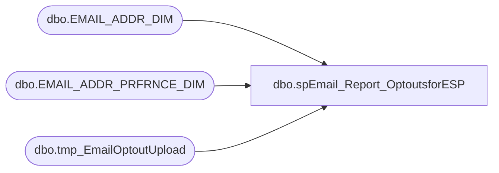

# dbo.spEmail_Report_OptoutsforESP

**Database:** dw  
**Server:** papamart  

## Architecture Diagram



## Table Dependencies

| Referenced Table |
|---|
| dbo.EMAIL_ADDR_DIM |
| dbo.EMAIL_ADDR_PRFRNCE_DIM |
| dbo.tmp_EmailOptoutUpload |

## Stored Procedure Code

```sql
CREATE PROC dbo.spEmail_Report_OptoutsforESP
-- =============================================================================================================
-- Name: dbo.spEmail_Report_OptoutsforESP
--
-- Description:	adds emails to text file and FTPs to HH to update suppression list
--
-- Input:	@emails			varchar(4000)		comma delimited list of e-mails to opt-out
--			@ad_date		datetime			begin date to pull opt-outs from
-- Output: 
--
-- Dependencies: 
--
-- EXAMPLE spEmail_Report_OptoutsforESP @ad_date = 
--
--
--
-- Revision History
--		Name:			Date:			Comments:
--		Keith Missey	6/9/2009		created
--		Keith Missey	8/13/2009		updated to remove logic to not include SFS members in upload
--		Keith Missey	10/23/2009		updated to use SFTP to send to Responsys
--		Keith Missey	8/31/2010		added date parameter and check to ensure Kiosk opt-outs are not uploaded
--		Keith Missey	03/11/2011		updated for to use new promo preference
-- =============================================================================================================
    @ad_date DATETIME = NULL
AS 
    SET NOCOUNT ON

    DECLARE @cmd varchar(1000),
        @filename varchar(100),
        @path varchar(200),
        @filedate varchar(20),
        @selectstmnt varchar(5000),
        @emailaddress varchar(255),
        @bcpsql varchar(500)

    IF EXISTS ( SELECT  *
                FROM    sysobjects
                WHERE   id = OBJECT_ID(N'[tmp_EmailOptoutUpload]')
                        AND type in ( N'U' ) ) 
        DROP TABLE dbo.[tmp_EmailOptoutUpload]

    CREATE TABLE dbo.[tmp_EmailOptoutUpload]
        (
          [tempid] [int] IDENTITY(1, 1) NOT NULL,
          [email] [varchar](255) NULL,
          source VARCHAR(20) NULL,
          optoutdate DATETIME NULL
        ) 

--LOCATION OF FILE TO BE UPLOADED
    SET @path = 'i:\responsys\upload\' 

--CREATE FILENAME
    SELECT  @filedate = CONVERT(VARCHAR(20), GETDATE(), 112)
    SELECT  @filename = 'BABWSuppression_' + @filedate + '.txt'

INSERT  dbo.tmp_EmailOptoutUpload
SELECT 'email_address','source',NULL

    IF @ad_date IS NOT NULL
        BEGIN

--LOAD ALL E-MAILS THAT HAVE OPTED OUT SINCE DATE PARAMETER
			INSERT  dbo.tmp_EmailOptoutUpload
            SELECT email_addr_txt, UPDT_SRC_SYS_CD, PROMO_UPDT_DT
            FROM    dw.[dbo].[EMAIL_ADDR_DIM] e WITH ( NOLOCK )
                    INNER JOIN dw.dbo.EMAIL_ADDR_PRFRNCE_DIM p WITH (NOLOCK) ON e.EMAIL_ADDR_ID = p.EMAIL_ADDR_ID
            WHERE   PROMO_PREF = 'N'
                    AND p.PROMO_UPDT_DT >= @ad_date AND email_stat_cd = 'VALID'
        END
        ELSE
        BEGIN
        			INSERT  dbo.tmp_EmailOptoutUpload
            SELECT email_addr_txt, UPDT_SRC_SYS_CD, PROMO_UPDT_DT
            FROM    dw.[dbo].[EMAIL_ADDR_DIM] e WITH ( NOLOCK )
                    INNER JOIN dw.dbo.EMAIL_ADDR_PRFRNCE_DIM p WITH (NOLOCK) ON e.EMAIL_ADDR_ID = p.EMAIL_ADDR_ID
            WHERE   PROMO_PREF = 'N' AND email_stat_cd = 'VALID'
        END

--CREATE FILE CONTAINING EMAILS USING BCP COMMAND
    SET @selectstmnt = 'SELECT email FROM dw.dbo.tmp_EmailOptoutUpload ORDER BY tempid'
    SET @bcpsql = 'bcp "' + @selectstmnt + '" queryout "' + @path + @filename
        + '" -t "," -T -c'
    EXEC master..xp_cmdshell @bcpsql--, no_output

--COMPRESS FILE
    SELECT  @cmd = '"C:\Program Files\7-zip\7z.exe" a -tzip '
            + @path + REPLACE(@filename, '.txt', '') + '.zip ' + @path
            + @filename 
    EXEC master..xp_cmdshell @cmd--, no_output

--DELETE TEXT FILE
    SELECT  @cmd = 'del ' + @path + '*.txt /Q /F'
    EXEC master..xp_cmdshell @cmd, no_output
```

