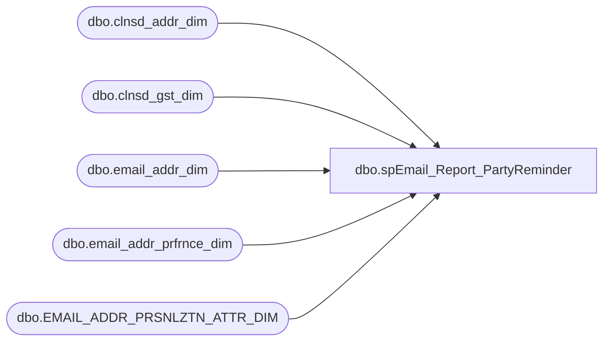

# dbo.spEmail_Report_PartyReminder

**Database:** dw  
**Server:** papamart  

## Architecture Diagram



## Table Dependencies

| Referenced Table |
|---|
| dbo.clnsd_addr_dim |
| dbo.clnsd_gst_dim |
| dbo.email_addr_dim |
| dbo.email_addr_prfrnce_dim |
| dbo.EMAIL_ADDR_PRSNLZTN_ATTR_DIM |

## Stored Procedure Code

```sql
CREATE PROC [dbo].[spEmail_Report_PartyReminder]
-- =============================================================================================================
-- Name: [dbo].[spEmail_Report_PartyReminder]
--
-- Description:	 pull guest email addresses with kids in the househould 
--				aged 3 (turning 4) to 12 (turning 13) with birthdays 55 days out.
--
-- Input:
--
-- Output: N/A
--
-- Dependencies: 
--
-- Revision History
--		Name:			Date:			Comments:
--		Keith Missey	05/23/2011		created
--		Keith Missey	01/03/2012		removed UK Party Packages
--		Keith Missey	02/21/2012		added age check of 3 - 12
-- =============================================================================================================
AS 
    SET NOCOUNT ON

DECLARE @month INT
DECLARE @day INT

SET @month = MONTH(CONVERT(varchar, DATEADD(d, 55, GETDATE()), 101))
SET @day = DAY((CONVERT(varchar, DATEADD(d, 55, GETDATE()), 101)))

--PULL UK PARTY PACKAGE STORES
--SELECT clnsd_gst_id, g.clnsd_addr_id, email_addr_id, brth_dt, ad.cntry_abbrv, store_id
--	INTO #tmpguests
--FROM dw.dbo.clnsd_gst_dim g WITH (NOLOCK)
--	INNER JOIN dw.dbo.clnsd_addr_dim ad WITH (NOLOCK) ON g.[CLNSD_ADDR_ID] = ad.[CLNSD_ADDR_ID]
--	INNER JOIN dw.dbo.[ADDR_SUM_FACT] a WITH (NOLOCK) ON g.[CLNSD_ADDR_ID] = a.[CLNSD_ADDR_ID]
--	INNER JOIN dw.dbo.[NRST_PSTL_CD_STR_DIM] n WITH (NOLOCK) ON a.[NRST_PSTL_CD_STR_ID] = n.[NRST_PSTL_CD_STR_ID]
--	INNER JOIN dw.dbo.store_dim s WITH (NOLOCK) ON n.str_id = s.store_key
--WHERE brth_dt = @birthdate AND store_id IN (2020, 2001, 2045, 2022, 2044, 2051, 2038, 2047, 2056, 2010, 
--			2024, 2046, 2025, 2026, 2023, 2041, 2036, 2054, 2052)

--PULL GUESTS WITH KNOWN E-MAILS AND ADDRESSES
--INSERT #tmpguests
SELECT clnsd_gst_id, g.clnsd_addr_id, email_addr_id, brth_dt, cntry_abbrv, 
	cast(((datediff(dy,g.brth_dt,getdate())/365.25)) as int) AS age, -1 AS store_id
INTO #tmpguests
FROM dw.dbo.clnsd_gst_dim g WITH (NOLOCK)
	INNER JOIN dw.dbo.clnsd_addr_dim ad WITH (NOLOCK) ON g.[CLNSD_ADDR_ID] = ad.[CLNSD_ADDR_ID]
WHERE MONTH(brth_dt) = @month AND DAY(brth_dt) = @day AND cntry_abbrv IN ('gbr', 'usa', 'can')
	--AND clnsd_gst_id NOT IN (SELECT clnsd_gst_id FROM #tmpguests)

SELECT DISTINCT email_addr_txt, brth_dt, cntry_abbrv, store_id
INTO #tmpemails
FROM #tmpguests t
	INNER JOIN dw.dbo.email_addr_dim e WITH (NOLOCK) ON t.email_addr_id = e.email_addr_id
	INNER JOIN dw.dbo.email_addr_prfrnce_dim p WITH (NOLOCK) ON e.email_addr_id = p.email_addr_id
WHERE email_stat_cd = 'valid' AND promo_pref = 'y' AND age BETWEEN 3 and 12

DELETE #tmpguests WHERE email_addr_id <> -1

--householding to find someone in the household with an e-mail
SELECT DISTINCT g.email_addr_id, t.brth_dt, cntry_abbrv
INTO #tmpemailid
FROM #tmpguests t
	INNER JOIN dw.dbo.clnsd_gst_dim g WITH (NOLOCK) ON t.clnsd_addr_id = g.clnsd_addr_id
WHERE g.email_addr_id <> -1 AND age BETWEEN 3 and 12

INSERT #tmpemails
SELECT DISTINCT email_addr_txt, brth_dt, cntry_abbrv, -1
FROM dw.dbo.email_addr_dim e WITH (NOLOCK)
	INNER JOIN #tmpemailid t ON e.email_addr_id = t.email_addr_id
	INNER JOIN dw.dbo.email_addr_prfrnce_dim p WITH (NOLOCK) ON e.email_addr_id = p.email_addr_id
WHERE email_addr_txt NOT IN (SELECT email_addr_txt FROM #tmpemails)
AND email_stat_cd = 'valid' AND promo_pref = 'y'

--FIND E-MAIL-ONLY RECORDS
SELECT DISTINCT email_addr_txt, email_brth_dt, cntry_abbrv, cast(((datediff(dy,email_brth_dt,getdate())/365.25)) as int) AS age, 
	-1 AS storeid
INTO #tmpemailonly
FROM dw.dbo.email_addr_dim e WITH (NOLOCK)
	INNER JOIN dw.dbo.EMAIL_ADDR_PRSNLZTN_ATTR_DIM p WITH (NOLOCK) ON e.email_addr_id = p.email_addr_id
	INNER JOIN dw.dbo.EMAIL_ADDR_PRFRNCE_DIM ep WITH (NOLOCK) ON e.email_addr_id = ep.EMAIL_ADDR_ID
WHERE email_stat_cd = 'valid' AND PROMO_PREF = 'Y' AND cntry_abbrv IN ('usa','gbr','can')
	AND MONTH(email_brth_dt) = @month AND DAY(email_brth_dt) = @day
	AND email_addr_txt NOT IN (SELECT email_addr_txt FROM #tmpemails)

INSERT #tmpemails
SELECT email_addr_txt, email_brth_dt, cntry_abbrv, storeid FROM #tmpemailonly
	WHERE age BETWEEN 3 and 12

--SAVE EVERYTHING TO PHYSICAL TABLE
if (Object_ID('dw.dbo.tmp_partyreminder') IS NOT NULL) DROP TABLE dw.dbo.tmp_partyreminder

SELECT DISTINCT email_addr_txt AS email_address, 
CONVERT(VARCHAR(10), brth_dt,121) AS birth_date, cntry_abbrv as country, store_id
	INTO dw.dbo.tmp_partyreminder
FROM #tmpemails

    DECLARE @cmd varchar(1000),
        @filename varchar(100),
		@filename_header varchar(100),
        @path varchar(200),
        @filedate varchar(20),
        @selectstmnt varchar(5000),
        @bcpsql varchar(500),
		@columnheaders varchar(4000), 
		@tablename varchar(128)

--CREATE TABLE CONTAINING COLUMN HEADERS FOR FILE EXPORT
SET @columnheaders = ''
SET @tablename='tmp_partyreminder'

SELECT @columnheaders = @columnheaders + c.name + '| '
 FROM syscolumns c INNER JOIN sysobjects o ON o.id = c.id
 WHERE o.name = @tablename
 ORDER BY colid

SELECT @columnheaders = Substring(@columnheaders, 1, Datalength(@columnheaders) - 2)

if (Object_ID('dw.dbo.tmp_partyreminder_Header') IS NOT NULL) DROP TABLE dw.dbo.tmp_partyreminder_Header

SELECT @columnheaders AS columnheader
INTO dw.dbo.tmp_partyreminder_Header

    SET @path = 'I:\Responsys\Upload\'
	SET @filedate = CONVERT(VARCHAR(20), GETDATE(), 112)
    SET @filename = 'BABW_PARTYREMINDER_' + @filedate + '.txt'
	SET @filename_header = 'BABW_PARTYREMINDER_HEADER.txt'

--CREATE FILE CONTAINING EMAILS USING BCP COMMAND
    SET @selectstmnt = 'SELECT * FROM dw.dbo.tmp_partyreminder'
    SET @bcpsql = 'bcp "' + @selectstmnt + '" queryout "' + @path + @filename
        + '.data" -t "|" -T -c'
    EXEC master..xp_cmdshell @bcpsql--, no_output

    SET @selectstmnt = 'SELECT * FROM dw.dbo.tmp_partyreminder_header'
    SET @bcpsql = 'bcp "' + @selectstmnt + '" queryout "' + @path + @filename_header
        + '" -t "|" -T -c'
    EXEC master..xp_cmdshell @bcpsql--, no_output

    SET @cmd = 'copy ' + @path + @filename_header + '+' + @path + @filename
            + '.data ' + @path + @filename 
    EXEC master..xp_cmdshell @cmd, no_output

--COMPRESS FILE
    SELECT  @cmd = '"C:\Program Files\7-zip\7z.exe" a -tzip '
            + @path + REPLACE(@filename, '.txt', '') + '.zip ' + @path
            + @filename 
    EXEC master..xp_cmdshell @cmd--, no_output

--DELETE TEXT FILE
    SELECT  @cmd = 'del ' + @path + '*.txt /Q /F'
    EXEC master..xp_cmdshell @cmd, no_output

	SELECT  @cmd = 'del ' + @path + '*.data /Q /F'
    EXEC master..xp_cmdshell @cmd, no_output
```

