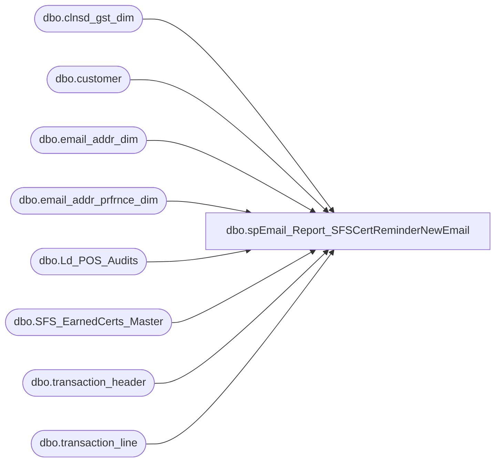

# dbo.spEmail_Report_SFSCertReminderNewEmail

**Database:** dw  
**Server:** papamart  

## Architecture Diagram



## Table Dependencies

| Referenced Table |
|---|
| dbo.clnsd_gst_dim |
| dbo.customer |
| dbo.email_addr_dim |
| dbo.email_addr_prfrnce_dim |
| dbo.Ld_POS_Audits |
| dbo.SFS_EarnedCerts_Master |
| dbo.transaction_header |
| dbo.transaction_line |

## Stored Procedure Code

```sql
CREATE PROC [dbo].[spEmail_Report_SFSCertReminderNewEmail]
-- =============================================================================================================
-- Name: [dbo].[spEmail_Report_SFSCertReminderNewEmail]
--
-- Description:	 pulls all new e-mails from a manually loaded earned certs table 
--				where the cert has not yet been redeemed; e-mail will be sent letting the 
--				recipient know about the unredeemed certificate
--
--
-- Input:	@ad_date	datetime		grabs records updated since this date
--
-- Output: N/A
--
-- Dependencies: 
--
-- Revision History
--		Name:			Date:			Comments:
--		Keith Missey	07/25/2011		created
--		Keith Missey	10/18/2011		fixed leading 0 issue with serialized coupon number
--		Keith Missey	05/08/2012		renamed main table, added audit columns, and subtract one month from expiration on upload
-- =============================================================================================================
@ad_date datetime=NULL
AS 
    SET NOCOUNT ON

--DECLARE @ad_date datetime

IF @ad_date IS NULL
	SET @ad_date = CONVERT(VARCHAR, DATEADD(DAY, -1, GETDATE()), 101)

--FIND LATEST REDEEMED CERTS FOR THE PREVIOUS 5 DAYS
SELECT transaction_id, store_no, transaction_no, reference_no, SUBSTRING(reference_no, PATINDEX('%[1-9]%', reference_no),LEN(reference_no)) AS reference_no_for_crm, transaction_date
		,gross_line_amount
INTO #tmpredeemedcerts
	FROM
	(
		SELECT tl.transaction_id, th.store_no, th.transaction_no, tl.reference_no, th.transaction_date, tl.gross_line_amount - ISNULL(tl_adj.gross_line_amount, 0) AS gross_line_amount
		FROM (SELECT DISTINCT transaction_id FROM bedrockdb01.auditworks.dbo.Ld_POS_Audits WITH (NOLOCK)) a
		INNER JOIN bedrockdb01.auditworks.dbo.transaction_header th WITH (NOLOCK) ON th.transaction_id = a.transaction_id
			AND th.transaction_void_flag = 0
		INNER JOIN bedrockdb01.auditworks.dbo.transaction_line tl WITH (NOLOCK) ON tl.transaction_id = th.transaction_id
			AND line_void_flag = 0
			-- line action of 25 is a redemption
			AND line_action = 25
		LEFT JOIN bedrockdb01.auditworks.dbo.transaction_line tl_adj WITH (NOLOCK) ON tl_adj.transaction_id = tl.transaction_id
			AND tl_adj.line_action = 13
			AND tl_adj.line_object = 1130
			AND tl.reference_no = (SELECT MAX(tl2.reference_no) FROM bedrockdb01.auditworks.dbo.transaction_line tl2 WITH (NOLOCK) WHERE tl2.transaction_id = th.transaction_id AND tl2.line_void_flag = 0 AND tl2.line_action = 25 AND tl2.reference_type = 31)
		WHERE tl.reference_type = 31
			AND th.store_no <> 990 AND transaction_date >= DATEADD(d, -5, @ad_date)

		UNION

		SELECT tl.transaction_id, th.store_no, th.transaction_no, tl.reference_no, th.transaction_date, tl.gross_line_amount - ISNULL(tl_adj.gross_line_amount, 0) AS gross_line_amount
		FROM bedrockdb01.auditworks.dbo.transaction_header th WITH (NOLOCK)
		INNER JOIN bedrockdb01.auditworks.dbo.transaction_line tl WITH (NOLOCK) ON tl.transaction_id = th.transaction_id
			AND line_void_flag = 0
			-- line action of 25 is a redemption
			AND line_action = 25
		LEFT JOIN bedrockdb01.auditworks.dbo.transaction_line tl_adj WITH (NOLOCK) ON tl_adj.transaction_id = tl.transaction_id
			AND tl_adj.line_action = 13
			AND tl_adj.line_object = 1130
			AND tl.reference_no = (SELECT MAX(tl2.reference_no) FROM bedrockdb01.auditworks.dbo.transaction_line tl2 WITH (NOLOCK) WHERE tl2.transaction_id = th.transaction_id AND tl2.line_void_flag = 0 AND tl2.line_action = 25 AND tl2.reference_type = 31)
		WHERE tl.reference_type = 31
			AND th.store_no <> 990
			AND th.transaction_void_flag = 0 AND transaction_date >= DATEADD(d, -5, @ad_date)
	) t

UPDATE queries.dbo.SFS_EarnedCerts_Master
	SET transaction_id = r.transaction_id,
		serialized_no = reference_no, redemption_date = transaction_date, master_upd_dt = GETDATE()
FROM queries.dbo.SFS_EarnedCerts_Master
	INNER JOIN #tmpredeemedcerts r ON serialized COLLATE Latin1_General_CI_AS = reference_no_for_crm

--FIND UPDATE E-MAIL INFORMATION
SELECT  lylty_gst_nbr, e.email_addr_txt, e.email_stat_cd, e.email_stat_dt, e.ins_dt, e.updt_dt, p.promo_pref, p.promo_updt_dt,
	p.sfscert_pref, p.sfscert_updt_dt 
	INTO #tmpemail
FROM queries.dbo.SFS_EarnedCerts_Master
	INNER JOIN dw.dbo.clnsd_gst_dim g WITH (NOLOCK) ON sfsnumber = lylty_gst_nbr
	INNER JOIN dw.dbo.email_addr_dim e WITH (NOLOCK) ON g.email_addr_id = e.email_addr_id
	INNER JOIN dw.dbo.email_addr_prfrnce_dim p WITH (NOLOCK) ON p.email_addr_id = e.email_addr_id
WHERE (e.ins_dt >= @ad_date OR e.EMAIL_STAT_DT >= @ad_date) AND e.EMAIL_STAT_CD = 'valid' 

UPDATE queries.dbo.SFS_EarnedCerts_Master
	SET email_addr_txt = e.email_addr_txt,
		email_stat_cd = e.email_stat_cd, email_stat_dt = e.email_stat_dt, ins_dt = e.ins_dt,
		updt_dt = e.updt_dt, promo_pref = e.promo_pref, promo_updt_dt = e.promo_updt_dt,
		sfscert_pref = e.sfscert_pref, sfscert_updt_dt = e.sfscert_updt_dt, master_upd_dt = GETDATE()
FROM queries.dbo.SFS_EarnedCerts_Master
	INNER JOIN #tmpemail e ON sfsnumber = lylty_gst_nbr

SELECT DISTINCT sfsnumber 
INTO #tmpsfsemail
FROM queries.dbo.SFS_EarnedCerts_Master  c
	LEFT JOIN dw.dbo.clnsd_gst_dim g WITH (NOLOCK) ON sfsnumber = lylty_gst_nbr
WHERE clnsd_gst_id IS NULL AND sentflag = 0

SELECT customer_no, email_address, email_indicator, opt_in_flag, opt_in_date, last_update_date
INTO #tmpcrm
FROM [stl-crmdb-p-01].crm.dbo.customer WHERE customer_no IN (SELECT sfsnumber from #tmpsfsemail)
	AND email_address IS NOT NULL AND email_address LIKE '%@%.%'

UPDATE queries.dbo.SFS_EarnedCerts_Master
	SET email_addr_txt = email_address, 
		email_stat_cd = CASE WHEN email_indicator = 0 THEN 'VALID' ELSE 'BOUNCE' END,
		email_stat_dt = CASE WHEN last_update_date >= opt_in_date THEN last_update_date ELSE opt_in_date END,
		ins_dt = c.opt_in_date, updt_dt = c.last_update_date, promo_pref = CASE WHEN opt_in_flag = 2 THEN 'N' ELSE 'Y' END, master_upd_dt = GETDATE()
FROM queries.dbo.SFS_EarnedCerts_Master e
	INNER JOIN #tmpcrm c ON customer_no = sfsnumber

--PULL E-MAILS FROM MANUALLY CREATED TABLE 
SELECT serialized, sfsnumber,firstname,lastname,email_addr_txt,expirationdate,
	email_stat_dt
INTO #tmpemails
FROM queries.dbo.SFS_EarnedCerts_Master
WHERE redemption_date IS NULL AND email_stat_cd = 'valid'
	AND emailaddress <> email_addr_txt AND DATEADD(m, -1, CAST(expirationdate AS DATETIME)) >= GETDATE()
	AND sentflag = 0  

INSERT #tmpemails
SELECT serialized, sfsnumber,firstname,lastname,email_addr_txt,expirationdate,
	email_stat_dt
FROM queries.dbo.SFS_EarnedCerts_Master
WHERE redemption_date IS NULL AND email_stat_cd = 'valid'
	AND emailaddress = email_addr_txt AND email_stat_dt >= @ad_date 
		AND email_addr_txt NOT IN (SELECT email_addr_txt FROM #tmpemails)
	AND DATEADD(m, -1, CAST(expirationdate AS DATETIME)) >= GETDATE()
AND sentflag = 0  

--SET FLAG SO CERTIFICATES SET TO BE UPLOADED ARE NOT RE-UPLOADED AGAIN
UPDATE queries.dbo.SFS_EarnedCerts_Master
	SET sentflag = 1, sentdate = GETDATE(), master_upd_dt = GETDATE()
WHERE serialized IN (SELECT serialized FROM #tmpemails)

--SAVE EVERYTHING TO PHYSICAL TABLE
if (Object_ID('dw.dbo.tmp_sfscertremindnewemail') IS NOT NULL) DROP TABLE dw.dbo.tmp_sfscertremindnewemail

SELECT serialized AS sfs_cert, sfsnumber AS sfs_number, firstname AS first_name,
	lastname AS last_name, email_addr_txt AS email_address, CONVERT(varchar, DATEADD(m, -1, CAST(expirationdate AS DATETIME)), 101) AS exp_date,
	CONVERT(varchar, CAST(email_stat_dt AS DATETIME), 121) AS optin_date
	INTO dw.dbo.tmp_sfscertremindnewemail
FROM #tmpemails e 
	
    DECLARE @cmd varchar(1000),
        @filename varchar(100),
		@filename_header varchar(100),
        @path varchar(200),
        @filedate varchar(20),
        @selectstmnt varchar(5000),
        @bcpsql varchar(500),
		@columnheaders varchar(4000), 
		@tablename varchar(128)

--CREATE TABLE CONTAINING COLUMN HEADERS FOR FILE EXPORT
SET @columnheaders = ''
SET @tablename='tmp_sfscertremindnewemail'

SELECT @columnheaders = @columnheaders + c.name + '| '
 FROM syscolumns c INNER JOIN sysobjects o ON o.id = c.id
 WHERE o.name = @tablename
 ORDER BY colid
SELECT @columnheaders
SELECT @columnheaders = Substring(@columnheaders, 1, Datalength(@columnheaders) - 2)

if (Object_ID('dw.dbo.tmp_sfscertremindnewemail_Header') IS NOT NULL) DROP TABLE dw.dbo.tmp_sfscertremindnewemail_Header

SELECT @columnheaders AS columnheader
INTO dw.dbo.tmp_sfscertremindnewemail_Header

    SET @path = 'I:\Responsys\Upload\'
	SET @filedate = CONVERT(VARCHAR(20), GETDATE(), 112)
    SET @filename = 'BABW_SFSCERTNEWEMAIL_' + @filedate + '.txt'
	SET @filename_header = 'BABW_SFSCERTNEWEMAIL_HEADER.txt'

--CREATE FILE CONTAINING EMAILS USING BCP COMMAND
    SET @selectstmnt = 'SELECT * FROM dw.dbo.tmp_sfscertremindnewemail'
    SET @bcpsql = 'bcp "' + @selectstmnt + '" queryout "' + @path + @filename
        + '.data" -t "|" -T -c'
    EXEC master..xp_cmdshell @bcpsql--, no_output

    SET @selectstmnt = 'SELECT * FROM dw.dbo.tmp_sfscertremindnewemail_header'
    SET @bcpsql = 'bcp "' + @selectstmnt + '" queryout "' + @path + @filename_header
        + '" -t "|" -T -c'
    EXEC master..xp_cmdshell @bcpsql--, no_output

    SET @cmd = 'copy ' + @path + @filename_header + '+' + @path + @filename
            + '.data ' + @path + @filename 
    EXEC master..xp_cmdshell @cmd, no_output

--COMPRESS FILE
    SELECT  @cmd = '"C:\Program Files\7-zip\7z.exe" a -tzip '
            + @path + REPLACE(@filename, '.txt', '') + '.zip ' + @path
            + @filename 
    EXEC master..xp_cmdshell @cmd--, no_output

--DELETE TEXT FILE
    SELECT  @cmd = 'del ' + @path + '*.txt /Q /F'
    EXEC master..xp_cmdshell @cmd, no_output

	SELECT  @cmd = 'del ' + @path + '*.data /Q /F'
    EXEC master..xp_cmdshell @cmd, no_output


dbo,spRPT_GiftcardUpsell_Detail_forDateCountry,-- =====================================================================================================
-- Name: spRPT_GiftcardUpsell_Detail_forDateCountry
--
-- Description:	Extracts the informtion for GiftcardUpsell_Detail_ForDateCountry report
--
-- Input: None
--
-- Output: Resultset 
--			
--
-- Dependencies: None
--
-- Revision History
--		Name:			Date:			Comments:
--		Gary Murrish	12/23/2013		Initial Release
-- =====================================================================================================
CREATE PROCEDURE [dbo].[spRPT_GiftcardUpsell_Detail_forDateCountry]
	@fromDate datetime,
	@thruDate datetime,
	@forCountry varchar(50),
	@forStoreNo int = -1

AS
BEGIN
	SET NOCOUNT ON;

	DECLARE @fromDateKey int
	DECLARE @thruDateKey int
	SELECT
		@fromDateKey = date_key
	FROM
		date_dim dd WITH (NOLOCK)
	WHERE
		dd.actual_date = @fromDate
	SELECT
		@thruDateKey = date_key
	FROM
		date_dim dd WITH (NOLOCK)
	WHERE
		dd.actual_date = @thruDate

	-- Get all of the redemptions with activated discounts
	IF OBJECT_ID('tempdb..#tmpRedemptions') IS NOT NULL
	BEGIN
		DROP TABLE #tmpRedemptions
	END

	SELECT
		sd.store_id,
		gr.giftcard_no,
		gr.redemption_amount,
		gr.currency_key AS redCurrency_Key,
		gr.activation_discount_amount,
		tf.transaction_no AS redTransaction_no,
		tf.register_no AS redRegister_no,
		dd.actual_date AS redDate,
		gr.date_key AS red_Date_Key,
		gr.daysSinceLastActivation,
		sd.store_name_abbrv AS redStoreName
	INTO #tmpRedemptions
	FROM
		giftcards_redeemed gr WITH (NOLOCK)
		INNER JOIN store_dim sd WITH (NOLOCK)
			ON gr.store_key = sd.store_key
		INNER JOIN Transaction_Facts tf WITH (NOLOCK)
			ON gr.transaction_id = tf.transaction_id
		INNER JOIN date_dim dd WITH (NOLOCK)
			ON gr.date_key = dd.date_key
	WHERE
		gr.date_key BETWEEN @fromDateKey AND @thruDateKey
		AND gr.activation_discount_amount <> 0
		AND sd.country = @forCountry
		AND (@forStoreNo = -1 OR @forStoreNo = sd.store_id)
	-- (3501 row(s) affected)

	-- Get the most recent activation for each of these giftcards

	IF OBJECT_ID('tempdb..#tmpRecentActivation') IS NOT NULL
	BEGIN
		DROP TABLE #tmpRecentActivation
	END
	SELECT
		ga.giftcard_no,
		r.red_Date_Key,
		MAX(ga.date_key) AS lastActivation
	INTO #tmpRecentActivation
	FROM
		Giftcards_Activated ga WITH (NOLOCK)
		INNER JOIN #tmpRedemptions r WITH (NOLOCK)
			ON ga.giftcard_no = r.giftcard_no
			AND ga.date_key <= r.red_Date_Key
	GROUP BY	ga.giftcard_no,
				r.red_Date_Key

	IF OBJECT_ID('tempdb..#tmpLastActivation') IS NOT NULL
	BEGIN
		DROP TABLE #tmpLastActivation
	END
	SELECT
		ra.giftcard_no,
		ra.red_Date_Key,
		MAX(ga.recID) AS lastRecID
	INTO #tmpLastActivation
	FROM
		#tmpRecentActivation ra WITH (NOLOCK)
		INNER JOIN Giftcards_Activated ga WITH (NOLOCK)
			ON ra.giftcard_no = ga.giftcard_no
			AND ra.lastActivation = ga.date_key
	GROUP BY	ra.giftcard_no,
				ra.red_Date_Key

	SELECT
		r.giftcard_no,
		r.redemption_amount,
		r.store_id AS redStoreNo,
		r.redStoreName AS redStoreName,
		r.activation_discount_amount AS redDiscountApplied,
		r.redTransaction_no,
		r.redRegister_no,
		r.redDate,
		r.daysSinceLastActivation,
		cdr.currency_code AS redCurrency_code,
		sd.store_id AS actStoreNo,
		tf.transaction_no AS actTransaction_no,
		tf.register_no AS actRegister_no,
		dd.actual_date AS actDate,
		cda.currency_code AS actCurrency_code,
		ga.activated_amount AS actActivatedAmount,
		ga.discount_amount AS actDiscountAmount

	FROM
		#tmpRedemptions r WITH (NOLOCK)
		LEFT JOIN #tmpLastActivation la WITH (NOLOCK)
			ON r.giftcard_no = la.giftcard_no
			AND r.red_Date_Key = la.red_Date_Key
		LEFT JOIN Giftcards_Activated ga WITH (NOLOCK)
			ON ga.giftcard_no = la.giftcard_no
			AND ga.recID = la.lastRecID
		LEFT JOIN Transaction_Facts tf WITH (NOLOCK)
			ON ga.transaction_id = tf.transaction_id
		LEFT JOIN date_dim dd WITH (NOLOCK)
			ON ga.date_key = dd.date_key
		LEFT JOIN currency_dim cda WITH (NOLOCK)
			ON ga.currency_key = cda.currency_key
		INNER JOIN currency_dim cdr WITH (NOLOCK)
			ON r.redCurrency_Key = cdr.currency_key
		LEFT JOIN store_dim sd WITH (NOLOCK)
			ON ga.store_key = sd.store_key
END


dbo,spGuestLoad_Process_BBPntRgn_USA,-- =============================================================================================================
-- Name: spGuestLoad_Process_BBPntRgn_USA
--
-- Description:	
--		This will update clnsd_addr_dim's  BLKGRP_CD, CLUS_ID columns
--
-- Input:
--		@etl_log_id				int	
--			last guest load to touch this, used for logging.
--
-- Output: 
--		 BLKGRP_CD, CLUS_ID columns on clnsd_addr_dim will be updated
--
-- Dependencies: 
--
-- EXAMPLE:
--		exec crm.dbo.spGuestLoad_Process_BBPntRgn_USA -1
--
-- Revision History
--		Name:			Date:			Comments:
--		Dave Rice		7/19/2010		created
-- =============================================================================================================

CREATE PROCEDURE [dbo].[spGuestLoad_Process_BBPntRgn_USA](@etl_log_id int)
AS
BEGIN
-- SET NOCOUNT ON added to prevent extra result sets from
-- interfering with SELECT statements.
SET NOCOUNT ON;


----exec dbo.[spGuestLoad_Process_BBPntRgn_USA] 13882
--select top 1 etl_log_id from dwstaging.dbo.load_rec_id_cntrl with (nolock)

--declare @etl_log_id int
--set @etl_log_id = 14138

/*
importing the mapinfo psyte clusters

back when we were using firstlogic with informatica, firstlogic would provide the blockgroup code
that we could then link up with the appropriate cluster from mapinfo.  but, when we converted to 
SSIS and QAS, we lost that blockgroup.

what to do, what to do.

we ended up contacting a company - stopwatchmaps - that would provide a program to figure out the 
correct blockgroup given a lat/lon.  It's really cheesy to shell out to run it, but it was also 
confusing because we needed to have Judy dump out the mapinfo data into a 4 data files for the US
and 4 for CA.  So, not only do I have to shell out, I have to do it twice.  And, we will have an 
issue in 2010 (or yearly) in getting the latest data.  We need to have someone remember how to get
those files out in the proper format.  Judy did create an export procedure where she had to select
the correct columns and then she renamed them.  She did this months ago, and forgot how she created
it.  We had to backtrack and download the file where she ftp'd them to stopwatchmaps just so we could
continue.  She did end up giving me a new CA file.  But the point is, this is very manual and updating 
each year could be a problem.

	Joe Bolian
	(314) 863-4636
	jbolian@stopwatchmaps.com

fyi:  look in the .tab file for the column names, i searched and searched to find what they were called 
for my spec file to run BBPntRgn.exe when all i had to do was look here.

good thing that the code does log errors in it's own .err file, so i can check that to see if the exe
died.

the exe does run fast, but currently there are issues.  it's not dumping out all the fields for every row
so the import process gets confused whether because from missing line feeds or tab issues so it combines
2 lines into 1.  i have to delete the corruption and try again later.

It is also dumping out blank rows and duplicates in the CA data.

Judy also wanted to modify the clustergroup code.  The mapinfo data has the clustercode concatenated onto
the major group.  this makes it harder for her to sort on the major groups.  Also, the cluster codes overlap
between US/CA and she doesn't want to have to add 2 fields to figure out the country.  I suggested concatenating
the country code onto the clustercode, but i'll talk to funmi about making the view in bo do that.

hmmm, side note, canada addresses are down to the their postal code.  qas didn't provide it, so i had to improvise.
not sure how accurate this will be for Judy?  all depends how tight their zip+4 scheme is.

i talked to judy about this and she is fine with leaving canada alone.  US is more important.  We are a week or so (1/5/2010) away from 
the expiration of mapinfo licenses.  Interesting that the stopwatchmaps code should also expire due to our contract with mapinfo.
looks like the reason is that we had to export part of mapinfo data out to allow the stopwatchmaps code to feed off of.  this 
makes sense.

*/


/*
1.  dump out latest addresses to be coded to q:\bbpntrgn\latlon_usa.txt and q:\bbpntrgn\latlon_can.txt
2.  delete old *out*.txt files
3.  run both "run_us.bat" and "run_ca.bat" batch files
4.  import the output files manually into queries
5.  run the remainder of this code
*/

/*

The problem is that the output program does not spit out the right number of columns so we need to import 
the entire row and then parse it out by the tabs

To import manually, 
	1.  set the format to "Ragged right"
	2.  on the advanced tab, set the column 0 width to 999
	3.  import into the latlon_us_out_full table
	4.  click the edit mappings button to make sure it doesn't try to create the table
*/
-- make sure to set last column to varchar(100) when importing to handle the 

--*****************************************************************************************************************
--*****************************************************************************************************************
--*****************************************************************************************************************

IF (Object_ID('tempdb..#ParsedLine') IS NOT NULL) DROP TABLE #ParsedLine
CREATE TABLE #ParsedLine(
	[clnsd_addr_id] [varchar](250) NULL,
	[lat_nbr] [varchar](250) NULL,
	[long_nbr] [varchar](250) NULL,
	[blockgroup] [varchar](250) NULL,
	[clustercode] [varchar](250) NULL,
	[clustergroup] [varchar](250) NULL,
	[clustername] [varchar](250) NULL
)

-- ***************************************************************************************************************************************
-- ***************************************************************************************************************************************
-- ***************************************************************************************************************************************

declare @line 	varchar(8000)

declare @clnsd_addr_id varchar(50)
declare @lat_nbr varchar(50)
declare @long_nbr varchar(50)
declare @blockgroup varchar(50)
declare @clustercode varchar(50)
declare @clustergroup varchar(50)
declare @clustername varchar(50)

declare curLine cursor read_only forward_only local
for 
	select full_line
	from GuestLoad_BBPntRgn_USA_FullLine

-- open the cursor
open curLine
fetch from curLine into @line

while @@FETCH_STATUS = 0
begin
	set @clnsd_addr_id = ''
	set @lat_nbr = ''
	set @long_nbr = ''
	set @blockgroup = ''
	set @clustercode = ''
	set @clustergroup = ''
	set @clustername = ''

--	print @line

	set @clnsd_addr_id = substring(@line, 0, charindex(char(9), @line))

	set @line = substring(@line, charindex(char(9), @line)+1, 999)
	set @lat_nbr = substring(@line, 0, charindex(char(9), @line))
	set @line = substring(@line, charindex(char(9), @line)+1, 999)
	set @long_nbr = 
			case when charindex(char(9), @line) = 0 then substring(@line, 0, 999)
				else substring(@line, 0, charindex(char(9), @line))
			end
	set @line = 
			case when charindex(char(9), @line) = 0 then ''
				else substring(@line, charindex(char(9), @line)+1, 999)
			end
	set @blockgroup = 
			case when charindex(char(9), @line) = 0 then substring(@line, 0, 999)
				else substring(@line, 0, charindex(char(9), @line))
			end
	set @line = 
			case when charindex(char(9), @line) = 0 then ''
				else substring(@line, charindex(char(9), @line)+1, 999)
			end
	set @clustercode = 
			case when charindex(char(9), @line) = 0 then substring(@line, 0, 999)
				else substring(@line, 0, charindex(char(9), @line))
			end
	set @line = 
			case when charindex(char(9), @line) = 0 then ''
				else substring(@line, charindex(char(9), @line)+1, 999)
			end
	set @clustergroup = 
			case when charindex(char(9), @line) = 0 then substring(@line, 0, 999)
				else substring(@line, 0, charindex(char(9), @line))
			end
	set @line = 
			case when charindex(char(9), @line) = 0 then ''
				else substring(@line, charindex(char(9), @line)+1, 999)
			end
	set @clustername = substring(@line, 0, 999)


--	print @clnsd_addr_id + '<'
--	print @lat_nbr + '<'
--	print @long_nbr + '<'
--	print @blockgroup + '<'
--	print @clustercode + '<'
--	print @clustergroup + '<'
--	print @clustername + '<'

	insert into #ParsedLine (clnsd_addr_id, lat_nbr, long_nbr, blockgroup, clustercode, clustergroup, clustername)
	select @clnsd_addr_id, @lat_nbr, @long_nbr, @blockgroup, @clustercode, @clustergroup, @clustername

	fetch from curLine into @line
end

-- remove the column headings
delete from #ParsedLine 
--select * from #ParsedLine 
where clnsd_addr_id = 'clnsd_addr_id'

-- take out those ridiculous blank lines
delete from #ParsedLine 
--select * from #ParsedLine 
where clnsd_addr_id = ''

-- ***************************************************************************************************************************************
-- ***************************************************************************************************************************************
-- ***************************************************************************************************************************************

-- if we stumble upon new PSYTEs, add them
-- USA
insert into dw.dbo.MAPINFO_PSYTE_CLUSTER (CNTRY_ABBRV, CLUS_CD, CLUS_GRP, CLUS_NM)
select distinct 'USA', stuff(clustercode, 1, 0, replicate('0',2-len(clustercode))), substring(clustergroup, 1, charindex('_',clustergroup)-1),
	clustername
--select distinct clustercode, clustergroup
from #ParsedLine o
	left join dw.dbo.MAPINFO_PSYTE_CLUSTER c
	on c.CLUS_CD = stuff(o.clustercode, 1, 0, replicate('0',2-len(o.clustercode)))
	and c.CNTRY_ABBRV = 'USA'
where c.CLUS_CD is null
	and o.clustercode != ''
order by stuff(clustercode, 1, 0, replicate('0',2-len(clustercode)))

--*****************************************************************************************************************
--*****************************************************************************************************************
--*****************************************************************************************************************

-- take care of other countries, nothing to work with so, make them -1
update dw.dbo.clnsd_addr_dim
set BLKGRP_CD = null,
	CLUS_ID = -1
from dw.dbo.clnsd_addr_dim cad
where cntry_abbrv not in ('USA')
	and clus_id is null
	and etl_log_id = @etl_log_id

-- take care of missing lat/lons
update dw.dbo.clnsd_addr_dim
set BLKGRP_CD = null,
	CLUS_ID = -1
from dw.dbo.clnsd_addr_dim cad
where (lat_nbr is null or long_nbr is null)
	and clus_id is null
	and etl_log_id = @etl_log_id


--*****************************************************************************************************************
--*****************************************************************************************************************
--*****************************************************************************************************************

IF (Object_ID('tempdb..#us_clus') IS NOT NULL) DROP TABLE #us_clus
create table #us_clus (
	id int IDENTITY (1, 1) NOT FOR REPLICATION  NOT NULL,
	clnsd_addr_id int,
	blockgroup varchar(12),
	CLUS_ID int
)

insert into #us_clus (clnsd_addr_id, blockgroup, CLUS_ID)
select distinct 
	cast(cast(o.clnsd_addr_id as float) as int) clnsd_addr_id, 
	o.blockgroup, 
	isnull(c.CLUS_ID, -1) CLUS_ID
from #ParsedLine o
	left join dw.dbo.MAPINFO_PSYTE_CLUSTER c
	on c.CLUS_CD = stuff(o.clustercode, 1, 0, replicate('0',2-len(o.clustercode)))
	and c.CNTRY_ABBRV = 'USA'
	join dw.dbo.clnsd_addr_dim cad
	on cad.clnsd_addr_id = cast(cast(o.clnsd_addr_id as float) as int)
create index ix_us_clus_id on #us_clus(id)

--*****************************************************************************************************************

-- looping through batches of updates so we don't run out of temp space
-- this is probably overkill for smaller amounts of data
-- but i grabbed this code from the original code where i update the entire database
declare @maxid int
declare @i int
declare @inc int
declare @subset_i int
declare @subset_inc int
declare @minid_subset int
declare @maxid_subset int

set @i = 0
set @subset_i = 0
set @inc = 10000
set @maxid =  (select max(id) from #us_clus)
set @subset_inc = 500000

while (@i < @maxid)
begin
	IF (Object_ID('tempdb..#us_clus_subset') IS NOT NULL) DROP TABLE #us_clus_subset
	select *
	into #us_clus_subset
	from #us_clus c
	where c.id between @i and @i + @subset_inc-1

	create index ix_us_clus_subset_id on #us_clus_subset(id)
	create index ix_us_clus_subset_clnsd_addr_id on #us_clus_subset(clnsd_addr_id)

	set @minid_subset =  (select min(id) from #us_clus_subset)
	set @maxid_subset =  (select max(id) from #us_clus_subset)

	set @subset_i = @minid_subset

	while (@subset_i < @maxid_subset)
	begin
--		print cast(@subset_i as varchar(100)) + ' - ' + cast(@subset_i + @inc-1 as varchar(100))

		update cad
		set BLKGRP_CD = c.blockgroup,
			CLUS_ID = c.clus_id
		from dw.dbo.clnsd_addr_dim cad
			join #us_clus_subset c
			on c.clnsd_addr_id = cad.clnsd_addr_id
		where c.id between @subset_i and @subset_i + @inc-1

		set @subset_i = @subset_i + @inc
	end

	set @i = @i + @subset_inc
end

--*****************************************************************************************************************
--*****************************************************************************************************************
--*****************************************************************************************************************

END
```

