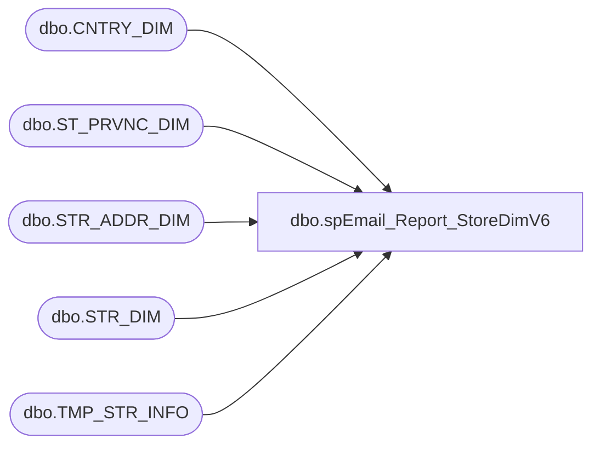

# dbo.spEmail_Report_StoreDimV6

**Database:** dw  
**Server:** papamart  

## Architecture Diagram



## Table Dependencies

| Referenced Table |
|---|
| dbo.CNTRY_DIM |
| dbo.ST_PRVNC_DIM |
| dbo.STR_ADDR_DIM |
| dbo.STR_DIM |
| dbo.TMP_STR_INFO |

## Stored Procedure Code

```sql
CREATE PROC [dbo].[spEmail_Report_StoreDimV6]
-- =============================================================================================================
-- Name: [dbo].[spEmail_Report_StoreDimV6]
--
-- Description:	Get store data for upload to ESP
--
-- Input:	
--
-- Output: Store file
--
-- Dependencies: 
--
-- Revision History
--		Name:			Date:			Comments:
--		Gary Derikito	09/07/2012		Created
--		GaryD			10/02/2012		Add query on master database
--		GaryD			10/18/2012		Change folder
--		Mike Pelikan	04/29/2014		Changed BABWMSTRDATA linked server reference

/*

Exec spEmail_Report_StoreDimV6 
*/
-- =============================================================================================================
AS 
    SET NOCOUNT ON


    DECLARE @cmd varchar(1000),
        @filename varchar(100),
		@filename_header varchar(100),
        @path varchar(200),
        @filedate varchar(20),
        @selectstmnt varchar(5000),
        @bcpsql varchar(500),
		@columnheaders varchar(4000), 
		@tablename varchar(128)

--CREATE TABLE CONTAINING COLUMN HEADERS FOR FILE EXPORT
IF OBJECT_ID(N'queries.dbo.TMP_STR_INFO', N'U') IS NOT NULL
	DROP TABLE queries.dbo.TMP_STR_INFO
	
	

CREATE TABLE queries.dbo.TMP_STR_INFO(
	[STR_NUM] [int] NOT NULL,
	[STR_NAME] [varchar](255) NOT NULL,
	[LCTR] [varchar](8000) NULL,
	[STREET] [varchar](255) NULL,
	[CC] [varchar](50) NULL,
	[STATE] [varchar](50) NULL,
	[CITY] [varchar](50) NOT NULL,
	[PSTL_CD] [varchar](20) NOT NULL,
	[EMAIL] [varchar](255) NULL,
	[MALL_WEBSITE_URL] [varchar](255) NULL
) ON [PRIMARY]


SET @columnheaders = ''
--SET @tablename='tmp_EmailStoreUploadV6'
SET @tablename='TMP_STR_INFO'

SELECT @columnheaders = @columnheaders + c.name + '| '
 FROM queries.dbo.syscolumns c INNER JOIN queries.dbo.sysobjects o ON o.id = c.id
 WHERE o.name = @tablename
 ORDER BY colid


	

INSERT INTO queries.dbo.TMP_STR_INFO
SELECT 
s.STR_NUM, 
RTRIM(s.NM_FULL) AS 'STR_NAME', 
RTRIM(s.LCTR) AS 'LCTR',--StoreLocator, 
RTRIM(a.LINE_1) AS 'STREET',--Address, 
RTRIM(c.NM_ABBRV) AS 'CC',--CNTRY_NM, 
RTRIM(p.NM_ABBRV) AS 'STATE',--ST_NM, 
RTRIM(a.CTY_NM) AS 'CITY',--CTY_NM, 
RTRIM(a.PSTL_CD) AS 'PSTL_CD',--PSTL_CD, 
RTRIM(s.EMAIL) AS 'EMAIL',--EMAIL, 
RTRIM(s.MALL_WEBSITE_URL) AS 'MALL_WEBSITE_URL' --MallWebsite
FROM KODIAK.BABWMstrData.dbo.STR_DIM s
JOIN KODIAK.BABWMstrData.dbo.STR_ADDR_DIM a
ON (s.STR_ID = a.STR_ID)
JOIN KODIAK.BABWMstrData.dbo.ST_PRVNC_DIM p
ON (a.ST_PRVNC_ID = p.ST_PRVNC_ID)
JOIN KODIAK.BABWMstrData.dbo.CNTRY_DIM c
ON (p.CNTRY_ID = c.CNTRY_ID)
ORDER BY s.STR_NUM


--select @columnheaders return


SELECT @columnheaders = Substring(@columnheaders, 1, Datalength(@columnheaders) - 2)

if (Object_ID('dw.dbo.tmp_EmailStoreUpload_HeaderV6') IS NOT NULL) DROP TABLE dw.dbo.tmp_EmailStoreUpload_HeaderV6

SELECT @columnheaders AS columnheader
INTO dw.dbo.tmp_EmailStoreUpload_HeaderV6

    SET @path = 'I:\Responsys\Upload\V6\'
	SET @filedate = CONVERT(VARCHAR(20), GETDATE(), 112)
    SET @filename = 'BABW_STOREV6_' + @filedate + '.txt'
	SET @filename_header = 'BABW_STORE_HEADERV6.txt'

--CREATE FILE CONTAINING EMAILS USING BCP COMMAND
    SET @selectstmnt = 'SELECT * FROM queries.dbo.TMP_STR_INFO'
    SET @bcpsql = 'bcp "' + @selectstmnt + '" queryout "' + @path + @filename
        + '.data" -t "|" -T -c'
    EXEC master..xp_cmdshell @bcpsql--, no_output

    SET @selectstmnt = 'SELECT * FROM dw.dbo.tmp_EmailStoreUpload_HeaderV6'
    SET @bcpsql = 'bcp "' + @selectstmnt + '" queryout "' + @path + @filename_header
        + '" -t "|" -T -c'
    EXEC master..xp_cmdshell @bcpsql--, no_output

    SET @cmd = 'copy ' + @path + @filename_header + '+' + @path + @filename
            + '.data ' + @path + @filename 
    EXEC master..xp_cmdshell @cmd, no_output

--COMPRESS FILE
    SELECT  @cmd = '"C:\Program Files\7-zip\7z.exe" a -tzip '
            + @path + REPLACE(@filename, '.txt', '') + '.zip ' + @path
            + @filename 
    EXEC master..xp_cmdshell @cmd--, no_output

--DELETE TEXT FILE
    SELECT  @cmd = 'del ' + @path + '*.txt /Q /F'
    EXEC master..xp_cmdshell @cmd, no_output

	SELECT  @cmd = 'del ' + @path + '*.data /Q /F'
    EXEC master..xp_cmdshell @cmd, no_output


dbo,spGuestLoad_Update_Clsnd_Addr_Vanity,-- =============================================================================================================
-- Name: spGuestLoad_Update_Clsnd_Addr_Vanity
--
-- Description:	
--		Funny stuff with addresses, they are not as distinct as you would think.  Vanity cities are one example.
--		Your city might really be Overland, MO, but you can use St Louis.  So some address fields are updated
--		continuously based on the last inputted address. just assume that one is correct
--
-- Input:
--		@etl_log_id			int	
--			Current load to process
--
-- Output: 
--
-- Dependencies: 
--
-- EXAMPLE:
--		exec dw.dbo.spGuestLoad_Update_Clsnd_Addr_Vanity
--
-- Revision History
--		Name:			Date:			Comments:
--		Dave Rice		7/19/2010		created
--		Dan Tweedie		08/20/2016		Altered proc to allow for bypass of QAS tables
-- =============================================================================================================

CREATE PROCEDURE [dbo].[spGuestLoad_Update_Clsnd_Addr_Vanity] (@etl_log_id int)
AS

BEGIN

SET NOCOUNT ON;

IF (Object_ID('tempdb..#BATCH_ADDR_STG') IS NOT NULL) DROP TABLE #BATCH_ADDR_STG
select distinct 
	addr_ln_1_txt,
	isnull(addr_ln_2_txt,'') addr_ln_2_txt, 
	isnull(addr_ln_3_txt,'') addr_ln_3_txt, 
	isnull(apt_unit_nbr,'') apt_unit_nbr,
	isnull(cty_nm,'') cty_nm, 
	pstl_cd,
	isnull(pstl_pls_4_cd,'') pstl_pls_4_cd,
	cntry_abbrv
into #BATCH_ADDR_STG
from DWSTAGING.dbo.BATCH_ADDR_STG 
create index ix_BATCH_ADDR_STG on #BATCH_ADDR_STG(addr_ln_1_txt, apt_unit_nbr, pstl_cd, cntry_abbrv)

IF (Object_ID('tempdb..#clnsd_addr') IS NOT NULL) DROP TABLE #clnsd_addr
select distinct 
	cad.clnsd_addr_id, 
	cad.addr_ln_1_txt, 
	isnull(cad.addr_ln_2_txt,'') addr_ln_2_txt, 
	isnull(cad.addr_ln_3_txt,'') addr_ln_3_txt, 
	isnull(cad.apt_unit_nbr,'') apt_unit_nbr, 
	isnull(cad.cty_nm,'') cty_nm, 
	cad.pstl_cd, 
	isnull(cad.pstl_pls_4_cd,'') pstl_pls_4_cd,
	cad.cntry_abbrv
into #clnsd_addr
from DWSTAGING.dbo.BATCH_ADDR_STG c with (nolock)
	join dw.dbo.clnsd_addr_dim cad with (nolock)
	on cad.addr_ln_1_txt = c.addr_ln_1_txt
	and cad.pstl_cd = c.pstl_cd
create index ix_clnsd_addr on #clnsd_addr(addr_ln_1_txt, apt_unit_nbr, pstl_cd, cntry_abbrv)

-- do not update Puerto Rico's address line 2, that appears to be unique
update dw.dbo.clnsd_addr_dim
set addr_ln_2_txt = case when c.addr_ln_2_txt = '' then null else c.addr_ln_2_txt end,
	addr_ln_3_txt = case when c.addr_ln_3_txt = '' then null else c.addr_ln_3_txt end,
	cty_nm = case when c.cty_nm = '' then null else c.cty_nm end,
	pstl_pls_4_cd = case when c.pstl_pls_4_cd = '' then null else c.pstl_pls_4_cd end, 
	UPDT_DT = getdate(), etl_log_id = @etl_log_id
from dw.dbo.clnsd_addr_dim cad
	join #clnsd_addr ca
	on ca.clnsd_addr_id = cad.clnsd_addr_id
	join #BATCH_ADDR_STG c
	on c.addr_ln_1_txt = ca.addr_ln_1_txt
	and c.apt_unit_nbr = ca.apt_unit_nbr
	and c.pstl_cd = ca.pstl_cd
	and c.cntry_abbrv = ca.cntry_abbrv
where 
	(c.addr_ln_2_txt != ca.addr_ln_2_txt
	or c.addr_ln_3_txt != ca.addr_ln_3_txt
	or c.cty_nm != ca.cty_nm
	or c.pstl_pls_4_cd != ca.pstl_pls_4_cd)
	and cad.st_prvnc_abbrv != 'PR'

-- update Puerto Rico's vanity columns
update dw.dbo.clnsd_addr_dim
set addr_ln_3_txt = case when c.addr_ln_3_txt = '' then null else c.addr_ln_3_txt end,
	cty_nm = case when c.cty_nm = '' then null else c.cty_nm end,
	pstl_pls_4_cd = case when c.pstl_pls_4_cd = '' then null else c.pstl_pls_4_cd end, 
	UPDT_DT = getdate(), etl_log_id = @etl_log_id
from dw.dbo.clnsd_addr_dim cad
	join #clnsd_addr ca
	on ca.clnsd_addr_id = cad.clnsd_addr_id
	join #BATCH_ADDR_STG c
	on c.addr_ln_1_txt = ca.addr_ln_1_txt
	and c.addr_ln_2_txt = ca.addr_ln_2_txt
	and c.apt_unit_nbr = ca.apt_unit_nbr
	and c.pstl_cd = ca.pstl_cd
	and c.cntry_abbrv = ca.cntry_abbrv
where 
	(c.addr_ln_3_txt != ca.addr_ln_3_txt
	or c.cty_nm != ca.cty_nm
	or c.pstl_pls_4_cd != ca.pstl_pls_4_cd)
	and cad.st_prvnc_abbrv = 'PR'
END
```

