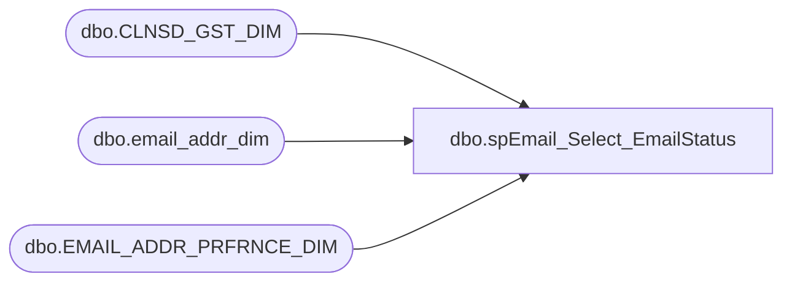

# dbo.spEmail_Select_EmailStatus

**Database:** dw  
**Server:** papamart  

## Architecture Diagram



## Table Dependencies

| Referenced Table |
|---|
| dbo.CLNSD_GST_DIM |
| dbo.email_addr_dim |
| dbo.EMAIL_ADDR_PRFRNCE_DIM |

## Stored Procedure Code

```sql
CREATE PROCEDURE dbo.[spEmail_Select_EmailStatus]
-- =============================================================================================================
-- Name: spEmail_Select_EmailStatus
--
-- Description:	returns data about a given e-mail address
--
-- Input:	@email			varchar(255)	email address
--
-- Output: 
--
-- Dependencies: 
--
-- EXAMPLE:
--
-- Revision History
--		Name:			Date:			Comments:
--		Keith Missey	8/19/2009		created
--		Keith Missey	02/09/2011		updated preference center
-- =============================================================================================================
	@email varchar(255)
AS
SET NOCOUNT ON

SELECT email_addr_txt, [ORIG_SRC_SYS_CD], UPDT_SRC_SYS_CD AS [OPT_IN_SRC_SYS_CD], 
	CASE PROMO_PREF 
		WHEN 'Y' THEN 'OPT-IN'
		WHEN 'N' THEN 'OPT-OUT' END
	AS [EMAIL_STAT_CD], ep.UPDT_DT AS [GLBL_OPT_IN_DT], 
	MAX(lylty_gst_nbr) AS lylty_gst_nbr, 
	COUNT(DISTINCT [CLNSD_GST_ID]) AS clnsd_gst_cnt
FROM dw.dbo.email_addr_dim e WITH (NOLOCK)
	INNER JOIN dw.dbo.EMAIL_ADDR_PRFRNCE_DIM ep WITH (NOLOCK) ON e.EMAIL_ADDR_ID = ep.EMAIL_ADDR_ID
	LEFT JOIN dw.dbo.[CLNSD_GST_DIM] g WITH (NOLOCK) ON e.[EMAIL_ADDR_ID] = g.[EMAIL_ADDR_ID]
WHERE [EMAIL_ADDR_TXT] = @email
GROUP BY email_addr_txt, [ORIG_SRC_SYS_CD], UPDT_SRC_SYS_CD, 
	CASE PROMO_PREF 
		WHEN 'Y' THEN 'OPT-IN'
		WHEN 'N' THEN 'OPT-OUT' END, ep.UPDT_DT
```

