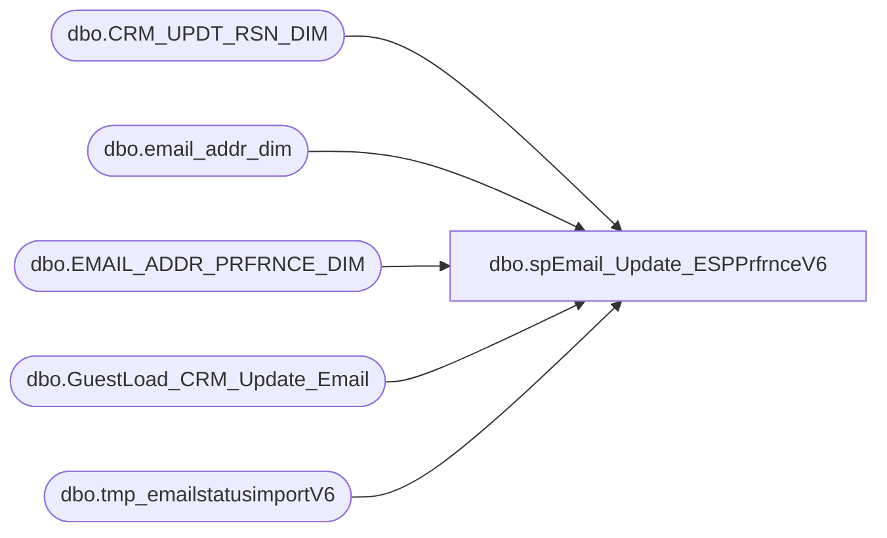

# dbo.spEmail_Update_ESPPrfrnceV6

**Database:** dw  
**Server:** papamart  

## Architecture Diagram



## Table Dependencies

| Referenced Table |
|---|
| dbo.CRM_UPDT_RSN_DIM |
| dbo.email_addr_dim |
| dbo.EMAIL_ADDR_PRFRNCE_DIM |
| dbo.GuestLoad_CRM_Update_Email |
| dbo.tmp_emailstatusimportV6 |

## Stored Procedure Code

```sql
CREATE PROC [dbo].[spEmail_Update_ESPPrfrnceV6]
-- =============================================================================================================
-- Name: [dbo].[spEmail_Update_ESPPrfrnceV6]
--
-- Description:	updates e-mail opt-outs/spam complaints/opt-ins on email_addr_dim from ESP
--
-- Input:	@status		varchar(20)			SPAM, OPT-OUT, OPT-IN
--			@logid		int					ETL log id
--			@eventid		int					ETL event id
--
-- Output: N/A
--
-- Dependencies: 
--
-- Revision History
--		Name:			Date:			Comments:
--		GaryD			9/18/2012		created from spEmail_Update_ESPPrfrnce
--		GaryD			10/19/2012		Update references to tmp table.
--		GaryD			10/24/2012		Update references to tmp table in SPAM section.

--exec spEmail_Update_ESPPrfrnceV6 @status = 'opt-in', @logid = 9, @eventid = 7, @Load_ID = 1
--exec spEmail_Update_ESPPrfrnceV6 @status = 'opt-in', @logid = 9,  @Load_ID = 1
--exec spEmail_Update_ESPPrfrnceV6 @Load_ID = 1, @status = 'opt-in', @logid = 777
-- =============================================================================================================
@status VARCHAR(20),
@logid	INT,
@eventid	INT,
@Load_ID	INT
AS 


	
    SET nocount ON
	
	DECLARE @crm_updt_rsn_id int
	--DECLARE @eventid int
	--declare @status VARCHAR(20)
	--declare @logid	INT
	
	--set @eventid = 13
	--set @status = 'opt-in'
	--set @logid = 777
	
	SET @crm_updt_rsn_id = (SELECT crm_updt_rsn_id 
				FROM dw.dbo.CRM_UPDT_RSN_DIM WHERE crm_updt_rsn_cd = 'email_optout_updt')

IF @status = 'opt-out'
BEGIN

SET @crm_updt_rsn_id = (SELECT crm_updt_rsn_id 
				FROM dw.dbo.CRM_UPDT_RSN_DIM WHERE crm_updt_rsn_cd = 'email_optout_updt')

	--UPDATE PREFERENCES
	UPDATE dw.dbo.[EMAIL_ADDR_PRFRNCE_DIM] SET
		updt_src_sys_cd = source,
		promo_pref = 'N',
		PROMO_UPDT_DT = statusdate,
		SFSPNTS_PREF = 'N',
		SFSPNTS_UPDT_DT = statusdate,
		[UPDT_DT] = GETDATE(),
			etl_log_id = @logid, 
			[ETL_EVNT_ID] = @eventid
	FROM dw.dbo.EMAIL_ADDR_PRFRNCE_DIM p
		INNER JOIN dw.dbo.email_addr_dim e WITH (NOLOCK) ON (p.email_addr_id = e.email_addr_id)
		INNER JOIN dw.dbo.tmp_emailstatusimportV6 t WITH (NOLOCK) 
		ON (t.email_address = e.email_addr_txt	)	
	WHERE updatestatus = @status
	AND Load_ID = @Load_ID
	
		--UPDATE CHANGE TABLE
	INSERT dw.dbo.GuestLoad_CRM_Update_Email
		(CLNSD_GST_ID, 
		EMAIL_ADDR_ID, 
		CRM_UPDT_RSN_ID, 
		CRM_GST_NBR, 
		EMAIL_ADDR_TXT_OLD, 
		EMAIL_ADDR_TXT_NEW, 
		CLEANSABLE, 
		EMAIL_STAT_CD_OLD, 
		EMAIL_STAT_CD_NEW, 
		PROMO_PREF_OLD, 
		PROMO_PREF_NEW, 
		SFSCERT_PREF_OLD, 
		SFSCERT_PREF_NEW, 
		SFSPNTS_PREF_OLD, 
		SFSPNTS_PREF_NEW, 
		BATCH_ID, 
		PROCESS_DT, 
		EMAIL_SENT_DT, 
		UPDT_CONFIRMED_DT, 
		INS_DT, 
		ETL_LOG_ID)
	SELECT 
		NULL, 
		e.email_addr_id, 
		@crm_updt_rsn_id, 
		NULL, 
		email_addr_txt, 
		email_addr_txt,
		NULL, 
		NULL, 
		NULL, 
		NULL, 
		'N', 
		NULL, 
		NULL, 
		NULL, 
		'N',
		NULL, 
		NULL, 
		NULL, 
		NULL, 
		GETDATE(), 
		@logid
	FROM dw.dbo.EMAIL_ADDR_PRFRNCE_DIM p
		INNER JOIN dw.dbo.email_addr_dim e WITH (NOLOCK) ON p.email_addr_id = e.email_addr_id
		INNER JOIN dw.dbo.tmp_emailstatusimportV6 t WITH (NOLOCK) 
		ON (t.email_address = e.email_addr_txt)
	WHERE updatestatus = @status
	AND Load_ID = @Load_ID
END
ELSE IF @status = 'opt-in'
BEGIN

SET @crm_updt_rsn_id = (SELECT crm_updt_rsn_id 
				FROM dw.dbo.CRM_UPDT_RSN_DIM WHERE crm_updt_rsn_cd = 'email_optin_updt')

	--UPDATE PREFERENCES
	UPDATE dw.dbo.[EMAIL_ADDR_PRFRNCE_DIM] SET
		updt_src_sys_cd = source,
		promo_pref = 'Y',
		PROMO_UPDT_DT = statusdate,
		SFSPNTS_PREF = 'Y',
		SFSPNTS_UPDT_DT = statusdate,
		[UPDT_DT] = GETDATE(),
			etl_log_id = @logid, 
			[ETL_EVNT_ID] = @eventid
	FROM dw.dbo.EMAIL_ADDR_PRFRNCE_DIM p
		INNER JOIN dw.dbo.email_addr_dim e WITH (NOLOCK) ON p.email_addr_id = e.email_addr_id
		INNER JOIN dw.dbo.tmp_emailstatusimportV6 t WITH (NOLOCK) ON t.email_address = e.email_addr_txt	
	WHERE updatestatus = @status
		AND Load_ID = @Load_ID
	
		--UPDATE CHANGE TABLE
	INSERT dw.dbo.GuestLoad_CRM_Update_Email
		(CLNSD_GST_ID, 
		EMAIL_ADDR_ID, 
		CRM_UPDT_RSN_ID, 
		CRM_GST_NBR, 
		EMAIL_ADDR_TXT_OLD, 
		EMAIL_ADDR_TXT_NEW, 
		CLEANSABLE, 
		EMAIL_STAT_CD_OLD, 
		EMAIL_STAT_CD_NEW, 
		PROMO_PREF_OLD, 
		PROMO_PREF_NEW, 
		SFSCERT_PREF_OLD, 
		SFSCERT_PREF_NEW, 
		SFSPNTS_PREF_OLD, 
		SFSPNTS_PREF_NEW, 
		BATCH_ID, 
		PROCESS_DT, 
		EMAIL_SENT_DT, 
		UPDT_CONFIRMED_DT, 
		INS_DT, 
		ETL_LOG_ID)	
	SELECT 
		NULL, 
		e.email_addr_id, 
		@crm_updt_rsn_id, 
		NULL, 
		email_addr_txt, 
		email_addr_txt,
		NULL, 
		NULL, 
		NULL, 
		NULL, 
		'Y', 
		NULL, 
		NULL, 
		NULL, 
		'Y',
		NULL, 
		NULL, 
		NULL, 
		NULL, 
		GETDATE(), 
		@logid
	FROM dw.dbo.EMAIL_ADDR_PRFRNCE_DIM p
		INNER JOIN dw.dbo.email_addr_dim e WITH (NOLOCK) ON p.email_addr_id = e.email_addr_id
		INNER JOIN dw.dbo.tmp_emailstatusimportV6 t WITH (NOLOCK) ON t.email_address = e.email_addr_txt	
	WHERE updatestatus = @status
	AND Load_ID = @Load_ID
END
ELSE IF @status = 'spam'
BEGIN

SET @crm_updt_rsn_id = (SELECT crm_updt_rsn_id 
				FROM dw.dbo.CRM_UPDT_RSN_DIM WHERE crm_updt_rsn_cd = 'email_optout_updt')

	--UPDATE STATUS CODE
	UPDATE dw.dbo.[EMAIL_ADDR_DIM] 
		SET [EMAIL_STAT_CD] = @status, email_stat_dt = statusdate, 
		[UPDT_DT] = GETDATE(), 
			[ETL_LOG_ID] = @logid, [ETL_EVNT_ID] = @eventid
	FROM dw.dbo.tmp_emailstatusimportV6 WITH (NOLOCK)
		INNER JOIN dw.dbo.email_addr_dim WITH (NOLOCK) ON email_address = email_addr_txt
	WHERE updatestatus = @status
	
	--OPT OUT OF ALL PREFERENCES
	UPDATE dw.dbo.[EMAIL_ADDR_PRFRNCE_DIM] SET
		updt_src_sys_cd = source,
		promo_pref = 'N',
		PROMO_UPDT_DT = statusdate,
		SFSCERT_PREF = 'N',
		SFSCERT_UPDT_DT = statusdate,
		SFSPNTS_PREF = 'N',
		SFSPNTS_UPDT_DT = statusdate,
		[UPDT_DT] = GETDATE(),
			etl_log_id = @logid, 
			[ETL_EVNT_ID] = @eventid
	FROM dw.dbo.EMAIL_ADDR_PRFRNCE_DIM p
		INNER JOIN dw.dbo.email_addr_dim e WITH (NOLOCK) ON (p.email_addr_id = e.email_addr_id)
		INNER JOIN dw.dbo.tmp_emailstatusimportV6 t WITH (NOLOCK) 
		ON (t.email_address = e.email_addr_txt)
	WHERE updatestatus = @status
	
	--UPDATE CHANGE TABLE
	INSERT dw.dbo.GuestLoad_CRM_Update_Email(CLNSD_GST_ID, EMAIL_ADDR_ID, CRM_UPDT_RSN_ID, CRM_GST_NBR, EMAIL_ADDR_TXT_OLD, EMAIL_ADDR_TXT_NEW, CLEANSABLE, EMAIL_STAT_CD_OLD, EMAIL_STAT_CD_NEW, PROMO_PREF_OLD, PROMO_PREF_NEW, SFSCERT_PREF_OLD, SFSCERT_PREF_NEW, SFSPNTS_PREF_OLD, SFSPNTS_PREF_NEW, BATCH_ID, PROCESS_DT, EMAIL_SENT_DT, UPDT_CONFIRMED_DT, INS_DT, ETL_LOG_ID)	
	SELECT NULL, e.email_addr_id, @crm_updt_rsn_id, NULL, email_addr_txt, email_addr_txt,
		NULL, 'VALID', @status, NULL, 'N', NULL, 'N', NULL, 'N',
		NULL, NULL, NULL, NULL, GETDATE(), @logid
	FROM dw.dbo.EMAIL_ADDR_PRFRNCE_DIM p
		INNER JOIN dw.dbo.email_addr_dim e WITH (NOLOCK) ON p.email_addr_id = e.email_addr_id
		INNER JOIN dw.dbo.tmp_emailstatusimportV6 t WITH (NOLOCK) 
		ON (t.email_address = e.email_addr_txt	)
	WHERE updatestatus = @status
END
```

