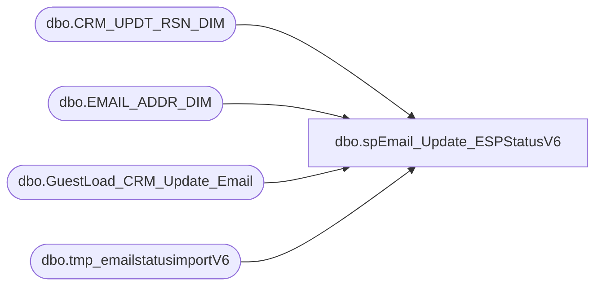

# dbo.spEmail_Update_ESPStatusV6

**Database:** dw  
**Server:** papamart  

## Architecture Diagram



## Table Dependencies

| Referenced Table |
|---|
| dbo.CRM_UPDT_RSN_DIM |
| dbo.EMAIL_ADDR_DIM |
| dbo.GuestLoad_CRM_Update_Email |
| dbo.tmp_emailstatusimportV6 |

## Stored Procedure Code

```sql
--DROP PROC [dbo].[spEmail_Update_ESPStatusV6]
--GO

CREATE PROC [dbo].[spEmail_Update_ESPStatusV6]
-- =============================================================================================================
-- Name: [dbo].[spEmail_Update_ESPStatusV6]
--
-- Description:	updates e-mail status on email_addr_dim from ESP 
--
-- Input:	@status		varchar(20)			BOUNCE, INVALID
--			@logid		int					ETL log id
--			@eventid		int					ETL event id
--
-- Output: N/A
--
-- Dependencies: 
--
-- Revision History
--		Name:			Date:			Comments:
--		Keith Missey	1/7/2011		created
--		GaryD			10/03/2012		Add status of FAIL for Responsys V6.
--		GaryD			10/19/2012		Remove status of FAIL for Responsys V6.
-- =============================================================================================================
@status VARCHAR(20),
@logid	INT,
@eventid	INT,
@Load_ID	INT
AS 
	
    SET nocount ON

IF @status IN ('BOUNCE', 'INVALID')
BEGIN
	
	--UPDATE EMAIL TABLE
	UPDATE dw.dbo.[EMAIL_ADDR_DIM] 
		SET [EMAIL_STAT_CD] = @status, email_stat_dt = statusdate, 
		[UPDT_DT] = GETDATE(), 
			[ETL_LOG_ID] = @logid, [ETL_EVNT_ID] = @eventid
	FROM dw.dbo.tmp_emailstatusimportV6 WITH (NOLOCK)
		INNER JOIN dw.dbo.email_addr_dim WITH (NOLOCK) ON email_address = email_addr_txt
	WHERE updatestatus = @status
	AND Load_ID = @Load_ID

	--INSERT INTO EMAIL CHANGE TABLE
	DECLARE @crm_updt_rsn_id int
	
	SET @crm_updt_rsn_id = (SELECT crm_updt_rsn_id 
				FROM dw.dbo.CRM_UPDT_RSN_DIM WHERE crm_updt_rsn_cd = 'email_status_updt')

	INSERT dw.dbo.GuestLoad_CRM_Update_Email	
	SELECT NULL, e.email_addr_id, @crm_updt_rsn_id, NULL, email_addr_txt, email_addr_txt,
		NULL, 'VALID', @status, NULL, NULL, NULL, NULL, NULL, NULL, NULL,
		NULL, NULL, NULL, GETDATE(), @logid
	FROM dw.dbo.tmp_emailstatusimportV6 v WITH (NOLOCK)
		INNER JOIN dw.dbo.email_addr_dim e WITH (NOLOCK) ON v.email_address = e.email_addr_txt
	WHERE updatestatus = @status
	AND Load_ID = @Load_ID
END
```

