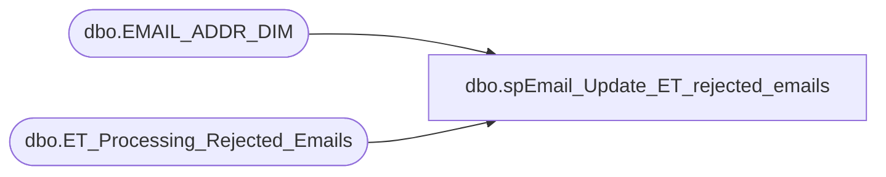

# dbo.spEmail_Update_ET_rejected_emails

**Database:** dw  
**Server:** papamart  

## Architecture Diagram



## Table Dependencies

| Referenced Table |
|---|
| dbo.EMAIL_ADDR_DIM |
| dbo.ET_Processing_Rejected_Emails |

## Stored Procedure Code

```sql
CREATE proc [dbo].[spEmail_Update_ET_rejected_emails]
as
begin
	set nocount on
	--select * from dw.dbo.ET_Processing_Rejected_Emails
	/*
	delete from dw.dbo.ET_Processing_Rejected_Emails
	where ISNUMERIC(email_id) <> 1
	*/
	/*
	--if identify column available
	DELETE dw.dbo.ET_Processing_Rejected_Emails
	FROM dw.dbo.ET_Processing_Rejected_Emails e
		LEFT OUTER JOIN (
	SELECT MIN(RowId) as RowId, Email_ID
	FROM test_database.dbo.Rejected_Emails 
	GROUP BY Email_ID
	) as KeepRows ON
	e.RowId = KeepRows.RowId
	WHERE KeepRows.RowId IS NULL
	*/
	
	--if no identify column
	;WITH cte
     AS (SELECT ROW_NUMBER() OVER (PARTITION BY email_address ORDER BY (SELECT 0)) RN
         FROM  dw.dbo.ET_Processing_Rejected_Emails)
	DELETE FROM cte
	WHERE  RN > 1
	
	/*
	select * from dw.dbo.EMAIL_ADDR_DIM e
		join dw.dbo.ET_Processing_Rejected_Emails et on e.email_addr_txt = et.email_address
	where e.email_stat_cd <> 'INVALID'
	*/
	
	update dw.dbo.EMAIL_ADDR_DIM
	set email_stat_cd = 'INVALID',
		updt_dt = getdate()
	from dw.dbo.EMAIL_ADDR_DIM e
		join dw.dbo.ET_Processing_Rejected_Emails et on e.email_addr_txt = et.email_address
	where e.email_stat_cd <> 'INVALID'

	truncate table dw.dbo.ET_Processing_Rejected_Emails
	
end
```

