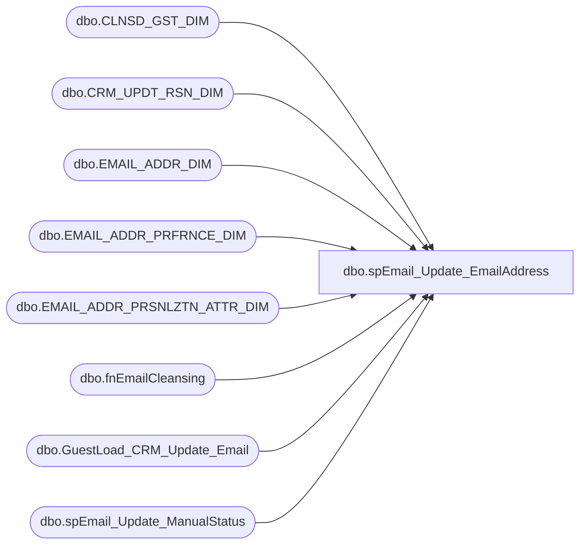

# dbo.spEmail_Update_EmailAddress

**Database:** dw  
**Server:** papamart  

## Architecture Diagram



## Table Dependencies

| Referenced Table |
|---|
| dbo.CLNSD_GST_DIM |
| dbo.CRM_UPDT_RSN_DIM |
| dbo.EMAIL_ADDR_DIM |
| dbo.EMAIL_ADDR_PRFRNCE_DIM |
| dbo.EMAIL_ADDR_PRSNLZTN_ATTR_DIM |
| dbo.fnEmailCleansing |
| dbo.GuestLoad_CRM_Update_Email |
| dbo.spEmail_Update_ManualStatus |

## Stored Procedure Code

```sql
CREATE PROC [dbo].[spEmail_Update_EmailAddress]
-- =============================================================================================================
-- Name: [dbo].[spEmail_Update_EmailAddress]
--
-- Description:	updates email address
--
-- Input:	@oldemail			varchar(100)	old email address to change
--			@newemail			varchar(100)	new email address to update/insert
--			@return_results	bit				prints results if set to 1
--
-- Output: N/A
--
-- Dependencies: 
--
-- Revision History
--		Name:			Date:			Comments:
--		Keith Missey	3/23/2011		created
-- =============================================================================================================
@oldemail VARCHAR(100),
@newemail varCHAR(100),
@return_results BIT=1
AS

IF @return_results = 1
BEGIN
	SELECT 'OLD BEFORE' AS Status, * FROM dw.[dbo].[EMAIL_ADDR_DIM] e  WITH (NOLOCK)
		LEFT JOIN dw.dbo.EMAIL_ADDR_PRFRNCE_DIM p WITH (NOLOCK) ON e.email_addr_id = p.EMAIL_ADDR_ID
		LEFT JOIN dbo.EMAIL_ADDR_PRSNLZTN_ATTR_DIM ep WITH (NOLOCK) ON e.EMAIL_ADDR_ID = ep.EMAIL_ADDR_ID
		LEFT JOIN dw.dbo.[CLNSD_GST_DIM] c WITH (NOLOCK) ON e.[EMAIL_ADDR_ID] = c.[EMAIL_ADDR_ID]
		WHERE [EMAIL_ADDR_TXT] = @oldemail
		
	SELECT 'NEW BEFORE' AS Status, * FROM dw.[dbo].[EMAIL_ADDR_DIM] e  WITH (NOLOCK)
		LEFT JOIN dw.dbo.EMAIL_ADDR_PRFRNCE_DIM p WITH (NOLOCK) ON e.email_addr_id = p.EMAIL_ADDR_ID
		LEFT JOIN dbo.EMAIL_ADDR_PRSNLZTN_ATTR_DIM ep WITH (NOLOCK) ON e.EMAIL_ADDR_ID = ep.EMAIL_ADDR_ID
		LEFT JOIN dw.dbo.[CLNSD_GST_DIM] c WITH (NOLOCK) ON e.[EMAIL_ADDR_ID] = c.[EMAIL_ADDR_ID]
		WHERE [EMAIL_ADDR_TXT] = @newemail
END

DECLARE @date DATETIME,
		@oldemailid INT,
		@newemailid INT
		
SET @date = GETDATE()

SET @oldemailid = (SELECT email_addr_id FROM dw.dbo.email_addr_dim WITH (NOLOCK) WHERE email_addr_txt = @oldemail)

--IF BOTH EMAILS EXISTS, NEED TO FIND ID OF NEW EMAIL
IF EXISTS(SELECT TOP 1 email_addr_txt FROM dw.dbo.email_addr_dim WITH (NOLOCK) WHERE email_addr_txt = @newemail)
	AND EXISTS (SELECT TOP 1 email_addr_txt FROM dw.dbo.email_addr_dim WITH (NOLOCK) WHERE email_addr_txt = @oldemail)
BEGIN

	SET @newemailid = (SELECT email_addr_id FROM dw.dbo.email_addr_dim WITH (NOLOCK) WHERE email_addr_txt = @newemail)
	
	--OPT-IN NEW EMAIL
	EXEC dw.dbo.spEmail_Update_ManualStatus @newemail, 'VALID','Y','DBA',-2,0
END

--IF ONLY OLD EMAIL EXISTS, NEED TO INSERT NEW EMAIL AND PERFORM SAME STEPS ABOVE
ELSE IF EXISTS (SELECT TOP 1 email_addr_txt FROM dw.dbo.email_addr_dim WITH (NOLOCK) WHERE email_addr_txt = @oldemail)
BEGIN
	SET @newemailid = (SELECT MAX(email_addr_id) + 1 FROM dw.dbo.email_addr_dim)
	
	INSERT dw.dbo.[EMAIL_ADDR_DIM] (
		email_addr_id,
		[EMAIL_ADDR_TXT],
		[EMAIL_STAT_CD],
		[EMAIL_STAT_DT],
		[INS_DT],
		[UPDT_DT],
		[BEG_EFF_DT],
		[END_EFF_DT],
		[ETL_LOG_ID],
		[ETL_EVNT_ID]
	)
	SELECT @newemailid, dbo.fnEmailCleansing(@newemail), 'VALID',
		@date, @date, @date, @date, '1/1/3000', -2, -2


	INSERT dw.dbo.[EMAIL_ADDR_PRSNLZTN_ATTR_DIM] (
		[EMAIL_ADDR_ID],
		[EMAIL_PRSNLZTN_ATTR_SEQ_NBR],
		[EMAIL_FRST_NM],
		[EMAIL_LAST_NM],
		[EMAIL_BRTH_DT],
		[CNTRY_ABBRV],
		[INS_DT],
		[UPDT_DT],
		[BEG_EFF_DT],
		[END_EFF_DT],
		[ETL_LOG_ID],
		[ETL_EVNT_ID]
	) 
	SELECT @newemailid, 1, EMAIL_FRST_NM, EMAIL_LAST_NM, EMAIL_BRTH_DT, cntry_abbrv, @date, @date, @date,
		'1/1/3000', -2, -2
	FROM dw.dbo.EMAIL_ADDR_PRSNLZTN_ATTR_DIM WITH (NOLOCK)
	WHERE email_addr_id = @oldemailid

	INSERT dw.dbo.[EMAIL_ADDR_PRFRNCE_DIM] (
		[EMAIL_ADDR_ID],
		[ORIG_SRC_SYS_CD],
		[UPDT_SRC_SYS_CD],
		[PROMO_PREF],
		[PROMO_UPDT_DT],
		[SFSCERT_PREF],
		[SFSCERT_UPDT_DT],
		[SFSPNTS_PREF],
		[SFSPNTS_UPDT_DT],
		INS_DT,
		UPDT_DT,
		[BEG_EFF_DT],
		[END_EFF_DT],
		[ETL_LOG_ID],
		[ETL_EVNT_ID]
	) 
	SELECT @newemailid, 'DBA', 'DBA',
		'Y', @date, 'Y', @date,'Y',@date,
			@date, @date, @date,'1/1/3000', -2, -2
END

--OPT-OUT OLD EMAIL
EXEC dw.dbo.spEmail_Update_ManualStatus @oldemail, 'VALID','N','DBA',-2,0

--UPDATE CLNSD_GST_DIM TO ASSOCIATE ALL GUESTS POINTING TO OLD EMAIL TO NEW EMAIL
UPDATE dw.dbo.clnsd_gst_dim SET EMAIL_ADDR_ID = @newemailid WHERE EMAIL_ADDR_ID = @oldemailid

	--INSERT INTO EMAIL CHANGE TABLE
	DECLARE @crm_updt_rsn_id int
	
	SET @crm_updt_rsn_id = (SELECT crm_updt_rsn_id 
				FROM dw.dbo.CRM_UPDT_RSN_DIM WHERE crm_updt_rsn_cd = 'manual updt')

	--INSERT CHANGE TABLE
	INSERT dw.dbo.GuestLoad_CRM_Update_Email	
	SELECT NULL, e.email_addr_id, @crm_updt_rsn_id, NULL, @oldemail, email_addr_txt,
		'Y', NULL, email_stat_cd, NULL, PROMO_PREF, NULL, SFSCERT_PREF, NULL, SFSPNTS_PREF,
		NULL, NULL, NULL, NULL, GETDATE(), -2
	FROM dw.dbo.EMAIL_ADDR_PRFRNCE_DIM p
		INNER JOIN dw.dbo.email_addr_dim e WITH (NOLOCK) ON p.email_addr_id = e.email_addr_id
	WHERE email_addr_txt = @newemail

IF @return_results = 1
BEGIN
	SELECT 'OLD AFTER' AS Status, * FROM dw.[dbo].[EMAIL_ADDR_DIM] e  WITH (NOLOCK)
		LEFT JOIN dw.dbo.EMAIL_ADDR_PRFRNCE_DIM p WITH (NOLOCK) ON e.email_addr_id = p.EMAIL_ADDR_ID
		LEFT JOIN dbo.EMAIL_ADDR_PRSNLZTN_ATTR_DIM ep WITH (NOLOCK) ON e.EMAIL_ADDR_ID = ep.EMAIL_ADDR_ID
		LEFT JOIN dw.dbo.[CLNSD_GST_DIM] c WITH (NOLOCK) ON e.[EMAIL_ADDR_ID] = c.[EMAIL_ADDR_ID]
		LEFT JOIN dw.dbo.GuestLoad_CRM_Update_Email g WITH (NOLOCK) ON EMAIL_ADDR_TXT_NEW = email_addr_txt
		WHERE [EMAIL_ADDR_TXT] = @oldemail

	SELECT 'NEW AFTER' AS Status, * FROM dw.[dbo].[EMAIL_ADDR_DIM] e  WITH (NOLOCK)
		LEFT JOIN dw.dbo.EMAIL_ADDR_PRFRNCE_DIM p WITH (NOLOCK) ON e.email_addr_id = p.EMAIL_ADDR_ID
		LEFT JOIN dbo.EMAIL_ADDR_PRSNLZTN_ATTR_DIM ep WITH (NOLOCK) ON e.EMAIL_ADDR_ID = ep.EMAIL_ADDR_ID
		LEFT JOIN dw.dbo.[CLNSD_GST_DIM] c WITH (NOLOCK) ON e.[EMAIL_ADDR_ID] = c.[EMAIL_ADDR_ID]
		LEFT JOIN dw.dbo.GuestLoad_CRM_Update_Email g WITH (NOLOCK) ON EMAIL_ADDR_TXT_NEW = email_addr_txt
		WHERE [EMAIL_ADDR_TXT] = @newemail
END
```

