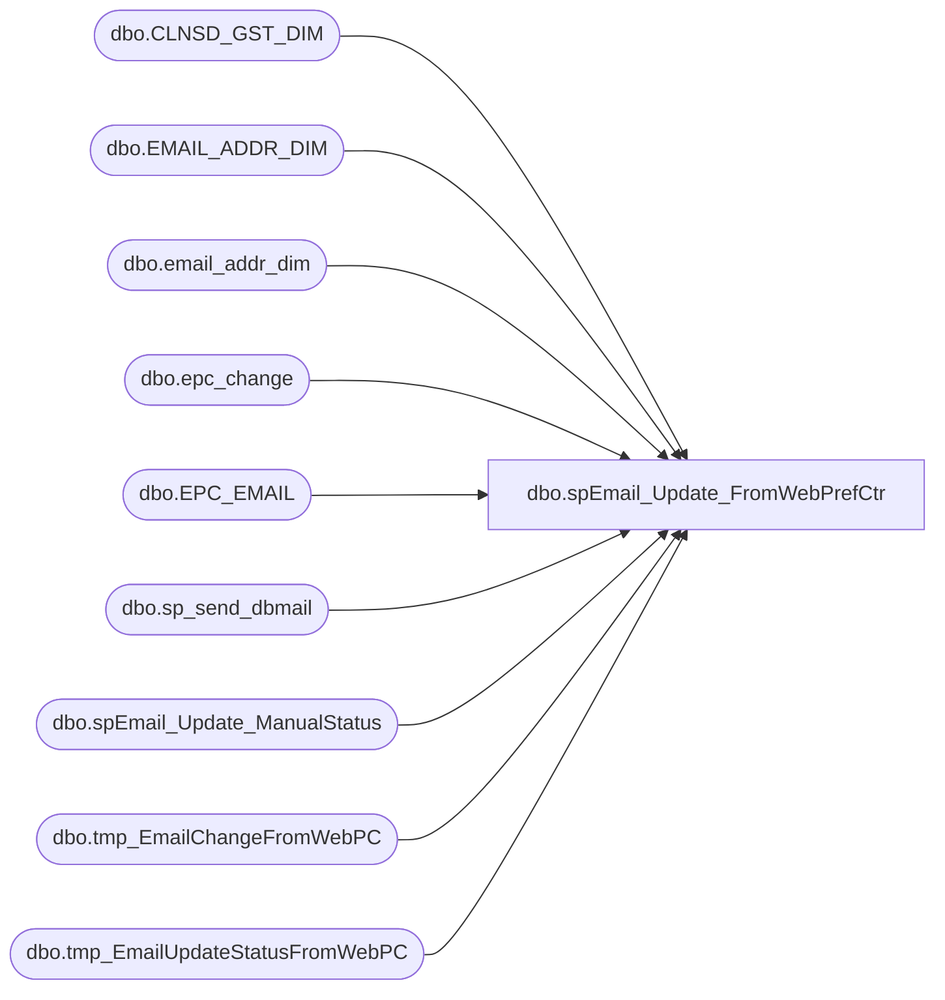

# dbo.spEmail_Update_FromWebPrefCtr

**Database:** dw  
**Server:** papamart  

## Architecture Diagram



## Table Dependencies

| Referenced Table |
|---|
| dbo.CLNSD_GST_DIM |
| dbo.EMAIL_ADDR_DIM |
| dbo.email_addr_dim |
| dbo.epc_change |
| dbo.EPC_EMAIL |
| dbo.sp_send_dbmail |
| dbo.spEmail_Update_ManualStatus |
| dbo.tmp_EmailChangeFromWebPC |
| dbo.tmp_EmailUpdateStatusFromWebPC |

## Stored Procedure Code

```sql
CREATE proc [dbo].[spEmail_Update_FromWebPrefCtr]
-- =============================================================================================================
-- Name: spEmail_Update_FromWebPrefCtr
--
-- Description:	Updates e-mails and email status from bearwebdb.emailcenter into data warehouse email table
--
-- Input:	@ad_date	datetime	initial date to find new e-mails updated on web 
--
-- Output:	N/A
--
-- Dependencies: 
--
-- Revision History
--		Name:			Date:			Comments:
--		Keith Missey	6/13/2009		created
--		Keith Missey	8/13/2009		updated to allow SFS opt-outs to flow through
--		Keith Missey	8/18/2009		added e-mail cleansing function
--		Keith Missey	8/19/2009		removed update statement for modified e-mails since INSERT process was taking care of this
--										apparently, these e-mails are inserted into epc_email as well as epc_change
--										added code to update guest table
--		Keith Missey	2/13/2011		updated for preference center
-- =============================================================================================================
@ad_date DATETIME
AS
SET NOCOUNT ON

    IF EXISTS ( SELECT  *
                FROM    dw.dbo.sysobjects
                WHERE   id = OBJECT_ID(N'[tmp_EmailChangeFromWebPC]')
                        AND type in ( N'U' ) )
     DROP TABLE dw.dbo.tmp_EmailChangeFromWebPC
                  
CREATE TABLE dw.dbo.tmp_EmailChangeFromWebPC
(
	oldemail_address VARCHAR(255),
	newemail_address VARCHAR(255),
	create_date datetime
)

    IF EXISTS ( SELECT  *
                FROM    dw.dbo.sysobjects
                WHERE   id = OBJECT_ID(N'[tmp_EmailUpdateStatusFromWebPC]')
                        AND type in ( N'U' ) )
     DROP TABLE dw.dbo.tmp_EmailUpdateStatusFromWebPC
                  
CREATE TABLE dw.dbo.tmp_EmailUpdateStatusFromWebPC
(
	email_address VARCHAR(255),
	emailstatus VARCHAR(20),
	update_date datetime
)

DECLARE @sourcecnt1 INT,
		@sourcecnt2 INT,
		@destcnt1 INT,
		@destcnt2 INT,
		@checktotal INT,
		@checkdupe INT,
		@sql NVARCHAR(1000),
		@maxid int,
		@counter int,
		@date datetime,
		@email varchar(255)

--UPDATE E-MAIL ADDRESSES THAT HAVE BEEN CHANGED
INSERT dw.dbo.[tmp_EmailChangeFromWebPC]
(oldemail_address, newemail_address, create_date)
SELECT DISTINCT email_addr_old, email_addr_new, [SYS_CREATE_DATE]
FROM bearwebdb.emailcenter.dbo.epc_change with (nolock)
WHERE sys_create_date >= @ad_date

SET @sourcecnt1 = @@ROWCOUNT

--REMOVED UPDATE STATEMENT BECAUSE NEW E-MAILS WERE BEING INSERTED THROUGH INSERT PROCESS; COUNT WILL VALIDATE THIS
SET @destcnt1 = (SELECT COUNT(email_addr_txt) FROM [dbo].[EMAIL_ADDR_DIM] e WITH (NOLOCK)
					INNER JOIN dw.[dbo].[tmp_EmailChangeFromWebPC] t ON e.[EMAIL_ADDR_TXT] = [newemail_address])

--UPDATE CLEANSED GUESTS TO POINT TO NEW EMAIL ADDRESS
UPDATE dw.dbo.[CLNSD_GST_DIM] SET [EMAIL_ADDR_ID] = e2.email_addr_id, 
	[UPDT_DT] = GETDATE(), etl_log_id = -3, [ETL_EVNT_ID] = -3
FROM dw.dbo.[CLNSD_GST_DIM] g WITH (NOLOCK)
	INNER JOIN dw.dbo.email_addr_dim e1 WITH (NOLOCK) ON g.[EMAIL_ADDR_ID] = e1.[EMAIL_ADDR_ID]
	INNER JOIN dw.dbo.[tmp_EmailChangeFromWebPC] p ON e1.email_addr_txt = p.oldemail_address
	INNER JOIN dw.dbo.email_addr_dim e2 WITH (NOLOCK) ON p.newemail_address = e2.email_addr_txt

--INSERT UPDATE EMAIL STATUSES
INSERT dw.dbo.[tmp_EmailUpdateStatusFromWebPC] 
(email_address, emailstatus, update_date)
SELECT DISTINCT email_addr, [GLOBAL_OUT_Y_N], COALESCE([SYS_UPDATE_DATE], sys_create_date)
FROM bearwebdb.emailcenter.dbo.[EPC_EMAIL] with (nolock)
WHERE sys_update_date >= @ad_date 
OR sys_create_date >= @ad_date

--ONLY UPDATE OPTED-OUT RECORDS
SELECT email_address, emailstatus, MAX(update_date) AS update_date
INTO #tmpemails
FROM dw.dbo.[tmp_EmailUpdateStatusFromWebPC] 
WHERE emailstatus = 'y' 
GROUP BY email_address, emailstatus

INSERT #tmpemails
SELECT DISTINCT oldemail_address AS email_address, 'Y' AS emailstatus, MAX(create_date) AS create_date
FROM dw.dbo.tmp_EmailChangeFromWebPC
WHERE oldemail_address NOT IN (SELECT email_address FROM #tmpemails)
GROUP BY oldemail_address

SET @sourcecnt2 = (SELECT COUNT(*) FROM #tmpemails)

ALTER TABLE #tmpemails ADD emailid INT IDENTITY(1,1)

--ONLY UPDATE STATUS FROM WEB PC IF EXISTING RECORDS IS OPTED IN OR UNKNOWN 
--UPDATE dw.dbo.[EMAIL_ADDR_DIM] SET [EMAIL_STAT_CD] = CASE emailstatus
--	WHEN 'y' THEN 'OPT-OUT'
--	WHEN 'n' THEN 'OPT-IN'
--	ELSE 'OPT-OUT'
--	END, [PERM_BOUNC_DT] = NULL,
--	[OPT_IN_SRC_SYS_CD] = 'WEB_PC', [GLBL_OPT_IN_DT] = update_date, [UPDT_DT] = GETDATE(), etl_log_id = -3, [ETL_EVNT_ID] = -3
--FROM dw.dbo.email_addr_dim e
--		INNER JOIN dw.[dbo].[tmp_EmailUpdateStatusFromWebPC] t ON e.[EMAIL_ADDR_TXT] = email_address
--WHERE email_address <> 'bad@email.adr' AND e.email_stat_cd IN ('UNK', 'OPT-IN') 
----AND opt_in_src_sys_cd IN ('KSK', 'WEB_PC')

SET @date = getdate()
SET @counter = 0
SET @destcnt2 = 0

--LOOP THROUGH AND UPDATE DW OPT-OUTS
WHILE @counter <= @sourcecnt2
BEGIN

	SET @counter = @counter + 1

	SET @email = (SELECT email_address FROM #tmpemails
				WHERE emailstatus = 'y' AND emailid = @counter)

	IF @email IS NOT NULL
	BEGIN
		exec dw.dbo.spEmail_Update_ManualStatus @email, 'VALID','N','WEB_PC',-3,0
		
		SET @destcnt2 = @destcnt2 + 1
	END

END

SET @checktotal = (SELECT COUNT(*) FROM dw.dbo.[EMAIL_ADDR_DIM] WITH (NOLOCK))
SET @checkdupe = (SELECT COUNT(DISTINCT email_addr_txt) FROM dw.dbo.[EMAIL_ADDR_DIM] WITH (NOLOCK))

DECLARE @query VARCHAR(4000)

SET @query = 'SET NOCOUNT ON '
+ ' SELECT ' + CAST(ISNULL(@sourcecnt1,0) AS VARCHAR) + ' AS [SRC Changed], ' + CAST(@destcnt1 AS VARCHAR) + ' AS [Dest Changed], ' 
+ CAST(@sourcecnt2 AS VARCHAR) + ' AS [SRC Upd Stat],' + CAST(@destcnt2 AS VARCHAR) + ' AS [Dest Upd Stat], ' 
+ CAST(@checktotal AS VARCHAR) + ' AS [Total Records],' + CAST(@checkdupe AS VARCHAR) + ' AS [Duplicates]' 

EXEC msdb.dbo.sp_send_dbmail @recipients = 'databears@buildabear.com'
	,@subject = 'WebPC Update Status'
	,@body = 'The number below represents the number of records updated from the Web Preference Center to the Data Warehouse.  If there are issues, please review papamart.dw.dbo.spEmail_Update_FromWebPrefCtr.
	'
	,@query = @query
```

