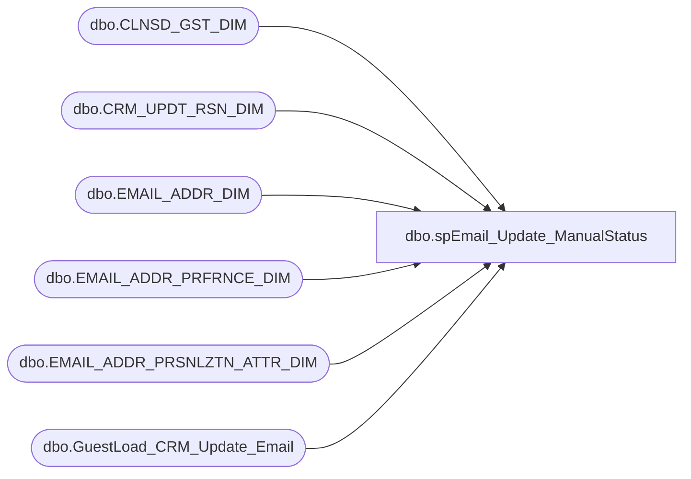

# dbo.spEmail_Update_ManualStatus

**Database:** dw  
**Server:** papamart  

## Architecture Diagram



## Table Dependencies

| Referenced Table |
|---|
| dbo.CLNSD_GST_DIM |
| dbo.CRM_UPDT_RSN_DIM |
| dbo.EMAIL_ADDR_DIM |
| dbo.EMAIL_ADDR_PRFRNCE_DIM |
| dbo.EMAIL_ADDR_PRSNLZTN_ATTR_DIM |
| dbo.GuestLoad_CRM_Update_Email |

## Stored Procedure Code

```sql
CREATE PROCEDURE [dbo].[spEmail_Update_ManualStatus]
-- =============================================================================================================
-- Name: spEmail_Update_ManualStatus
--
-- Description:	opts in or opts-out e-mail ; 
--
-- Input:	@email			varchar(255)	email to change
--			@status			varchar(10)		VALID, INVALID, BOUNCE
--			@optin			char(1)			Y/N			
--			@source			varchar(10)		DBA, ESP, WEB_PC, KSK, CRM
--			@logid			int				-2 by default
--			@return_results	bit				prints results if set to 1
--
-- Output: 
--
-- Dependencies: 
--
-- EXAMPLE:
/*
exec [dbo].[spEmail_Update_ManualStatus]
@email = ''
,@status = 'VALID'
,@optin = 'N'
,@source = 'CRM'
*/
--
-- Revision History
--		Name:			Date:			Comments:
--		Keith Missey	02/08/2011		created
-- =============================================================================================================
	@email varchar(255),
	@status VARCHAR(10),
	@optin CHAR(1),
	@source VARCHAR(10)='DBA',
	@logid INT=-2,
	@return_results bit=1
AS
SET NOCOUNT ON

DECLARE @date DATETIME

IF @return_results = 1
BEGIN
	SELECT 'BEFORE' AS Status, * FROM dw.[dbo].[EMAIL_ADDR_DIM] e  WITH (NOLOCK)
		LEFT JOIN dw.dbo.EMAIL_ADDR_PRFRNCE_DIM p WITH (NOLOCK) ON e.email_addr_id = p.EMAIL_ADDR_ID
		LEFT JOIN dbo.EMAIL_ADDR_PRSNLZTN_ATTR_DIM ep WITH (NOLOCK) ON e.EMAIL_ADDR_ID = ep.EMAIL_ADDR_ID
		LEFT JOIN dw.dbo.[CLNSD_GST_DIM] c WITH (NOLOCK) ON e.[EMAIL_ADDR_ID] = c.[EMAIL_ADDR_ID]
		WHERE [EMAIL_ADDR_TXT] = @email
END

SET @date = GETDATE()

IF EXISTS(SELECT email_addr_txt FROM dw.dbo.EMAIL_ADDR_DIM e WITH (NOLOCK) WHERE email_addr_txt = @email)
BEGIN
	--UPDATE EMAIL TABLE
	UPDATE dw.dbo.[EMAIL_ADDR_DIM] 
		SET [EMAIL_STAT_CD] = @status, email_stat_dt = @date, 
		[UPDT_DT] = GETDATE(), 
			[ETL_LOG_ID] = @logid, [ETL_EVNT_ID] = @logid
	WHERE email_addr_txt = @email

--UPDATE PREFERENCES
UPDATE dw.dbo.[EMAIL_ADDR_PRFRNCE_DIM] SET
	updt_src_sys_cd = @source,
	promo_pref = @optin,
	PROMO_UPDT_DT = @date,
	SFSCERT_PREF = @optin,
	SFSCERT_UPDT_DT = @date,
	SFSPNTS_PREF = @optin,
	SFSPNTS_UPDT_DT = @date,
	[UPDT_DT] = @date,
		etl_log_id = @logid, [ETL_EVNT_ID] = @logid
FROM dw.dbo.EMAIL_ADDR_PRFRNCE_DIM ep 
	INNER JOIN dw.dbo.EMAIL_ADDR_DIM e WITH (NOLOCK) ON ep.EMAIL_ADDR_ID = e.EMAIL_ADDR_ID
WHERE [EMAIL_ADDR_TXT] = @email

	--INSERT INTO EMAIL CHANGE TABLE
	DECLARE @crm_updt_rsn_id int
	
	SET @crm_updt_rsn_id = (SELECT crm_updt_rsn_id 
				FROM dw.dbo.CRM_UPDT_RSN_DIM WHERE crm_updt_rsn_cd = 'manual updt')

	--INSERT CHANGE TABLE
	INSERT dw.dbo.GuestLoad_CRM_Update_Email	
	SELECT NULL, e.email_addr_id, @crm_updt_rsn_id, NULL, email_addr_txt, email_addr_txt,
		NULL, @source, @status, NULL, @optin, NULL, @optin, NULL, @optin,
		NULL, NULL, NULL, NULL, GETDATE(), @logid
	FROM dw.dbo.EMAIL_ADDR_PRFRNCE_DIM p
		INNER JOIN dw.dbo.email_addr_dim e WITH (NOLOCK) ON p.email_addr_id = e.email_addr_id
	WHERE email_addr_txt = @email
END

IF @return_results = 1
BEGIN
	SELECT 'AFTER' AS Status, * FROM dw.[dbo].[EMAIL_ADDR_DIM] e  WITH (NOLOCK)
		LEFT JOIN dw.dbo.EMAIL_ADDR_PRFRNCE_DIM p WITH (NOLOCK) ON e.email_addr_id = p.EMAIL_ADDR_ID
		LEFT JOIN dbo.EMAIL_ADDR_PRSNLZTN_ATTR_DIM ep WITH (NOLOCK) ON e.EMAIL_ADDR_ID = ep.EMAIL_ADDR_ID
		LEFT JOIN dw.dbo.[CLNSD_GST_DIM] c WITH (NOLOCK) ON e.[EMAIL_ADDR_ID] = c.[EMAIL_ADDR_ID]
		LEFT JOIN dw.dbo.GuestLoad_CRM_Update_Email g WITH (NOLOCK) ON EMAIL_ADDR_TXT_NEW = email_addr_txt
		WHERE [EMAIL_ADDR_TXT] = @email
END
```

