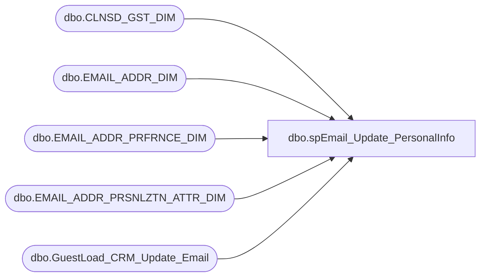

# dbo.spEmail_Update_PersonalInfo

**Database:** dw  
**Server:** papamart  

## Architecture Diagram



## Table Dependencies

| Referenced Table |
|---|
| dbo.CLNSD_GST_DIM |
| dbo.EMAIL_ADDR_DIM |
| dbo.EMAIL_ADDR_PRFRNCE_DIM |
| dbo.EMAIL_ADDR_PRSNLZTN_ATTR_DIM |
| dbo.GuestLoad_CRM_Update_Email |

## Stored Procedure Code

```sql
CREATE PROC [dbo].[spEmail_Update_PersonalInfo]
-- =============================================================================================================
-- Name: [dbo].[spEmail_Update_PersonalInfo]
--
-- Description:	updates personal data associated with e-mail
--
-- Input:	@email			varchar(200)	email address to change
--			@country		char(3)			country to associate with e-mail 'USA', 'GBR', 'FRA', 'IRE'
--			@return_results	bit				prints results if set to 1
--
-- Output: N/A
--
-- Dependencies: 
--
-- Revision History
--		Name:			Date:			Comments:
--		Keith Missey	3/23/2011		created
-- =============================================================================================================
@email VARCHAR(200),
@country CHAR(3),
@return_results BIT=1
AS

DECLARE @date datetime

IF @return_results = 1
BEGIN
	SELECT 'BEFORE' AS Status, * FROM dw.[dbo].[EMAIL_ADDR_DIM] e  WITH (NOLOCK)
		LEFT JOIN dw.dbo.EMAIL_ADDR_PRFRNCE_DIM p WITH (NOLOCK) ON e.email_addr_id = p.EMAIL_ADDR_ID
		LEFT JOIN dbo.EMAIL_ADDR_PRSNLZTN_ATTR_DIM ep WITH (NOLOCK) ON e.EMAIL_ADDR_ID = ep.EMAIL_ADDR_ID
		LEFT JOIN dw.dbo.[CLNSD_GST_DIM] c WITH (NOLOCK) ON e.[EMAIL_ADDR_ID] = c.[EMAIL_ADDR_ID]
		WHERE [EMAIL_ADDR_TXT] = @email
END

SET @date = GETDATE()

UPDATE dw.dbo.EMAIL_ADDR_PRSNLZTN_ATTR_DIM SET CNTRY_ABBRV = @country, UPDT_DT = GETDATE()
FROM dw.dbo.EMAIL_ADDR_PRSNLZTN_ATTR_DIM p WITH (NOLOCK)
	INNER JOIN dw.dbo.email_addr_dim e WITH (NOLOCK) ON p.EMAIL_ADDR_ID = e.EMAIL_ADDR_ID
WHERE email_addr_txt = @email

IF @return_results = 1
BEGIN
	SELECT 'AFTER' AS Status, * FROM dw.[dbo].[EMAIL_ADDR_DIM] e  WITH (NOLOCK)
		LEFT JOIN dw.dbo.EMAIL_ADDR_PRFRNCE_DIM p WITH (NOLOCK) ON e.email_addr_id = p.EMAIL_ADDR_ID
		LEFT JOIN dbo.EMAIL_ADDR_PRSNLZTN_ATTR_DIM ep WITH (NOLOCK) ON e.EMAIL_ADDR_ID = ep.EMAIL_ADDR_ID
		LEFT JOIN dw.dbo.[CLNSD_GST_DIM] c WITH (NOLOCK) ON e.[EMAIL_ADDR_ID] = c.[EMAIL_ADDR_ID]
		LEFT JOIN dw.dbo.GuestLoad_CRM_Update_Email g WITH (NOLOCK) ON EMAIL_ADDR_TXT_NEW = email_addr_txt
		WHERE [EMAIL_ADDR_TXT] = @email
END
```

