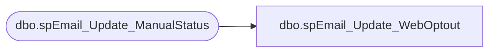

# dbo.spEmail_Update_WebOptout

**Database:** dw  
**Server:** papamart  

## Architecture Diagram



## Table Dependencies

| Referenced Table |
|---|
| dbo.spEmail_Update_ManualStatus |

## Stored Procedure Code

```sql
CREATE PROCEDURE dbo.[spEmail_Update_WebOptout]
-- =============================================================================================================
-- Name: spEmail_Update_WebOptout
--
-- Description:	opts out e-mail in all systems; used by the website
--
-- Input:	@email			varchar(255)	email to opt out
--
-- Output: 
--
-- Dependencies: 
--
-- EXAMPLE:
--
-- Revision History
--		Name:			Date:			Comments:
--		Keith Missey	8/19/2009		created
--		Keith Missey	5/13/2010		changed opt-out values
--		Keith Missey	2/9/2011		updated for preeference center
-- =============================================================================================================
	@email varchar(255)
AS
SET NOCOUNT ON

exec dw.dbo.spEmail_Update_ManualStatus @email, 'VALID','N','WEB_PC',-3,0
```

