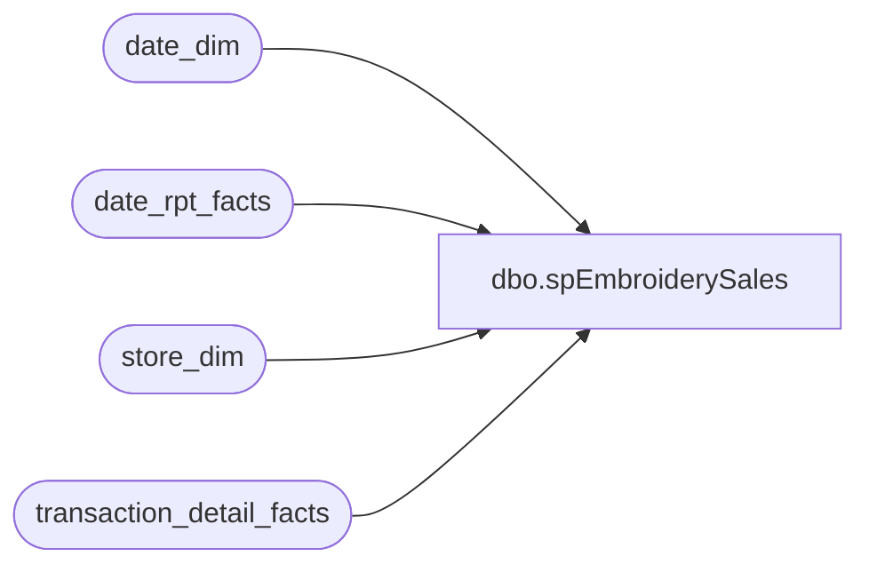

# dbo.spEmbroiderySales

**Database:** dw  
**Server:** papamart  

## Architecture Diagram



## Table Dependencies

| Referenced Table |
|---|
| date_dim |
| date_rpt_facts |
| store_dim |
| transaction_detail_facts |

## Stored Procedure Code

```sql
/******************************************************************************
**
**	Name:		spEmbroiderySales
**
**	Description: 	Returns Embroidery Sales TY vs LY
**
**
**	Parameters:	none
**
**
**	Examples:	EXEC spEmbroiderySales
**			
**
**	History:	
**  Date 		Author 		Purpose
**  08/25/04		CC 		Created
******************************************************************************/
CREATE                                       PROCEDURE  spEmbroiderySales
/* ===== ARGUMENTS ===== */	
AS
SET NOCOUNT ON

/* ===== DECLARATIONS ===== */

DECLARE
 @curDay char(2)
,@curMon char(2)
,@curYr char(4)
,@curDate datetime
,@wkCurTY int
,@wk13TY int
,@dw	int


SET @curDay = datepart(dd,getdate())
SET @curMon = datepart(mm,getdate())
SET @curYr = datepart(yy,getdate())

--SET @fiscYrTY = @curYr
--SET @fiscYrLY = @curYr-1


SET @curDate = cast((@curMon+'/'+@curDay+'/'+@curYr) as Datetime)
--SET @curDate = dateadd(dd, -1,@curDate)

SET @dw = datepart(dw,@CurDate)
--select @dw
IF @dw BETWEEN 1 AND 6
	SET @wkCurTY = (select week_id-1 from date_dim where actual_date = @curDate)
	--SET @wkCurTY = (select week_id from date_dim where actual_date = @curDate)

ELSE 
	SET @wkCurTY = (select week_id from date_dim where actual_date = @curDate)

--select @wkCurTY

SET @wk13TY = @wkCurTY - 13 


IF (Object_ID('tempdb..#date_key_xref') IS NOT NULL) DROP TABLE #date_key_xref
--get TY and LY date keys
select date_key_TY, date_key_LY
into #date_key_xref 
from date_rpt_facts drf 		
	join date_dim dd on drf.date_key_TY = dd.date_key
	join date_dim ddly on drf.date_key_LY = ddly.date_key
	where dd.week_id > @wk13TY and dd.week_id <= @wkCurTY 

create index idx_temp_date_key_TY on #date_key_xref(date_key_TY)
create index idx_temp_date_key_LY on #date_key_xref(date_key_LY)

/******populate TYdata table with all TY and LY date and store keys******/

IF (Object_ID('tempdb..#TYdata') IS NOT NULL) DROP TABLE #TYdata

select 	store_key,
	date_key_TY,
	0 as TYtransactions,
	0 as TYamount,
	0 as TYdiscount,
	0 as TYunits,
	date_key_LY,
	0 as LYtransactions,
	0 as LYamount,
	0 as LYdiscount,
	0 as LYunits

INTO #TYdata		
from store_dim cross join #date_key_xref
where store_key > 0 and bearritory is not null

create index idx_tempTYdata_date_key_TY on #TYdata(date_key_TY)

--select * from #TYdata where store_key = 6 order by date_key_TY

/******populate table with TY actual data*******/
IF (Object_ID('tempdb..#TYdata_actual') IS NOT NULL) DROP TABLE #TYdata_actual

SELECT 	a.store_key,
	a.date_key,
	count(distinct a.transaction_id) as TYtransactions,
	sum(isnull(CASE WHEN a.unit_gross_amount = 16 AND a.units = 1 THEN 0
			ELSE a.unit_gross_amount END,0)) as TYamount,
	sum(isnull(CASE WHEN a.unit_gross_amount = 16 AND a.units = 1 THEN 0
			ELSE a.unit_disc_amount END,0)) as TYdiscount,
	sum(isnull(CASE WHEN a.unit_gross_amount = 16 AND a.units = 1 THEN 0
			ELSE a.units END,0)) as TYunits
	
into #TYdata_actual
FROM 
	(
	select  tdf.store_key,
		tdf.date_key,
		tdf.transaction_id,
		tdf.unit_gross_amount,
		tdf.unit_disc_amount,
		tdf.units 
		--CAST((tdf.unit_gross_amount) AS int) % CAST(8 AS int) as modulo
	
	from transaction_detail_facts tdf
	--join line_object_dim lo on tdf.line_object_key = lo.line_object_key
	--join store_dim sd on tdf.store_key = sd.store_key
	--join date_dim dd on tdf.date_key = dd.date_key
	
	where tdf.product_key = -8
	and tdf.date_key in (select date_key_TY from #date_key_xref)
	and tdf.transaction_line_seq >= 0

	group by tdf.store_key,
		 tdf.date_key,
		 tdf.transaction_id,
		 tdf.unit_gross_amount,
		 tdf.unit_disc_amount,
		 tdf.units 
	
	having CAST((tdf.unit_gross_amount) AS int) % CAST(8 AS int) = 0 
	) a

GROUP BY a.store_key,
	 a.date_key	


create index idx_tempTYdata_actual_date_key_TY on #TYdata_actual(date_key)

/*
select ty.*,dd.actual_date 
from #TYdata_actual ty
join date_dim dd on ty.date_key = dd.date_key
where ty.store_key = 6 and dd.fiscal_week = 21
*/

/******UPDATE #TYdata with #TYdata_actual results*******/

UPDATE 	 #TYdata
   SET   #TYdata.TYtransactions = #TYdata_actual.TYtransactions,
	 #TYdata.TYamount = #TYdata_actual.TYamount,
	 #TYdata.TYdiscount = #TYdata_actual.TYdiscount,
	 #TYdata.TYunits = #TYdata_actual.TYunits
   FROM  #TYdata, #TYdata_actual
   WHERE #TYdata.date_key_TY = #TYdata_actual.date_key
         AND #TYdata.store_key = #TYdata_actual.store_key

/*
select ty.*,dd.actual_date 
from #TYdata ty
join date_dim dd on ty.date_key_TY = dd.date_key
where ty.store_key = 6 and dd.fiscal_week = 21
order by dd.actual_date
*/

/******populate table with LY data******/
IF (Object_ID('tempdb..#LYdata_actual') IS NOT NULL) DROP TABLE #LYdata_actual
SELECT 	a.store_key,
	a.date_key,
	count(distinct a.transaction_id) as LYtransactions,
	sum(isnull(CASE WHEN a.unit_gross_amount = 16 AND a.units = 1 THEN 0
			ELSE a.unit_gross_amount END,0)) as LYamount,
	sum(isnull(CASE WHEN a.unit_gross_amount = 16 AND a.units = 1 THEN 0
			ELSE a.unit_disc_amount END,0)) as LYdiscount,
	sum(isnull(CASE WHEN a.unit_gross_amount = 16 AND a.units = 1 THEN 0
			ELSE a.units END,0)) as LYunits
into #LYdata_actual
FROM 
	(
	select  tdf.store_key,
		tdf.date_key,
		tdf.transaction_id,
		tdf.unit_gross_amount,
		tdf.unit_disc_amount,
		tdf.units 
		--CAST((tdf.unit_gross_amount) AS int) % CAST(8 AS int) as modulo
	
	from transaction_detail_facts tdf
	--join line_object_dim lo on tdf.line_object_key = lo.line_object_key
	--join store_dim sd on tdf.store_key = sd.store_key
	--join date_dim dd on tdf.date_key = dd.date_key
	
	where tdf.product_key = -8
	and tdf.date_key in (select date_key_LY from #date_key_xref)
	and tdf.transaction_line_seq >= 0
	
	group by tdf.store_key,
		 tdf.date_key,
		 tdf.transaction_id,
		 tdf.unit_gross_amount,
		 tdf.unit_disc_amount,
		 tdf.units
	
	having CAST((tdf.unit_gross_amount) AS int) % CAST(8 AS int) = 0 
	) a

GROUP BY a.store_key,
	 a.date_key	


create index idx_tempLYdata_actual_date_key_TY on #LYdata_actual(date_key)
/*
select ly.*,dd.actual_date 
from #LYdata_actual ly
join date_dim dd on ly.date_key = dd.date_key
where ly.store_key = 6 and dd.fiscal_week = 22
order by dd.actual_date
*/

/******UPDATE #TYdata with #LYdata_actual results*****/

UPDATE 	 #TYdata
   SET   #TYdata.LYtransactions = #LYdata_actual.LYtransactions,
	 #TYdata.LYamount = #LYdata_actual.LYamount,
	 #TYdata.LYdiscount = #LYdata_actual.LYdiscount,
	 #TYdata.LYunits = #LYdata_actual.LYunits
   FROM  #TYdata, #LYdata_actual
   WHERE #TYdata.date_key_LY = #LYdata_actual.date_key
         AND #TYdata.store_key = #LYdata_actual.store_key


/*
select ty.*,dd.actual_date, ddly.actual_date as LYactualdate 
from #TYdata ty
join date_dim dd on ty.date_key_TY = dd.date_key
join date_dim ddly on ty.date_key_LY = ddly.date_key
where ty.store_key = 6 and dd.fiscal_week = 21
order by dd.actual_date
*/


/*********************FINAL RESULTS**********************/

	select  sum(isnull(ty.LYtransactions,0)) as LYtransactions,
		sum(isnull(ty.LYamount,0)) as LYamount,
		sum(isnull(ty.LYdiscount,0)) as LYdiscount,
		sum(isnull(ty.LYunits,0)) as LYunits,
		sum(isnull(ty.TYtransactions,0)) as TYtransactions,
		sum(isnull(ty.TYamount,0)) as TYamount,
		sum(isnull(ty.TYdiscount,0)) as TYdiscount,
		sum(isnull(ty.TYunits,0)) as TYunits,
		sd.store_id,
		dd.fiscal_week,
		dd.fiscal_year
		
		
	from #TYdata ty
	join date_dim dd on ty.date_key_TY = dd.date_key
	join store_dim sd on ty.store_key = sd.store_key
	
	--where sd.store_id = 6 and dd.fiscal_week = 21
	group by sd.store_id,
		 dd.fiscal_week,
		 dd.fiscal_year


/* for validation only */
/*********************************************************
--select * from product_dim where product_key IN (-7,-8,-9)
--below will eliminate $25 fee which may be valid
SELECT 	a.store_id,
	a.fiscal_week,
	count(distinct a.transaction_id) as ttlTransactions,
	sum(isnull(a.unit_gross_amount,0)) as ttlAmount,
	sum(isnull(a.unit_disc_amount,0)) as ttlDiscount,
	sum(isnull(a.units,0)) as ttlUnits
FROM 
	(
	select  tdf.store_key,
		tdf.date_key,
		tdf.transaction_id,
		tdf.unit_gross_amount,
		tdf.unit_disc_amount,
		tdf.units
		--CAST((tdf.unit_gross_amount) AS int) % CAST(8 AS int) as modulo
	
	from transaction_detail_facts tdf
	--join line_object_dim lo on tdf.line_object_key = lo.line_object_key
	join store_dim sd on tdf.store_key = sd.store_key
	join date_dim dd on tdf.date_key = dd.date_key
	
	where tdf.product_key = -8
	and dd.actual_date between '8/1/2004' and '8/5/2004'
	and tdf.transaction_line_seq >= 0
	group by sd.store_id,
		 dd.actual_date,
		 dd.fiscal_week,
		 tdf.transaction_id,
		 tdf.unit_gross_amount,
		 tdf.unit_disc_amount,
		 tdf.units
	
	having CAST((tdf.unit_gross_amount) AS int) % CAST(8 AS int) = 0 
	) a

GROUP BY a.store_id,
	 a.fiscal_week	

select * 
from transaction_detail_facts tdf
where transaction_id IN (15425778,15449746,15449752,15473184)
and transaction_line_seq >=0
order by transaction_id
********************************************************************/
```

