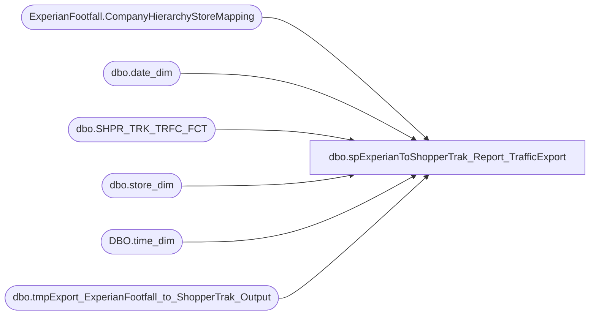

# dbo.spExperianToShopperTrak_Report_TrafficExport

**Database:** dw  
**Server:** papamart  

## Architecture Diagram



## Table Dependencies

| Referenced Table |
|---|
| ExperianFootfall.CompanyHierarchyStoreMapping |
| dbo.date_dim |
| dbo.SHPR_TRK_TRFC_FCT |
| dbo.store_dim |
| DBO.time_dim |
| dbo.tmpExport_ExperianFootfall_to_ShopperTrak_Output |

## Stored Procedure Code

```sql
CREATE PROC [dbo].[spExperianToShopperTrak_Report_TrafficExport]

	@ac_path varchar(100),
	@ad_dateStart datetime,
	@ad_dateEnd datetime

AS

DECLARE @outputsql VARCHAR(1000)
		, @bcpsql VARCHAR(4000)
		, @filename VARCHAR(200)
   

----------------------------------------
-- Create Temp Table
----------------------------------------
IF EXISTS(SELECT * FROM dbo.sysobjects WHERE Name = 'tmpExport_ExperianFootfall_to_ShopperTrak_Output') 
	DROP TABLE dbo.tmpExport_ExperianFootfall_to_ShopperTrak_Output

CREATE TABLE dbo.tmpExport_ExperianFootfall_to_ShopperTrak_Output
		( ShopperTrakID INT
			, CUST_ID INT
			, DT VARCHAR(10)
			, TM VARCHAR(2)
			, ENTERS INT
			, EXITS INT
			, Data_Ind CHAR(1)
		)

INSERT INTO dbo.tmpExport_ExperianFootfall_to_ShopperTrak_Output
		(  CUST_ID
			, DT
			, TM
			, ENTERS
			, EXITS
		)
SELECT	 sd.store_id AS storeId
		, CONVERT(date,dd.actual_date) as [date]
		, LEFT(RIGHT('00000' + LTRIM(RTRIM(CAST(10000*td.[hour] + 100*(td.[minute]-14) AS VARCHAR(6)))), 6),2) AS hrOfDay
		, MAX(sttf.ENTERS) AS totalEnters
		, MAX(sttf.EXITS) AS totalExits
	FROM dw.dbo.SHPR_TRK_TRFC_FCT sttf WITH(NOLOCK)
		INNER JOIN dw.dbo.store_dim sd WITH(NOLOCK)
			ON sttf.STR_KEY = sd.store_key
		INNER JOIN DWStaging.ExperianFootfall.CompanyHierarchyStoreMapping chsm WITH(NOLOCK)
			ON sd.store_key = chsm.store_key
				AND chsm.IsFootFall = 1
		INNER JOIN dw.DBO.time_dim td WITH(NOLOCK)
			ON sttf.TM_key = td.time_key
		INNER JOIN dw.dbo.date_dim dd WITH(NOLOCK)
			ON sttf.DT_key = dd.date_key
	WHERE dd.actual_date BETWEEN @ad_dateStart AND @ad_dateEnd --ORIGINAL CODE
	AND dd.actual_date <> @ad_dateEnd
	GROUP BY 
		sd.store_id
		, CASE
			WHEN LEFT(RIGHT('00000' + LTRIM(RTRIM(CAST(10000*td.[hour] + 100*(td.[minute]-14) AS VARCHAR(6)))), 6),2) = '234500'
				THEN 10000*YEAR(DATEADD(dd, -1, dd.actual_date)) + 100*MONTH(DATEADD(dd, -1, dd.actual_date)) + DAY(DATEADD(dd, -1, dd.actual_date)) 
			ELSE 10000*YEAR(dd.actual_date) + 100*MONTH(dd.actual_date) + DAY(dd.actual_date) 
		END
		--, CONVERT(date,dd.actual_date) 
		, LEFT(RIGHT('00000' + LTRIM(RTRIM(CAST(10000*td.[hour] + 100*(td.[minute]-14) AS VARCHAR(6)))), 6),2)
		,dd.actual_date
	ORDER BY sd.store_id,[date],hrOfDay ASC

----------------------------------------
-- Export File
----------------------------------------
	SET @outputsql = 'SELECT CUST_ID, DT, TM, ENTERS, EXITS '
					+ ' FROM dw.dbo.tmpExport_ExperianFootfall_to_ShopperTrak_Output '
					+ ' ORDER BY CUST_ID, DT, TM; '

	SELECT @filename = 'TRAFFIC_' 
						+ CAST(YEAR(@ad_dateEnd) AS VARCHAR(4))
						+ REPLICATE('0', 2 - LEN(MONTH(@ad_dateEnd))) + CAST(MONTH(@ad_dateEnd) AS VARCHAR(2))
						+ REPLICATE('0', 2 - LEN(DAY(@ad_dateEnd))) + CAST(DAY(@ad_dateEnd) AS VARCHAR(2)) 
						+ '.txt'

	SET @bcpsql = 'bcp "' + @outputsql + '" queryout "' + @ac_path + @filename
	+ '" -t "," -T -c'

	 
	EXEC master..xp_cmdshell @bcpsql;
```

