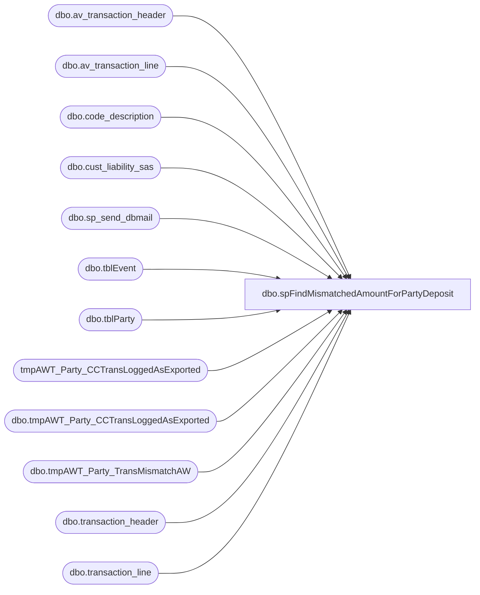

# dbo.spFindMismatchedAmountForPartyDeposit

**Database:** dw  
**Server:** papamart  

## Architecture Diagram



## Table Dependencies

| Referenced Table |
|---|
| dbo.av_transaction_header |
| dbo.av_transaction_line |
| dbo.code_description |
| dbo.cust_liability_sas |
| dbo.sp_send_dbmail |
| dbo.tblEvent |
| dbo.tblParty |
| tmpAWT_Party_CCTransLoggedAsExported |
| dbo.tmpAWT_Party_CCTransLoggedAsExported |
| dbo.tmpAWT_Party_TransMismatchAW |
| dbo.transaction_header |
| dbo.transaction_line |

## Stored Procedure Code

```sql
--USE [dw]
--GO
--/****** Object:  StoredProcedure [dbo].[spFindMismatchedAmountForPartyDeposit]    Script Date: 2/23/2015 7:17:37 AM ******/
--SET ANSI_NULLS ON
--GO
--SET QUOTED_IDENTIFIER ON
--GO

CREATE PROCEDURE [dbo].[spFindMismatchedAmountForPartyDeposit]
@includeArchivedData bit = 0
as

-- =====================================================================================================
-- Name: spFindMismatchedAmountForPartyDeposit
--
-- Description:	Some things to know about this report.  
---	It runs once per day at 5:30 am 
---	It compiles all successful party deposit and party refund transactions for the last 365 days (Paymentech logs on BearWebDB).
---	For each of those parties, the AW transactions (queried directly from Oursblanc) are also compiled then compared to the party deposits.  
---	Once the party date is past, those parties no longer display mismatches on this report.
---	If a party is cancelled it is no longer on this report
---	I only include store reg 2, series ‘P’ so store deposits are not included in the AW data

-- Input:	
--			@includeArchivedData		bit	
--
-- Output: Resultset with the following columns:
--		EventID,
--		dStart,
--		Store,
--		[PT$],
--		[AW$],
--		Diff,
--		[Voucher$],
--		FirstTransDate,
--		[lastTransDate]
-- Dependencies: None
--
-- Revision History
--		Name:			Date:			Comments:
--										initial version
--		GaryD			20090814		Update email To list
--		Brad A			03/31/2010		updated email receipient to webteam
--		GaryD			20100818		Record current prod version
--		GaryD			20100819		Update server name for SA 5.0.
--		MikeP			20140306		Cleaned up the procedure and converted email to use sp_send_dbmail
--		MikeP			20150223		Used OPENQUERY to access SQL 2000 server
--		JustinD			20151105		Including site code check
-- =====================================================================================================

--DECLARE @includeArchivedData bit = 0
set nocount on

declare @RowCount int

truncate table dw.dbo.[tmpAWT_Party_CCTransLoggedAsExported]

Insert INTO dw.[dbo].[tmpAWT_Party_CCTransLoggedAsExported]
	(sAWTransNo
	, EventID 
	, sOrderNumber
	, TransDateTime
	, mAmount
	, iStoreID 
	, sClientCountryCode
	, iExportStatus
	, sTransactionId )
	SELECT * FROM OPENQUERY(BEARWEBDB, 'select sAWTransNo
	, sOrderNumber_BABW as EventID--(no x001)
	, sOrderNumber --(with x001 at end)
	, AuthDateTime as TransDateTime
	, mAmount
	, iStoreID
	, sClientCountryCode
	, iExportStatus
	, sTransactionId
from BEARWEBDB.[WebCart_Commerce].[dbo].vwPT_Auth A 
where iClientID in (1,3,6)	--1=BT, 3=BAP, 6=BT POS
 and bIsProduction=1
 and sMessageType=''AC''
 and bIsApproved=1
 and iExportStatus=2 
 and sAWTransNo is not null
 and AuthDateTime between Dateadd(year, -1, getdate()) and getdate() --@FirstDateForChecks
 and Right(sOrderNumber, 4) <> ''DUPE''
')


----get the refunds and reverse the sign on the amount so we can sum these with auths
Insert INTO dw.[dbo].[tmpAWT_Party_CCTransLoggedAsExported]
	(sAWTransNo
	, EventID 
	, sOrderNumber
	, TransDateTime
	, mAmount
	, iStoreID 
	, sClientCountryCode
	, iExportStatus
	, sTransactionId )
	SELECT * FROM OPENQUERY(BEARWEBDB, '
select sAWTransNo
	, sOrderNumber_BABW as EventID --(no x001)
	, sOrderNumber --(with x001 at end)
	, RefundDateTime as TransDateTime
	, - mAmount as mAmount
	, iStoreID
	, sClientCountryCode
	, iExportStatus
	, sTransactionId
from WebCart_Commerce.dbo.vwPT_Refund R 
where iClientID in (1,3,6)	--1=BT, 3=BAP, 6=BT POS
and bIsProduction=1
and bIsApproved=1
and iExportStatus=2 
and sAWTransNo is not null
and RefundDateTime between Dateadd(year, -1, getdate()) and getdate()
and Right(sOrderNumber, 4) <> ''DUPE''
')
--select * from tmpAWT_Party_CCTransLoggedAsExported where iExportStatus=2 --and sOrderNumber='5668664x001'


--justind - remove any party invitation order numbers as these do not relate to deposits
delete from tmpAWT_Party_CCTransLoggedAsExported
where sOrderNumber in (SELECT distinct(sOrderNumber) FROM OPENQUERY(BEARWEBDB, 'select sOrderNumber from WebCart_Commerce.dbo.Paymentech_AuthSent where sClientSiteCode = ''BAP_US_INV'' and bIsProduction = 1'))


--PROBLEM #1: NOT EXPORTED
--select 'NOT EXPORTED', * from [dbo].tmpAWT_Party_CCTransLoggedAsExported where iExportStatus=1 --and sOrderNumber='5668664x001'

--group by EventID and Sum the Auths and refunds by EventID
select EventID 
	, iStoreID as StoreID
	, sum(mAmount) as NetBalance
	, count(*) as TransCount
	, min(TransDateTime) AS FirstTransDate
	, max(TransDateTime) AS LastTransDate
into #AuthLog_NetBalance
from dw.[dbo].tmpAWT_Party_CCTransLoggedAsExported 
where iExportStatus=2
group by EventID, iStoreID


/*======================= VOUCHER BALANCE =======================*/
--===== START 2nd METHOD: using the AW transaction level ===========
-- Detect POS deposits (NOT store 990, 995, 1590, 2990, 2995)
-- and do not include them in "current balance" for comparison purposes.

create table #aw_transaction_header(
	store_no int
	, register_no smallint
	, transaction_series char(1)
	, transaction_date smalldatetime
	, transaction_id numeric(14,0)
	, transaction_no varchar(50)
	, entry_date_time datetime
)

insert into #aw_transaction_header
	(store_no
	, register_no
	, transaction_series
	, transaction_date
	, transaction_id
	, transaction_no
	, entry_date_time )
select store_no
	, register_no
	, transaction_series
	, transaction_date
	, transaction_id
	, transaction_no
	, entry_date_time
	--, tender_total -- all are $0 so this field is to be ignored
	--,exception_flag, sa_rejection_flag, if_rejection_flag
from bedrockdb01.auditworks.dbo.transaction_header
where store_no in (990,995,2990,2995,1590) 
	and register_no = 2
	and transaction_series = 'P'
	and transaction_void_flag = 0
	and exception_flag = 0
	 
--========= START - ARCHIVE DATA =======================================================================================================
-- ARCHIVE DATA should be a one time need! after that we should be able to keep up with current AW data
if @includeArchivedData = 1 begin
	insert into #aw_transaction_header
		(store_no
		, register_no
		, transaction_series
		, transaction_date
		, transaction_id
		, transaction_no
		, entry_date_time )
	select store_no
		, register_no
		, transaction_series
		, transaction_date
		, av_transaction_id as transaction_id
		, transaction_no
		, entry_date_time
		--, tender_total -- all are $0 so this field is to be ignored
		--,exception_flag, sa_rejection_flag, if_rejection_flag
	from bedrockdb01.auditworks.dbo.av_transaction_header
	where entry_date_time between Dateadd(year, -1, getdate()) and getdate()
		and store_no in (990,995,2990,2995,1590) 
		and register_no = 2
		and transaction_series = 'P'
		and transaction_void_flag = 0
		and exception_flag = 0
end
--========= END - ARCHIVE DATA =======================================================================================================

create table #aw_transaction_line(
	transaction_id numeric(12,0)
	, reference_no varchar(80)
	, Amount money
)

insert into #aw_transaction_line
(transaction_id
	, reference_no
	, Amount)
select transaction_id
	, reference_no
	, case when line_action = 24 then gross_line_amount
		when line_action = 25 then - gross_line_amount
		else 99999 -- <-- this should flag an issue
	  end as Amount
from bedrockdb01.auditworks.dbo.transaction_line
where transaction_id in (select transaction_id from #aw_transaction_header)
and line_id = 100
and reference_no in (select distinct cast(EventID as varchar) from dw.[dbo].tmpAWT_Party_CCTransLoggedAsExported)


--========= START - ARCHIVE DATA =======================================================================================================
-- ARCHIVE DATA should be a one time need! after that we should be able to keep up with current AW data
if @includeArchivedData = 1 begin
	insert into #aw_transaction_line
	(transaction_id
		, reference_no
		, Amount)
	select av_transaction_id as transaction_id
		, reference_no
		, case when line_action = 24 then gross_line_amount
			when line_action = 25 then - gross_line_amount
			else 99999 -- <-- this should flag an issue
		  end as Amount
	from bedrockdb01.auditworks.dbo.av_transaction_line
	where av_transaction_id in (select transaction_id from #aw_transaction_header)
	and line_id = 100
	and reference_no in (select distinct cast(EventID as varchar) from [dbo].tmpAWT_Party_CCTransLoggedAsExported)
end
--========= END - ARCHIVE DATA =======================================================================================================


select reference_no
	, sum(Amount) as NetAmount
into #aw_transaction_line_groupByEvent
from #aw_transaction_line
group by reference_no

--compare AW to Auth log
select a.EventID 
	, a.StoreID
	, a.NetBalance as PT_Balance
	, b.NetAmount as AW_Balance
	, b.NetAmount - a.NetBalance as Diff
	, a.FirstTransDate
	, a.lastTransDate
into #MismatchBalances
from #AuthLog_NetBalance a
join #aw_transaction_line_groupByEvent b
on a.EventID = b.reference_no
where a.NetBalance != b.NetAmount


--join to party data to ignore past parties
select e.iEventID, e.iStoreID, e.dStart, p.bCancelled
into #Kodiak_EventData
from kodiak.BearHouse.dbo.tblEvent e 
join kodiak.BearHouse.dbo.tblParty p on e.iEventID = p.iEventID
where e.iEventID in (select EventID from #MismatchBalances)


--get the voucher data also
select  vw.reference_no as eventid
	, vw.pos_amount_1 as voucher_balance
into #POSDbsSA_VoucherBalance
from bedrockdb01.auditworks.dbo.cust_liability_sas vw 
	JOIN bedrockdb01.auditworks.dbo.code_description d 
	on d.code=vw.pos_status and d.code_type=251 --251 means valid?
where reference_type=30 --cust_liability_type.tracking_id_desc='Party Deposits' when joining on reference_type=reference_type
	AND reference_no in (select cast(EventID as varchar) from #MismatchBalances) 

truncate table dw.dbo.[tmpAWT_Party_TransMismatchAW]

Insert INTO dw.[dbo].[tmpAWT_Party_TransMismatchAW]
	(EventID 
	, StoreID
	, PT_Balance
	, AW_Balance
	, Voucher_Balance
	, Diff 
	, dStart
	, FirstTransDate
	, LastTransDate
	)
select m.EventID, m.StoreID, PT_Balance, AW_Balance, Voucher_Balance, Diff, dStart, FirstTransDate, LastTransDate 
from #MismatchBalances m
join #Kodiak_EventData e on m.eventID = e.iEventID
left join #POSDbsSA_VoucherBalance v on v.eventid = m.eventID
where bCancelled = 0 and dStart >  getdate()
order by e.dStart 

set @RowCount = @@RowCount 
--===== END 2nd METHOD: using the AW transaction level ===========

if(@RowCount > 0) begin
	declare @query varchar(2000)

	set @query = '
	print ''Papamart.DW.dbo.spFindMismatchedAmountForPartyDeposit''

	select 
		cast(EventID as varchar(8)) EventID,
		cast(dStart as varchar(12)) dStart,
		cast(StoreID as varchar(6)) Store,
		cast(PT_Balance as varchar(10)) [PT$],
		cast(AW_Balance as varchar(10)) [AW$],
		cast(Diff as varchar(10)) Diff,
		cast(Voucher_Balance as varchar(10)) [Voucher$],
		cast(FirstTransDate as varchar(12)) FirstTransDate,
		cast(lastTransDate as varchar(12)) [lastTransDate]
	from dw.[dbo].[tmpAWT_Party_TransMismatchAW]
	order by dStart, StoreID
	'
	EXEC msdb.dbo.sp_send_dbmail @recipients = 'webteam@buildabear.com; lindak@buildabear.com; jackm@buildabear.com; posadmin@buildabear.com',
	--EXEC msdb.dbo.sp_send_dbmail @recipients = 'brianb@buildabear.com',
		@subject='Daily Party Deposit Amount Mismatch Check', 
		@query_result_width = 250,
		@query= @query
end

drop table #AuthLog_NetBalance
drop table #POSDbsSA_VoucherBalance
drop table #MismatchBalances
drop table #aw_transaction_header
drop table #aw_transaction_line
drop table #aw_transaction_line_groupByEvent
drop table #Kodiak_EventData
```

