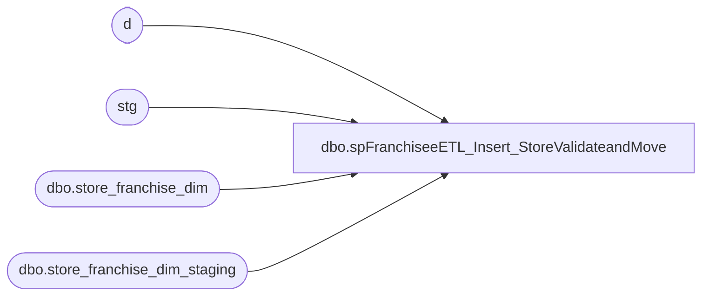

# dbo.spFranchiseeETL_Insert_StoreValidateandMove

**Database:** dw  
**Server:** papamart  

## Architecture Diagram



## Table Dependencies

| Referenced Table |
|---|
| d |
| stg |
| dbo.store_franchise_dim |
| dbo.store_franchise_dim_staging |

## Stored Procedure Code

```sql
CREATE PROC [dbo].[spFranchiseeETL_Insert_StoreValidateandMove]
-- =============================================================================================================
-- Name: [dbo].[spFranchiseeETL_Insert_StoreValidateandMove]
--
-- Description:	Used in Franchise Store ETL SSIS
--
-- Input:	N/A
--
-- Output: N/A
--
-- Dependencies: 
--
-- Revision History
--		Name:			Date:			Comments:
--		Scott Morrison	1/1/2007		created
--		Keith Missey	12/11/2009		
-- =============================================================================================================
AS 
    BEGIN  

        SET NOCOUNT ON
  
        UPDATE  dbo.store_franchise_dim_staging
        SET     store_franchise_dim_staging.new_store_key = CHECKSUM(CAST(store_franchise_dim_staging.store_id AS VARCHAR(50)))  
  
        UPDATE  dbo.store_franchise_dim_staging
        SET     store_franchise_dim_staging.Errors = NULL  
  
        UPDATE  stg
        SET     stg.Errors = ISNULL(stg.Errors + '|', '') + 'Duplicate store_id.'  
  -- select *   
        FROM    dbo.store_franchise_dim_staging stg
        WHERE   EXISTS ( SELECT *
                         FROM   dbo.store_franchise_dim_staging sub
                         WHERE  sub.store_id = stg.store_id
                         GROUP BY sub.store_id
                         HAVING COUNT(*) > 1 )  
  
        UPDATE  stg
        SET     stg.Errors = ISNULL(stg.Errors + '|', '') + 'Invalid store_name.'  
  -- select *  
        FROM    dbo.store_franchise_dim_staging stg
        WHERE   ISNULL(LTRIM(RTRIM(stg.store_name)), '') = ''  
  
        UPDATE  stg
        SET     stg.Errors = ISNULL(stg.Errors + '|', '') + 'Invalid bearritory.'  
  -- select *  
        FROM    dbo.store_franchise_dim_staging stg
        WHERE   ISNULL(LTRIM(RTRIM(stg.bearritory)), '') = ''  
  
        UPDATE  stg
        SET     stg.Errors = ISNULL(stg.Errors + '|', '') + 'Invalid region.'  
  -- select *  
        FROM    dbo.store_franchise_dim_staging stg
        WHERE   ISNULL(LTRIM(RTRIM(stg.region)), '') = ''  
  
        UPDATE  stg
        SET     stg.Errors = ISNULL(stg.Errors + '|', '') + 'Invalid country.'  
  -- select *  
        FROM    dbo.store_franchise_dim_staging stg
        WHERE   ISNULL(LTRIM(RTRIM(stg.country)), '') = ''  
  
        UPDATE  stg
        SET     stg.Errors = ISNULL(stg.Errors + '|', '') + 'Invalid BearRange.'  
  -- select *  
        FROM    dbo.store_franchise_dim_staging stg
        WHERE   ISNULL(LTRIM(RTRIM(stg.BearRange)), '') = ''  
  
        UPDATE  stg
        SET     stg.Errors = ISNULL(stg.Errors + '|', '') + 'Invalid opening_date.'  
  -- select *  
        FROM    dbo.store_franchise_dim_staging stg
        WHERE   ISDATE(stg.opening_date) = 0  
  
        UPDATE  stg
        SET     stg.Errors = ISNULL(stg.Errors + '|', '') + 'Invalid comp_date.'  
  -- select *  
        FROM    dbo.store_franchise_dim_staging stg
        WHERE   ISDATE(stg.comp_date) = 0  
  
        DELETE  d   
 --select *  
        FROM    dbo.store_franchise_dim d
        WHERE   NOT EXISTS ( SELECT *
                             FROM   dbo.store_franchise_dim_staging stg
                             WHERE  d.Store_Key = stg.new_store_key )  
  
        DELETE  d   
  --select *   
        FROM    dbo.store_franchise_dim d
        WHERE   EXISTS ( SELECT *
                         FROM   dbo.store_franchise_dim_staging stg
                         WHERE  d.Store_Key = stg.new_store_key
                                AND stg.Errors IS NULL )  
  
        INSERT  dw.dbo.store_franchise_dim
                (
                  [store_key],
                  [store_id],
                  [bearea],
                  [store_name],
                  [bearritory],
                  [address1],
                  [region],
                  [zone],
                  [address2],
                  [state_province_name],
                  [business_type],
                  [city],
                  [division],
                  [state_province],
                  [county],
                  [business_unit],
                  [country],
                  [country_name],
                  [postal_code],
                  [phone],
                  [fax],
                  [email],
                  [opening_date],
                  [active],
                  [latitude],
                  [longitude],
                  [volume_group],
                  [store_mgr],
                  [bearea_mgr],
                  [bearitory_mgr],
                  [region_mgr],
                  [store_type],
                  [closing_date],
                  [comp_date],
                  [store_group_id],
                  [address3],
                  [address4],
                  [square_feet],
                  [num_of_pos],
                  [num_of_kiosks],
                  [postal_plus4],
                  [Abbreviation],
                  [Legal_Description],
                  [comp_week_id],
                  [bearea_id],
                  [bearitory_id],
                  [region_id],
                  [division_code],
                  [language],
                  [demographics_bg_key],
                  [BearRange]
                )
                ( SELECT    CHECKSUM(CAST(store_franchise_dim_staging.store_id AS VARCHAR(50))) AS [store_key],
                            CASE WHEN ISNULL(LTRIM(RTRIM(store_franchise_dim_staging.store_id)), '') = ''
                                 THEN NULL
                                 ELSE store_franchise_dim_staging.store_id
                            END,
                            CASE WHEN ISNULL(LTRIM(RTRIM(store_franchise_dim_staging.bearea)), '') = ''
                                 THEN NULL
                                 ELSE store_franchise_dim_staging.bearea
                            END AS [bearea],
                            CASE WHEN ISNULL(LTRIM(RTRIM(store_franchise_dim_staging.store_name)), '') = ''
                                 THEN NULL
                                 ELSE store_franchise_dim_staging.store_name
                            END AS [store_name],
                            CASE WHEN ISNULL(LTRIM(RTRIM(store_franchise_dim_staging.bearritory)), '') = ''
                                 THEN NULL
                                 ELSE store_franchise_dim_staging.bearritory
                            END AS [bearritory],
                            CASE WHEN ISNULL(LTRIM(RTRIM(store_franchise_dim_staging.address1)), '') = ''
                                 THEN NULL
                                 ELSE store_franchise_dim_staging.address1
                            END AS [address1],
                            CASE WHEN ISNULL(LTRIM(RTRIM(store_franchise_dim_staging.region)), '') = ''
                                 THEN NULL
                                 ELSE store_franchise_dim_staging.region
                            END AS [region],
                            CASE WHEN ISNULL(LTRIM(RTRIM(store_franchise_dim_staging.[zone])), '') = ''
                                 THEN NULL
                                 ELSE store_franchise_dim_staging.[zone]
                            END AS [zone],
                            CASE WHEN ISNULL(LTRIM(RTRIM(store_franchise_dim_staging.address2)), '') = ''
                                 THEN NULL
                                 ELSE store_franchise_dim_staging.address2
                            END AS [address2],
                            CASE WHEN ISNULL(LTRIM(RTRIM(store_franchise_dim_staging.state_province_name)),
                                             '') = '' THEN NULL
                                 ELSE store_franchise_dim_staging.state_province_name
                            END AS [state_province_name],
                            CASE WHEN ISNULL(LTRIM(RTRIM(store_franchise_dim_staging.business_type)), '') = ''
                                 THEN NULL
                                 ELSE store_franchise_dim_staging.business_type
                            END AS [business_type],
                            CASE WHEN ISNULL(LTRIM(RTRIM(store_franchise_dim_staging.city)), '') = ''
                                 THEN NULL
                                 ELSE store_franchise_dim_staging.city
                            END AS [city],
                            CASE WHEN ISNULL(LTRIM(RTRIM(store_franchise_dim_staging.division)), '') = ''
                                 THEN NULL
                                 ELSE store_franchise_dim_staging.division
                            END AS [division],
                            CASE WHEN ISNULL(LTRIM(RTRIM(store_franchise_dim_staging.state_province)),
                                             '') = '' THEN NULL
                                 ELSE store_franchise_dim_staging.state_province
                            END AS [state_province],
                            CASE WHEN ISNULL(LTRIM(RTRIM(store_franchise_dim_staging.county)), '') = ''
                                 THEN NULL
                                 ELSE store_franchise_dim_staging.county
                            END AS [county],
                            CASE WHEN ISNULL(LTRIM(RTRIM(store_franchise_dim_staging.business_unit)), '') = ''
                                 THEN NULL
                                 ELSE store_franchise_dim_staging.business_unit
                            END AS [business_unit],
                            CASE WHEN ISNULL(LTRIM(RTRIM(store_franchise_dim_staging.country)), '') = ''
                                 THEN NULL
                                 ELSE store_franchise_dim_staging.country
                            END AS [country],
                            CASE WHEN ISNULL(LTRIM(RTRIM(store_franchise_dim_staging.country_name)), '') = ''
                                 THEN NULL
                                 ELSE store_franchise_dim_staging.country_name
                            END AS [country_name],
                            CASE WHEN ISNULL(LTRIM(RTRIM(store_franchise_dim_staging.postal_code)), '') = ''
                                 THEN NULL
                                 ELSE store_franchise_dim_staging.postal_code
                            END AS [postal_code],
                            CASE WHEN ISNULL(LTRIM(RTRIM(store_franchise_dim_staging.phone)), '') = ''
                                 THEN NULL
                                 ELSE store_franchise_dim_staging.phone
                            END AS [phone],
                            CASE WHEN ISNULL(LTRIM(RTRIM(store_franchise_dim_staging.fax)), '') = ''
                                 THEN NULL
                                 ELSE store_franchise_dim_staging.fax
                            END AS [fax],
                            CASE WHEN ISNULL(LTRIM(RTRIM(store_franchise_dim_staging.email)), '') = ''
                                 THEN NULL
                                 ELSE store_franchise_dim_staging.email
                            END AS [email],
                            CASE WHEN ISNULL(LTRIM(RTRIM(store_franchise_dim_staging.opening_date)), '') = ''
                                 THEN NULL
                                 ELSE store_franchise_dim_staging.opening_date
                            END AS [opening_date],
                            CASE WHEN ISNULL(LTRIM(RTRIM(store_franchise_dim_staging.active)), '') = ''
                                 THEN NULL
                                 ELSE store_franchise_dim_staging.active
                            END AS [active],
                            CASE WHEN ISNULL(LTRIM(RTRIM(store_franchise_dim_staging.latitude)), '') = ''
                                 THEN NULL
                                 ELSE store_franchise_dim_staging.latitude
                            END AS [latitude],
                            CASE WHEN ISNULL(LTRIM(RTRIM(store_franchise_dim_staging.longitude)), '') = ''
                                 THEN NULL
                                 ELSE store_franchise_dim_staging.longitude
                            END AS [longitude],
                            CASE WHEN ISNULL(LTRIM(RTRIM(store_franchise_dim_staging.volume_group)), '') = ''
                                 THEN NULL
                                 ELSE store_franchise_dim_staging.volume_group
                            END AS [volume_group],
                            CASE WHEN ISNULL(LTRIM(RTRIM(store_franchise_dim_staging.store_mgr)), '') = ''
                                 THEN NULL
                                 ELSE store_franchise_dim_staging.store_mgr
                            END AS [store_mgr],
                            CASE WHEN ISNULL(LTRIM(RTRIM(store_franchise_dim_staging.bearea_mgr)), '') = ''
                                 THEN NULL
                                 ELSE store_franchise_dim_staging.bearea_mgr
                            END AS [bearea_mgr],
                            CASE WHEN ISNULL(LTRIM(RTRIM(store_franchise_dim_staging.bearitory_mgr)), '') = ''
                                 THEN NULL
                                 ELSE store_franchise_dim_staging.bearitory_mgr
                            END AS [bearitory_mgr],
                            CASE WHEN ISNULL(LTRIM(RTRIM(store_franchise_dim_staging.region_mgr)), '') = ''
                                 THEN NULL
                                 ELSE store_franchise_dim_staging.region_mgr
                            END AS [region_mgr],
                            CASE WHEN ISNULL(LTRIM(RTRIM(store_franchise_dim_staging.store_type)), '') = ''
                                 THEN NULL
                                 ELSE store_franchise_dim_staging.store_type
                            END AS [store_type],
                            CASE WHEN ISNULL(LTRIM(RTRIM(store_franchise_dim_staging.closing_date)), '') = ''
                                 THEN NULL
                                 ELSE store_franchise_dim_staging.closing_date
                            END AS [closing_date],
                            CASE WHEN ISNULL(LTRIM(RTRIM(store_franchise_dim_staging.comp_date)), '') = ''
                                 THEN NULL
                                 ELSE store_franchise_dim_staging.comp_date
                            END AS [comp_date],
                            CASE WHEN ISNULL(LTRIM(RTRIM(store_franchise_dim_staging.store_group_id)),
                                             '') = '' THEN NULL
                                 ELSE store_franchise_dim_staging.store_group_id
                            END AS [store_group_id],
                            CASE WHEN ISNULL(LTRIM(RTRIM(store_franchise_dim_staging.address3)), '') = ''
                                 THEN NULL
                                 ELSE store_franchise_dim_staging.address3
                            END AS [address3],
                            CASE WHEN ISNULL(LTRIM(RTRIM(store_franchise_dim_staging.address4)), '') = ''
                                 THEN NULL
                                 ELSE store_franchise_dim_staging.address4
                            END AS [address4],
                            CASE WHEN ISNULL(LTRIM(RTRIM(store_franchise_dim_staging.square_feet)), '') = ''
                                 THEN NULL
                                 ELSE store_franchise_dim_staging.square_feet
                            END AS [square_feet],
                            CASE WHEN ISNULL(LTRIM(RTRIM(store_franchise_dim_staging.num_of_pos)), '') = ''
                                 THEN NULL
                                 ELSE store_franchise_dim_staging.num_of_pos
                            END AS [num_of_pos],
                            CASE WHEN ISNULL(LTRIM(RTRIM(store_franchise_dim_staging.num_of_kiosks)), '') = ''
                                 THEN NULL
                                 ELSE store_franchise_dim_staging.num_of_kiosks
                            END AS [num_of_kiosks],
                            CASE WHEN ISNULL(LTRIM(RTRIM(store_franchise_dim_staging.postal_plus4)), '') = ''
                                 THEN NULL
                                 ELSE store_franchise_dim_staging.postal_plus4
                            END AS [postal_plus4],
                            CASE WHEN ISNULL(LTRIM(RTRIM(store_franchise_dim_staging.Abbreviation)), '') = ''
                                 THEN NULL
                                 ELSE store_franchise_dim_staging.Abbreviation
                            END AS [Abbreviation],
                            CASE WHEN ISNULL(LTRIM(RTRIM(store_franchise_dim_staging.Legal_Description)),
                                             '') = '' THEN NULL
                                 ELSE store_franchise_dim_staging.Legal_Description
                            END AS [Legal_Description],
                            CASE WHEN ISNULL(LTRIM(RTRIM(store_franchise_dim_staging.comp_week_id)), '') = ''
                                 THEN NULL
                                 ELSE store_franchise_dim_staging.comp_week_id
                            END AS [comp_week_id],
                            CASE WHEN ISNULL(LTRIM(RTRIM(store_franchise_dim_staging.bearea_id)), '') = ''
                                 THEN NULL
                                 ELSE store_franchise_dim_staging.bearea_id
                            END AS [bearea_id],
                            CASE WHEN ISNULL(LTRIM(RTRIM(store_franchise_dim_staging.bearitory_id)), '') = ''
                                 THEN NULL
                                 ELSE store_franchise_dim_staging.bearitory_id
                            END AS [bearitory_id],
                            CASE WHEN ISNULL(LTRIM(RTRIM(store_franchise_dim_staging.region_id)), '') = ''
                                 THEN NULL
                                 ELSE store_franchise_dim_staging.region_id
                            END AS [region_id],
                            CASE WHEN ISNULL(LTRIM(RTRIM(store_franchise_dim_staging.division_code)), '') = ''
                                 THEN NULL
                                 ELSE store_franchise_dim_staging.division_code
                            END AS [division_code],
                            CASE WHEN ISNULL(LTRIM(RTRIM(store_franchise_dim_staging.[language])), '') = ''
                                 THEN NULL
                                 ELSE store_franchise_dim_staging.[language]
                            END AS [language],
                            CASE WHEN ISNULL(LTRIM(RTRIM(store_franchise_dim_staging.demographics_bg_key)),
                                             '') = '' THEN NULL
                                 ELSE store_franchise_dim_staging.demographics_bg_key
                            END AS [demographics_bg_key],
                            CASE WHEN ISNULL(LTRIM(RTRIM(store_franchise_dim_staging.BearRange)), '') = ''
                                 THEN NULL
                                 ELSE store_franchise_dim_staging.BearRange
                            END AS [BearRange]
                  FROM      dbo.store_franchise_dim_staging
                  WHERE     store_franchise_dim_staging.Errors IS NULL
                )  
    END
```

