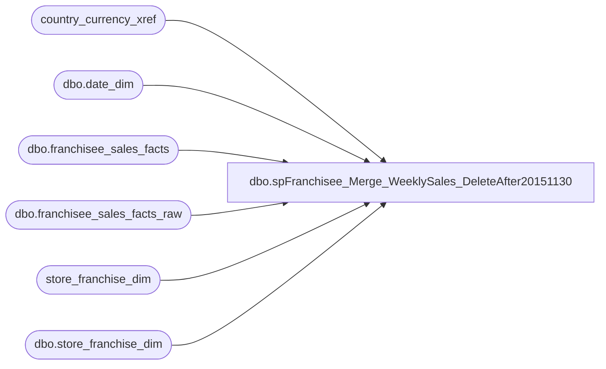

# dbo.spFranchisee_Merge_WeeklySales_DeleteAfter20151130

**Database:** dw  
**Server:** papamart  

## Architecture Diagram



## Table Dependencies

| Referenced Table |
|---|
| country_currency_xref |
| dbo.date_dim |
| dbo.franchisee_sales_facts |
| dbo.franchisee_sales_facts_raw |
| store_franchise_dim |
| dbo.store_franchise_dim |

## Stored Procedure Code

```sql
CREATE PROC [dbo].[spFranchisee_Merge_WeeklySales]
-- =============================================================================================================
-- Name: [spFranchisee_Insert_WeeklySales]
--
-- Description:	use RAW table to insert/update the fact table, return # of rows affected
--
-- Revision History
--		Name:			Date:			Comments:
--		Kevin Shyr		12/10/2014		CREATED
-- =============================================================================================================
AS
BEGIN
	SET NOCOUNT ON
	DECLARE @CntRowsInserted INT
		, @CntRowsUpdated INT
		, @CntRowsDeleted INT
	/****************  Working with raw data  *********************/
	-- Update WeekEndingDateKey
	UPDATE fsfr
	SET week_ending_date_key = weekendkey.WeekEndingDateKey
	--SELECT COUNT(*)
	FROM dbo.franchisee_sales_facts_raw fsfr
		INNER JOIN (SELECT week_id 
						, actual_date
					FROM dbo.date_dim WITH(NOLOCK)
		) dateweek
			ON CAST(CONVERT(varchar(10),fsfr.WeekEndingDateRaw,101) AS smalldatetime) = dateweek.actual_date
		INNER JOIN (SELECT week_id
						, MAX(date_key) AS WeekEndingDateKey
					FROM dbo.date_dim WITH(NOLOCK)
					GROUP BY week_id
		) weekendkey
			ON dateweek.week_id = weekendkey.week_id

	-- Update store_key and currency_key
	UPDATE fsfr
	SET franchisee_store_key = s.store_key
		, currency_key = cc.currency_key
	-- SELECT COUNT(*)
	FROM dbo.franchisee_sales_facts_raw fsfr
		INNER JOIN store_franchise_dim s WITH(NOLOCK)
			ON s.store_id = SUBSTRING(fsfr.StoreNameRaw, CHARINDEX('#', fsfr.StoreNameRaw) + 1, CHARINDEX(' ', fsfr.StoreNameRaw) - CHARINDEX('#', fsfr.StoreNameRaw) - 1)
		LEFT OUTER JOIN country_currency_xref cc WITH(NOLOCK)
			ON cc.country_code = s.country
	WHERE ISNULL(fsfr.StoreNameRaw, '') <> ''

	-- Select good records
	UPDATE fsfr
	SET IsGoodRecord = 1
	-- SELECT COUNT(*)
	FROM dbo.franchisee_sales_facts_raw fsfr
		INNER JOIN (SELECT Min(RawRecordID) AS RawRecordID
						, franchisee_store_key
						, week_ending_date_key
						, currency_key
					FROM dbo.franchisee_sales_facts_raw r WITH(NOLOCK)
					WHERE franchisee_store_key IS NOT NULL
						AND week_ending_date_key IS NOT NULL
						AND currency_key IS NOT NULL
					GROUP BY franchisee_store_key
						, week_ending_date_key
						, currency_key
		) g
			ON fsfr.RawRecordID = g.RawRecordID

	-- Delete records that were removed
	--SELECT sfd.store_id, dd.actual_date, fsf.* INTO dbo.franchisee_sales_facts_DeletionBackup_DeleteAfter20151130
	DELETE fsf
	FROM dbo.franchisee_sales_facts fsf
		INNER JOIN dbo.store_franchise_dim sfd WITH(READCOMMITTED)
			ON fsf.franchisee_store_key = sfd.store_key
		INNER JOIN dbo.date_dim dd WITH(READCOMMITTED)
			ON fsf.week_ending_date_key = dd.date_key
		LEFT OUTER JOIN dbo.franchisee_sales_facts_raw fsfr WITH(READCOMMITTED)
			ON fsf.franchisee_store_key = fsfr.franchisee_store_key
				AND fsf.week_ending_date_key = fsfr.week_ending_date_key
	WHERE fsfr.franchisee_store_key IS NULL
		AND (sfd.store_id NOT LIKE 'DE%') -- exclude Germany, we determined that Denmark should be deleted
	--ORDER BY sfd.store_id, dd.actual_date
	SELECT @CntRowsDeleted = @@ROWCOUNT
	--PRINT CAST(@CntRowsDeleted AS VARCHAR(10)) + ' updated'

	-- Update changed records
	UPDATE fsf
	SET [currency_key] = fsfr.[currency_key]
		, [total_sales] = fsfr.[total_sales]
		, [sales_plan] = fsfr.[sales_plan]
		, [transaction_count] = fsfr.[transaction_count]
		, [footware_sales] = fsfr.[footware_sales]
		, [footware_units] = fsfr.[footware_units]
		, [sound_sales] = fsfr.[sound_sales]
		, [sound_units] = fsfr.[sound_units]
		, [unstuffed_sales] = fsfr.[unstuffed_sales]
		, [unstuffed_units] = fsfr.[unstuffed_units]
		, [party_sales] = fsfr.[party_sales]
		, [party_count] = fsfr.[party_count]
		, [gift_card_sales] = fsfr.[gift_card_sales]
		, [gift_card_units] = fsfr.[gift_card_units]
		, [accessories_sales] = fsfr.[accessories_sales]
		, [accessories_units] = fsfr.[accessories_units]
		, [clothes_sales] = fsfr.[clothes_sales]
		, [clothes_units] = fsfr.[clothes_units]
		, [sports_sales] = fsfr.[sports_sales]
		, [sports_units] = fsfr.[sports_units]
		, [prestuffed_sales] = fsfr.[prestuffed_sales] 
		, [prestuffed_units] = fsfr.[prestuffed_units]
		, coupons_and_discounts = fsfr.coupons_and_discounts
		, [RETURNS] = fsf.[RETURNS]
		, giftcards_redeemed = fsfr.giftcards_redeemed
		, exchange_rate = fsfr.exchange_rate 
		, withholding_tax_rate = fsfr.withholding_tax_rate
	-- SELECT COUNT(*)
	FROM dbo.franchisee_sales_facts fsf
		INNER JOIN dbo.franchisee_sales_facts_raw fsfr WITH(READCOMMITTED)
			ON fsf.franchisee_store_key = fsfr.franchisee_store_key
				AND fsf.week_ending_date_key = fsfr.week_ending_date_key
				AND fsfr.IsGoodRecord = 1
	WHERE (fsf.[currency_key] <> fsfr.[currency_key]
		OR fsf.[total_sales] <> fsfr.[total_sales]
		OR fsf.[sales_plan] <> fsfr.[sales_plan]
		OR fsf.[transaction_count] <> fsfr.[transaction_count]
		OR fsf.[footware_sales] <> fsfr.[footware_sales]
		OR fsf.[footware_units] <> fsfr.[footware_units]
		OR fsf.[sound_sales] <> fsfr.[sound_sales]
		OR fsf.[sound_units] <> fsfr.[sound_units]
		OR fsf.[unstuffed_sales] <> fsfr.[unstuffed_sales]
		OR fsf.[unstuffed_units] <> fsfr.[unstuffed_units]
		OR fsf.[party_sales] <> fsfr.[party_sales]
		OR fsf.[party_count] <> fsfr.[party_count]
		OR fsf.[gift_card_sales] <> fsfr.[gift_card_sales]
		OR fsf.[gift_card_units] <> fsfr.[gift_card_units]
		OR fsf.[accessories_sales] <> fsfr.[accessories_sales]
		OR fsf.[accessories_units] <> fsfr.[accessories_units]
		OR fsf.[clothes_sales] <> fsfr.[clothes_sales]
		OR fsf.[clothes_units] <> fsfr.[clothes_units]
		OR fsf.[sports_sales] <> fsfr.[sports_sales]
		OR fsf.[sports_units] <> fsfr.[sports_units]
		OR fsf.[prestuffed_sales] <> fsfr.[prestuffed_sales] 
		OR fsf.[prestuffed_units] <> fsfr.[prestuffed_units]
		OR fsf.coupons_and_discounts <> fsfr.coupons_and_discounts
		OR fsf.[RETURNS] <> fsf.[RETURNS]
		OR fsf.giftcards_redeemed <> fsfr.giftcards_redeemed
		OR fsf.exchange_rate <> fsfr.exchange_rate 
		OR fsf.withholding_tax_rate <> fsfr.withholding_tax_rate)
	
	SELECT @CntRowsUpdated = @@ROWCOUNT
	--PRINT CAST(@CntRowsUpdated AS VARCHAR(10)) + ' updated'
	
	INSERT INTO [dbo].[franchisee_sales_facts]
		([week_ending_date_key]
		,[franchisee_store_key]
		,[currency_key]
		,[total_sales]
		,[sales_plan]
		,[transaction_count]
		,[footware_sales]
		,[footware_units]
		,[sound_sales]
		,[sound_units]
		,[unstuffed_sales]
		,[unstuffed_units]
		,[party_sales]
		,[party_count]
		,[gift_card_sales]
		,[gift_card_units]
		,[accessories_sales]
		,[accessories_units]
		,[clothes_sales]
		,[clothes_units]
		,[sports_sales]
		,[sports_units]
		,[prestuffed_sales]
		,[prestuffed_units]
		,coupons_and_discounts
		,[RETURNS]
		,giftcards_redeemed
		,exchange_rate
		,withholding_tax_rate)
	SELECT fsfr.[week_ending_date_key]
		, fsfr.[franchisee_store_key]
		, fsfr.[currency_key]
		, fsfr.[total_sales]
		, fsfr.[sales_plan]
		, fsfr.[transaction_count]
		, fsfr.[footware_sales]
		, fsfr.[footware_units]
		, fsfr.[sound_sales]
		, fsfr.[sound_units]
		, fsfr.[unstuffed_sales]
		, fsfr.[unstuffed_units]
		, fsfr.[party_sales]
		, fsfr.[party_count]
		, fsfr.[gift_card_sales]
		, fsfr.[gift_card_units]
		, fsfr.[accessories_sales]
		, fsfr.[accessories_units]
		, fsfr.[clothes_sales]
		, fsfr.[clothes_units]
		, fsfr.[sports_sales]
		, fsfr.[sports_units]
		, fsfr.[prestuffed_sales]
		, fsfr.[prestuffed_units]
		, fsfr.coupons_and_discounts
		, fsfr.[RETURNS]
		, fsfr.giftcards_redeemed
		, fsfr.exchange_rate
		, fsfr.withholding_tax_rate
	FROM dbo.franchisee_sales_facts_raw fsfr WITH(NOLOCK)
		LEFT OUTER JOIN dbo.franchisee_sales_facts fsf WITH(NOLOCK)		
			ON fsf.franchisee_store_key = fsfr.franchisee_store_key
				AND fsf.week_ending_date_key = fsfr.week_ending_date_key
	WHERE fsfr.IsGoodRecord = 1
		AND fsf.franchisee_store_key IS NULL

	SELECT @CntRowsInserted = @@ROWCOUNT
	--PRINT CAST(@CntRowsInserted AS VARCHAR(10)) + ' inserted'

	SELECT 3 -- ISNULL(@CntRowsInserted, 0) + ISNULL(@CntRowsUpdated, 0) + ISNULL(@CntRowsDeleted, 0)
END
```

