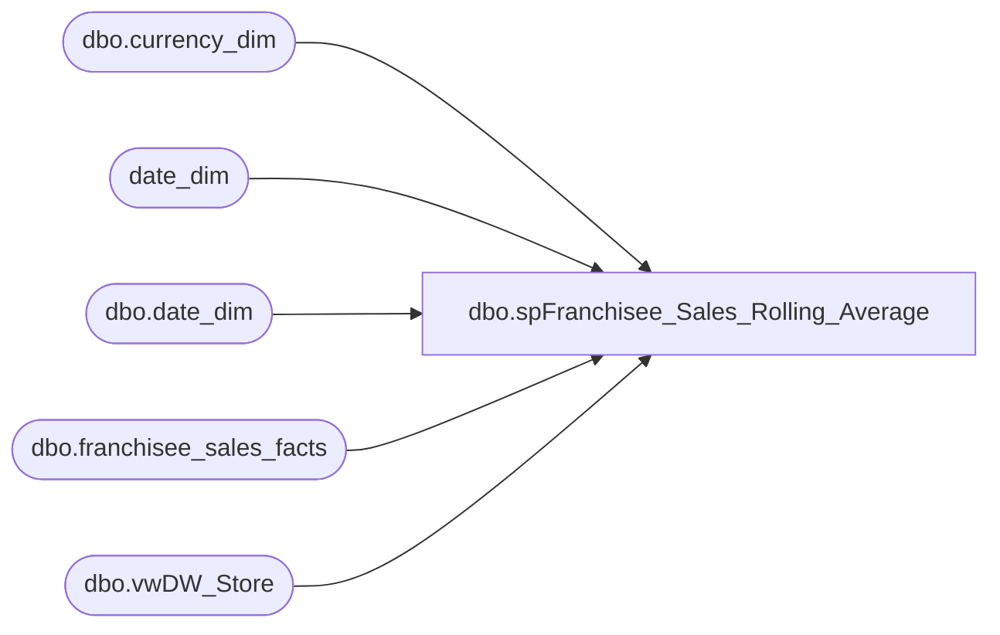

# dbo.spFranchisee_Sales_Rolling_Average

**Database:** dw  
**Server:** papamart  

## Architecture Diagram



## Table Dependencies

| Referenced Table |
|---|
| dbo.currency_dim |
| date_dim |
| dbo.date_dim |
| dbo.franchisee_sales_facts |
| dbo.vwDW_Store |

## Stored Procedure Code

```sql
-- =============================================================================================================
-- Name: spFranchisee_Sales_Rolling_Average
--
-- Description:	
--		This procedure will extract the franchisee sales for a week and include a rolling 4 week average
--
-- Input:
--		@thisWeek			int	
--			The date key for the current week
--
-- Output: 
--		A recordset containin the information
--
-- Dependencies: 
--
-- EXAMPLE:
--		 exec dw.dbo.spFranchisee_Sales_Rolling_Average 5166
--
-- Revision History
--		Name:				Date:			Comments:
--		Gary Murrish		12/30/2010		created
-- =============================================================================================================
CREATE PROCEDURE [dbo].[spFranchisee_Sales_Rolling_Average] 
	-- Add the parameters for the stored procedure here
    @thisWeek int = 5166
AS
BEGIN
	-- SET NOCOUNT ON added to prevent extra result sets from
	-- interfering with SELECT statements.
    SET NOCOUNT ON ;

    DECLARE @thisWeekID int
    DECLARE @priorWeek int
    DECLARE @RSStartWeek int
    DECLARE @thisWeekDate datetime
    DECLARE @priorWeekDate datetime
    DECLARE @RSStartWeekDate datetime
    DECLARE @thisWeek_WeekNum varchar(10)

    SET @thisWeekID = (SELECT
                           week_id
                       FROM
                           date_dim WITH (NOLOCK)
                       WHERE
                       date_key = @thisWeek)
    SET @thisWeek_WeekNum = (SELECT
                                 '''' + RIGHT(CAST(fiscal_year AS varchar), 2) + ' W' + RIGHT('0' + CAST(fiscal_week AS varchar), 2)
                             FROM
                                 dbo.date_dim WITH (NOLOCK)
                             WHERE
                             date_key = @thisWeek)
    SET @priorWeek = (SELECT
                          MAX(date_key)
                      FROM
                          date_dim WITH (NOLOCK)
                      WHERE
                      week_id = @thisweekID - 1)
    SET @RSStartWeek = (SELECT
                            MAX(date_key)
                        FROM
                            date_dim WITH (NOLOCK)
                        WHERE
                        week_id = @thisweekID - 4)
    SET @thisWeekDate = (SELECT
                             actual_date
                         FROM
                             date_dim WITH (NOLOCK)
                         WHERE
                         date_key = @thisWeek)
    SET @priorWeekDate = (SELECT
                              actual_date
                          FROM
                              date_dim WITH (NOLOCK)
                          WHERE
                          date_key = @priorWeek)
    SET @RSStartWeekDate = (SELECT
                                actual_date
                            FROM
                                dbo.date_dim WITH (NOLOCK)
                            WHERE
                            date_key = @RSStartWeek)


    SELECT --TOP 10
        @thisWeekDate AS thisWeekDate
       ,@priorWeekDate AS priorWeekDate
       ,@RSStartWeekDate AS StartWeekDate
       ,@thisWeek_WeekNum AS FiscalWeekDisplay
       ,STO.storeNameNum
       ,STO.region
       ,sto.BearRange
       ,sto.bearritory
       ,CURR.currency_code
       ,FSF.week_ending_date_key
       ,FSF.franchisee_store_key
       ,FSF.currency_key
       ,fsf.total_sales
       ,FSF_RA.RA_total_sales
       ,fsf.footware_sales
       ,FSF.footware_units
       ,FSF_RA.RA_footware_sales
       ,fsf.sound_sales
       ,FSF.sound_units
       ,FSF_RA.RA_sound_sales
       ,fsf.unstuffed_sales
       ,FSF.unstuffed_units
       ,FSF_RA.RA_unstuffed_sales
       ,FSF.party_sales
       ,FSF.party_count
       ,FSF_RA.RA_party_sales
       ,FSF.gift_card_sales
       ,FSF.gift_card_units
       ,FSF_RA.RA_gift_card_sales
       ,FSF.accessories_sales
       ,fsf.accessories_units
       ,FSF_RA.RA_accessories_sales
       ,FSF.clothes_sales
       ,fsf.clothes_units
       ,FSF_RA.RA_clothes_sales
       ,FSF.sports_sales
       ,FSF.sports_units
       ,FSF_RA.RA_sports_sales
       ,FSF.prestuffed_sales
       ,FSF.prestuffed_units
       ,FSF_RA.RA_prestuffed_sales
       ,FSF.coupons_and_discounts
       ,FSF_RA.RA_coupons_and_discounts
       ,FSF.[returns]
       ,FSF_RA.RA_returns
       ,FSF.giftcards_redeemed
       ,FSF_RA.RA_giftcards_redeemed
    FROM
        dbo.franchisee_sales_facts FSF WITH (NOLOCK)
    LEFT JOIN dbo.vwDW_Store STO WITH (NOLOCK)
        ON FSF.franchisee_store_key = sto.store_key
    LEFT JOIN dbo.currency_dim CURR WITH (NOLOCK)
        ON CURR.currency_key = FSF.currency_key
    LEFT JOIN (SELECT
                   franchisee_store_key
                  ,SUM(total_sales) / COUNT(total_sales) AS RA_total_sales
                  ,SUM(footware_sales) / COUNT(footware_sales) AS RA_footware_sales
                  ,SUM(sound_sales) / COUNT(sound_sales) AS RA_sound_sales
                  ,SUM(unstuffed_sales) / COUNT(unstuffed_sales) AS RA_unstuffed_sales
                  ,SUM(party_sales) / COUNT(party_sales) AS RA_party_sales
                  ,SUM(gift_card_sales) / COUNT(gift_card_sales) AS RA_gift_card_sales
                  ,SUM(accessories_sales) / COUNT(accessories_sales) AS RA_accessories_sales
                  ,SUM(clothes_sales) / COUNT(clothes_sales) AS RA_clothes_sales
                  ,SUM(sports_sales) / COUNT(sports_sales) AS RA_sports_sales
                  ,SUM(prestuffed_sales) / COUNT(prestuffed_sales) AS RA_prestuffed_sales
                  ,SUM(coupons_and_discounts) / COUNT(coupons_and_discounts) AS RA_coupons_and_discounts
                  ,SUM([returns]) / COUNT([returns]) AS RA_returns
                  ,SUM(giftcards_redeemed) / COUNT(giftcards_redeemed) AS RA_giftcards_redeemed
               FROM
                   dbo.franchisee_sales_facts FCT WITH (NOLOCK)
               WHERE
               week_ending_date_key BETWEEN @RSStartWeek
               AND @priorWeek
               GROUP BY
                   franchisee_store_key) AS FSF_RA
        ON FSF.franchisee_store_key = FSF_RA.franchisee_store_key
    WHERE
    week_ending_date_key = @thisWeek


END
```

