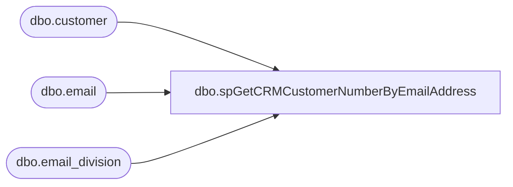

# dbo.spGetCRMCustomerNumberByEmailAddress

**Database:** dw  
**Server:** papamart  

## Architecture Diagram



## Table Dependencies

| Referenced Table |
|---|
| dbo.customer |
| dbo.email |
| dbo.email_division |

## Stored Procedure Code

```sql
CREATE PROCEDURE [dbo].[spGetCRMCustomerNumberByEmailAddress]
	@EmailAddress VARCHAR(100)

-- =============================================================================================================
-- Name: spGetCRMCustomerNumberByEmailAddress
--
-- Description:	Get CRM Customer Number by Email Address
--	
-- Output: CRM Customer Number
--	
-- Available actions:
--	
-- Dependencies: 
--		[crm].[dbo].[customer]

-- Revision History
--		Name:			Date:			Comments:
--		Ben Barud		07/26/2017		Creation
--		Ben Barud		11/14/2018		Updated for CRM Upgrade 	
-- =============================================================================================================

AS
BEGIN
	-- SET NOCOUNT ON added to prevent extra result sets from
	-- interfering with SELECT statements.
	SET NOCOUNT ON;

 --   SELECT TOP 1 customer_no
	--FROM [CRMISE02].[mw].[dbo].[customer]
	--WHERE email_address = @EmailAddress
	--ORDER BY last_update_date DESC

	SELECT TOP 1 customer_no
	FROM [stl-crmdb-p-01].[crm].[dbo].[email] e
	INNER JOIN [stl-crmdb-p-01].[crm].[dbo].[email_division] ed ON e.email_id = ed.email_id AND e.customer_id = ed.customer_id
	INNER JOIN [stl-crmdb-p-01].[crm].[dbo].[customer] c ON e.customer_id = c.customer_id
	WHERE e.email_address = @EmailAddress AND ed.division_id = 89
	ORDER BY e.email_id DESC
END
```

