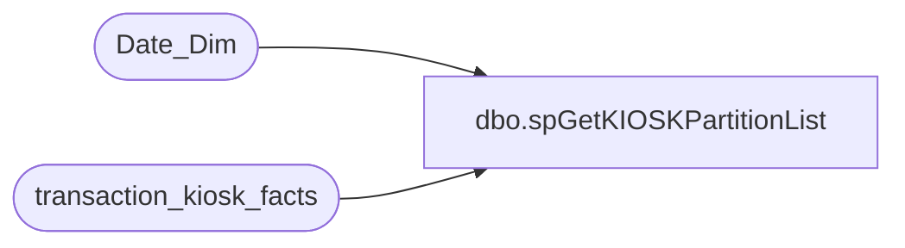

# dbo.spGetKIOSKPartitionList

**Database:** dw  
**Server:** papamart  

## Architecture Diagram



## Table Dependencies

| Referenced Table |
|---|
| Date_Dim |
| transaction_kiosk_facts |

## Stored Procedure Code

```sql
CREATE proc [dbo].[spGetKIOSKPartitionList]
as

declare @w_SQL				as varchar(8000)
	, @w_CurrentPeriod_ID	as int

set @w_SQL = 'SELECT [dbo].[vwDW_fact_kiosk].[customer_geography_key]
					,[dbo].[vwDW_fact_kiosk].[customer_demographics_key]
					,[dbo].[vwDW_fact_kiosk].[store_key]
					,[dbo].[vwDW_fact_kiosk].[date_key]
					,[dbo].[vwDW_fact_kiosk].[guest_type_key]
					,[dbo].[vwDW_fact_kiosk].[purpose_key]
					,[dbo].[vwDW_fact_kiosk].[product_key]
					,[dbo].[vwDW_fact_kiosk].[transaction_id]
					FROM [dbo].[vwDW_fact_kiosk]  
					WHERE date_key between @p_StartKey and @p_EndKey'

select @w_CurrentPeriod_ID = Period_ID
	from Date_Dim
	where convert(char(10),getDate(),112) = convert(char(10),Actual_date,112)

SELECT 'BAB DW' AS DataSourceID
	, 'Papa Mart' AS CubeName
	, 'Papa Mart' AS CubeID
	, 'Kiosk Facts' AS MeasureGroup
	, 'Vw DW Fact Kiosk' AS MeasureGroupID
	, 'kiosk_' + CAST(dd.fiscal_year AS varchar) + '_' + RIGHT('0' + CAST(dd.fiscal_period AS varchar), 2) as Partition
	, replace(replace(@w_SQL,'@p_StartKey',min(dd.Date_Key)),'@p_EndKey',max(dd.Date_Key)) as SQL
	, min(dd.Date_Key) as min_date_key
	, max(dd.Date_Key) as max_date_key
	, max(case when dd.period_id > @w_CurrentPeriod_ID - 12 then 1 else 0 end) as ProcessFlag
	, 2000000 as EstimatedRows
	, 'AggregationDesign' as AggregationDesignID
	from date_dim dd
	where dd.Fiscal_Year >= datePart(year,dateAdd(year,-3,getDate()))
	group by dd.Fiscal_Year
		, dd.Fiscal_Period
	having exists (select * from transaction_kiosk_facts tkf 
						where tkf.Date_Key between min(dd.Date_Key) and max(dd.Date_Key))
	order by min_date_key
```

