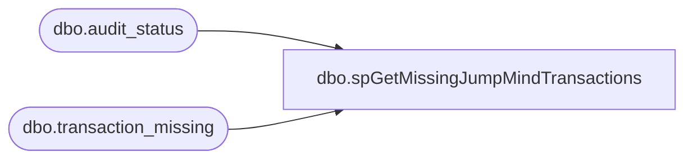

# dbo.spGetMissingJumpMindTransactions

**Database:** dw  
**Server:** papamart  

## Architecture Diagram



## Table Dependencies

| Referenced Table |
|---|
| dbo.audit_status |
| dbo.transaction_missing |

## Stored Procedure Code

```sql
CREATE PROCEDURE [dbo].[spGetMissingJumpMindTransactions]

-- =============================================================================================================
-- Name: spGetMissingJumpMindTransactions 
--
-- Description:	Get's Missing JumpMind transactions for alerts and reprocessing
--	
-- Output: 
--	
-- Available actions:
--	
-- Dependencies: 
--		
-- Revision History
--		Name:			Date:			Comments:
--		Ben Barud		03/01/2024		Creation
--		Ben Barud		08/31/2024		Updated logic to pull from JMC_sls_trans instead of Silver Data Lake
--		Ben Barud		09/02/2024	    Updated logic to calculate transaction numbers instead of querying Jumpmind_sls_trans
-- =============================================================================================================

AS
BEGIN
	-- SET NOCOUNT ON added to prevent extra result sets from
	-- interfering with SELECT statements.
	SET NOCOUNT ON;

    -- Insert statements for procedure here
	IF (Object_ID('tempdb..##misstransqty') IS NOT NULL) DROP TABLE ##misstransqty
	SELECT CONVERT (VARCHAR(5),audit_status.store_no) AS Store
		,CONVERT (VARCHAR(3),audit_status.register_no) AS WS
		,REPLACE(CONVERT(VARCHAR(11), audit_status.sales_date, 102), '.', '') AS Sales_Date
		,CONVERT (VARCHAR(14),from_transaction_no) AS from_Trans_No
		,CONVERT (VARCHAR(12),to_transaction_no) AS to_Trans_No
		,CONVERT (VARCHAR(7),(to_transaction_no+1) - from_transaction_no) AS Total_Trans
		,CASE
			WHEN LEN(audit_status.store_no) = 4 THEN CAST(audit_status.store_no AS VARCHAR(4)) + '-' + RIGHT('000' + CAST(audit_status.register_no AS VARCHAR(3)), 3)
			ELSE '1' + RIGHT('000' + CAST(audit_status.store_no AS VARCHAR(3)), 3) + '-' + RIGHT('000' + CAST(audit_status.register_no AS VARCHAR(3)), 3)
		   END device_id
	INTO ##misstransqty
	FROM bedrockdb01.auditworks.dbo.audit_status,bedrockdb01.auditworks.dbo.transaction_missing
	WHERE audit_status.missing_qty > 0
	AND audit_status.missing_qty < 20000
	AND verified = 0
	and sa_reject_qty = 0
	and if_reject_qty = 0
	and audit_status.register_no not in (21,22,23,24,1000)
	AND audit_status.store_no = transaction_missing.store_no
	AND audit_status.register_no = transaction_missing.register_no
	AND audit_status.sales_date = transaction_missing.sales_date
	ORDER BY audit_status.store_no

	--SELECT * FROM ##misstransqty

	DELETE FROM ##misstransqty WHERE Store = 238 AND to_Trans_No < 8054

	IF (Object_ID('tempdb..#jm') IS NOT NULL) DROP TABLE #jm
	CREATE TABLE #jm
	(
	  device_id VARCHAR(8)
	 ,business_date VARCHAR(8)
	 ,sequence_number VARCHAR(6)
	 ,business_unit_id VARCHAR(4)
	 --,JMTransactionCount INT
	 ,Store VARCHAR(4)
	 ,Register VARCHAR(4)
	 ,from_Trans_No VARCHAR(6)
	 ,to_Trans_No VARCHAR(6)
	)

	DECLARE @currDevice_Id AS VARCHAR(8), @currFrom_Trans_No AS VARCHAR(6), @currTo_Trans_No AS VARCHAR(6), @currSales_Date AS VARCHAR(8), @currStore AS VARCHAR(4), @currRegister AS VARCHAR(4)
	WHILE (SELECT COUNT(*) FROM ##misstransqty) > 0
	BEGIN
	  SELECT TOP 1 @currDevice_Id = device_id, @currFrom_Trans_No = from_Trans_No, @currTo_Trans_No = to_Trans_No, @currSales_Date = Sales_Date, @currStore = Store, @currRegister = WS  FROM ##misstransqty

	  --INSERT INTO #jm (device_id, business_date, sequence_number, business_unit_id, Store, JMTransactionCount, Register, from_Trans_No, to_Trans_No)
	  --SELECT device_id, @currSales_Date, trans_nbr, business_unit_id, @currStore, 1, @currRegister, @currFrom_Trans_No, @currTo_Trans_No
	  ----FROM SILVERDELTALAKE.silverdeltalake.dbo.JumpMind_sls_trans
	  --FROM dw.dbo.JMC_sls_trans WITH(NOLOCK)
	  --WHERE device_id = @currDevice_Id
			--AND business_date = @currSales_Date
			--AND trans_nbr BETWEEN @currFrom_Trans_No AND @currTo_Trans_No

	  --IF (SELECT COUNT(*) FROM #jm WHERE device_id = @currDevice_Id AND business_date = @currSales_Date AND sequence_number BETWEEN @currFrom_Trans_No AND @currTo_Trans_No) = 0
	  --BEGIN
	  --  INSERT INTO #jm (device_id, business_date, sequence_number, business_unit_id, Store, JMTransactionCount, Register, from_Trans_No, to_Trans_No)
	  --  SELECT device_id, business_date, sequence_number, business_unit_id, @currStore, 1, @currRegister, @currFrom_Trans_No, @currTo_Trans_No
	  --  FROM SILVERDELTALAKE.silverdeltalake.dbo.JumpMind_sls_trans_summary WITH(NOLOCK)
	  --  WHERE device_id = @currDevice_Id
		 -- 	  AND business_date = @currSales_Date
			--  AND sequence_number BETWEEN @currFrom_Trans_No AND @currTo_Trans_No
	  --END

	  --IF (SELECT COUNT(*) FROM #jm WHERE device_id = @currDevice_Id AND business_date = @currSales_Date AND sequence_number BETWEEN @currFrom_Trans_No AND @currTo_Trans_No) = 0
	  BEGIN
		DECLARE @diff AS INT, @tmpTrans_no AS INT
		--SELECT @diff
		SELECT @diff = CAST(@currTo_Trans_No AS INT) - CAST(@currFrom_Trans_No AS INT)
		SELECT @tmpTrans_no = CAST(@currFrom_Trans_No AS INT)

		
		WHILE @diff > 0
		BEGIN
		  --INSERT INTO #jm (device_id, business_date, sequence_number, business_unit_id, JMTransactionCount, Store, Register, from_Trans_No, to_Trans_No)
		  INSERT INTO #jm (device_id, business_date, sequence_number, business_unit_id, Store, Register, from_Trans_No, to_Trans_No)
		  VALUES (@currDevice_Id, @currSales_Date, @tmpTrans_no, LEFT(@currDevice_Id, 4), @currStore, @currRegister, @currFrom_Trans_No, @currTo_Trans_No)
		  
		  SELECT @diff = @diff - 1
		  SELECT @tmpTrans_no = @tmpTrans_no + 1
		END
		--INSERT INTO #jm (device_id, business_date, sequence_number, business_unit_id, JMTransactionCount, Store, Register, from_Trans_No, to_Trans_No)
		INSERT INTO #jm (device_id, business_date, sequence_number, business_unit_id, Store, Register, from_Trans_No, to_Trans_No)
		--VALUES (@currDevice_Id, @currSales_Date, @currTo_Trans_No, LEFT(@currDevice_Id, 4), 0, @currStore, @currRegister, @currFrom_Trans_No, @currTo_Trans_No)
		VALUES (@currDevice_Id, @currSales_Date, @currTo_Trans_No, LEFT(@currDevice_Id, 4), @currStore, @currRegister, @currFrom_Trans_No, @currTo_Trans_No)
	  END 

	  DELETE FROM ##misstransqty
	  WHERE device_id = @currDevice_Id AND from_Trans_No = @currFrom_Trans_No AND to_Trans_No = @currTo_Trans_No AND Sales_Date = @currSales_Date
	END

	SELECT * FROM #jm
	ORDER BY business_date, CAST(Store AS INT)
END
```

