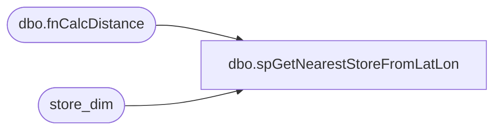

# dbo.spGetNearestStoreFromLatLon

**Database:** dw  
**Server:** papamart  

## Architecture Diagram



## Table Dependencies

| Referenced Table |
|---|
| dbo.fnCalcDistance |
| store_dim |

## Stored Procedure Code

```sql
--declare @store1 int
--execute spGetNearestStoreFromLatLon 38.6300, -90.3400, '1/16/03', @store = @store1 output
--select @store1

--drop procedure spGetNearestStoreFromLatLon

CREATE      procedure dbo.spGetNearestStoreFromLatLon(

@Lat float(15), @Lon float(15), @Today datetime,
@store int output

)

AS

BEGIN
--DECLARE @Zip char(10)
--DECLARE @Lat float(15)
--DECLARE @Lon float(15)
 
--SET @Lat=38.6300
--SET @Lon=-90.3400
--SET @Zip=left(ltrim('12345-1234'),5)
 
--SELECT @Lat = ud.Latitude, @Lon = ud.Longitude
--FROM PRIZM..tblUSDist ud
--WHERE ud.srecordtype='Z'
--AND ud.Zip=@Zip
 
select @Store=s.store_id
from store_dim s 
where s.store_id > 0 and s.store_id < 2000 and s.store_id!=13
and s.Opening_Date <= @Today
and (s.Closing_date > @Today or s.Closing_date is NULL)
and abs((dw.dbo.fnCalcDistance(@Lat, @Lon, s.latitude, s.longitude)-
            (select min(dw.dbo.fnCalcDistance(@Lat, @Lon, s.latitude, s.longitude))
	            from store_dim s 
	            where s.store_id > 0 and s.store_id < 2000 and s.store_id != 13
	            and s.Opening_date <= @Today
				and (s.Closing_date > @Today or s.Closing_date is NULL)
			))) < 0.1
 

END
```

