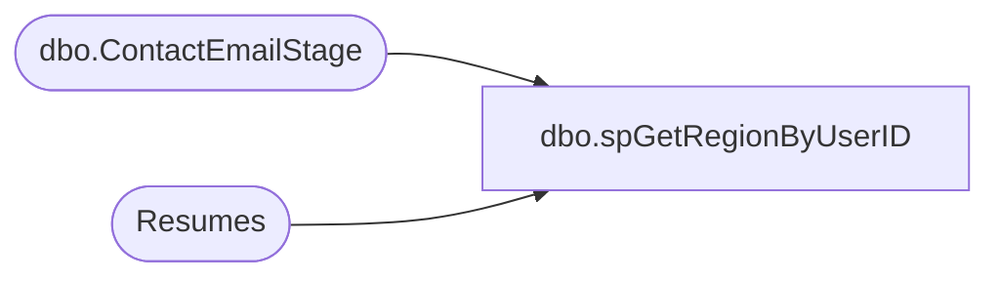

# dbo.spGetRegionByUserID

**Database:** dw  
**Server:** papamart  

## Architecture Diagram



## Table Dependencies

| Referenced Table |
|---|
| dbo.ContactEmailStage |
| Resumes |

## Stored Procedure Code

```sql
CREATE proc [dbo].[spGetRegionByUserID] 
@UserID varchar (100),
@StartDate date,
@EndDate date

as 

set nocount on

IF (Object_ID('tempdb..#StoreList') IS NOT null) DROP TABLE #StoreList
create table #StoreList (StoreNumber varchar(100))

insert #StoreList 
select distinct store 
from dwstaging.dbo.ContactEmailStage 
where substring(ContactEmail, 1, charindex('@', ContactEmail)-1) = @UserID

select distinct 
	case 
		when r.CareerType like '%UK%' or r.WorkshopID >= 2000 
			then 'UK' 
		else 'US' 
	end as Region
from Resumes r
join #StoreList s on cast(r.WorkShopID as varchar(10)) = cast(s.StoreNumber as varchar(10)) 
where cast(DateSaved as date) between @StartDate and @EndDate
UNION
select distinct  
	case 
		when r.CareerType like '%UK%' or state in ('APO/FPO - Europe, Canada, Africa, Middle East', 'n/a')
			then 'UK' 
		else 'US' 
	end as Region
from Resumes r
where r.WorkshopID is NULL 
and cast(DateSaved as date) between @StartDate and @EndDate
and case 
		when r.CareerType like '%UK%' or state in ('APO/FPO - Europe, Canada, Africa, Middle East', 'n/a')
			then 'UK' 
		else 'US' 
	end = case when @UserID = 'SibusisoS' then 'UK' else 'US' end
```

