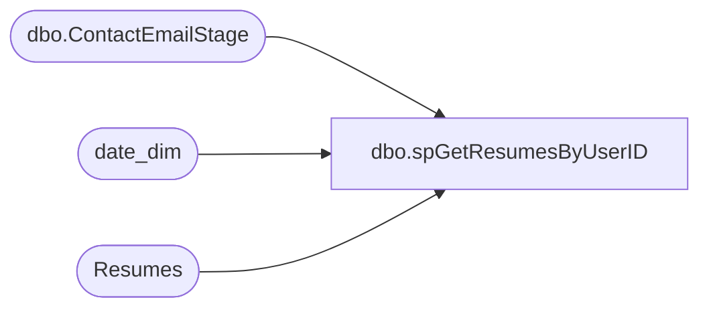

# dbo.spGetResumesByUserID

**Database:** dw  
**Server:** papamart  

## Architecture Diagram



## Table Dependencies

| Referenced Table |
|---|
| dbo.ContactEmailStage |
| date_dim |
| Resumes |

## Stored Procedure Code

```sql
CREATE proc [dbo].[spGetResumesByUserID] 
@UserID varchar (100)
--,
--@CareerType varchar(500),
--@State varchar(500)

as 

set nocount on

IF (Object_ID('tempdb..#StoreList') IS NOT null) DROP TABLE #StoreList
create table #StoreList (StoreNumber varchar(100))

insert #StoreList 
select distinct store 
from dwstaging.dbo.ContactEmailStage 
where substring(ContactEmail, 1, charindex('@', ContactEmail)-1) =@UserID


select 
	case 
		when r.CareerType like '%UK%' or r.WorkshopID >= 2000 
			then 'UK' 
		else 'US' 
	end as Region,
	r.CareerType,
	r.JobDepartment,
	r.Position,
	r.WorkShopID,
	r.FirstName,
	r.LastName,
	r.City,
	r.State,
	case r.WillingToRelocate when 0 then 'False' else 'True' end as WillingToRelocate,
	case WillingToTravel when 0 then 'False' else 'True' end as WillingToTravel,
	r.Reference,
	r.DateSaved,
--	cast(r.Resume as nvarchar(4000)) as Resume
	replace(replace(cast(r.Resume as nvarchar(4000)), '\\', 'http://'), '\', '/') as Resume
from Resumes r
join #StoreList s on cast(r.WorkShopID as varchar(10)) = cast(s.StoreNumber as varchar(10)) 
join date_dim dd on cast(r.DateSaved as date) = cast(dd.actual_date as date) 
UNION
select 
	case 
		when r.CareerType like '%UK%' or state in ('APO/FPO - Europe, Canada, Africa, Middle East', 'n/a')
			then 'UK' 
		else 'US' 
	end as Region,
	r.CareerType,
	r.JobDepartment,
	r.Position,
	'0' as WorkShopID,
	r.FirstName,
	r.LastName,
	r.City,
	r.State,
	case r.WillingToRelocate when 0 then 'False' else 'True' end as WillingToRelocate,
	case WillingToTravel when 0 then 'False' else 'True' end as WillingToTravel,
	r.Reference,
	r.DateSaved,
	--cast(r.Resume as nvarchar(4000)) as Resume
	replace(replace(cast(r.Resume as nvarchar(4000)), '\\', 'http://'), '\', '/') as Resume
from Resumes r
join date_dim dd on cast(r.DateSaved as date) = cast(dd.actual_date as date)
where r.WorkshopID is NULL 
and case 
		when r.CareerType like '%UK%' or state in ('APO/FPO - Europe, Canada, Africa, Middle East', 'n/a')
			then 'UK' 
		else 'US' 
	end = case when @UserID = 'SibusisoS' then 'UK' else 'US' end
```

