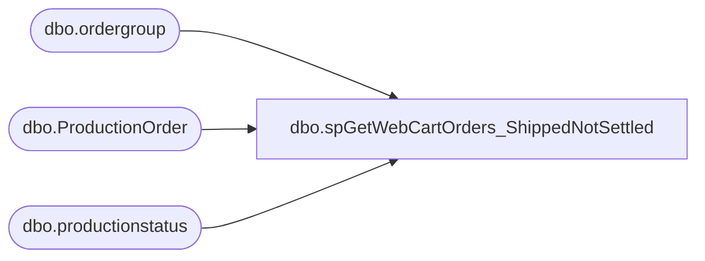

# dbo.spGetWebCartOrders_ShippedNotSettled

**Database:** dw  
**Server:** papamart  

## Architecture Diagram



## Table Dependencies

| Referenced Table |
|---|
| dbo.ordergroup |
| dbo.ProductionOrder |
| dbo.productionstatus |

## Stored Procedure Code

```sql
--exec spGetWebCartOrders_ShippedNotSettled
CREATE procedure  [dbo].[spGetWebCartOrders_ShippedNotSettled]
as

IF  EXISTS (SELECT * FROM dbo.sysobjects WHERE id = OBJECT_ID(N'[dbo].[tmpAWT_ShippedNotSettled]') AND OBJECTPROPERTY(id, N'IsUserTable') = 1)
DROP TABLE [dbo].[tmpAWT_ShippedNotSettled]

declare @dateToEnd smalldatetime

--UNSETTLED PROBLEM
select @dateToEnd=dateadd(minute, -150, getdate())

select order_status_code
	, SendToSettlement
	, productionorderdatetimeShipped
	, Convert(varchar(8), productionorderdatetimeShipped, 1) 
		+ ' ' 
		+ Cast(Datepart(hour, productionorderdatetimeShipped) as varchar(2)) 
		+ ':' 
		+ Cast(Datepart(minute, productionorderdatetimeShipped) as varchar(2)) 
		as DateTimeShipped
	, po.productionOrderNumber
	, og.order_number
	, og.SiteCode 
	--,og.*
	--, po.*
into tmpAWT_ShippedNotSettled
from bearwebdb.webcart_commerce.dbo.ordergroup og WITH(NOLOCK)
join Kodiak.BABWPMS.dbo.ProductionOrder po 
	on og.order_number=po.productionordernumber
join Kodiak.BABWPMS.dbo.productionstatus ps 
	on ps.productionorderid = po.productionorderid
where sendtosettlement not in (2,3)
	and productionstatusactive = 1
        and productionorderdatetimeShipped < @dateToEnd
        and productionstatusname in ('Completed','canceled')
order by sendtosettlement, productionorderdatetimeShipped

--select * from tmpAWT_ShippedNotSettled sns
-- join sheet1$ sa on left(sa.OrderNumber,7)=sns.order_number
-- where sns.SiteCode = 'BABW_UK'
--order by productionorderdatetimeShipped
```

