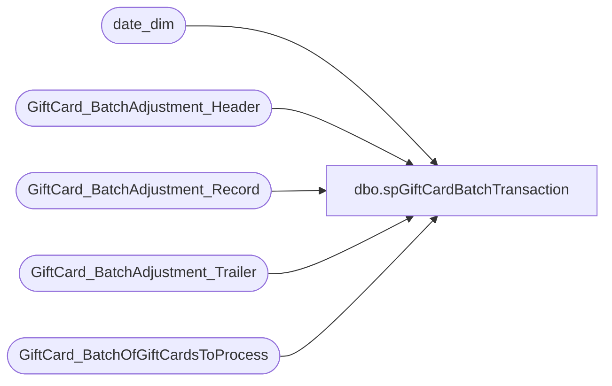

# dbo.spGiftCardBatchTransaction

**Database:** dw  
**Server:** papamart  

## Architecture Diagram



## Table Dependencies

| Referenced Table |
|---|
| date_dim |
| GiftCard_BatchAdjustment_Header |
| GiftCard_BatchAdjustment_Record |
| GiftCard_BatchAdjustment_Trailer |
| GiftCard_BatchOfGiftCardsToProcess |

## Stored Procedure Code

```sql
/*
2009/05/21
called valuelink looks like my last 2 attempts were pointing at test, must have somehow went to the wrong H: directory

dug up old emails and decided to include them here.  they were right, wrong ip address and wrong filename.  KASA00P = production KASA00Q= test
*/


/*
-- from an email dated 9/12/2008 11:17

Hi David,
 
Awesome! 
 
New implementation date is 9/23/08. The Live Alert has already been issued on my end. 
 
0100 – Activation -- CERTIFIED
0202 – Redemption, NSF-- CERTIFIED
0300 - Reload-- CERTIFIED
0460 – Balance Adjustment-- CERTIFIED
0501 – Report Lost/Stolen-- CERTIFIED
0600 – Cash out-- CERTIFIED
0800 – Void of Redemption-- CERTIFIED
0801 – Void of Reload-- CERTIFIED
0802 – Void of Activation -- CERTIFIED
3460 – Forced Adjustment-- CERTIFIED
 
In production, the BAJs will be scheduled to run at the following times – please confirm ASAP if these work for you.
 
11:10 AM EST
14:10 AM EST
17:10 AM EST
 
You may send multiple files a day (at least 5 minutes apart) and they will get processed at the times listed above. You should expect the BAJEX file about 30 min – 60 min after the run time. 
 
On 9/23, these are the production datasets:
KASA00P.GB.KASV#23B.PFTP001.BAJ
KASA00P.GB.NOPROCES.BLDABEAR.BAJEX 
Thank you!
 
Adriana Mize
Prepaid MTI
 954-227-6442 Direct
954-846-1521 Fax
 firstdata.com 
*/


/*

From: Davis, Judy D. [mailto:judy.d.davis@firstdata.com] 
Sent: Monday, November 26, 2007 9:01 AM
To: Jack McCormick
Subject: FW: FTP INSTRUCTIONS
 
Hello Jack,
Below is the information you will need to retrieve your Valuelink files. Please contact Idalia Nunez if you have questions regarding the file format. 
IP Addresses:  For testing use:  206.201.50.53       For Production use:  206.201.50.52
ID=CFTP135
Password= USE EXISTING
Note:  The FDMS file names must be in single quotes because we are a mainframe shop.
FTP COMMANDS
To retrieve a test file from FDMS:
At the ftp prompt, enter the following commands:
open 206.201.50.53
enter your id
enter your password
        get ‘KASA00Q.GB.KASV099R.NOPROCES.RECON(0)' _____ client file name____
        bye
To retrieve a production file from FDMS:
At the ftp prompt, enter the following commands:
open 206.201.50.52
enter your id
enter your password
        get ‘KASA00Q.GB.KASV099R.NOPROCES.RECON(0)' _____ client file name____
        bye
In an effort to improve the File Transmission process and provide more accurate Incident Reporting, please be advised that all problems or incidents related to a production file, must be reported to the Help Desk (800-555-9966).  
If the Help Desk cannot resolve the issue, they will document the issue and contact HFMS support personnel. This will provide quicker resolutions, ensure proper routing of incident tickets and greatly improve the accuracy of incident tracking reports. 
We appreciate your support and cooperation in this matter.
Judy Davis
First Data Commercial Services/HFMS
314-738-2709
judy.d.davis@firstdata.com


*/


-- 
-- 
-- IP Addresses:  For testing use:  206.201.50.53       For Production use:  206.201.50.52
-- 
-- ID=CFTP135
-- 
-- Password= USE EXISTING
-- 
-- i created a batch file called 
-- 
-- h:\baj\ftp_push.bat
-- 	ftp -s:ftp_push.txt 206.201.50.53
-- 
-- h:\baj\ftp_push.txt
-- 	cftp135
-- 	b1a3b5r
-- 	quote site rec=fb lr=300 blk=0
-- 	quote site dcbdsn='sys1.mdscb' cy pri=5 sec=5
-- 	put 'KASA00Q.GB.KASV#23B.PFTP001.BAJ(+1)'
-- 	quit
-- 
-- 0040020081781334462008178133446200817813344600010001BAJ    0300000100000                                                                                                                                                                                                                                   
-- 300000000097020300000000000000000000000010000                 000777700708641768600100+00000010000000000020081781334460000000000000000000000000000000Y0000000000N                bulk adjustment code                    0000000000000000840                                                               
-- 300000000097020300000000000000000000000010000                 000777700708642077600100+00000010000000000020081781334460000000000000000000000000000000Y0000000000N                bulk adjustment code                    0000000000000000840                                                               
-- 300000000097020300000000000000000000000010000                 000777700708643377000100+00000010000000000020081781334460000000000000000000000000000000Y0000000000N                bulk adjustment code                    0000000000000000840                                                               
-- 300000000097020300000000000000000000000010000                 000777700708644642700100+00000010000000000020081781334460000000000000000000000000000000Y0000000000N                bulk adjustment code                    0000000000000000840                                                               
-- 300000000097020300000000000000000000000010000                 000777700708645144600100+00000010000000000020081781334460000000000000000000000000000000Y0000000000N                bulk adjustment code                    0000000000000000840                                                               
-- 300000000097020300000000000000000000000010000                 000777700708646262200100+00000010000000000020081781334460000000000000000000000000000000Y0000000000N                bulk adjustment code                    0000000000000000840                                                               
-- 300000000097020300000000000000000000000010000                 000777700708647205400100+00000010000000000020081781334460000000000000000000000000000000Y0000000000N                bulk adjustment code                    0000000000000000840                                                               
-- 300000000097020300000000000000000000000010000                 000777700708648634300100+00000010000000000020081781334460000000000000000000000000000000Y0000000000N                bulk adjustment code                    0000000000000000840                                                               
-- 300000000097020300000000000000000000000010000                 000777700708649163800100+00000010000000000020081781334460000000000000000000000000000000Y0000000000N                bulk adjustment code                    0000000000000000840                                                               
-- 300000000097020300000000000000000000000010000                 000777700708650621800100+00000010000000000020081781334460000000000000000000000000000000Y0000000000N                bulk adjustment code                    0000000000000000840                                                               
-- 90000000010                                                                                                                                                                                                                                                                                                
-- 
-- -- test fdms data set name to send to:
-- -- 'KASA00Q.GB.KASV#23B.PFTP001.BAJ(+1)'
-- -- 
-- -- 'KASA00P.GB.NOPROCES.BLDABEAR.PTD(0)'
-- -- 'KASA00P.GB.NOPROCES.BLDABEAR.MPOX(0)'
-- -- 'KASA00P.GB.NOPROCES.BLDABEAR.DACT(0)'
-- -- 'KASA00P.GB.NOPROCES.BLDABEAR.HDSK(0)'
-- -- 'KASA00P.GB.NOPROCES.BLDBRWGC.DACT(0)'
-- -- 'KASA00P.GB.NOPROCES.BLDBRWGC.HDSK(0)'
-- -- 'KASA00P.GB.NOPROCES.BLABEUK.PTD(0)'
-- -- 'KASA00P.GB.NOPROCES.BLABEDK.PTD(0)'
-- -- 'KASA00P.GB.NOPROCES.BLABENS.PTD(0)'
-- -- 'KASA00P.GB.NOPROCES.BLABESN.PTD(0)'
-- -- 'KASA00P.GB.NOPROCES.BLDABEAR.PTD(23)'
-- -- 'KASA00P.GB.NOPROCES.BLABEUK.DACT(0)'
-- -- 'KASA00P.GB.NOPROCES.BLABEDK.DACT(0)'
-- -- 'KASA00P.GB.NOPROCES.BLABENS.DACT(0)'
-- -- 'KASA00P.GB.NOPROCES.BLABESN.DACT(0)'
-- -- 'KASA00P.GB.NOPROCES.BLDBEINC.DSR(0)'
-- -- 'KASA00P.GB.NOPROCES.BLDBEINC.HDSK(0)'
-- -- 'KASA00P.GB.NOPROCES.RIDEMAKE.PTD(0)'
-- 
-- 
-- -- select * from GiftCard_DeadDestroyCards where processed is not null
-- -- 
-- select * from GiftCard_BatchAdjustment_Header
-- select * from GiftCard_BatchAdjustment_Record
-- select * from GiftCard_BatchAdjustment_Trailer


-- @Echo Off
-- For /F "tokens=* delims=" %%A in (%1) Do Echo %%A >> %2


/*
-- -- -- -- do not do this any more, these are recorded on valuelink's side and we have to be in sync
-- -- -- -- -- truncate table GiftCard_BatchAdjustment_Header
-- -- -- -- -- --delete from GiftCard_BatchAdjustment_Header
-- -- -- -- -- truncate table GiftCard_BatchAdjustment_Record
-- -- -- -- -- truncate table GiftCard_BatchAdjustment_Trailer
*/

--
--select * from GiftCard_BatchAdjustment_Header
--select * from GiftCard_BatchAdjustment_Record
--select * from GiftCard_BatchAdjustment_Trailer
-- 

-- select * 
-- into GiftCard_BatchAdjustment_Header_Certification
-- from GiftCard_BatchAdjustment_Header
-- 
-- select * 
-- into GiftCard_BatchAdjustment_Record_Certification
-- from GiftCard_BatchAdjustment_Record
-- 
-- select * 
-- into GiftCard_BatchAdjustment_Trailer_Certification
-- from GiftCard_BatchAdjustment_Trailer


-- delete from GiftCard_BatchAdjustment_Trailer where batch_id = 24
-- delete from GiftCard_BatchAdjustment_Record where batch_id = 28
-- delete from GiftCard_BatchAdjustment_Header where batch_id = 24

--drop table GiftCard_BatchOfGiftCardsToProcess


-- *****************************************************************************************************************************
-- *****************************************************************************************************************************
-- *****************************************************************************************************************************

-- activations for $10 
-- insert into GiftCard_BatchOfGiftCardsToProcess values('97020300000', '7777007086417686','100', 10,'840')
-- insert into GiftCard_BatchOfGiftCardsToProcess values('97020300000', '7777007086420776','100', 10,'840')
-- insert into GiftCard_BatchOfGiftCardsToProcess values('97020300000', '7777007086433770','100', 10,'840')
-- insert into GiftCard_BatchOfGiftCardsToProcess values('97020300000', '7777007086446427','100', 10,'840')
-- insert into GiftCard_BatchOfGiftCardsToProcess values('97020300000', '7777007086451446','100', 10,'840')
-- insert into GiftCard_BatchOfGiftCardsToProcess values('97020300000', '7777007086462622','100', 10,'840')
-- insert into GiftCard_BatchOfGiftCardsToProcess values('97020300000', '7777007086472054','100', 10,'840')
-- insert into GiftCard_BatchOfGiftCardsToProcess values('97020300000', '7777007086486343','100', 10,'840')
-- insert into GiftCard_BatchOfGiftCardsToProcess values('97020300000', '7777007086491638','100', 10,'840')
-- insert into GiftCard_BatchOfGiftCardsToProcess values('97020300000', '7777007086506218','100', 10,'840')

-- -- Void of Activation
-- insert into GiftCard_BatchOfGiftCardsToProcess values('97020300000', '7777007086417686','802', 10, '840')
-- insert into GiftCard_BatchOfGiftCardsToProcess values('97020300000', '7777007086420776','802', 10, '840')
-- insert into GiftCard_BatchOfGiftCardsToProcess values('97020300000', '7777007086433770','802', 10, '840')
-- insert into GiftCard_BatchOfGiftCardsToProcess values('97020300000', '7777007086446427','802', 10, '840')
-- insert into GiftCard_BatchOfGiftCardsToProcess values('97020300000', '7777007086451446','802', 10, '840')
-- insert into GiftCard_BatchOfGiftCardsToProcess values('97020300000', '7777007086462622','802', 10, '840')
-- insert into GiftCard_BatchOfGiftCardsToProcess values('97020300000', '7777007086472054','802', 10, '840')
-- insert into GiftCard_BatchOfGiftCardsToProcess values('97020300000', '7777007086486343','802', 10, '840')
-- insert into GiftCard_BatchOfGiftCardsToProcess values('97020300000', '7777007086491638','802', 10, '840')
-- insert into GiftCard_BatchOfGiftCardsToProcess values('97020300000', '7777007086506218','802', 10, '840')

-- -- reload
-- insert into GiftCard_BatchOfGiftCardsToProcess values('97020300000', '7777007086417686','300', 5, '840')
-- insert into GiftCard_BatchOfGiftCardsToProcess values('97020300000', '7777007086420776','300', 5, '840')
-- insert into GiftCard_BatchOfGiftCardsToProcess values('97020300000', '7777007086433770','300', 5, '840')
-- insert into GiftCard_BatchOfGiftCardsToProcess values('97020300000', '7777007086446427','300', 5, '840')
-- insert into GiftCard_BatchOfGiftCardsToProcess values('97020300000', '7777007086451446','300', 5, '840')
-- insert into GiftCard_BatchOfGiftCardsToProcess values('97020300000', '7777007086462622','300', 5, '840')
-- insert into GiftCard_BatchOfGiftCardsToProcess values('97020300000', '7777007086472054','300', 5, '840')
-- insert into GiftCard_BatchOfGiftCardsToProcess values('97020300000', '7777007086486343','300', 5, '840')
-- insert into GiftCard_BatchOfGiftCardsToProcess values('97020300000', '7777007086491638','300', 5, '840')
-- insert into GiftCard_BatchOfGiftCardsToProcess values('97020300000', '7777007086506218','300', 5, '840')

-- -- void of reload
-- insert into GiftCard_BatchOfGiftCardsToProcess values('97020300000', '7777007086417686','801', 5, '840')
-- insert into GiftCard_BatchOfGiftCardsToProcess values('97020300000', '7777007086420776','801', 5, '840')
-- insert into GiftCard_BatchOfGiftCardsToProcess values('97020300000', '7777007086433770','801', 5, '840')
-- insert into GiftCard_BatchOfGiftCardsToProcess values('97020300000', '7777007086446427','801', 5, '840')
-- insert into GiftCard_BatchOfGiftCardsToProcess values('97020300000', '7777007086451446','801', 5, '840')
-- insert into GiftCard_BatchOfGiftCardsToProcess values('97020300000', '7777007086462622','801', 5, '840')
-- insert into GiftCard_BatchOfGiftCardsToProcess values('97020300000', '7777007086472054','801', 5, '840')
-- insert into GiftCard_BatchOfGiftCardsToProcess values('97020300000', '7777007086486343','801', 5, '840')
-- insert into GiftCard_BatchOfGiftCardsToProcess values('97020300000', '7777007086491638','801', 5, '840')
-- insert into GiftCard_BatchOfGiftCardsToProcess values('97020300000', '7777007086506218','801', 5, '840')


-- -- redemption, no nsf
-- insert into GiftCard_BatchOfGiftCardsToProcess values('97020300000', '7777007086417686','202', -2.5, '840')
-- insert into GiftCard_BatchOfGiftCardsToProcess values('97020300000', '7777007086420776','202', -2.5, '840')
-- insert into GiftCard_BatchOfGiftCardsToProcess values('97020300000', '7777007086433770','202', -2.5, '840')
-- insert into GiftCard_BatchOfGiftCardsToProcess values('97020300000', '7777007086446427','202', -2.5, '840')
-- insert into GiftCard_BatchOfGiftCardsToProcess values('97020300000', '7777007086451446','202', -2.5, '840')
-- insert into GiftCard_BatchOfGiftCardsToProcess values('97020300000', '7777007086462622','202', -2.5, '840')
-- insert into GiftCard_BatchOfGiftCardsToProcess values('97020300000', '7777007086472054','202', -2.5, '840')
-- insert into GiftCard_BatchOfGiftCardsToProcess values('97020300000', '7777007086486343','202', -2.5, '840')
-- insert into GiftCard_BatchOfGiftCardsToProcess values('97020300000', '7777007086491638','202', -2.5, '840')
-- insert into GiftCard_BatchOfGiftCardsToProcess values('97020300000', '7777007086506218','202', -2.5, '840')

-- -- void of redemption
-- insert into GiftCard_BatchOfGiftCardsToProcess values('97020300000', '7777007086417686','800', -2.5, '840')
-- insert into GiftCard_BatchOfGiftCardsToProcess values('97020300000', '7777007086420776','800', -2.5, '840')
-- insert into GiftCard_BatchOfGiftCardsToProcess values('97020300000', '7777007086433770','800', -2.5, '840')
-- insert into GiftCard_BatchOfGiftCardsToProcess values('97020300000', '7777007086446427','800', -2.5, '840')
-- insert into GiftCard_BatchOfGiftCardsToProcess values('97020300000', '7777007086451446','800', -2.5, '840')
-- insert into GiftCard_BatchOfGiftCardsToProcess values('97020300000', '7777007086462622','800', -2.5, '840')
-- insert into GiftCard_BatchOfGiftCardsToProcess values('97020300000', '7777007086472054','800', -2.5, '840')
-- insert into GiftCard_BatchOfGiftCardsToProcess values('97020300000', '7777007086486343','800', -2.5, '840')
-- insert into GiftCard_BatchOfGiftCardsToProcess values('97020300000', '7777007086491638','800', -2.5, '840')
-- insert into GiftCard_BatchOfGiftCardsToProcess values('97020300000', '7777007086506218','800', -2.5, '840')

-- -- balance adjustment
-- -- this will add value to a card.  not sure about substractions.  the cards started with $10.00 and using
-- -- 460 with a value of $24.60 gave the cards a total value of $34.60.  i thought it would just reset the balance
-- -- but it turned out to be additive
-- insert into GiftCard_BatchOfGiftCardsToProcess values('97020300000', '7777007086417686','460', 24.60, '840')
-- insert into GiftCard_BatchOfGiftCardsToProcess values('97020300000', '7777007086420776','460', 24.60, '840')
-- insert into GiftCard_BatchOfGiftCardsToProcess values('97020300000', '7777007086433770','460', 24.60, '840')
-- insert into GiftCard_BatchOfGiftCardsToProcess values('97020300000', '7777007086446427','460', 24.60, '840')
-- insert into GiftCard_BatchOfGiftCardsToProcess values('97020300000', '7777007086451446','460', 24.60, '840')
-- insert into GiftCard_BatchOfGiftCardsToProcess values('97020300000', '7777007086462622','460', 24.60, '840')
-- insert into GiftCard_BatchOfGiftCardsToProcess values('97020300000', '7777007086472054','460', 24.60, '840')
-- insert into GiftCard_BatchOfGiftCardsToProcess values('97020300000', '7777007086486343','460', 24.60, '840')
-- insert into GiftCard_BatchOfGiftCardsToProcess values('97020300000', '7777007086491638','460', 24.60, '840')
-- insert into GiftCard_BatchOfGiftCardsToProcess values('97020300000', '7777007086506218','460', 24.60, '840')

-- -- forced adjustment
-- this appears to wipe out the value of the cards which now makes sense since we set the sign to 0 and the value to 0 in the
-- data going out to the valuelink
-- insert into GiftCard_BatchOfGiftCardsToProcess values('97020300000', '7777007086417686','3460', 4.60, '840')
-- insert into GiftCard_BatchOfGiftCardsToProcess values('97020300000', '7777007086420776','3460', 4.60, '840')
-- insert into GiftCard_BatchOfGiftCardsToProcess values('97020300000', '7777007086433770','3460', 4.60, '840')
-- insert into GiftCard_BatchOfGiftCardsToProcess values('97020300000', '7777007086446427','3460', 4.60, '840')
-- insert into GiftCard_BatchOfGiftCardsToProcess values('97020300000', '7777007086451446','3460', 4.60, '840')
-- insert into GiftCard_BatchOfGiftCardsToProcess values('97020300000', '7777007086462622','3460', 4.60, '840')
-- insert into GiftCard_BatchOfGiftCardsToProcess values('97020300000', '7777007086472054','3460', 4.60, '840')
-- insert into GiftCard_BatchOfGiftCardsToProcess values('97020300000', '7777007086486343','3460', 4.60, '840')
-- insert into GiftCard_BatchOfGiftCardsToProcess values('97020300000', '7777007086491638','3460', 4.60, '840')
-- insert into GiftCard_BatchOfGiftCardsToProcess values('97020300000', '7777007086506218','3460', 4.60, '840')


-- -- 501 - report lost/stolen
-- -- 	Sign ‘+’ or ‘-‘
-- -- 	Transaction Amount 0000000000
-- -- 	Escheatable Transaction Field  Blank
-- -- For the 501, the currency needs to be ‘000’ instead of a ‘840’.
-- insert into GiftCard_BatchOfGiftCardsToProcess values('97020300000', '7777007086417686','501', 4.60, '000')
-- insert into GiftCard_BatchOfGiftCardsToProcess values('97020300000', '7777007086420776','501', 4.60, '000')
-- insert into GiftCard_BatchOfGiftCardsToProcess values('97020300000', '7777007086433770','501', 4.60, '000')
-- insert into GiftCard_BatchOfGiftCardsToProcess values('97020300000', '7777007086446427','501', 4.60, '000')
-- insert into GiftCard_BatchOfGiftCardsToProcess values('97020300000', '7777007086451446','501', 4.60, '000')
-- insert into GiftCard_BatchOfGiftCardsToProcess values('97020300000', '7777007086462622','501', 4.60, '000')
-- insert into GiftCard_BatchOfGiftCardsToProcess values('97020300000', '7777007086472054','501', 4.60, '000')
-- insert into GiftCard_BatchOfGiftCardsToProcess values('97020300000', '7777007086486343','501', 4.60, '000')
-- insert into GiftCard_BatchOfGiftCardsToProcess values('97020300000', '7777007086491638','501', 4.60, '000')
-- insert into GiftCard_BatchOfGiftCardsToProcess values('97020300000', '7777007086506218','501', 4.60, '000')


-- 600 - cashout
-- 	Sign should be a  ‘-‘
-- 	Transaction Amount should be 0000000000
-- 	Escheatable Transaction Field needs to be Blank
-- cards went from an activation value of $10 to 0
-- insert into GiftCard_BatchOfGiftCardsToProcess values('97020300000', '7777007086417686','600', 4.60, '840')
-- insert into GiftCard_BatchOfGiftCardsToProcess values('97020300000', '7777007086420776','600', 4.60, '840')
-- insert into GiftCard_BatchOfGiftCardsToProcess values('97020300000', '7777007086433770','600', 4.60, '840')
-- insert into GiftCard_BatchOfGiftCardsToProcess values('97020300000', '7777007086446427','600', 4.60, '840')
-- insert into GiftCard_BatchOfGiftCardsToProcess values('97020300000', '7777007086451446','600', 4.60, '840')
-- insert into GiftCard_BatchOfGiftCardsToProcess values('97020300000', '7777007086462622','600', 4.60, '840')
-- insert into GiftCard_BatchOfGiftCardsToProcess values('97020300000', '7777007086472054','600', 4.60, '840')
-- insert into GiftCard_BatchOfGiftCardsToProcess values('97020300000', '7777007086486343','600', 4.60, '840')
-- insert into GiftCard_BatchOfGiftCardsToProcess values('97020300000', '7777007086491638','600', 4.60, '840')
-- insert into GiftCard_BatchOfGiftCardsToProcess values('97020300000', '7777007086506218','600', 4.60, '840')


--test 21 
--insert into GiftCard_BatchOfGiftCardsToProcess values('97020300000', 1, '6020312264191614','202', -1.00, '840')

--drop table GiftCard_BatchOfGiftCardsToProcess
--create table GiftCard_BatchOfGiftCardsToProcess
-- (
-- 	merchant_id	varchar(20),
--	alternate_merchant_number	varchar(16),
-- 	account_number varchar(20),
-- 	request_code	varchar(10),
-- 	transaction_amount money,
-- 	local_currency_code char(3)
-- )


------------------------------------------------------------------------------------------------------------------
CREATE procedure spGiftCardBatchTransaction
(@mid varchar(50)
,@altMid varchar(50)
,@firstAccountNumber varchar(50)
,@lastAccountNumber varchar(50)
,@transactionCode varchar(50)
,@transactionAmount money
,@localCurrencyCode varchar(50)
)
as

--====== Start - Standard Variables (Standard) =====================
SET NOCOUNT ON
DECLARE
@iErr integer,
@iTranCount integer

SET @iErr = 0
--====== End - Standard Variables  (Standard) =====================

--clear table
truncate table GiftCard_BatchOfGiftCardsToProcess

--populate table
declare @iCurrentAccount bigint, @iMaxAccount bigint
select @iMaxAccount= Cast(@lastAccountNumber as bigint)
select @iCurrentAccount = Cast(@firstAccountNumber as bigint)

while @iCurrentAccount <= @iMaxAccount begin 
	
	insert into GiftCard_BatchOfGiftCardsToProcess 
	values(@mid, @altMid, Cast(@iCurrentAccount as varchar(50)), @transactionCode, @transactionAmount, @localCurrencyCode)

	IF @@ERROR <> 0 BEGIN 
		SET @iErr = @@ERROR
		GOTO ExitHandler
	END

	--increment the GC#
	Select @iCurrentAccount = @iCurrentAccount + 1 
end

--=====  Start - Start Transaction (Standard) ==========
SET @iTranCount = @@TRANCOUNT
IF @iTranCount = 0 BEGIN
	BEGIN TRAN
END
--=====  End - Start Transaction (Standard)==========

-- ******************************
-- * header
-- ******************************
declare @processed_date datetime
declare @processed_date_char varchar(113)
declare @julian_day char(3)
declare @next_sequence_number int
declare @batch_id int

set @processed_date = getdate()
--set @processed_date = '5/23/2009'
set @julian_day = (select day_of_year from dw..date_dim where actual_date = cast(convert(varchar, @processed_date, 101) as datetime))
set @julian_day = stuff(@julian_day, 1, 0, replicate('0',3-len(@julian_day)))
set @processed_date_char = 
	cast(year(@processed_date) as varchar)
	+ @julian_day
 	+ cast(stuff(datepart(hh,@processed_date), 1, 0, replicate('0',2-len(datepart(hh,@processed_date)))) as varchar)
	+ cast(stuff(datepart(mi,@processed_date), 1, 0, replicate('0',2-len(datepart(mi,@processed_date)))) as varchar)
	+ cast(stuff(datepart(ss,@processed_date), 1, 0, replicate('0',2-len(datepart(ss,@processed_date)))) as varchar)
IF @@ERROR <> 0 BEGIN 
	SET @iErr = @@ERROR
	GOTO ExitHandler
END

set @next_sequence_number = (select isnull(max(cast(sequence_number as int)),0)+1 from GiftCard_BatchAdjustment_Header)
IF @@ERROR <> 0 BEGIN 
	SET @iErr = @@ERROR
	GOTO ExitHandler
END

insert into GiftCard_BatchAdjustment_Header (
	record_format_indicator,
	version,
	revision,
	processed_date,
	period_start_date,
	period_end_date,
	file_number,
	number_of_files,
	file_data_type,
	reserved_flag,
	record_length,
	sequence_number,
	prev_sequence_number,
	relative_post_date,
	filler
)
select
	'0' --record format indicator
	,'04' --version
	,'00' --revision
	,@processed_date_char	--processed date
	,@processed_date_char	--period start date
	,@processed_date_char	--period end date
	,'0001'	--file number
	,'0001'	--number of files
	,'BAJ'	--file data type
	,'    '	--reserved flag
	,'0300'	--record length
	,stuff(@next_sequence_number, 1, 0, replicate('0',4-len(@next_sequence_number)))	--sequence number
	,stuff(@next_sequence_number-1, 1, 0, replicate('0',4-len(@next_sequence_number-1)))	--prev sequence number
	,'0'	--relative post date
	,stuff(' ', 1, 0, replicate(' ',227-len('x'))) 	-- filler

IF @@ERROR <> 0 BEGIN 
	SET @iErr = @@ERROR
	GOTO ExitHandler
END

set @batch_id = (select max(batch_id) from GiftCard_BatchAdjustment_Header)
IF @@ERROR <> 0 BEGIN 
	SET @iErr = @@ERROR
	GOTO ExitHandler
END

-- ******************************
-- * records
-- ******************************

-- declare @transaction_amount money
-- set @transaction_amount = -2.50
-- select stuff(cast(cast(abs(@transaction_amount)*100 as int) as varchar), 1, 0, replicate('0',10-len(cast(cast(abs(@transaction_amount)*100 as int) as varchar))))-- transaction_amount

declare @account_number varchar(20)
declare @merchant_id varchar(20)
declare @alternate_merchant_number varchar(16)
declare @request_code int
declare @balance money
declare @transaction_amount money
declare @local_currency_code char(3)
declare @escheatable_transaction varchar(1)
declare @user1 varchar(20)
set @user1 = 'bulk adjustment code'
--set @user1 = 'baj 5/23 network out'

--select * from GiftCard_BatchOfGiftCardsToProcess

declare curCard cursor
for	select merchant_id, alternate_merchant_number, account_number, request_code, transaction_amount, local_currency_code from GiftCard_BatchOfGiftCardsToProcess
-- for	select top 10 account_number from GiftCard_DeadDestroyCards where processed is null and balance != 0
open curCard

fetch next from curCard into @merchant_id, @alternate_merchant_number, @account_number, @request_code, @transaction_amount, @local_currency_code
while (@@fetch_STATUS <> -1)
begin

-- Also for a 3460 Forced Adjustment , we need a file that has 
-- 	Sign 0
-- 	Transaction Amount 0000000000
-- 	Escheatable Transaction Field  Y


	-- i question the 100 as 'N', i think in our case it should be 'Y' need to ask Jack
	if @request_code in (3460)
	begin
		set @escheatable_transaction = 'Y' 
	end
	else if @request_code in (100,300,460)
	begin
		set @escheatable_transaction = 'N' 
	end
	else
	begin 
		set @escheatable_transaction = ' ' 
	end


	insert into GiftCard_BatchAdjustment_Record (
		batch_id,
		record_format_indicator,
		reserved1,
		merchant_id,
		reserved2,
		alternate_merchant_number,
		terminal_id,
		terminal_transaction_number,
		account_number,
		request_code,
		sign1,
		transaction_amount,
		clerk_id,
		terminal_local_timestamp,
		replaced_by_account_number,
		reserved3,
		card_class,
		apply_adjustment,
		card_cost,
		escheatable_transaction,
		reference_number,
		user1,
		user2,
		card_available_for_use_date,
		expiration_date,
		currency_code,
		filler
	)

-- this does not scale if there are 2 or more transactions on the same card number

	select 
		@batch_id,
		'3' -- record_format_indicator
		,'0000' -- reserved1
		,stuff(@merchant_id, 1, 0, replicate('0',16-len(@merchant_id))) -- merchant_id
		,'0000' -- reserved2
		,stuff(@alternate_merchant_number, 1, 0, replicate('0',16-len(@alternate_merchant_number))) -- alternate_merchant_number
		,stuff('0', 1, 0, replicate('0',4-len('0')))-- terminal_id
		,stuff('0', 1, 0, replicate('0',17-len('x'))) -- terminal_transaction_number
		,stuff(@account_number, 1, 0, replicate('0',19-len(@account_number)))-- account_number
		,stuff(@request_code, 1, 0, replicate('0',5-len(@request_code)))-- request_code
		,case 	when @request_code = 3460 then '0' 
			when @request_code = 600 then '-' 
			when @transaction_amount > 0 then '+' 
			else '-' 
		end -- sign1
		,case 	when @request_code in (3460,501,600) then stuff('0', 1, 0, replicate('0',10-len('0')))
			else stuff(cast(cast(abs(@transaction_amount)*100 as int) as varchar), 1, 0, replicate('0',10-len(cast(cast(abs(@transaction_amount)*100 as int) as varchar))))
		end -- transaction_amount
		,stuff('0', 1, 0, replicate('0',8-len('0'))) -- clerk_id
		,@processed_date_char -- terminal_local_timestamp
		,stuff('0', 1, 0, replicate('0',19-len('0')))-- replaced_by_account_number
		,'00000000'-- reserved3
	 	,stuff('0', 1, 0, replicate('0',4-len('0')))-- card_class
		,'Y'-- apply_adjustment
		,stuff('0', 1, 0, replicate('0',10-len('0')))-- card_cost
		,@escheatable_transaction-- escheatable_transaction
		,stuff(' ', 1, 0, replicate(' ',16-len('x')))-- reference_number - this is only used for activations(if we want to), if not activations, make it blank
		,stuff(@user1, 1, 0, replicate(' ',20-len(@user1)))-- user1
		,stuff(' ', 1, 0, replicate(' ',20-len('x')))-- user2
		,stuff('0', 1, 0, replicate('0',8-len('x')))-- card_available_for_use_date
		,stuff('0', 1, 0, replicate('0',8-len('x')))-- expiration_date
		,case when @request_code in (501) then '000' else @local_currency_code end-- currency_code
		,stuff(' ', 1, 0, replicate(' ',63-len('x')))-- filler

		IF @@ERROR <> 0 BEGIN 
			SET @iErr = @@ERROR
			GOTO ExitHandler
		END
	fetch next from curCard into @merchant_id, @alternate_merchant_number, @account_number, @request_code, @transaction_amount, @local_currency_code

end
close curCard
deallocate curCard

-- ******************************
-- * trailer
-- ******************************

declare @record_count char(10)
set @record_count = (select count(*) from GiftCard_BatchAdjustment_Record where batch_id = @batch_id)
IF @@ERROR <> 0 BEGIN 
	SET @iErr = @@ERROR
	GOTO ExitHandler
END

insert into GiftCard_BatchAdjustment_Trailer (
batch_id,
format,
record_count,
filler
)
select 
	@batch_id,
	'9' -- format
	,stuff(@record_count, 1, 0, replicate('0',10-len(@record_count)))-- record count
	,stuff(' ', 1, 0, replicate(' ',288-len('x')))-- filler

IF @@ERROR <> 0 BEGIN 
	SET @iErr = @@ERROR
	GOTO ExitHandler
END

-- ******************************
-- * output
-- *   
-- *   
-- ******************************
--select * From GiftCard_BatchAdjustment_Header
set nocount on
--declare @batch_id int
--set @batch_id = (select max(batch_id) from GiftCard_BatchAdjustment_Header)
--set @batch_id = 46
select
	record_format_indicator
	+ version
	+ revision
	+ processed_date
	+ period_start_date
	+ period_end_date
	+ file_number
	+ number_of_files
	+ file_data_type
	+ reserved_flag
	+ record_length
	+ sequence_number
	+ prev_sequence_number
	+ relative_post_date
	+ filler as result
from GiftCard_BatchAdjustment_Header where batch_id = @batch_id
union
select
	record_format_indicator
	+ reserved1
	+ merchant_id
	+ reserved2
	+ alternate_merchant_number
	+ terminal_id
	+ terminal_transaction_number
	+ account_number
	+ request_code
	+ sign1
	+ transaction_amount
	+ clerk_id
	+ terminal_local_timestamp
	+ replaced_by_account_number
	+ reserved3
	+ card_class
	+ apply_adjustment
	+ card_cost
	+ escheatable_transaction
	+ reference_number
	+ user1
	+ user2
	+ card_available_for_use_date
	+ expiration_date
	+ currency_code
	+ filler as result
from GiftCard_BatchAdjustment_Record where batch_id = @batch_id
-- order by record_id
union
select
	format
	+ record_count
	+ filler as result
from GiftCard_BatchAdjustment_Trailer where batch_id = @batch_id

IF @@ERROR <> 0 BEGIN 
	SET @iErr = @@ERROR
	GOTO ExitHandler
END

--###################### Start - Error Handling (Standard) #############################
ExitHandler:
--=====  Start - Start Transaction (Standard) ==========
IF @iTranCount = 0 AND @@TRANCOUNT > 0 BEGIN
	IF @iErr = 0 BEGIN
		COMMIT TRAN
		Print 'NO ERROR, Commit'
	END
	ELSE BEGIN
		ROLLBACK TRAN
		Print 'ERROR CODE:' + CAST(@iErr AS varchar(5))
		Return @iErr
	END
END
--=====  End - Start Transaction (Standard)==========
--###################### End - Error Handling (Standard) #############################
```

