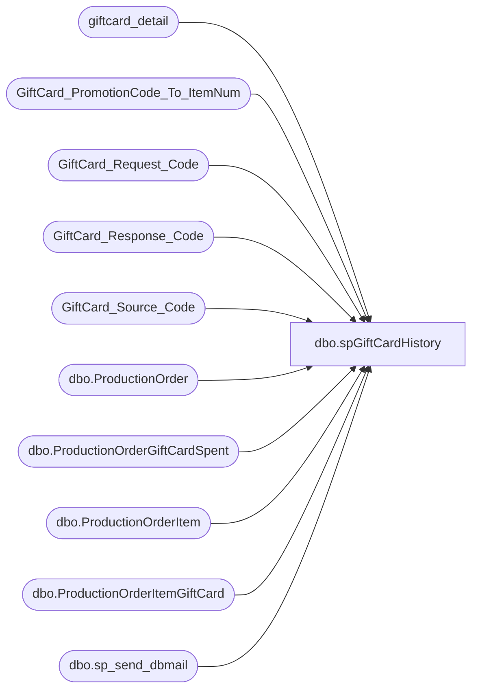

# dbo.spGiftCardHistory

**Database:** dw  
**Server:** papamart  

## Architecture Diagram



## Table Dependencies

| Referenced Table |
|---|
| giftcard_detail |
| GiftCard_PromotionCode_To_ItemNum |
| GiftCard_Request_Code |
| GiftCard_Response_Code |
| GiftCard_Source_Code |
| dbo.ProductionOrder |
| dbo.ProductionOrderGiftCardSpent |
| dbo.ProductionOrderItem |
| dbo.ProductionOrderItemGiftCard |
| dbo.sp_send_dbmail |

## Stored Procedure Code

```sql
CREATE PROCEDURE [dbo].[spGiftCardHistory](
	@cardnumber varchar(20), @morerecipients varchar(100)
)
-- =============================================================================================================
-- Name: spGiftCardHistory
--
-- Description:	

--
-- Input:		
--				
--
--
-- Output: 
--
-- Dependencies: 
--
-- Revision History
--		Name:			Date:			Comments:
--		GaryD			20090914		Upate recipients
--		MikeP			20140724		replaced email procedure with sp_send_dbmail
-- =============================================================================================================
AS

set nocount off

-- declare @cardnumber	varchar(20)
-- set @cardnumber = '6008965182712063'

declare @recipients	varchar(200)
set @recipients = 'Develobears@buildabear.com;'

set @recipients = @recipients + @morerecipients

/*
IF (Object_ID('tempdb..##webdata') IS NOT NULL) DROP TABLE ##webdata
select 	cast(ProductionOrderNumber as varchar(10)) order_num,
	cast(ProductionOrderGiftCardSpentNumber as varchar(16)) account_number,
	cast(ProductionOrderGiftCardSpentAmount as varchar(8)) spent_amt,
	convert(varchar(16), ProductionOrderGiftCardSpentDate, 121) spent_date
into ##webdata
from kodiak.babwpms.dbo.ProductionOrderGiftCardSpent gcs
	join kodiak.babwpms.dbo.ProductionOrder po
	on po.ProductionOrderID = gcs.ProductionOrderID
where ProductionOrderGiftCardSpentNumber = @cardnumber
*/
IF (Object_ID('tempdb..##webdata') IS NOT NULL) DROP TABLE ##webdata
select 	'bought' Action,
	cast(ProductionOrderNumber as varchar(10)) order_num,
	cast(gcs.ProductionOrderItemGiftCardNumber as varchar(16)) account_number,
	cast(ProductionOrderItemGiftCardAmount as varchar(8)) amount,
	convert(varchar(16), ProductionOrderDateTimeCreated, 121) date
into ##webdata
from kodiak.babwpms.dbo.ProductionOrderItemGiftCard gcs
	join kodiak.babwpms.dbo.ProductionOrderItem poi
	on poi.ProductionOrderItemID = gcs.ProductionOrderItemID
	join kodiak.babwpms.dbo.ProductionOrder po
	on po.ProductionOrderID = poi.ProductionOrderID
where gcs.ProductionOrderItemGiftCardNumber = @cardnumber

union

select 	'spent' Action,
	cast(ProductionOrderNumber as varchar(10)) order_num,
	cast(ProductionOrderGiftCardSpentNumber as varchar(16)) account_number,
	cast(ProductionOrderGiftCardSpentAmount as varchar(8)) amount,
	convert(varchar(16), ProductionOrderGiftCardSpentDate, 121) date
from kodiak.babwpms.dbo.ProductionOrderGiftCardSpent gcs
	join kodiak.babwpms.dbo.ProductionOrder po
	on po.ProductionOrderID = gcs.ProductionOrderID
where ProductionOrderGiftCardSpentNumber = @cardnumber


IF (Object_ID('tempdb..##vlgeneral') IS NOT NULL) DROP TABLE ##vlgeneral
select distinct account_number, im.promotion_code, im.item_num sku, im.description
into ##vlgeneral
from dw..giftcard_detail gd
	left join dw..GiftCard_PromotionCode_To_ItemNum im
	on im.promotion_code = gd.promotion_code
where account_number = @cardnumber

IF (Object_ID('tempdb..##vldetails') IS NOT NULL) DROP TABLE ##vldetails
select  convert(varchar(16), fdms_local_timestamp, 121) datetime, 
	cast(rc.description as varchar(25)) RequestCodeDesc, cast(resp.description as varchar(15)) ResponseDesc, 
	cast(alternate_merchant_number as varchar(5)) store, 
	cast(sc.description as varchar(15)) SourceDesc, 
	cast(transaction_amount as varchar(8)) tran_amt, 
	cast(base_amount as varchar(8)) base_amt, 
	cast(reporting_amount as varchar(8)) rep_amt, 
	cast(balance as varchar(8)) balance, 
	userid 
into ##vldetails
from dw..giftcard_detail gd
	join dw..GiftCard_Request_Code rc
	on rc.request_code = gd.request_code
	join dw..GiftCard_Response_Code resp
	on resp.response_code = gd.response_code
	join dw..GiftCard_Source_Code sc
	on sc.source_code = gd.source_code
where account_number = @cardnumber
order by fdms_local_timestamp

--@recipients = 'davidr@buildabear.com;returnbear@buildabear.com;lindak@buildabear.com;',

declare @MySubject varchar(75)
set @MySubject = 'GiftCard - Value & Webshop History - ' + @cardnumber

exec msdb.dbo.sp_send_dbmail 
@recipients = @recipients,
@subject=@MySubject, 
@query_result_width = 350,
@query= '

select ''General Info''

select * from ##vlgeneral

select ''WebShop Order Info''

select * from ##webdata
order by date

select ''ValueLink Details''

select * from ##vldetails
'
```

