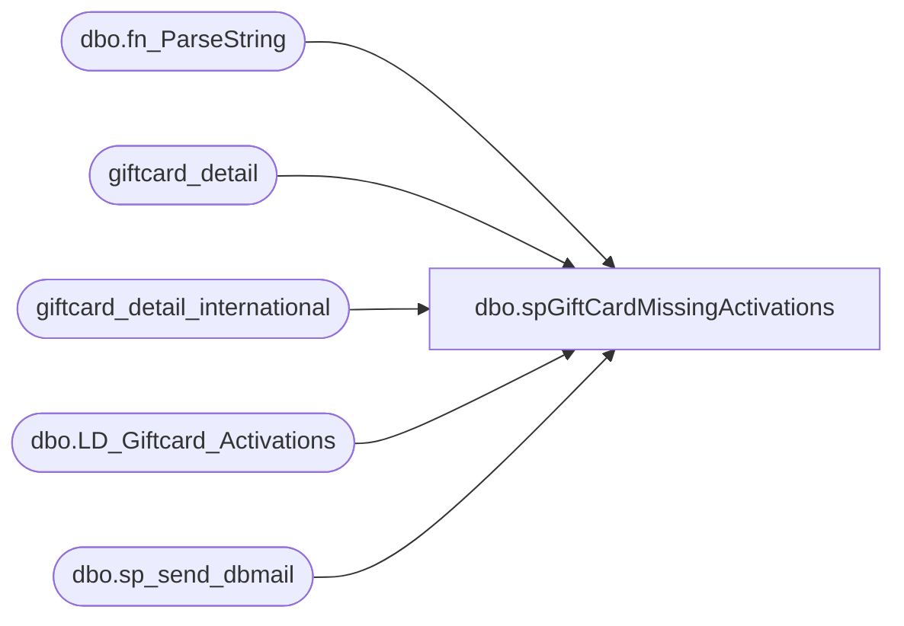

# dbo.spGiftCardMissingActivations

**Database:** dw  
**Server:** papamart  

## Architecture Diagram



## Table Dependencies

| Referenced Table |
|---|
| dbo.fn_ParseString |
| giftcard_detail |
| giftcard_detail_international |
| dbo.LD_Giftcard_Activations |
| dbo.sp_send_dbmail |

## Stored Procedure Code

```sql
CREATE PROCEDURE [dbo].[spGiftCardMissingActivations] 
AS
-- =============================================================================================================
-- Name: spGiftCardMissingActivations
--
-- Description:	

--
-- Input:		
--
--
-- Output: 
--
-- Dependencies: 
--
--	exec spGiftCardMissingActivations
--
-- Revision History
--		Name:			Date:			Comments:
--		Dave Rice						created
--		Keith Missey	10/16/2008		Updated to use dbmail following SQL 2005 upgrade
--		Dave Rice		12/10/2009		improved performance by pre-staging the data on oursblanc via the auditworks.spGiftCard_Pull_Activations_Redemptions proc
--										wanted to remove any performance issues when this runs around 10:00am
--		GaryD			08/19/2010		Change server name for SA 5.0.
--		Dave Rice		10/12/2010		added in popup stores
--		Dave Rice		11/16/2010		extended line_note size due to new webcart release not breaking up giftcards correctly
--		dave			01/06/2011		took out ridemakerz
--		Gary Murrish	10/13/2011		Expanded missing Activations to 1000 records and sent out store 470 as a seperate file.
--		Keith Missey	03/16/2012		Expanded missing Activations to 2000 records 
--		Mike Pelikan	08/28/2012		Modified Reports based on LindaK's request: 
--										'Missing Gift Card Activations in AW - BABW (Excluding 470)'
--											AND a.merchant_id IN (97020300000, 97032000002, 97088700000)
--											AND a.alternate_merchant_number <> 470
--										'Missing Gift Card Activations in AW -Third Party and  470' Report:
--											AND a.merchant_id NOT IN (97020300000, 97032000002, 97088700000)
--											AND a.alternate_merchant_number = 470
--		Mike Pelikan	02/13/2013		Removed escheatable_transaction clause from valuelink temp table query
--		Mike Pelikan	11/18/2013		Corrected internal_request_code where clause.
--		Mike Pelikan	01/22/2014		Corrected typo in in 'Missing Gift Card Activations in AW -Third Party and  470' where clause

-- =============================================================================================================
SET NOCOUNT OFF  
  
DECLARE @sql VARCHAR(8000)   
  
  
-- **************************************************************************************  
-- * valuelink activations  
-- **************************************************************************************  
    IF ( OBJECT_ID('tempdb..##giftcard_activations_valuelink_200703') IS NOT NULL ) 
        DROP TABLE ##giftcard_activations_valuelink_200703  
    SELECT  merchant_id,
			alternate_merchant_number,
            FDMS_local_timestamp,
            promotion_code,
            account_number,
            transaction_amount,
            userid
    INTO    ##giftcard_activations_valuelink_200703
    FROM    dw..giftcard_detail gd with (nolock)
    WHERE   1 = 1
            AND ( gd.internal_request_code IN ( 18, 28 )
                  OR gd.request_code = 300
                )
--This is causing email gift cards to not show up
			--AND gd.escheatable_transaction = 'Y'
            AND FDMS_local_timestamp BETWEEN DATEADD(mm, -3, GETDATE())
                                     AND     GETDATE() -- needed a wider net to catch activations  
            AND response_code = 0
			and reversal_flag = 0
-- store 13/web is screwing up and activating the cards in valuelink as store 0, so start including it
            AND ( ( alternate_merchant_number between 0 and 499
--                    AND alternate_merchant_number <= 499
                  )
--            AND ( ( alternate_merchant_number != 0
--                    AND alternate_merchant_number <= 499
--                  )
                  OR alternate_merchant_number = 991
                  OR alternate_merchant_number between 600 and 699
                )
    UNION
    SELECT  merchant_id,
			alternate_merchant_number,
            FDMS_local_timestamp,
            promotion_code,
            account_number,
            transaction_amount,
            userid
    FROM    dw..giftcard_detail_international gd with (nolock)
    WHERE   1 = 1
            AND ( gd.internal_request_code IN ( 18, 28 )
                  OR gd.request_code = 300
                )
            --AND gd.escheatable_transaction = 'Y'
            AND FDMS_local_timestamp BETWEEN DATEADD(mm, -3, GETDATE())
                                     AND     GETDATE() -- needed a wider net to catch activations  
            AND response_code = 0  
			and reversal_flag = 0
			
    CREATE INDEX ix_gd_activations_account_number ON ##giftcard_activations_valuelink_200703 ( account_number )  
  
-- **************************************************************************************  
-- * pull in the data we got from sales audit  
-- **************************************************************************************  
-- pull the pre-staged data from auditworks, from posdbssa job "GiftCard_Pull_Activations_Redemptions" - calling proc "auditworks.dbo.spGiftCard_Pull_Activations_Redemptions"
IF (Object_ID('tempdb..##giftcard_activations_POSDbsSA') IS NOT NULL) DROP TABLE  ##giftcard_activations_POSDbsSA
--select * 
select store_no, register_no, transaction_no, transaction_date, transaction_id, line_id, line_sequence, 
	transaction_void_flag, line_void_flag, gross_line_amount, line_object,
	reference_no collate SQL_Latin1_General_CP1_CI_AS reference_no,
	line_note collate SQL_Latin1_General_CP1_CI_AS line_note
into ##giftcard_activations_POSDbsSA
from bedrockdb01.auditworks.dbo.LD_Giftcard_Activations
CREATE INDEX ix_##giftcard_activations_POSDbsSA_reference_no ON ##giftcard_activations_POSDbsSA (reference_no)  

-- take out ridemakerz from the pos data
delete from ##giftcard_activations_POSDbsSA
where store_no between 1500 and 1599
  
    DELETE  FROM ##giftcard_activations_POSDbsSA
    WHERE   LEN(reference_no) != 16  
  
    DELETE  FROM ##giftcard_activations_POSDbsSA
    WHERE   LEN(line_note) < 10
            AND reference_no IS NULL  
  
-- **************************************************************************************  
-- * break apart the line note from auditworks so that we can compare giftcards across the board  
-- **************************************************************************************  
  
    DECLARE @Temp VARCHAR(8000)  
  
    DECLARE @wherefrom VARCHAR(30)  
    DECLARE @store_no INT  
    DECLARE @transaction_date DATETIME  
    DECLARE @entry_date_time DATETIME  
    DECLARE @transaction_void_flag INT  
    DECLARE @line_void_flag INT  
    DECLARE @transaction_id INT  
    DECLARE @line_id INT  
    DECLARE @gross_line_amount MONEY  
    DECLARE @line_object INT  
    DECLARE @reference_type INT  
    DECLARE @voiding_reversal_flag INT  
    DECLARE @reference_no VARCHAR(25)  
    DECLARE @line_note VARCHAR(1000)  
  
    DECLARE @register_no INT  
    DECLARE @transaction_no INT  
    DECLARE @line_sequence INT  
  
    DECLARE curBatch CURSOR read_only forward_only local
        FOR SELECT  store_no,
                    transaction_date,
                    transaction_id,
                    line_id,
                    gross_line_amount,
                    transaction_void_flag,
                    line_void_flag,
                    line_object,
                    reference_no,
                    line_note,
                    register_no,
                    transaction_no,
                    line_sequence
            FROM    ##giftcard_activations_POSDbsSA
--   from queries..Q794_GiftCard_Questions_from_Jack_transactions  
            WHERE   line_note IS NOT NULL
                    AND LEN(line_note) > 10  
  
  
-- select * from dave_giftcard_activations_oursblanc_uk_200703  
--    
-- open the cursor  
    OPEN curBatch  
    FETCH FROM curBatch INTO @store_no, @transaction_date, @transaction_id,
        @line_id, @gross_line_amount, @transaction_void_flag, @line_void_flag,
        @line_object, @reference_no, @line_note, @register_no, @transaction_no,
        @line_sequence  
  
-- loop through the set of dups  
    WHILE @@FETCH_STATUS = 0  
        BEGIN  
            SET @Temp = SUBSTRING(@line_note, 11, LEN(@line_note) - 11)  
  
-- print @store_no  
-- print @line_note  
-- print @temp   
            INSERT  INTO ##giftcard_activations_POSDbsSA
                    (
                      store_no,
                      transaction_date,
                      transaction_id,
                      line_id,
                      gross_line_amount,
                      transaction_void_flag,
                      line_void_flag,
                      line_object,
                      reference_no,
                      line_note,
                      register_no,
                      transaction_no,
                      line_sequence
                    )
                    SELECT  @store_no,
                            @transaction_date,
                            @transaction_id,
                            @line_id,
                            @gross_line_amount,
                            @transaction_void_flag,
                            @line_void_flag,
                            -1,
                            p.ParsedItem,
                            @line_note,
                            @register_no,
                            @transaction_no,
                            @line_sequence
                    FROM    queries.dbo.fn_ParseString(@Temp, ',') p
                            LEFT JOIN ##giftcard_activations_POSDbsSA t ON t.reference_no = p.ParsedItem
                    WHERE   t.reference_no IS NULL  
  
            FETCH FROM curBatch INTO @store_no, @transaction_date,
                @transaction_id, @line_id, @gross_line_amount,
                @transaction_void_flag, @line_void_flag, @line_object,
                @reference_no, @line_note, @register_no, @transaction_no,
                @line_sequence  
        END  
  
    CLOSE curBatch  
    DEALLOCATE curBatch  
--:01  
  
  
-- select * from ##giftcard_activations_oursblanc where line_object = -1  
  
-- delete from ##giftcard_activations_oursblanc where transaction_no = -1  
  
-- **************************************************************************************  
  
    --IF ( OBJECT_ID('tempdb..#cart_giftcards') IS NOT NULL ) 
    --    DROP TABLE #cart_giftcards  
    --SELECT  ProductionOrderNumber,
    --        ProductionOrderDateTimeCreated,
    --        gc.ProductionOrderItemGiftCardNumber,
    --        gc.ProductionOrderItemGiftCardAmount
    --INTO    #cart_giftcards
    --FROM    kodiak.babwpms.dbo.ProductionOrder po
    --        JOIN kodiak.babwpms.dbo.ProductionOrderItem poi ON poi.ProductionOrderID = po.ProductionOrderID
    --        JOIN kodiak.babwpms.dbo.ProductionOrderItemGiftCard gc ON gc.ProductionOrderItemId = poi.ProductionOrderItemId
    --WHERE   ProductionOrderDateTimeCreated >= '01/01/2007'  
    --CREATE INDEX ix_cart_giftcards_ProductionOrderItemGiftCardNumber ON #cart_giftcards ( ProductionOrderItemGiftCardNumber )  


-- ************************************************************************************

 
-- look for giftcard activations in auditworks but they didn't get to valuelink, so the cards aren't activated
-- declare @sql varchar(8000)  
    SET @sql = '  
    SET NOCOUNT ON
    
 select top 2000 j.store_no,   
  j.register_no,   
  j.transaction_no,   
  convert(varchar, j.transaction_date, 101) transaction_date,   
  j.line_void_flag,   
  j.gross_line_amount,   
  ''="'' + j.reference_no + ''"'' reference_no,  
  cast(j.line_note as varchar(150)) line_note  
 from ##giftcard_activations_POSDbsSA j  
  left join ##giftcard_activations_valuelink_200703 a  
  on a.account_number = j.reference_no  
 where  a.account_number is null  
  and reference_no is not null  
 order by cast(transaction_date as datetime) desc, store_no
 '  
  
    DECLARE @filename VARCHAR(100)  
    DECLARE @char_separator VARCHAR(12)  
    DECLARE @message VARCHAR(200)  

    SET @filename = 'MissingGiftCardActivations.csv'  
    SET @char_separator = CHAR(9)  
    SET @message = 'The attached list contains missing gift card activations in valuelink'  
   
    EXEC msdb.dbo.sp_send_dbmail 
		@recipients = 'lindak@buildabear.com',
		@copy_recipients = 'databears@buildabear.com;posadmin@buildabear.com', 
		
		@body = @message,
        @subject = 'Missing Gift Card Activations', @query_result_width = 500,
        @query = @sql, @attach_query_result_as_file = 'TRUE',
        @query_result_separator = @char_separator,
        @query_attachment_filename = @filename


-- look for fraud - that's transactions in valuelink but not in auditworks
-- Omit Store 470

    SET @sql = '  
    SET NOCOUNT ON
    SELECT ''The attached list contains the top 2000 missing gift card activations in auditworks (theft?) BABW (excluding 470)''
select top 2000 
	''="'' + merchant_id + ''"'' merchant_id, 
	alternate_merchant_number store_no, 
	 convert(varchar, fdms_local_timestamp, 101) datestamp,   
	promotion_code, 
	''="'' + account_number + ''"'' account_number, 
	transaction_amount, 
	userid
from ##giftcard_activations_valuelink_200703 a
	left join ##giftcard_activations_POSDbsSA j
	on j.reference_no = a.account_number
where j.reference_no is null
	and fdms_local_timestamp <= dateadd(dd, -2, getdate()) 
AND a.merchant_id IN (97020300000, 97032000002, 97088700000)
and a.alternate_merchant_number <> 470
order by fdms_local_timestamp desc
'

    SET @filename = 'MissingGiftCardActivationsInAWBABWnot470.csv'  
    SET @char_separator = CHAR(9)  
    SET @message = 'The attached list contains the top 2000 missing gift card activations in auditworks (theft?) BABW (excluding 470)'  
   
    EXEC msdb.dbo.sp_send_dbmail 
		@recipients = 'lindak@buildabear.com',
		@copy_recipients = 'databears@buildabear.com;posadmin@buildabear.com', 
		@body = @message,
        @subject = 'Missing Gift Card Activations in AW - BABW (Excluding 470)', @query_result_width = 500,
        @query = @sql, @attach_query_result_as_file = 'TRUE',
        @query_result_separator = @char_separator,
        @query_attachment_filename = @filename

-- look for fraud - that's transactions in valuelink but not in auditworks
-- For only Store 470
  
    SET @sql = '  
    SET NOCOUNT ON
    SELECT ''The attached list contains the top 2000 missing gift card activations in auditworks (theft?) Third Party and 470''  
select top 2000 
	''="'' + merchant_id + ''"'' merchant_id, 
	alternate_merchant_number store_no, 
	 convert(varchar, fdms_local_timestamp, 101) datestamp,   
	promotion_code, 
	''="'' + account_number + ''"'' account_number, 
	transaction_amount, 
	userid
from ##giftcard_activations_valuelink_200703 a
	left join ##giftcard_activations_POSDbsSA j
	on j.reference_no = a.account_number
where j.reference_no is null
	and fdms_local_timestamp <= dateadd(dd, -2, getdate()) 
	AND (
		a.merchant_id NOT IN (97032000002, 97088700000, 97020300000)
		OR (a.merchant_id = 97020300000 AND a.alternate_merchant_number = 470)
		)

order by fdms_local_timestamp desc
'

    SET @filename = 'MissingGiftCardActivationsInAWThirdParty470.csv'  
    SET @char_separator = CHAR(9)  
    SET @message = 'The attached list contains the top 2000 missing gift card activations in auditworks (theft?) Third Party and 470'  
   
    EXEC msdb.dbo.sp_send_dbmail 
		@recipients = 'lindak@buildabear.com',
		@copy_recipients = 'databears@buildabear.com;posadmin@buildabear.com', 
		@body = @message,
        @subject = 'Missing Gift Card Activations in AW -Third Party and  470', @query_result_width = 500,
        @query = @sql, @attach_query_result_as_file = 'TRUE',
        @query_result_separator = @char_separator,
        @query_attachment_filename = @filename
```

