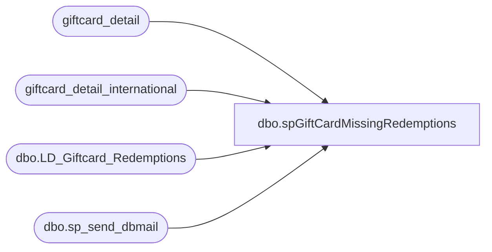

# dbo.spGiftCardMissingRedemptions

**Database:** dw  
**Server:** papamart  

## Architecture Diagram



## Table Dependencies

| Referenced Table |
|---|
| giftcard_detail |
| giftcard_detail_international |
| dbo.LD_Giftcard_Redemptions |
| dbo.sp_send_dbmail |

## Stored Procedure Code

```sql
CREATE PROCEDURE [dbo].[spGiftCardMissingRedemptions] 
-- =============================================================================================================
-- Name: spGiftCardMissingRedemptions
--
-- Description:	
-- looking for giftcards that were redeemed in auditworks, but we can find no sign of them in the valuelink data
--
-- 60105% giftcards are not the actual number of the giftcard, these have to be decrypted by linda through the
-- auditworks (or is it a valuelink) converter.  From what i remember, these numbers occur when the store has
-- to use the ice machine to activate/redeem the card.
--
-- looking for redemptions that are in auditworks but not in valuelink  
-- we had communication issues between coalition and valuelink and the cashiers let the transactions go through anyhow
--
-- Input:		
--
--
-- Output: 
--
-- Dependencies: 
--
-- Revision History
--		Name:			Date:			Comments:
--		Dave Rice						created
--		Keith Missey	10/16/2008		Updated to use dbmail following SQL 2005 upgrade
--		Dave Rice		11/14/2008		set auditworks date range to only ignore today
--		Dave Rice		12/10/2009		improved performance by pre-staging the data on oursblanc via the auditworks.spGiftCard_Pull_Activations_Redemptions proc
--										wanted to remove any performance issues when this runs around 10:00am
--		Garyd			08/19/2010		Change server name for SA 5.0.
--		dave			01/06/2011		took out ridemakerz
-- =============================================================================================================
AS 
-- SET QUOTED_IDENTIFIER ON   
-- GO  
-- SET ANSI_NULLS ON   
-- GO  
set nocount on  

declare @sql varchar(8000)


-- pull the pre-staged data from auditworks
IF (Object_ID('tempdb..##giftcardsredeemed_POSDbsSA') IS NOT NULL) DROP TABLE  ##giftcardsredeemed_POSDbsSA
--select * 
select store_no, register_no, transaction_no, transaction_date, transaction_void_flag, line_void_flag, gross_line_amount, 
	reference_no collate SQL_Latin1_General_CP1_CI_AS reference_no
into ##giftcardsredeemed_POSDbsSA
from bedrockdb01.auditworks.dbo.LD_Giftcard_Redemptions
create index ix_giftcardsredeemed_POSDbsSA_reference_no on ##giftcardsredeemed_POSDbsSA (reference_no)

-- take out ridemakerz from the pos data
delete from ##giftcardsredeemed_POSDbsSA
where store_no between 1500 and 1599

-- remove spaces
update ##giftcardsredeemed_POSDbsSA
set reference_no = replace(reference_no, ' ', '')
--select charindex(' ', reference_no),'>'+reference_no+'<',*
from ##giftcardsredeemed_POSDbsSA
where charindex(' ', reference_no) > 1

-- remove dashes
update ##giftcardsredeemed_POSDbsSA
set reference_no = replace(reference_no, '-', '')
--select charindex('-', rtrim(reference_no)),*
from ##giftcardsredeemed_POSDbsSA
where charindex('-', reference_no) > 1

-- pull valuelink redemptions
IF (Object_ID('tempdb..##giftcardsredeemed_valuelink') IS NOT NULL) DROP TABLE ##giftcardsredeemed_valuelink
select alternate_merchant_number, request_code, internal_request_code, FDMS_local_timestamp, terminal_local_timestamp, account_number, base_amount, transaction_amount, userid, processed_date
into ##giftcardsredeemed_valuelink
from dw..giftcard_detail gd with (nolock)
where 
	1=1
	and fdms_local_timestamp between dateadd(mm, -2, getdate()) and getdate()
	and gd.internal_request_code = 1 --in (200, 202, 6200, 6005)
	and gd.response_code = 0
	and gd.reversal_flag = 0 -- keep in mind that this flag can only get set if the reversal happens that day, 99.9% should occur that way
union
select alternate_merchant_number, request_code, internal_request_code, FDMS_local_timestamp, terminal_local_timestamp, account_number, base_amount, transaction_amount, userid, processed_date
from dw..giftcard_detail_international gd with (nolock)
where 
	1=1
	and fdms_local_timestamp between dateadd(mm, -2, getdate()) and getdate()
	and gd.internal_request_code = 1 --in (200, 202, 6200, 6005)
	and gd.response_code = 0
	and gd.reversal_flag = 0 -- keep in mind that this flag can only get set if the reversal happens that day, 99.9% should occur that way
------union
------select alternate_merchant_number, request_code, internal_request_code, FDMS_local_timestamp, terminal_local_timestamp, account_number, base_amount, transaction_amount, userid, processed_date
------from dw..giftcard_detail_ridemakerz gd with (nolock)
------where 
------	1=1
------	and fdms_local_timestamp between dateadd(mm, -2, getdate()) and getdate()
------	and gd.internal_request_code = 1 --in (200, 202, 6200, 6005)
------	and gd.response_code = 0
------	and gd.reversal_flag = 0 -- keep in mind that this flag can only get set if the reversal happens that day, 99.9% should occur that way
create index ix_giftcardsredeemed_valuelink_account_number on ##giftcardsredeemed_valuelink (account_number)
 
-- pull voids 
-- technically, i should be looking for a request_code of 800 for voiding redemptions, but i took a bigger view
-- by going with the internal_request_code of 23 which should catch forced voids and any others.  i'm relying on the
-- the processed_date to tie things together.  very unlikely to have two voids with the exact timestamp down to the same second

-- this probably isn't needed since i just found the reversal_flag.  But, it can't catch every last one, but 99.9% is good enough
IF (Object_ID('tempdb..##giftcardsredeemed_valuelink_voids') IS NOT NULL) DROP TABLE ##giftcardsredeemed_valuelink_voids
select alternate_merchant_number, request_code, internal_request_code, FDMS_local_timestamp, terminal_local_timestamp, account_number, base_amount, transaction_amount, userid, processed_date
into ##giftcardsredeemed_valuelink_voids
from dw..giftcard_detail gd with (nolock)
where 
	1=1
	and fdms_local_timestamp between dateadd(mm, -2, getdate()) and getdate()
	and gd.internal_request_code = 23 --in (200, 202, 6200, 6005)
	and gd.response_code = 0
union
select alternate_merchant_number, request_code, internal_request_code, FDMS_local_timestamp, terminal_local_timestamp, account_number, base_amount, transaction_amount, userid, processed_date
from dw..giftcard_detail_international gd with (nolock)
where 
	1=1
	and fdms_local_timestamp between dateadd(mm, -2, getdate()) and getdate()
	and gd.internal_request_code = 23 --in (200, 202, 6200, 6005)
	and gd.response_code = 0
------union
------select alternate_merchant_number, request_code, internal_request_code, FDMS_local_timestamp, terminal_local_timestamp, account_number, base_amount, transaction_amount, userid, processed_date
------from dw..giftcard_detail_ridemakerz gd with (nolock)
------where 
------	1=1
------	and fdms_local_timestamp between dateadd(mm, -2, getdate()) and getdate()
------	and gd.internal_request_code = 23 --in (200, 202, 6200, 6005)
------	and gd.response_code = 0
create index ix_giftcardsredeemed_valuelink_account_number on ##giftcardsredeemed_valuelink_voids (account_number)
-- 7167

-- remove voids
delete from ##giftcardsredeemed_valuelink
--select r.base_amount, r.transaction_amount, v.base_amount, v.transaction_amount, *
from ##giftcardsredeemed_valuelink r
	join ##giftcardsredeemed_valuelink_voids v
	on v.account_number = r.account_number
	and v.processed_date = r.processed_date


-- there is an email size limit so limit things to manageable level
--declare @sql varchar(8000)  
SET @sql = '  
SET NOCOUNT ON
    
select top 1000 
	o.store_no,   
	o.register_no,   
	o.transaction_no,   
	''="'' + cast(convert(varchar, o.transaction_date, 101) as varchar(10)) + ''"'' transaction_date,   
	o.gross_line_amount,   
	''="'' + cast(o.reference_no as varchar(20)) + ''"'' reference_no
from ##giftcardsredeemed_POSDbsSA o
	left join ##giftcardsredeemed_valuelink v
	on v.account_number = o.reference_no
	and abs(v.transaction_amount) = o.gross_line_amount
where v.account_number is null
	and gross_line_amount != 0
order by case when o.reference_no like ''60105%'' then 1 else 2 end, transaction_date
'  

    DECLARE @filename VARCHAR(100)  
    DECLARE @char_separator VARCHAR(12)  
    DECLARE @message VARCHAR(200)  
    SET @filename = 'MissingGiftCardRedemptions.csv'  
    SET @char_separator = CHAR(9)  
    SET @message = 'The attached list contains missing gift card redemptions in valuelink (1000 row limit)'  

--		@recipients = 'davidr@buildabear.com',  
--		@copy_recipients = 'davidr@buildabear.com', 
--		@recipients = 'lindak@buildabear.com', 
--		@copy_recipients = 'databears@buildabear.com', 
    EXEC msdb.dbo.sp_send_dbmail 
		@recipients = 'lindak@buildabear.com', 
		@copy_recipients = 'databears@buildabear.com', 
		@body = @message,
        @subject = 'Missing Gift Card Redemptions', @query_result_width = 500,
        @query = @sql, @attach_query_result_as_file = 'TRUE',
        @query_result_separator = @char_separator,
        @query_attachment_filename = @filename
```

