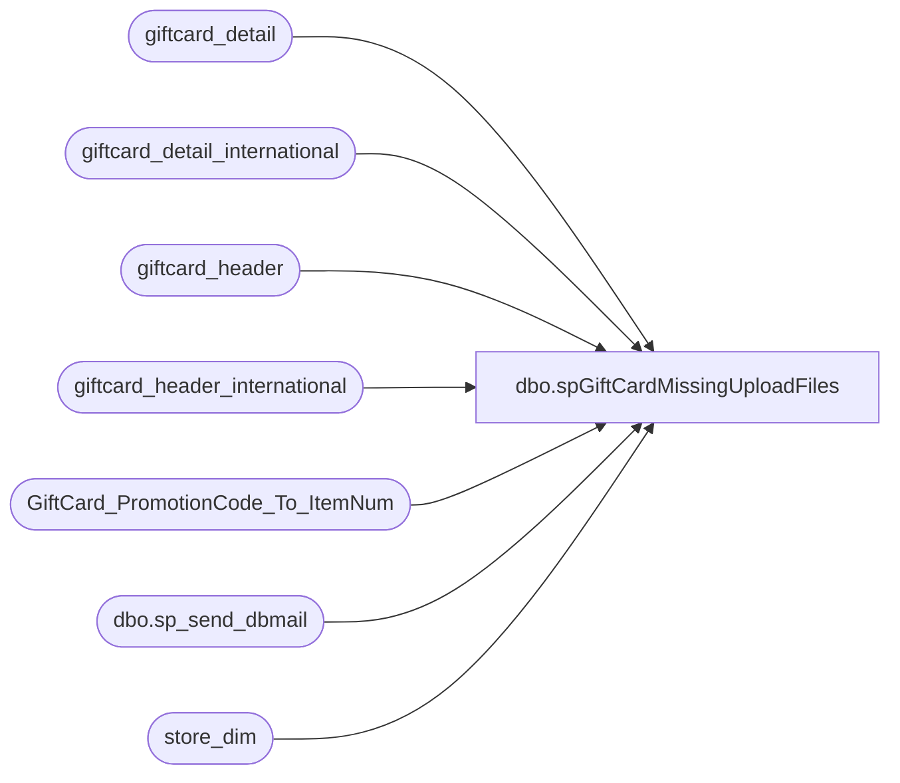

# dbo.spGiftCardMissingUploadFiles

**Database:** dw  
**Server:** papamart  

## Architecture Diagram



## Table Dependencies

| Referenced Table |
|---|
| giftcard_detail |
| giftcard_detail_international |
| giftcard_header |
| giftcard_header_international |
| GiftCard_PromotionCode_To_ItemNum |
| dbo.sp_send_dbmail |
| store_dim |

## Stored Procedure Code

```sql
CREATE PROCEDURE [dbo].[spGiftCardMissingUploadFiles] AS
-- =============================================================================================================
-- Name: spGiftCardMissingUploadFiles
--
-- Description:	

--
-- Input:		
--				
--
--
-- Output: 
--
-- Dependencies: 
--
-- Revision History
--		Name:			Date:			Comments:
--		GaryD			20090914		Update recipients
--		MikeP			20120412		Update recipients, added sp name to email
--		DanT			20160509		Removed Jack McCormick and develobears from email, added BIAdmin, added international to query, added FileID to results
-- =============================================================================================================

set nocount on

declare @sql varchar(8000)
declare @Subject 		varchar(200) 

set @Subject = 'Gift Card - Missing Upload Files'

IF (Object_ID('tempdb..##Missing_A45') IS NOT NULL) DROP TABLE ##Missing_A45
SELECT gch.FileID, period_start_date, count(*) count
INTO ##Missing_A45
FROM 
   giftcard_header gch
   join giftcard_detail gcd
   on gcd.FileID = gch.FileID
   join GiftCard_PromotionCode_To_ItemNum i
   on i.promotion_code = gcd.promotion_code
   join store_dim s
   on s.store_key = gcd.store_key
WHERE 1=1
   and internal_request_code in (18, 28)
   and escheatable_transaction = 'Y'
   and gcd.promotion_code != 0
   and exported_date is null
   and period_start_date >= '11/23/2004'
   and gch.fileid in (select fileid from giftcard_header where dw_processed_date between DateAdd(dd, -14, getdate()) and DateAdd(dd, -1, getdate()))
GROUP BY gch.FileID, period_start_date
UNION
SELECT gch.FileID, period_start_date, count(*) count
FROM 
   giftcard_header_international gch
   join giftcard_detail_international gcd
   on gcd.FileID = gch.FileID
   join GiftCard_PromotionCode_To_ItemNum i
   on i.promotion_code = gcd.promotion_code
   join store_dim s
   on s.store_key = gcd.store_key
WHERE 1=1
   and internal_request_code in (18, 28)
   and escheatable_transaction = 'Y'
   and gcd.promotion_code != 0
   and exported_date is null
   and period_start_date >= '11/23/2004'
   and gch.fileid in (select fileid from giftcard_header_international where dw_processed_date between DateAdd(dd, -14, getdate()) and DateAdd(dd, -1, getdate()))
GROUP BY gch.FileID, period_start_date
ORDER BY period_start_date, FileID


set @sql = 'set nocount on 
select ''The giftcards file might not have been uploaded to Sales Audit!!!
Do NOT close the previous days receipts until things are confirmed''

select ''The following giftcard data has not been uploaded to Sales Audit''
select * from ##Missing_A45
select ''Email sent from PAPAMART.dw.dbo.spGiftCardMissingUploadFiles''
'

IF (SELECT COUNT(*) FROM ##MISSING_A45) > 0
BEGIN
	exec msdb.dbo.sp_send_dbmail 
	@recipients = 'biadmin@buildabear.com;lindak@buildabear.com;posadmin@buildabear.com',
	@subject=@Subject, 
	@query_result_width = 250,
	@query= @sql
END
```

