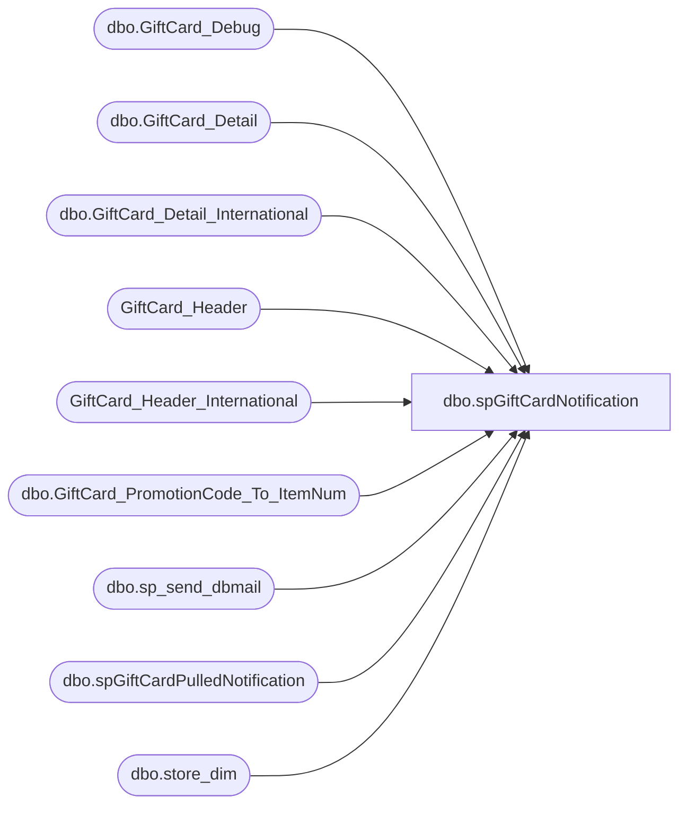

# dbo.spGiftCardNotification

**Database:** dw  
**Server:** papamart  

## Architecture Diagram



## Table Dependencies

| Referenced Table |
|---|
| dbo.GiftCard_Debug |
| dbo.GiftCard_Detail |
| dbo.GiftCard_Detail_International |
| GiftCard_Header |
| GiftCard_Header_International |
| dbo.GiftCard_PromotionCode_To_ItemNum |
| dbo.sp_send_dbmail |
| dbo.spGiftCardPulledNotification |
| dbo.store_dim |

## Stored Procedure Code

```sql
CREATE PROCEDURE [dbo].[spGiftCardNotification]
	@FileID		int,
	@ExportedDate	datetime,
	@Country	varchar(10)
AS

-- =============================================================================================================
-- Name: spGiftCardNotification
--
-- Description:	

--
-- Input:		
--				
--
--
-- Output: 
--
-- Dependencies: 
--
-- Revision History
--		Name:			Date:			Comments:
--		GaryD			20090914		Update recipients
--		MikeP			20130502		Removed RZ logic
--		Mike P			20140128		changed to use sp_send_dbmail
--		Mike P			20141112		added execution of spGiftCardPulledNotification
--		Mike P			20141113		corrected bug
-- =============================================================================================================

SET NOCOUNT ON

declare @sql 		varchar(8000)
declare @Subject 	varchar(200) 

IF (Object_ID('tempdb..##Exported') IS NOT NULL) DROP TABLE ##Exported
create table ##Exported (
	promotion_code	varchar(10),
	item_num		varchar(10),
	count			int
)

IF (Object_ID('tempdb..##NotExported') IS NOT NULL) DROP TABLE ##NotExported
create table ##NotExported (
	promotion_code	varchar(10),
	item_num		varchar(10),
	count			int
)

if @Country = 'US'
begin
	set @Subject = 'Gift Card Upload Stats (' + (select cast(sequence_number as varchar) from GiftCard_Header where FileID = @FileID) + ')'

	insert into ##Exported
	select d.promotion_code, item_num, count(*) count
	from dw.dbo.GiftCard_Detail d
		join dw.dbo.GiftCard_PromotionCode_To_ItemNum i
		on i.promotion_code = d.promotion_code
	where 	1=1
		and FileID = @FileID
		and exported_date is not null
	group by d.promotion_code, item_num
	order by item_num
	
	insert into ##NotExported
	select d.promotion_code, item_num, count(*) count
	from dw.dbo.GiftCard_Detail d
		left join dw.dbo.GiftCard_PromotionCode_To_ItemNum i
		on i.promotion_code = d.promotion_code
		join dw.dbo.store_dim s
		on s.store_key = d.store_key
	where 	1=1
		and FileID = @FileID
		and internal_request_code in (18,28)
		and escheatable_transaction ='Y'
		and exported_date is null
		and d.promotion_code != 0
		and d.promotion_code != 14325	-- Maxines CEB promocode
		and d.promotion_code != 24890	-- Walgreens
	group by d.promotion_code, item_num
	order by item_num
end
else if @Country = 'UK'
begin
	set @Subject = 'Gift Card (UK) Upload Stats (' + (select cast(sequence_number as varchar) from GiftCard_Header_International where FileID = @FileID) + ')'
	
	insert into ##Exported
	select d.promotion_code, item_num, count(*) count
	from dw.dbo.GiftCard_Detail_International d
		join dw.dbo.GiftCard_PromotionCode_To_ItemNum i
		on i.promotion_code = d.promotion_code
	where 	1=1
		and FileID = @FileID
		and exported_date is not null
	group by d.promotion_code, item_num
	order by item_num
	
	insert into ##NotExported
	select d.promotion_code, item_num, count(*) count
	from dw.dbo.GiftCard_Detail_International d
		left join dw.dbo.GiftCard_PromotionCode_To_ItemNum i
		on i.promotion_code = d.promotion_code
		join dw.dbo.store_dim s
		on s.store_key = d.store_key
	where 	1=1
		and FileID = @FileID
		and internal_request_code in (18,28)
		and escheatable_transaction ='Y'
		and exported_date is null
		and d.promotion_code != 0
		and d.promotion_code != 14325	-- Maxines CEB promocode
		and d.promotion_code != 24890	-- Walgreens
	group by d.promotion_code, item_num
	order by item_num
end


IF (Object_ID('tempdb..##Errors') IS NOT NULL) DROP TABLE ##Errors
select substring(convert(varchar, DateStamp, 101) + ' ' + convert(varchar(5), DateStamp, 14),1,16) DateStamp, substring(LogMessage,1,90) Error
into ##Errors
from dw.dbo.GiftCard_Debug 
where DateStamp between dateadd(day, -2, @ExportedDate) and @ExportedDate
	and LogType = 'Error'
order by Datestamp

set @sql = '
select ''Gift Cards loaded to STS''
select * from ##Exported

if (select count(*) from ##NotExported) > 0
begin
	select ''Gift Cards not processed''
	select * from ##NotExported
end

select ''Errors:''
select * from ##Errors
'

--@recipients = 'davidr@buildabear.com',
--@recipients = 'davidr@buildabear.com',

exec msdb.dbo.sp_send_dbmail 
@recipients = 'Develobears@buildabear.com',
@subject=@Subject, 
@query_result_width  = 250,
@query= @sql

EXEC dw.dbo.spGiftCardPulledNotification @FileID
```

