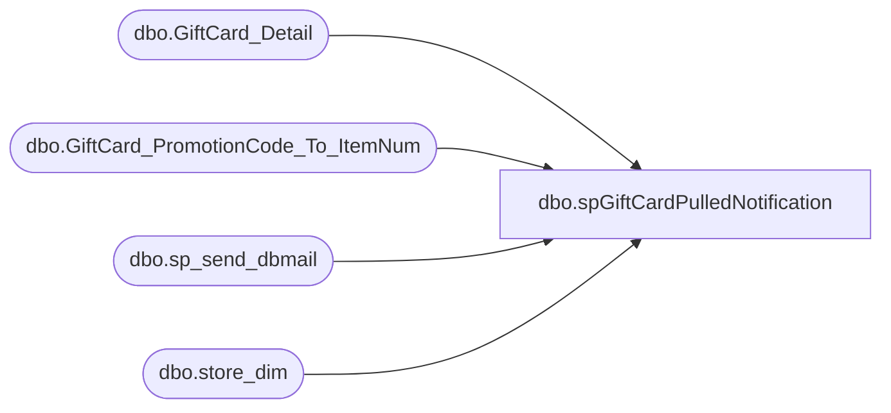

# dbo.spGiftCardPulledNotification

**Database:** dw  
**Server:** papamart  

## Architecture Diagram



## Table Dependencies

| Referenced Table |
|---|
| dbo.GiftCard_Detail |
| dbo.GiftCard_PromotionCode_To_ItemNum |
| dbo.sp_send_dbmail |
| dbo.store_dim |

## Stored Procedure Code

```sql
CREATE PROCEDURE [dbo].[spGiftCardPulledNotification]
	/* ===== ARGUMENTS ===== */
	@FileID		int
AS
BEGIN
-- =============================================================================================================
-- Name: spGiftCardPulledNotification
--
-- Description:	
-- the goal is to show what new giftcards are coming in that we don't have a matching sku for
--
-- Input:		
--				
--
--
-- Output: 
--
-- Dependencies: 
--
-- Revision History
--		Name:			Date:			Comments:
--		GaryD			20090914		Update recipients
--		dave			20100217		cleaned up to report missing activations
--		dave			20101015		ignore 38741
--		mikep			20131121		added store description
-- =============================================================================================================

SET NOCOUNT ON

-- select max(fileid) from dw..giftcard_header
-- exec spGiftCardPulledNotification 3003
--declare @FileID int
--set @FileID = 3003


IF (Object_ID('tempdb..##MissingGiftCardMapping') IS NOT NULL) DROP TABLE ##MissingGiftCardMapping
select d.promotion_code, item_num, s.store_id store_num,  count(*) missingcount
into ##MissingGiftCardMapping
from dw.dbo.GiftCard_Detail d
	left join dw.dbo.GiftCard_PromotionCode_To_ItemNum i
	on i.promotion_code = d.promotion_code
	join dw.dbo.store_dim s
	on s.store_key = d.store_key
where 	1=1
	and i.item_num is null
	--and d.FileID in (4143,4142,4141)
	and d.FileID = @FileID
	and d.internal_request_code in (18,28)
	and d.escheatable_transaction ='Y'
	and d.promotion_code != 0
	and d.promotion_code not in (14325)	-- Maxines CEB promocode
	and d.promotion_code not in (24890, 22098)	-- Walgreens
	and d.promotion_code not in (92364) -- mismapped, so just ignore
	and d.promotion_code not in (38741) -- old red bearhead card that was sent out as a promotion where the guest had to activate it
	and d.promotion_code not in (143268)	-- costco activation
	and d.promotion_code not in (128667)	-- beats me
group by d.promotion_code, item_num, s.store_id
having count(*) >= 3

if (select count(*) from ##MissingGiftCardMapping) > 0
begin
	exec msdb.dbo.sp_send_dbmail 
		@recipients = 'corieb@buildabear.com;databears@buildabear.com',
		@subject='Gift Card Missing SKU Mappings', 
		@query_result_width = 250,
		@query= '
		print ''These valuelink promotion codes have no corresponding BABW sku''
		print ''''

		select promotion_code, missingcount, store_num
		from ##MissingGiftCardMapping (nolock)
		order by promotion_code

		print ''''
		print ''this was run from papamart.dw.dbo.spGiftCardPulledNotification''

		'
end


END
```

