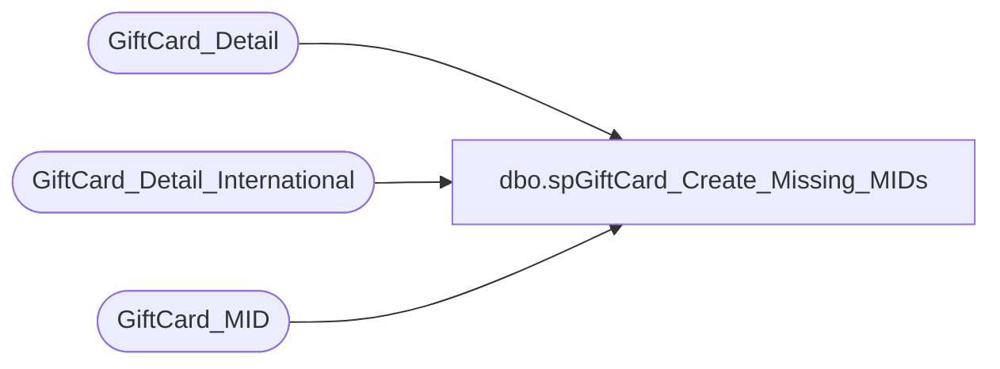

# dbo.spGiftCard_Create_Missing_MIDs

**Database:** dw  
**Server:** papamart  

## Architecture Diagram



## Table Dependencies

| Referenced Table |
|---|
| GiftCard_Detail |
| GiftCard_Detail_International |
| GiftCard_MID |

## Stored Procedure Code

```sql
CREATE PROCEDURE [dbo].[spGiftCard_Create_Missing_MIDs]
-- =============================================================================================================
-- Name: spGiftCard_Create_Missing_MIDs
--
-- Description:	
--	Generate giftcard_mid record for missing Merchant_IDs from Valuelink
--
--
-- Input:		
--
-- Output: 
--
-- Dependencies: 
--
-- Revision History
--		Name:			Date:			Comments:
--		Gary Murrish	1/3/2014		Created

-- =============================================================================================================
AS

	SET NOCOUNT ON
	-- Drop table #tmpMissingDetails
	SELECT
		gcd.merchant_id,
		COUNT(*) AS numRecords,
		MIN(gcd.FDMS_local_timestamp) AS earliestTimeStamp,
		MAX(gcd.FDMS_local_timestamp) AS latestTimeStamp
	INTO #tmpMissingDetails
	FROM
		GiftCard_Detail gcd WITH (NOLOCK)
		LEFT JOIN GiftCard_MID gcm WITH (NOLOCK)
			ON gcd.merchant_id = gcm.MID
	WHERE
		gcm.MID IS NULL
		AND gcd.merchant_id IS NOT NULL
	GROUP BY gcd.merchant_id
	ORDER BY 1

	INSERT INTO GiftCard_MID
		(	MID,
			Description,
			localCurrencyCode,
			isCorporate)
		SELECT
			md.merchant_id,
			'Unknown',
			0,
			0
		FROM
			#tmpMissingDetails md

	-- Drop table #tmpMissingIntl
	SELECT
		gcd.merchant_id,
		COUNT(*) AS numRecords,
		MIN(gcd.FDMS_local_timestamp) AS earliestTimeStamp,
		MAX(gcd.FDMS_local_timestamp) AS latestTimeStamp
	INTO #tmpMissingIntl
	FROM
		GiftCard_Detail_International gcd WITH (NOLOCK)
		LEFT JOIN GiftCard_MID gcm WITH (NOLOCK)
			ON gcd.merchant_id = gcm.MID
	WHERE
		gcm.MID IS NULL
		AND gcd.merchant_id IS NOT NULL
	GROUP BY gcd.merchant_id
	ORDER BY 1


	INSERT INTO GiftCard_MID
		(	MID,
			Description,
			localCurrencyCode,
			isCorporate)
		SELECT
			md.merchant_id,
			'Unknown',
			0,
			0
		FROM
			#tmpMissingIntl md
```

