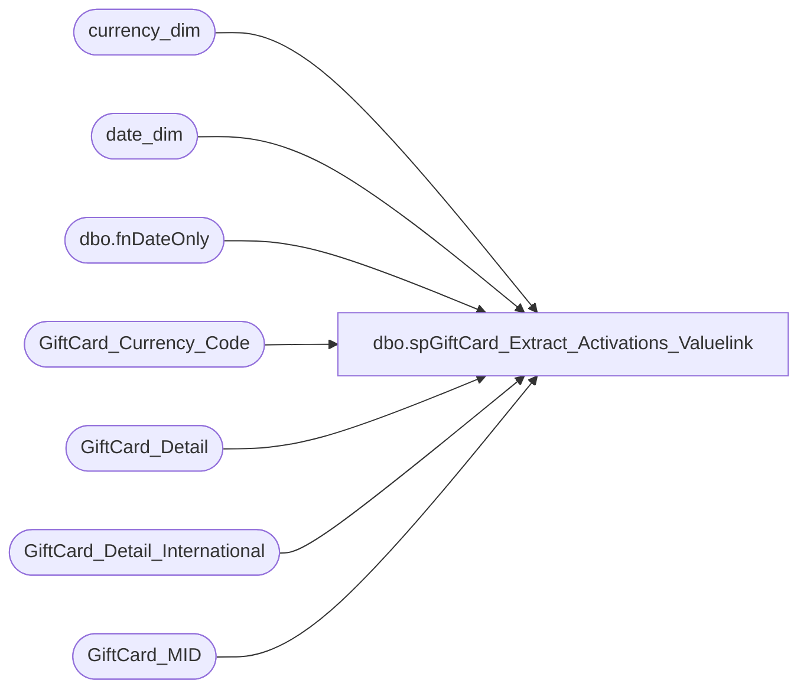

# dbo.spGiftCard_Extract_Activations_Valuelink

**Database:** dw  
**Server:** papamart  

## Architecture Diagram



## Table Dependencies

| Referenced Table |
|---|
| currency_dim |
| date_dim |
| dbo.fnDateOnly |
| GiftCard_Currency_Code |
| GiftCard_Detail |
| GiftCard_Detail_International |
| GiftCard_MID |

## Stored Procedure Code

```sql
CREATE PROCEDURE [dbo].[spGiftCard_Extract_Activations_Valuelink]
	-- =============================================================================================================
	-- Name: spGiftCard_Extract_Activations
	--
	-- Description:	
	--	Pull the giftcard activations from ValueLink for pulling the datawarehouse.
	--
	--
	-- Input:		@numDaysHorizon = number of days to go back for the extraction
	--
	-- Output: 
	--
	-- Dependencies: NOTE THE UNION STATEMENT IN THE SELECTION IF YOU HAVE TO CHANGE THE CRITERIA
	--
	-- Revision History
	--		Name:			Date:			Comments:
	--		Gary Murrish	4/17/2013		Created
	--		Gary Murrish	7/12/2013		Removed 1 from internal request code. That is a redemption

	-- =============================================================================================================
	@numDaysHorizon AS int
AS

	SET NOCOUNT ON
	DECLARE @minDate AS datetime
	SET @minDate = DATEADD(D, -1 * @numDaysHorizon, dbo.fnDateOnly(GETDATE()))
	SELECT
		MAX(x.MID) AS MID,
		CAST(-1 AS int) AS store_key,
		CAST(-1 AS int) AS transaction_id,
		x.Date_key,
		x.giftcard_no,
		SUM(x.transaction_amount) AS transaction_amount,
		MAX(x.currency_key) AS currency_key
	FROM
		(SELECT
				(merchant_id) AS MID,
				dd.Date_key,
				account_number AS giftcard_no,
				(transaction_amount) AS transaction_amount,
				(cd.currency_key) AS currency_key
			FROM
				GiftCard_Detail gd WITH (NOLOCK)
				INNER JOIN GiftCard_Currency_Code gccc WITH (NOLOCK)
					ON gccc.currency_code = gd.local_currency_code
				LEFT JOIN date_dim dd WITH (NOLOCK)
					ON dd.actual_date = dbo.fnDateOnly(gd.FDMS_local_timestamp)
				LEFT JOIN currency_dim cd WITH (NOLOCK)
					ON gccc.Description = cd.currency_code
				INNER JOIN GiftCard_MID gcm WITH (NOLOCK)
					ON gd.merchant_id = gcm.MID

			WHERE
				1 = 1
				AND (gd.internal_request_code IN (18, 28, 43)
				OR gd.request_code = 300
				)
				AND dbo.fnDateOnly(FDMS_local_timestamp) >= @minDate
				AND response_code = 0
				AND reversal_flag = 0
				AND gcm.isCorporate = 0
			UNION ALL
			SELECT
				(merchant_id) AS MID,

				dd.Date_key,
				account_number AS giftcard_no,
				(transaction_amount) AS transaction_amount,
				(cd.currency_key) AS currency_key
			FROM
				GiftCard_Detail_International gd WITH (NOLOCK)
				INNER JOIN GiftCard_Currency_Code gccc WITH (NOLOCK)
					ON gccc.currency_code = gd.local_currency_code
				LEFT JOIN date_dim dd WITH (NOLOCK)
					ON dd.actual_date = dbo.fnDateOnly(gd.FDMS_local_timestamp)
				LEFT JOIN currency_dim cd WITH (NOLOCK)
					ON gccc.Description = cd.currency_code
				INNER JOIN GiftCard_MID gcm WITH (NOLOCK)
					ON gd.merchant_id = gcm.MID

			WHERE
				1 = 1
				AND (gd.internal_request_code IN (18, 28, 43)
				OR gd.request_code = 300
				)
				AND dbo.fnDateOnly(FDMS_local_timestamp) >= @minDate
				AND response_code = 0
				AND reversal_flag = 0
				AND gcm.isCorporate = 0)
		x
	GROUP BY	x.Date_key,
				x.giftcard_no
	ORDER BY	x.Date_key,
				x.giftcard_no
```

