# dbo.spGiftCard_GenerateSalesAuditFiles_runOnce_US

**Database:** dw  
**Server:** papamart  

## Architecture Diagram

```mermaid
flowchart LR
    SP["dbo.spGiftCard_GenerateSalesAuditFiles_runOnce_US"]
    gcd(["gcd"]) --> SP
    dbo_GiftCard_Detail(["dbo.GiftCard_Detail"]) --> SP
    dbo_GiftCard_Header(["dbo.GiftCard_Header"]) --> SP
    dbo_GiftCard_PromotionCode_To_ItemNum(["dbo.GiftCard_PromotionCode_To_ItemNum"]) --> SP
    dbo_sp_send_dbmail(["dbo.sp_send_dbmail"]) --> SP
    dbo_store_dim(["dbo.store_dim"]) --> SP
    dbo_STS_DocumentNumber(["dbo.STS_DocumentNumber"]) --> SP
    dbo_xp_cmdshell(["dbo.xp_cmdshell"]) --> SP
    dbo_xp_create_subdir(["dbo.xp_create_subdir"]) --> SP
    dbo_xp_fileexist(["dbo.xp_fileexist"]) --> SP
```



## Table Dependencies

| Referenced Table |
|---|
| gcd |
| dbo.GiftCard_Detail |
| dbo.GiftCard_Header |
| dbo.GiftCard_PromotionCode_To_ItemNum |
| dbo.sp_send_dbmail |
| dbo.store_dim |
| dbo.STS_DocumentNumber |
| dbo.xp_cmdshell |
| dbo.xp_create_subdir |
| dbo.xp_fileexist |

## Stored Procedure Code

```sql
CREATE PROCEDURE [dbo].[spGiftCard_GenerateSalesAuditFiles_runOnce_US]
AS

SET NOCOUNT ON

-- =============================================================================================================
-- Name: spGiftCard_GenerateSalesAuditFiles
--
-- Description:	Generates export file from data warehouse to Sales Audit for adjusting gift card inventory
--
-- Output: 
-- Available actions:
--
-- Dependencies: 
--
-- Revision History
--		Name:			Date:			Comments:
--		Mike Pelikan	11/26/2014		Deployment - based on logic in:
--										C:\DataBears\SSIS Projects\Gift Card Process\GiftCardProcess\GiftCard_WriteSTSFiles.dtsx
--		Mike Pelikan	11/30/2014		Added #UKFiles and #NAFiles Logic
--		Mike Pelikan	12/01/2014		Added promo code table logic to exported date update where clause
--		Mike Pelikan	12/23/2014		Added validation logic

DECLARE @Revision DATETIME
SET @Revision = '11/30/2014'
 	
-- =============================================================================================================


SET NOCOUNT ON
----------------------------------------------------------------------------------------------------
--// Variable Declaration	                                                                    //--
----------------------------------------------------------------------------------------------------

DECLARE @MaxLastDocumentNumber BIGINT, @CurrentDate DATETIME
DECLARE @sql varchar(8000), @strFileName VARCHAR(20), @wrkDirectory VARCHAR(50), 
@STSDirectory VARCHAR(500), @STSDirectoryPrefix CHAR(4), @IPSTSDirectorySuffix CHAR(3), @TRSTSDirectorySuffix CHAR(3),
@intCounter INT, @bitFolderExists BIT, @chkdirectory VARCHAR(2000)

DECLARE @isError BIT, @errText VARCHAR(1000)
DECLARE @recipients AS VARCHAR(200)

DECLARE @StartDate DateTime, @intStoreID INT, @itemNumber INT, @LineNum INT
DECLARE @prevStartDate DateTime, @previntStoreID INT 		

DECLARE @file_results TABLE (file_exists int, file_is_a_directory int, parent_directory_exists int )

DECLARE @GCWrk TABLE (period_start_date DATETIME, store_id INT, item_num INT, unitcnt INT, DocumentNumber INT, LineNum CHAR(3))
DECLARE @GCDocNumber TABLE (period_start_date DATETIME, store_id INT, DocumentNumber INT IDENTITY(1,1) )


SELECT @strFileName = 'XPOLLD00130001', 
@STSDirectory = '\\saapp01\PollData\',
--@STSDirectory = '\\posappsa01\sybwork\POLLFILES_LIVE\', -- changed 20150717 - bedrock go live
--@STSDirectory = '\\KERMODE\FileRepository\', 
--@STSDirectory = '\\posappsatest01\sybwork\POLLFILES_TEST\',
@STSDirectoryPrefix = 'AWL.', @IPSTSDirectorySuffix = '.IP', @TRSTSDirectorySuffix = '.TR',
--@recipients = 'databears@buildabear.com'
@recipients = 'ianw@buildabear.com'


IF OBJECT_ID('tempdb..#UKFiles') IS NOT NULL DROP TABLE #UKFiles
IF OBJECT_ID('tempdb..#NAFiles') IS NOT NULL DROP TABLE #NAFiles

IF OBJECT_ID('tempdb..##GCWork') IS NOT NULL DROP TABLE ##GCWork
CREATE TABLE ##GCWork (col1 VARCHAR(1000),store_id INT, LineNum INT)

----------------------------------------------------------------------------------------------------
--// Insert the data into the working tables                                                    //--
----------------------------------------------------------------------------------------------------

---- use this section if you only want to pull certain files
----SELECT * FROM dw.dbo.GiftCard_Header_International WHERE period_end_date BETWEEN DATEADD(dd, -5, GETDATE()) AND DATEADD(dd, -4, GETDATE())
----SELECT * FROM dw.dbo.GiftCard_Header WHERE period_end_date BETWEEN DATEADD(dd, -5, GETDATE()) AND DATEADD(dd, -4, GETDATE())
--SELECT FileID INTO #UKFiles FROM dw.dbo.GiftCard_Header_International WHERE period_end_date BETWEEN DATEADD(dd, -5, GETDATE()) AND DATEADD(dd, -4, GETDATE())
--SELECT FileID INTO #NAFiles FROM dw.dbo.GiftCard_Header WHERE period_end_date BETWEEN DATEADD(dd, -5, GETDATE()) AND DATEADD(dd, -4, GETDATE())

---- use this section if you need to catch up to a few days
--SELECT * FROM dw.dbo.GiftCard_Header_International WHERE period_end_date > DATEADD(dd, -2, GETDATE())
--SELECT * FROM dw.dbo.GiftCard_Header WHERE period_end_date > DATEADD(dd, -2, GETDATE())
--SELECT FileID INTO #UKFiles FROM dw.dbo.GiftCard_Header_International WHERE period_end_date > DATEADD(dd, -2, GETDATE())
--SELECT FileID INTO #NAFiles FROM dw.dbo.GiftCard_Header WHERE period_end_date > DATEADD(dd, -2, GETDATE())
--SELECT FileID INTO #UKFiles FROM dw.dbo.GiftCard_Header_International WHERE FileID = 12214
SELECT FileID INTO #NAFiles FROM dw.dbo.GiftCard_Header WHERE FileID in (8651)	

INSERT INTO @GCWrk (period_start_date, store_id, item_num, unitcnt)
--SELECT  --CONVERT(varchar(10),gch.period_start_date,101) 
--period_start_date, 
--CASE WHEN s.store_id = 0 THEN 2990 ELSE s.store_id END AS store_id, i.item_num, COUNT(*) unitcnt 
--FROM dw.dbo.GiftCard_Header_International AS gch 
--INNER JOIN dw.dbo.GiftCard_Detail_International AS gcd ON gcd.FileID = gch.FileID 
--INNER JOIN dw.dbo.GiftCard_PromotionCode_To_ItemNum AS i ON i.promotion_code = gcd.promotion_code 
--INNER JOIN dw.dbo.store_dim AS s ON s.store_key = gcd.store_key
--WHERE gcd.internal_request_code IN (18, 28) AND gcd.promotion_code <> 0 AND gcd.exported_date IS NULL AND 
--gch.period_start_date >= '11/23/2004' AND gch.FileID IN --(11365,11366,11367,11368,11369,11370,11371,11372,11373,11374,11375,11376,11377,11378)
--	(SELECT FileID FROM #UKFiles) 
--GROUP BY --CONVERT(varchar(10),gch.period_start_date,101), 
--period_start_date, CASE WHEN s.store_id = 0 THEN 2990 ELSE s.store_id END, i.item_num
--UNION ALL
SELECT --CONVERT(varchar(10),gch.period_start_date,101) 
period_start_date,  
--'2023-07-29 05:00:00.000' as period_start_date,
CASE 
	WHEN s.store_id = 0 AND  gcd.clerk_id = 'BABW_PMS' THEN 13 
	WHEN s.store_id = 0 THEN 990 ELSE s.store_id 
END store_id, 
CASE 
	WHEN (store_id = 13 OR (s.store_id = 0 AND gcd.clerk_id = 'BABW_PMS')) AND store13_item_num IS NOT NULL THEN store13_item_num 
	ELSE item_num 
END item_num, COUNT(*) unitcnt 
FROM dw.dbo.GiftCard_Header AS gch 
INNER JOIN dw.dbo.GiftCard_Detail AS gcd ON gcd.FileID = gch.FileID 
INNER JOIN dw.dbo.GiftCard_PromotionCode_To_ItemNum AS i ON i.promotion_code = gcd.promotion_code 
INNER JOIN dw.dbo.store_dim AS s ON s.store_key = gcd.store_key
WHERE gcd.internal_request_code IN (18, 28) AND gcd.promotion_code <> 0 
AND gcd.exported_date IS NULL 
AND gch.period_start_date >= '11/23/2004' 
AND gch.FileID IN 	(SELECT FileID FROM #NAFiles)	
GROUP BY --CONVERT(varchar(10),gch.period_start_date,101), 
period_start_date,
CASE 
	WHEN s.store_id = 0 AND  gcd.clerk_id = 'BABW_PMS' THEN 13 
	WHEN s.store_id = 0 THEN 990 ELSE s.store_id 
END , 
CASE 
	WHEN (store_id = 13 OR (s.store_id = 0 AND gcd.clerk_id = 'BABW_PMS')) AND store13_item_num IS NOT NULL THEN store13_item_num 
	ELSE item_num 
END
ORDER BY 1, 2

--/*******  DEBUG  *********/
--SELECT * FROM @GCWrk
--/*******  DEBUG  *********/
----------------------------------------------------------------------------------------------------
--// Get the STS Document Numbers			                                                    //--
----------------------------------------------------------------------------------------------------

INSERT INTO @GCDocNumber
SELECT DISTINCT period_start_date, store_id 
FROM @GCWrk
ORDER BY 1, 2
--/*******  DEBUG  *********/
--SELECT * FROM @GCDocNumber
--/*******  DEBUG  *********/

SELECT @CurrentDate = GETDATE()
SELECT @MaxLastDocumentNumber = MAX(LastDocumentNumber) FROM KODIAK.beardata.dbo.STS_DocumentNumber

INSERT INTO KODIAK.beardata.dbo.STS_DocumentNumber
SELECT DISTINCT DocumentNumber + @MaxLastDocumentNumber, @CurrentDate, 'ParseValueLink'  FROM @GCDocNumber
/*******  DEBUG  *********/
SELECT DISTINCT DocumentNumber + @MaxLastDocumentNumber, @CurrentDate, 'ParseValueLink'  FROM @GCDocNumber
/*******  DEBUG  *********/

UPDATE wrk
SET DocumentNumber = dn.DocumentNumber + @MaxLastDocumentNumber
FROM @GCWrk wrk
INNER JOIN @GCDocNumber dn ON wrk.period_start_date = dn.period_start_date AND wrk.store_id = dn.store_id

----------------------------------------------------------------------------------------------------
--// Update the detail line numbers		                                                    //--
----------------------------------------------------------------------------------------------------

DECLARE lineNumber_csr CURSOR FOR
	SELECT period_start_date, store_id, item_num
	FROM @GCWrk

OPEN lineNumber_csr   
FETCH NEXT FROM lineNumber_csr INTO @StartDate, @intStoreID, @itemNumber

WHILE @@FETCH_STATUS = 0   
BEGIN  
	IF ISNULL(@prevStartDate, '1/1/1900') <> @StartDate OR ISNULL(@previntStoreID, 0) <> @intStoreID
	BEGIN
		SET @LineNum = 100
	END
	ELSE
	BEGIN
		SET @LineNum = @LineNum + 1
	END
       
	UPDATE @GCWrk
	SET LineNum = CAST(@LineNum AS CHAR(3))
	WHERE period_start_date = @StartDate AND store_id = @intStoreID AND item_num = @itemNumber

	SELECT @prevStartDate = @StartDate, @previntStoreID = @intStoreID
	      
	FETCH NEXT FROM lineNumber_csr INTO @StartDate, @intStoreID, @itemNumber
END   

CLOSE lineNumber_csr   
DEALLOCATE lineNumber_csr

----------------------------------------------------------------------------------------------------
--// Generate the file						                                                    //--
----------------------------------------------------------------------------------------------------

WHILE (SELECT COUNT(*) FROM @GCWrk) > 0
BEGIN
	SELECT @StartDate = MIN(period_start_date) FROM @GCWrk

	TRUNCATE TABLE ##GCWork

	INSERT INTO ##GCWork
	SELECT  'H' + CHAR(9) + CAST(store_id AS VARCHAR(10)) + CHAR(9) + '2' + CHAR(9) + 
		CONVERT(VARCHAR(10), period_start_date, 101) + ' ' +  CONVERT(VARCHAR(10), period_start_date, 8) +
		CHAR(9) + 'G' + CHAR(9) + CAST(DocumentNumber AS VARCHAR(10)) + CHAR(9) + '0' + CHAR(9) + '1' + CHAR(9) + '0' + CHAR(9) + CHAR(9) +  
		CHAR(9) + '0' + CHAR(9) + '0' + CHAR(9) + '1' + CHAR(9) + '0' + CHAR(9) + '0' + CHAR(9) + CHAR(9) + '0' col1, store_id, 0 LineNum
	FROM @GCWrk 
	WHERE  period_start_date = @StartDate
	UNION
	SELECT   'L' + CHAR(9) + LineNum  + CHAR(9) + '405' + CHAR(9) + '1' + CHAR(9) + RIGHT(REPLICATE('0',12) + CAST(item_num AS VARCHAR(12)), 12) + 
		CHAR(9) + '0' + CHAR(9) + '0' + CHAR(9) + '1' + CHAR(9) + '0' + CHAR(9) + '1' + CHAR(9) + '0' + CHAR(9) + '1' + CHAR(9) + '0' + CHAR(9) + 
		'0' + CHAR(9) + '0' + CHAR(9) + '0' col1, store_id, LineNum
	--INTO ##Tran
	FROM @GCWrk 
	WHERE  period_start_date = @StartDate
	UNION
	SELECT   'M' + CHAR(9) + LineNum  + CHAR(9) + '1' + CHAR(9) + '2' + CHAR(9) + RIGHT(REPLICATE('0',12) + CAST(item_num AS VARCHAR(12)), 12)  + 
		CHAR(9) + CAST(unitcnt AS VARCHAR(5)) + CHAR(9) + '1' + CHAR(9) + '0' + CHAR(9) + '0' + CHAR(9) + '0' + CHAR(9) + '0' + CHAR(9) + '0' +
		CHAR(9) + '0' + CHAR(9) + '0' + CHAR(9) + '0' + CHAR(9) + RIGHT(REPLICATE('0',12) + CAST(item_num AS VARCHAR(12)), 12) + CHAR(9) + '0' col1, store_id, LineNum
	
	FROM @GCWrk 
	WHERE period_start_date = @StartDate
	ORDER BY  store_id, LineNum
	
	----------------------------------------------------------------------------------------------------
	--// Validation					                                                    //--
	----------------------------------------------------------------------------------------------------
	SELECT @isError = 0, @errText = ''
	--if any nulls
	IF (SELECT COUNT(*) FROM ##GCWork WHERE col1 IS NULL) > 0 
	BEGIN
		SELECT @isError = 1, @errText = @errText + 'There are nulls in the Giftcard Transaction file. ' + CHAR(13)
	END
	--if there aren't matching L to M line counts
	IF (SELECT COUNT(*) FROM ##GCWork WHERE col1 LIKE 'L%') <> (SELECT COUNT(*) FROM ##GCWork WHERE col1 LIKE 'M%')
	BEGIN
		SELECT @isError = 1, @errText = @errText + 'The number of L lines do not match the number of M lines. ' + CHAR(13)
	END
	--Count of Gift cards for the day do not match.
	IF (SELECT SUM(unitcnt) FROM @GCWrk WHERE  period_start_date = @StartDate ) <> 
		(SELECT SUM(CAST(SUBSTRING(col1,24,CHARINDEX(CHAR(9) , col1, 25)-24) AS INT))FROM ##GCWork WHERE col1 LIKE 'M%' and col1 not like '%*%'	)
	BEGIN
		SELECT @isError = 1, @errText = @errText + 'The count of gift cards do not match from the source to the file. ' +CHAR(13)
	END


	----------------------------------------------------------------------------------------------------
	--// Create the directory					                                                    //--
	----------------------------------------------------------------------------------------------------
	--check to see if directory exists
	SELECT @intCounter = 0, @bitFolderExists  = 1

	WHILE @bitFolderExists = 1
	BEGIN
		DELETE FROM @file_results
		
		SET @wrkDirectory = RIGHT('00' + CAST(MONTH(@StartDate) AS VARCHAR(2)), 2) + RIGHT('00' + CAST(DAY(@StartDate) AS VARCHAR(2)), 2) + RIGHT( '0000' + CAST (@intCounter AS VARCHAR(4)), 4)
		SET @chkdirectory = @STSDirectory + @STSDirectoryPrefix + @wrkDirectory + @TRSTSDirectorySuffix
		
		INSERT INTO @file_results (file_exists, file_is_a_directory, parent_directory_exists)
		EXEC master.dbo.xp_fileexist @chkdirectory
     
		SELECT @bitFolderExists = file_is_a_directory from @file_results
		IF @bitFolderExists = 1
		BEGIN
			SET @intCounter = @intCounter + 1
		END
		ELSE
		BEGIN
			DELETE FROM @file_results

			SET @wrkDirectory = RIGHT('00' + CAST(MONTH(@StartDate) AS VARCHAR(2)), 2) + RIGHT('00' + CAST(DAY(@StartDate) AS VARCHAR(2)), 2) + RIGHT( '0000' + CAST (@intCounter AS VARCHAR(4)), 4)
			SET @chkdirectory = @STSDirectory + @STSDirectoryPrefix + @wrkDirectory + @IPSTSDirectorySuffix
		
			INSERT INTO @file_results (file_exists, file_is_a_directory, parent_directory_exists)
			EXEC master.dbo.xp_fileexist @chkdirectory
     
			SELECT @bitFolderExists = file_is_a_directory from @file_results
		
			IF @bitFolderExists = 1
			BEGIN
				SET @intCounter = @intCounter + 1
			END
		END
	END
	
	EXECUTE master.dbo.xp_create_subdir @chkdirectory
        select  @chkdirectory
	SELECT @sql = 'bcp "SELECT col1 FROM ##GCWork " queryout ' + @chkdirectory + '\' + @strFileName + '.tmp' + ' -c -t, -T ' ---S WBNSCOREDEV01\SQL2008R2' ---S KODIAK' 
	EXEC master.dbo.xp_cmdshell @sql
PRINT @sql
	
	IF @isError = 1 
	BEGIN
		SELECT @sql = 'RENAME ' + @chkdirectory + '\' + @strFileName + '.tmp' + ' ' + @strFileName + '.err'
		EXEC master.dbo.xp_cmdshell @sql

		SET @sql = @chkdirectory + '\' + @strFileName + '.err' 
		exec msdb.dbo.sp_send_dbmail 
		@recipients = @recipients,
		@body= @errText, 
		@file_attachments = @sql
	END
	ELSE
	BEGIN
		SELECT @sql = 'RENAME ' + @chkdirectory + '\' + @strFileName + '.tmp' + ' ' + @strFileName 
		EXEC master.dbo.xp_cmdshell @sql
PRINT @sql

		----------------------------------------------------------------------------------------------------
		--// Update Data Warehouse					                                                    //--
		----------------------------------------------------------------------------------------------------

		UPDATE gcd
		SET exported_date = GETDATE()
		FROM dw.dbo.GiftCard_Detail gcd
		INNER JOIN dw.dbo.GiftCard_PromotionCode_To_ItemNum AS i ON i.promotion_code = gcd.promotion_code 
		INNER JOIN dw.dbo.GiftCard_Header gch ON gch.FileID = gcd.FileID
		WHERE (internal_request_code IN (18, 28)) AND (gcd.promotion_code <> 0) and exported_date is null
		AND gcd.FileID IN  (SELECT FileID FROM #NAFiles) AND period_start_date = @StartDate
		--AND gcd.FileID IN (SELECT FileID FROM #NAFiles) AND period_start_date = '2023-07-30 05:00:00.000' --@StartDate

		--UPDATE gcd
		--SET exported_date = GETDATE()
		--FROM dw.dbo.GiftCard_Detail_International gcd
		--INNER JOIN dw.dbo.GiftCard_PromotionCode_To_ItemNum AS i ON i.promotion_code = gcd.promotion_code 
		--INNER JOIN dw.dbo.GiftCard_Header_International gch ON gch.FileID = gcd.FileID
		--WHERE (internal_request_code IN (18, 28)) AND (gcd.promotion_code <> 0) and exported_date is null
		--AND gcd.FileID IN  (SELECT FileID FROM #UKFiles)  AND period_start_date = @StartDate

	END

	DELETE FROM @GCWrk WHERE  period_start_date = @StartDate
END
```

