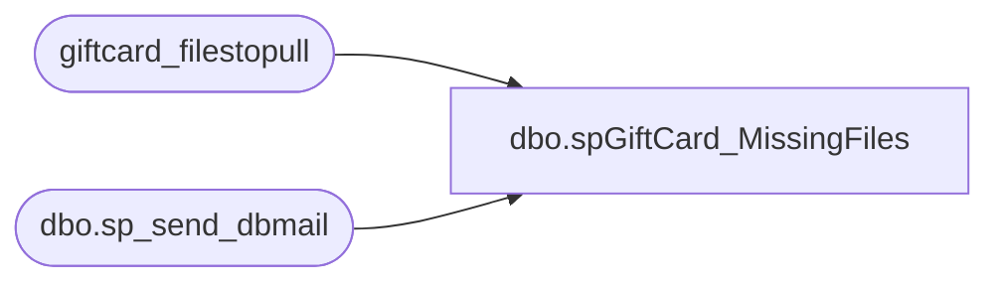

# dbo.spGiftCard_MissingFiles

**Database:** dw  
**Server:** papamart  

## Architecture Diagram



## Table Dependencies

| Referenced Table |
|---|
| giftcard_filestopull |
| dbo.sp_send_dbmail |

## Stored Procedure Code

```sql
CREATE PROCEDURE [dbo].[spGiftCard_MissingFiles]
 AS
-- =============================================================================================================
-- Name: spGiftCard_MissingFiles
--
-- Description:	

--
-- Input:		
--				
--
--
-- Output: 
--
-- Dependencies: 
--
-- Revision History
--		Name:			Date:			Comments:
--		GaryD			20090914		Update recipients
--		Davidr			20110421		removed RZ from error message
--		MikeP			20120807		Updated email body to include more notes
--		MikeP			20140724		replaced email procedure with sp_send_dbmail
--		MikeP			20150331		updated email with correct filenames, sftp address, etc
--		DanT			20151103		Added text alert, and ReadMe file attachment to email
--		DanT			20160507		Fixed part of code that deletes from ##PTD where count(*) = 6...
--										I changed it to >= 6 to prevent a false alarm if we have have an extra file one day
-- =============================================================================================================

declare @Days 		int
declare @recipients 	varchar(8000)

set @Days = 7
set @recipients = 'biadmin@buildabear.com'


IF (Object_ID('tempdb..##PTD') IS NOT NULL) DROP TABLE ##PTD
create table ##PTD (
	GroupCode			varchar(20),
	period_start_date	datetime
)

declare @GroupID 		varchar(20)
declare @GroupCode 		varchar(20)
declare @HeaderGroupIDRequired 	bit
declare @HeaderTable 	varchar(40)
declare @sql 			varchar(8000)

declare curPTD cursor
for	select GroupID, GroupCode, HeaderGroupIDRequired, HeaderTable from giftcard_filestopull where FileType='PTD' and Active = 1
open curPTD

fetch next from curPTD into @GroupID, @GroupCode, @HeaderGroupIDRequired, @HeaderTable
while (@@fetch_STATUS <> -1)
begin

	set @sql = '
		insert into ##PTD (GroupCode, period_start_date)
		select ''' + @GroupCode + ''' GroupCode, period_start_date
		from ' + @HeaderTable + '
		where cast(convert(varchar,period_start_date,101) as datetime) > dateadd(dd, -' + cast(@days as varchar) + ', getdate())
	'
	if @HeaderGroupIDRequired = 1
	begin
		set @sql = @sql + ' and GroupCode = ''' + @GroupCode + ''''
	end
	
	exec (@sql)

	fetch next from curPTD into @GroupID, @GroupCode, @HeaderGroupIDRequired, @HeaderTable
end
close curPTD
deallocate curPTD

-- we we have them all for a group, then the count will be 6, so just pop them
delete from ##PTD
where GroupCode in (
	select GroupCode
	from ##PTD
	group by GroupCode
	having count(*) >= 6
)

-- remove countries that aren't live yet
delete from ##PTD where groupcode in ('dk','sn','rz')

if (select count(*) from ##PTD) > 0
begin
	set @sql= '
		print ''Ignore some of following instruction and look here:  https://world.buildabear.com/depts/it/dba/DBA%20Wiki/ValueLink%20Giftcard%20Download.aspx''
		print ''THIS EMAIL WAS RUN FROM PAPAMART.DW.dbo.spGiftCard_MissingFiles'' 
		print '''' 
		print '''' 
		print '''' 
		print ''If a file is missing we might have a big problem and lots of work to do.''
		print '''' 
		print ''First, see why the BABWSCORE01 job "GiftCard Process Hourly_Recurring" didn''''t run.'' 
		print ''If we are still in the 24 hour window, rerunning the job should get the missing file'' 
		print '''' 
		print ''We can also run the following code to see what is going on in the debug table.'' 
		print ''     select top 500 * from dw..giftcard_debug order by id desc'' 
		print ''''
		print ''Check AuditWorks to see if the giftcards made it to auditworks:''
		print ''	select * from transaction_header where transaction_date = @Date and transaction_series = ''''G'''' ''	
		print '''' 
		print ''One days worth of data is only available for one day (the day runs from about 7:30 am to 7:30 am.''
		print '''' 
		print ''If we missed this window, there are a few days of older files out there.  However, they are in the downloaded ''
		print ''directory, but you will have to pull them manually.''
		print '''' 
		print '''' 
		print ''1. ftp to the appropriate site - see below for the correct IP address.  The username and private key ''
		print ''are in the databear password safe''
		print ''2. pull the file (NOTE:  The filename MUST be enclosed in ticks!!!!!!)''
		print ''3. rename the file to the correct naming standard - see below''
		print ''4. copy the file to the correct directory - see below''
		print ''5. change the <DaysPreviousToProcess> to the correct number of days to process.''		
		print '''' 
		print ''		216.66.216.11	''''PC1BBEAR''''		\\BABWSCORE01\GCArchive\Incoming''
		print ''		216.66.216.11	''''PC1BBEA1''''		\\BABWSCORE01\GCArchive\Incoming_International''
		print '''' 
		print ''Sample File names for the correct naming standard''
		print ''	US_CA_PTD_2363_20090301_081931.txt''
		print ''	UK_PTD_1217_20090304_114215.txt''
		print '''' 
		print '''' 
		print ''If we miss the files, we will need FirstData to put the file out on the FTP site so that we can grab it.''
		print '''' 
		print ''Call First Data Customer Support at 1.800.555.9966.  They have been quite helpful in the past''
		print '''' 
		print ''If you can not get help from customer support, ''
		print ''	Have ? contact the Account Manager.  This used to be Jennifer Wild''
		print ''''
		print ''''
		print ''Give them the file name we are looking for:''
		print ''US/CA file:				PC1BBEAR	North Platform''
		print ''International file		PC1BBEA1	North Platform''
		print ''''
		print ''There is more information regarding these files in papamart.dw.dbo.giftcard_filestopull.''
		print ''''
		print ''You can also get more information on the files by looking at the last files pulled:''
		print ''	select top 10 * from papamart.dw.dbo.giftcard_header order by fileid desc''
		print ''	select top 10 * from papamart.dw.dbo.giftcard_header_international order by fileid desc''
		print ''''
		print ''If the file does not get pulled during the 24 hour period, Customer Support will have to put the file out on the''
		print ''FTP site ''''''
		print ''''

		print ''''
		print ''The file should be picked up in the next 45 minutes or so.''
		print ''''
		print ''This job was run from papamart.dw.dbo.spGiftCard_MissingFiles and shows the few files that were loaded recently''
		print ''''

		select * from ##PTD
		order by GroupCode, period_start_date
	'
	exec msdb.dbo.sp_send_dbmail 
	@recipients = @recipients,
	@subject='ERROR!  ERROR!:  Missing GiftCard File', 
	@query_result_width = 250,
	@query= @sql,
	@file_attachments = '\\stl-sql-p-04\d$\BABWSCORE01_D\GCArchive\README\ReadMe.txt'

	exec msdb.dbo.sp_send_dbmail 
	@recipients = '3143249033@txt.att.net',
	@subject='ERROR!  ERROR!:  Missing GiftCard File', 
	@body = 'ERROR!  ERROR!:  Missing GiftCard File -- PAPAMART.DW.DW.spGiftCard_MissingFiles' 


end
```

