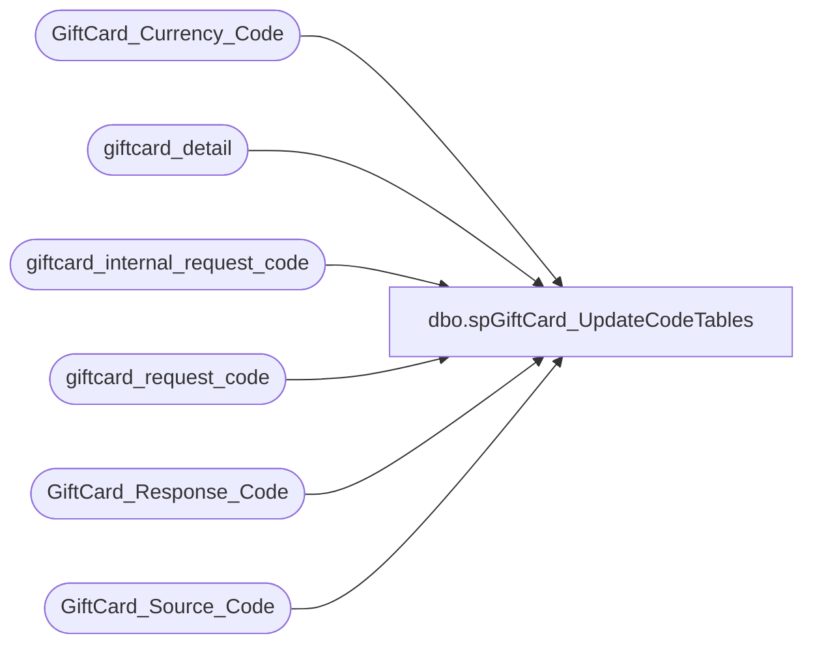

# dbo.spGiftCard_UpdateCodeTables

**Database:** dw  
**Server:** papamart  

## Architecture Diagram



## Table Dependencies

| Referenced Table |
|---|
| GiftCard_Currency_Code |
| giftcard_detail |
| giftcard_internal_request_code |
| giftcard_request_code |
| GiftCard_Response_Code |
| GiftCard_Source_Code |

## Stored Procedure Code

```sql
/*

This proc needs to run occasionaly so that all the giftcard code tables get updated.  Jack has started to use these 
tables though business objects and if he doesn't do a left join into these tables, he will not see all the records.

So, periodically, go through and create the code as a space holder.

*/

CREATE PROCEDURE [dbo].[spGiftCard_UpdateCodeTables]
AS
 
-- -- SET QUOTED_IDENTIFIER ON 
-- -- GO
-- -- SET ANSI_NULLS ON 
-- -- GO
 
set nocount off

-- fix missing descriptions in giftcard_request_code
insert into giftcard_request_code 
select distinct gd.request_code, girc.description + ' (Assumed Desc - Dave)'
-- select distinct gd.request_code, 'Assumed Description - Dave (' + girc.description + ')'
-- select gd.request_code, count(*) count, girc.internal_request_code, girc.description
from giftcard_detail gd
	left join giftcard_request_code c
	on c.request_code = gd.request_code
	join giftcard_internal_request_code girc
	on girc.internal_request_code = gd.request_code
where c.request_code is null
-- group by gd.request_code, girc.internal_request_code, girc.description
order by gd.request_code

insert into giftcard_request_code 
select distinct gd.request_code, 'Unknown - Dave'
from giftcard_detail gd
	left join giftcard_request_code c
	on c.request_code = gd.request_code
where c.request_code is null

-- fix missing descriptions in giftcard_internal_request_code
--insert into giftcard_request_code 
insert into giftcard_internal_request_code 
select distinct gd.internal_request_code, 'Unknown - Dave'
from giftcard_detail gd
	left join giftcard_internal_request_code c
	on c.internal_request_code = gd.internal_request_code
where c.internal_request_code is null

-- fix missing descriptions in GiftCard_Response_Code
insert into GiftCard_Response_Code 
select distinct gd.Response_Code, 'Unknown - Dave', 'Unknown - Dave'
from giftcard_detail gd
	left join GiftCard_Response_Code c
	on c.Response_Code = gd.Response_Code
where c.Response_Code is null

-- fix missing descriptions in GiftCard_Source_Code
insert into GiftCard_Source_Code 
select distinct gd.Source_Code, 'Unknown - Dave'
from giftcard_detail gd
	left join GiftCard_Source_Code c
	on c.Source_Code = gd.Source_Code
where c.Source_Code is null

-- fix missing descriptions in GiftCard_Currency_Code
insert into GiftCard_Currency_Code 
select distinct gd.base_currency_code, 'unk', 'Unknown - Dave'
from giftcard_detail gd
	left join GiftCard_Currency_Code c
	on c.Currency_Code = gd.base_currency_code
where c.Currency_Code is null

insert into GiftCard_Currency_Code 
select distinct gd.local_currency_code, 'unk', 'Unknown - Dave'
from giftcard_detail gd
	left join GiftCard_Currency_Code c
	on c.Currency_Code = gd.local_currency_code
where c.Currency_Code is null

insert into GiftCard_Currency_Code 
select distinct gd.reporting_currency_code, 'unk', 'Unknown - Dave'
from giftcard_detail gd
	left join GiftCard_Currency_Code c
	on c.Currency_Code = gd.reporting_currency_code
where c.Currency_Code is null
```

