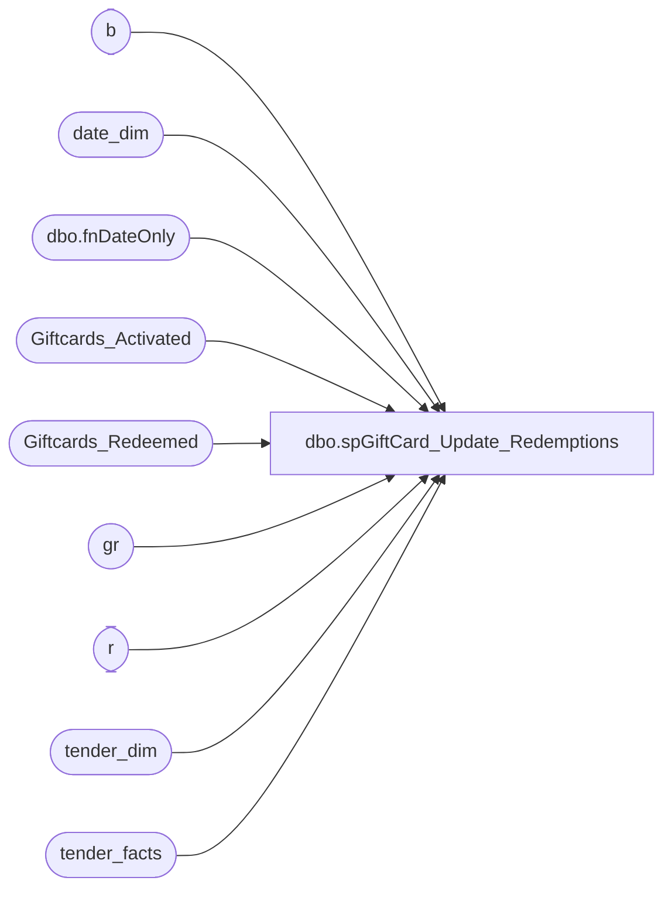

# dbo.spGiftCard_Update_Redemptions

**Database:** dw  
**Server:** papamart  

## Architecture Diagram



## Table Dependencies

| Referenced Table |
|---|
| b |
| date_dim |
| dbo.fnDateOnly |
| Giftcards_Activated |
| Giftcards_Redeemed |
| gr |
| r |
| tender_dim |
| tender_facts |

## Stored Procedure Code

```sql
CREATE PROCEDURE [dbo].[spGiftCard_Update_Redemptions]
	-- =============================================================================================================
	-- Name: spGiftCard_Update_Redemptions
	--
	-- Description:	
	--	Update the Giftcard Redemptions settting the:
	--		. Days since issued
	--		. Lift Amount
	--		. Discount applied at activation
	--
	--
	-- Input:		@numDaysHorizon = number of days to go back for the extraction
	--
	-- Output: 
	--
	-- Dependencies: 
	--
	-- Revision History
	--		Name:			Date:			Comments:
	--		Gary Murrish	4/25/2013		Created

	-- =============================================================================================================
	@numDaysHorizon AS int
AS

	SET NOCOUNT ON

	DECLARE @minDateKey AS int
	SELECT
		@minDateKey = date_key
	FROM
		date_dim dd WITH (NOLOCK)
	WHERE
		dd.actual_date = DATEADD(D, -1 * @numDaysHorizon, dbo.fnDateOnly(GETDATE()))

	-- Drop table #tmpRedemp
	SELECT
		*,
		CAST(0 AS money) AS priorRedemptionsThisBatch
	INTO #tmpRedemp
	FROM
		Giftcards_Redeemed gr WITH (NOLOCK)
	WHERE
		gr.date_key >= @minDateKey


	-- Set the date of the last redemption
	UPDATE #tmpRedemp
		SET daysSinceLastActivation = ISNULL(#tmpRedemp.date_key - (SELECT
				MAX(date_key)
			FROM
				Giftcards_Activated ga WITH (NOLOCK)
			WHERE
				ga.giftcard_no = #tmpRedemp.giftcard_no)
		, -1)


	-- Set the prior redemption amount for each giftcard in this batch for those cards where
	--		there is more than one redemption
	UPDATE #tmpRedemp
		SET priorRedemptionsThisBatch = ISNULL((SELECT
				SUM(redemption_amount)
			FROM
				#tmpRedemp x WITH (NOLOCK)
			WHERE
				x.giftcard_no = #tmpRedemp.giftcard_no
				AND x.transaction_id < #tmpRedemp.transaction_id)
		, 0)


	-- For each giftcard, construct the beginning balances
	-- Drop table #tmpBalance
	SELECT
		ga.giftcard_no,
		SUM(ga.activated_amount) AS activated_amount,
		SUM(ga.discount_amount) AS discount_amount,
		CAST(0 AS money) AS priorPostedDiscount,
		CAST(0 AS money) AS thisPostedDiscount
	INTO #tmpBalance
	FROM
		Giftcards_Activated ga WITH (NOLOCK)
		INNER JOIN (SELECT DISTINCT
				giftcard_no
			FROM
				#tmpRedemp r WITH (NOLOCK))
		x
			ON x.giftcard_no = ga.giftcard_no
	GROUP BY ga.giftcard_no


	-- Now compute for each of these giftcards, the amount of the discount
	--	which have previously been posted to redemptions
	UPDATE b
		SET priorPostedDiscount = x.priorPostedDiscount
	FROM
		#tmpBalance b
		INNER JOIN (SELECT
				gr.giftcard_no,
				SUM(gr.activation_discount_amount) AS priorPostedDiscount
			FROM
				Giftcards_Redeemed gr WITH (NOLOCK)
				INNER JOIN #tmpBalance b WITH (NOLOCK)
					ON gr.giftcard_no = b.giftcard_no
			WHERE
				gr.date_key < @minDateKey
			GROUP BY gr.giftcard_no)
		x
			ON x.giftcard_no = b.giftcard_no


	-- Set the amount of the original POS discount should be applied to this transaction
	UPDATE r
		SET r.activation_discount_amount =
			CASE
				WHEN x.openDiscount <= x.redemption_amount THEN x.openDiscount
				ELSE x.redemption_amount
			END
	FROM
		#tmpRedemp r WITH (NOLOCK)
		INNER JOIN (SELECT
				r.recID,
				b.giftcard_no,
				(b.discount_amount - b.priorPostedDiscount - r.priorRedemptionsThisBatch) AS openDiscount,
				r.redemption_amount
			FROM
				#tmpRedemp r WITH (NOLOCK)
				INNER JOIN #tmpBalance b WITH (NOLOCK)
					ON r.giftcard_no = b.giftcard_no
			WHERE
				(b.discount_amount - b.priorPostedDiscount - r.priorRedemptionsThisBatch) > 0)
		x
			ON x.recID = r.recID


	-- Now compute the lift on the redemptions
	-- Drop table #tmpLift
	SELECT
		x.transaction_id,
		x.totalRedemption,
		ISNULL(tender.totalTender, 0) AS totalTender,
		x.firstGiftcard_No
	INTO #tmpLift
	FROM
		(SELECT
				r.transaction_id,
				SUM(r.redemption_amount) AS totalRedemption,
				MIN(r.giftcard_no) AS firstGiftcard_No

			FROM
				#tmpRedemp r
			GROUP BY r.transaction_id)
		x
		LEFT JOIN (SELECT
				tf.transaction_id,
				SUM(CASE
					WHEN td.tender_code = 640 THEN -1 * tf.tender_amt
					ELSE tf.tender_amt
				END) AS totalTender
			FROM
				tender_facts tf WITH (NOLOCK)
				INNER JOIN tender_dim td WITH (NOLOCK)
					ON tf.tender_key = td.tender_key
			WHERE
				td.tender_code <> 633
			GROUP BY tf.transaction_id)
		tender
			ON tender.transaction_id = x.transaction_id


	-- Now post a percentage of the lift to each giftcard
	UPDATE r
		SET r.lift_amount = ROUND(l.totalTender * (r.redemption_amount / l.totalRedemption), 2)
	FROM
		#tmpRedemp r WITH (NOLOCK)
		INNER JOIN #tmpLift l WITH (NOLOCK)
			ON r.transaction_id = l.transaction_id

	-- Build the total lift differences that need to be adjusted
	-- Drop table #tmpNeedToAdjust
	SELECT
		l.*,
		x.postedLift
	INTO #tmpNeedToAdjust
	FROM
		(SELECT
				r.transaction_id,
				SUM(r.lift_amount) AS postedLift
			FROM
				#tmpRedemp r
			GROUP BY r.transaction_id)
		x
		INNER JOIN #tmpLift l WITH (NOLOCK)
			ON l.transaction_id = x.transaction_id
	WHERE
		x.postedLift <> l.totalTender

	-- Put any rounding differences on the first giftcard
	UPDATE r
		SET r.lift_amount = r.lift_amount + (adj.totalTender - adj.postedLift)
	FROM
		#tmpRedemp r
		INNER JOIN #tmpNeedToAdjust
		adj
			ON adj.transaction_id = r.transaction_id
			AND adj.firstGiftcard_No = r.giftcard_no

	-- We now have the Purchase Discount, Lift, and Days since activation
	--	Update the master file for any of those which are different
	UPDATE gr
		SET	gr.daysSinceLastActivation = r.daysSinceLastActivation,
			gr.lift_amount = r.lift_amount,
			gr.activation_discount_amount = r.activation_discount_amount
	FROM
		Giftcards_Redeemed gr
		INNER JOIN #tmpRedemp r WITH (NOLOCK)
			ON gr.recID = r.recID
	WHERE gr.daysSinceLastActivation <> r.daysSinceLastActivation
	OR gr.lift_amount <> r.lift_amount
	OR gr.activation_discount_amount <> r.activation_discount_amount


dbo,spRPT_Product_TransWithSKUs,-- =====================================================================================================
-- Name: spRPT_Product_TransWithSKUs
--
-- Description:	Pulls transaction data from the data warehouse for specific SKUs
--
-- Input:	
--			@fromDate			datetime	Sets date range
--			@thruDate			datetime	
--			@selSKUs			varchar(MAX) A comma delimited list of SKUs
--
-- Output: Resultset 
--			
--
-- Dependencies: None
--
-- Revision History
--		Name:			Date:			Comments:
--		Gary Murrish	1/4/2012		Initial Release
-- =====================================================================================================
CREATE PROCEDURE spRPT_Product_TransWithSKUs @fromDate DATETIME,
                                             @thruDate DATETIME,
                                             @selSKUs  VARCHAR(MAX)
                                             
AS
BEGIN
	-- SET NOCOUNT ON added to prevent extra result sets from
	-- interfering with SELECT statements.
	SET NOCOUNT ON;

	DECLARE @fromDateKey INT
	DECLARE @thruDateKey INT

	SET @fromDateKey = (SELECT date_key
						FROM
							date_dim dd WITH (NOLOCK)
						WHERE
							actual_date = @fromDate)
	SET @thruDateKey = (SELECT date_key
						FROM
							date_dim dd WITH (NOLOCK)
						WHERE
							actual_date = @thruDate)


	IF object_id('tempdb..#tmpTransProduct') IS NOT NULL
		DROP TABLE #tmpTransProduct

	SELECT tdf.transaction_id
		 , sku
		 , sum(unit_gross_amount) AS unit_gross_amount
		 , sum(cast(CASE
						WHEN unit_gross_amount < 0 THEN
							-1
						ELSE
							1
					END AS INTEGER)) AS productReturn
	INTO
		#tmpTransProduct
	FROM
		dw.dbo.transaction_detail_facts tdf WITH (NOLOCK)
		INNER JOIN dw.dbo.product_dim pd WITH (NOLOCK)
			ON tdf.product_key = pd.product_key
		INNER JOIN dw.dbo.fn_String_To_Table(@selSKUs, ',', 1)
			ON pd.sku = Val
	WHERE
		tdf.date_key BETWEEN @fromDateKey AND @thruDateKey
	GROUP BY
		tdf.transaction_id
	  , sku


	IF object_id('tempdb..#tmpTransactions') IS NOT NULL
		DROP TABLE #tmpTransactions

	SELECT tp.transaction_id
		 , sum(tp.productReturn) AS skuCount
	INTO
		#tmpTransactions
	FROM
		#tmpTransProduct tp WITH (NOLOCK)
	GROUP BY
		tp.transaction_id


	IF object_id('tempdb..#tmpTransSum') IS NOT NULL
		DROP TABLE #tmpTransSum

	SELECT tf.transaction_id
		 , tf.merchandise_units AS merchUnits
		 , tf.unit_gross_amount AS uga
		 , tf.unit_discount_amount AS uda
		 , tf.transaction_type_key
		 , tf.GAAP_sales_amount AS GAAPSales
		 , tf.animal_units AS AnimalUnits
		 , tf.accessories_units AS AccessoryUnits
		 , tf.sounds_units AS SoundUnits
		 , tf.clothing_units AS ClothesUnits
		 , tf.footwear_units AS ShoeUnits
		 , ttd.transaction_type
		 , tf.party_flag AS isParty
		 , t.skuCount
		 , tf.store_key
		 , tf.date_key
	INTO
		#tmpTransSum
	FROM
		Transaction_Facts tf WITH (NOLOCK)
		INNER JOIN #tmpTransactions t WITH (NOLOCK)
			ON t.transaction_id = tf.transaction_id
		INNER JOIN Transaction_Type_Dim ttd WITH (NOLOCK)
			ON tf.transaction_type_key = ttd.transaction_key


	SELECT 'SKU' AS record_Type
		 , store_id AS Store
		 , fiscal_year AS [Fiscal Year]
		 , fiscal_week AS [Fiscal Week]
		 , transaction_type AS [Transaction Type]
		 , sku AS [SKU]
		 , count(DISTINCT t.transaction_id) AS [Trans Count]
		 , sum(t.productReturn) AS [SKU Count]
		 , sum(animalunits) AS [Animal Units]
		 , sum(merchunits) AS [Total Units]
		 , sum(gaapsales) AS [GAAP Sales]
		 , sum(uga) AS [UGA]
		 , sum(uda) AS [UDA]
	FROM
		#tmpTransProduct t
		LEFT JOIN #tmpTransSum ts
			ON t.transaction_id = ts.transaction_id
		INNER JOIN dw.dbo.store_dim sd
			ON ts.store_key = sd.store_key
		INNER JOIN dw.dbo.date_dim dd
			ON ts.date_key = dd.date_key
	GROUP BY
		store_id
	  , fiscal_year
	  , fiscal_week
	  , transaction_type
	  , sku

	UNION ALL
	SELECT 'TOTAL' AS record_Type
		 , store_id AS Store
		 , fiscal_year AS [Fiscal Year]
		 , fiscal_week AS [Fiscal Week]
		 , transaction_type AS [Transaction Type]
		 , 0 AS [SKU]
		 , count(DISTINCT t.transaction_id) AS [Trans Count]
		 , sum(t.productReturn) AS [SKU Count]
		 , sum(animalunits) AS [Animal Units]
		 , sum(merchunits) AS [Total Units]
		 , sum(gaapsales) AS [GAAP Sales]
		 , sum(uga) AS [UGA]
		 , sum(uda) AS [UDA]
	FROM
		#tmpTransProduct t
		LEFT JOIN #tmpTransSum ts
			ON t.transaction_id = ts.transaction_id
		INNER JOIN dw.dbo.store_dim sd
			ON ts.store_key = sd.store_key
		INNER JOIN dw.dbo.date_dim dd
			ON ts.date_key = dd.date_key
	GROUP BY
		store_id
	  , fiscal_year
	  , fiscal_week
	  , transaction_type
END
```

