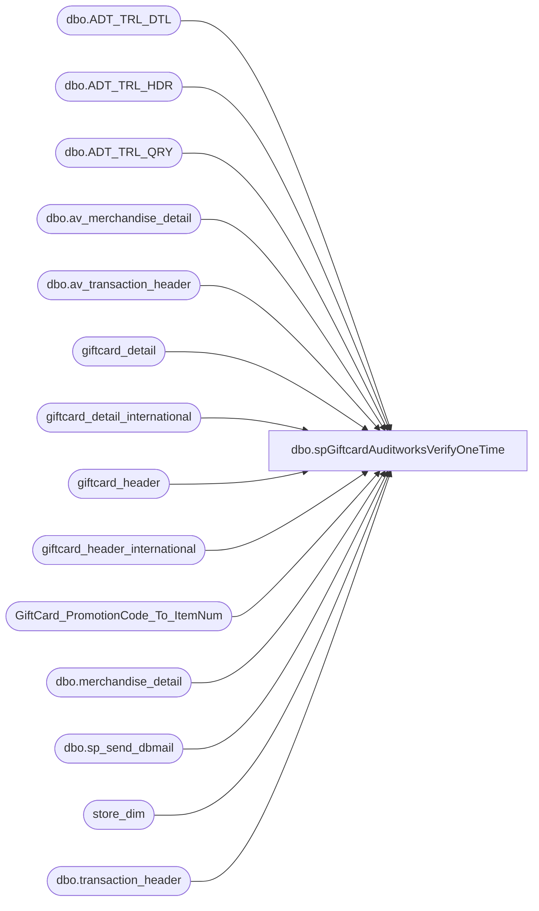

# dbo.spGiftcardAuditworksVerifyOneTime

**Database:** dw  
**Server:** papamart  

## Architecture Diagram



## Table Dependencies

| Referenced Table |
|---|
| dbo.ADT_TRL_DTL |
| dbo.ADT_TRL_HDR |
| dbo.ADT_TRL_QRY |
| dbo.av_merchandise_detail |
| dbo.av_transaction_header |
| giftcard_detail |
| giftcard_detail_international |
| giftcard_header |
| giftcard_header_international |
| GiftCard_PromotionCode_To_ItemNum |
| dbo.merchandise_detail |
| dbo.sp_send_dbmail |
| store_dim |
| dbo.transaction_header |

## Stored Procedure Code

```sql
CREATE PROCEDURE [dbo].[spGiftcardAuditworksVerifyOneTime] AS
-- =============================================================================================================
-- Name: spGiftcardAuditworksVerify
--
-- Description:	

--
-- Input:		
--				
--
--
-- Output: 
--
-- Dependencies: 
--
-- Revision History
--		Name:			Date:			Comments:
--		GaryD			20090914		Update recipients
--		GaryD			20100818		Record current prod version
--		GaryD			20100819		Update server name for SA 5.0 and remove openrowset.
--		GaryD			20100914		Correct linked server name.
--		davidr			20101026		fixed gary's attempt at removing my openrowset
--		davidr			20101208		new webcart kludge for store 0/13
--		MikeP			20140724		replaced email procedure with sp_send_dbmail
--		DanTweedie		20160325		Replaced recipients to be BIAdmin instead of Databears, changed profile to BIAdmin.
--		DanTweedie		20160513		Added lookup for Deleted transactions, exclude these from alert criteria
--		Dan Tweedie		20161212		Modified email query to show qty from Valuelink vs qty from Sales Audit
-- =============================================================================================================
set nocount on

IF (Object_ID('tempdb..#fileid') IS NOT NULL) DROP TABLE #fileid
select fileid 
into #fileid
from giftcard_header 
where dw_processed_date > DateAdd(dd, -7, getdate())

IF (Object_ID('tempdb..#fileid_international') IS NOT NULL) DROP TABLE #fileid_international
select fileid 
into #fileid_international
from giftcard_header_international 
where groupcode = 'UK' and dw_processed_date > DateAdd(dd, -7, getdate())

IF (Object_ID('tempdb..##valuelink') IS NOT NULL) DROP TABLE ##valuelink
select file_type, period_start_date, store_id, item_num, count(*) count, cast(0 as bit) found
into ##valuelink
from (
	select 'us_ca' file_type, gcd.FileID, LineID, period_start_date, 
		case when s.store_id = 0 and gcd.clerk_id = 'BABW_PMS' then 13 when s.store_id = 0 then 990 else s.store_id end store_id, 
		case when (store_id = 13 or (s.store_id = 0 and gcd.clerk_id = 'BABW_PMS')) and store13_item_num is not null then store13_item_num 
	       else item_num 
	  end item_num
	from 
	   giftcard_header gch with (nolock)
	   join giftcard_detail gcd with (nolock)
	   on gcd.FileID = gch.FileID
	   join GiftCard_PromotionCode_To_ItemNum i with (nolock)
	   on i.promotion_code = gcd.promotion_code
	   join store_dim s
	   on s.store_key = gcd.store_key
	Where 1=1
	   and internal_request_code in (18, 28)
	   and gcd.promotion_code != 0
	   and exported_date is not null
	   and period_start_date >= '11/23/2004'
	   and gch.fileid in (select fileid from #fileid)

	union
	
	select 'uk' file_type, gcd.FileID, LineID, period_start_date, case when s.store_id = 0 then 2990 else s.store_id end store_id, item_num
	from 
	   giftcard_header_international gch with (nolock)
	   join giftcard_detail_international gcd with (nolock)
	   on gcd.FileID = gch.FileID
	   join GiftCard_PromotionCode_To_ItemNum i with (nolock)
	   on i.promotion_code = gcd.promotion_code
	   join store_dim s
	   on s.store_key = gcd.store_key
	Where 1=1
	   and internal_request_code in (18, 28)
	   and gcd.promotion_code != 0
	   and period_start_date >= '10/29/2006'
	   and exported_date is not null
	   and gch.fileid in (select fileid from #fileid_international)

) d
group by file_type, period_start_date, store_id, item_num

-- **************************************************************************************************************
-- **************************************************************************************************************
-- **************************************************************************************************************

IF (Object_ID('tempdb..##giftcards_POSDbsSA') IS NOT NULL) DROP TABLE ##giftcards_POSDbsSA
select store_no, entry_date_time, upc_no, sum(units) units, cast(0 as bit) found
into ##giftcards_POSDbsSA
from (
	select store_no, entry_date_time, upc_no, units
	from bedrockdb01.auditworks.dbo.transaction_header th with (nolock)
		join bedrockdb01.auditworks.dbo.merchandise_detail md with (nolock)
		on md.transaction_id = th.transaction_id
	where transaction_series = 'G'
		and entry_date_time in (select distinct period_start_date from ##valuelink)
	union
	select store_no, entry_date_time, upc_no, units
	from bedrockdb01.auditworks.dbo.av_transaction_header th with (nolock)
		join bedrockdb01.auditworks.dbo.av_merchandise_detail md with (nolock)
		on md.av_transaction_id = th.av_transaction_id
	where transaction_series = 'G'
		and entry_date_time in (select distinct period_start_date from ##valuelink)
) d
group by store_no, entry_date_time, upc_no

--====this tells us if a G transaction was deleted in sales audit for same store and date as a transaction from our valuelink dataset
--we can't get style and qty from audit trail, but if a transaction was delete, it can be assumed to be the same transaction
--per Linda Keeney, this would likely be the result of store 472 accidentally entering a giftcard transaction and Linda deleting it.
IF (Object_ID('tempdb..#Deleted') IS NOT NULL) DROP TABLE #Deleted
select 
	ATQ.KEY_PART_VAL_1 AS STORE_NO,
	ATQ.KEY_PART_VAL_3 AS TRANSACTION_DATE
	--ATQ.KEY_PART_VAL_8 AS TRANSACTION_ID,
	--ATQ.KEY_PART_VAL_5 AS TRANSACTION_NO,
into #Deleted
from bedrockdb01.auditworks.dbo.ADT_TRL_HDR ATH
JOIN bedrockdb01.auditworks.dbo.ADT_TRL_DTL ATD ON ATH.ENTRY_ID = ATD.ENTRY_ID
JOIN bedrockdb01.auditworks.dbo.ADT_TRL_QRY ATQ ON ATH.ENTRY_ID = ATQ.ENTRY_ID
JOIN ##valuelink v on ATQ.KEY_PART_VAL_1 = v.store_id
	and cast(ATQ.KEY_PART_VAL_3 as date) = cast(period_start_date as date) 
where ATH.ROOT_TBL_NAME = 'TRANSACTION'
AND ATD.ACTN_CODE = 'D' --delete
AND ATQ.KEY_PART_VAL_6 = 'G' --gift card

update ##valuelink
set found = 1
from ##valuelink v
	join ##giftcards_POSDbsSA o
	on o.entry_date_time = v.period_start_date
	and o.store_no = v.store_id
	and o.upc_no = v.item_num
	and o.units = v.count

update ##valuelink
set found = 1
from ##valuelink v
join #Deleted d on cast(v.period_start_date as date) = cast(d.TRANSACTION_DATE as date)
	and v.store_id = d.STORE_NO

update ##giftcards_POSDbsSA
set found = 1
from ##giftcards_POSDbsSA o
	join ##valuelink v
	on v.period_start_date = o.entry_date_time
	and v.store_id = o.store_no
	and v.item_num = o.upc_no
	and v.count = o.units


--if (select count(*) from ##valuelink where found = 0) > 0 
begin
	declare @subject varchar(200)
	declare @recipients varchar(200)

	
	set @recipients = 'ianw@buildabear.com'
	set @subject = 'Giftcard to Auditworks Problems'

	exec msdb.dbo.sp_send_dbmail  
	 @profile_name='BIAdmin'
	,@recipients=@recipients
	,@subject = @subject
	,@query_result_width = 200	
	,@query = '
	print ''VALUELINK vs SALES AUDIT: GIFTCARD UNIT VARIANCES PER DATE, STORE AND ITEM''
	print ''''
	
	set nocount on
	
	print ''''
	
	--NEW QUERY TO SHOW UNIT QTY COMPARISON
	select 
	vl.file_type,
	cast(vl.period_start_date as date) file_date,
	vl.store_id,
	vl.item_num,
	cast(vl.count as int) VL_Units,
	cast(isnull(aw.units,0) as int) as AW_Units
	from 
		##valuelink vl
	left join ##giftcards_POSDbsSA aw 
		on vl.period_start_date = aw.entry_date_time
		and vl.store_id = aw.store_no
		and vl.item_num = aw.upc_no
	--where vl.store_id = 105 and vl.item_num = 24529
	where (cast(vl.count as int) <> cast(aw.units as int) or aw.units is null)
	and vl.store_id not in (396, 426) --per Linda, these are Bakeshop and not in SA
	order by cast(vl.period_start_date as date), vl.store_id, vl.item_num, cast(vl.count as int) 

	print ''''
	print ''this was run from papamart.dw..spGiftcardAuditworksVerify''
	'
end
```

