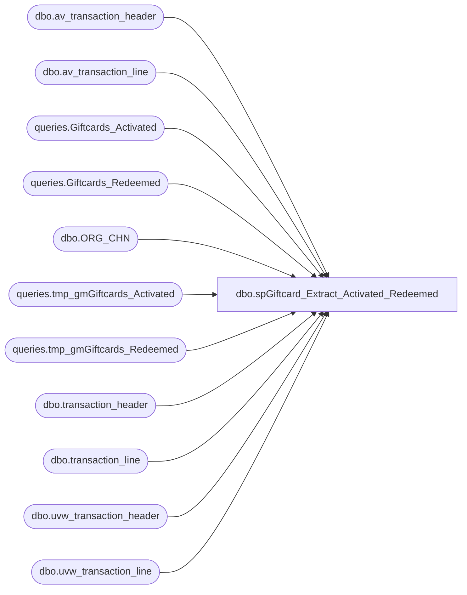

# dbo.spGiftcard_Extract_Activated_Redeemed

**Database:** dw  
**Server:** papamart  

## Architecture Diagram



## Table Dependencies

| Referenced Table |
|---|
| dbo.av_transaction_header |
| dbo.av_transaction_line |
| queries.Giftcards_Activated |
| queries.Giftcards_Redeemed |
| dbo.ORG_CHN |
| queries.tmp_gmGiftcards_Activated |
| queries.tmp_gmGiftcards_Redeemed |
| dbo.transaction_header |
| dbo.transaction_line |
| dbo.uvw_transaction_header |
| dbo.uvw_transaction_line |

## Stored Procedure Code

```sql
CREATE PROCEDURE [dbo].[spGiftcard_Extract_Activated_Redeemed]
	@numDaysHorizon int = 60
AS

-- =============================================================================================================
-- Name: spGiftCard_Extract_Activated_Redeemed
--
-- Description:	This will extract the information for activation and redemption of giftcards from Auditworks
--			The results are stored in the tables:
--				queries.Giftcards_Activated
--			and queries.Giftcards_Redeemed
--		
--			This is normally submitted by Jack McCormick whenever he wants to do an analysis of the Giftcards
--			using powerPivot.
--
-- Input:		
--				
--
--
-- Output: 
--
-- Dependencies: 
--
-- Revision History
--		Name:					Date:			Comments:
--		Mike Pelikan			04/06/2015		Split the view into a union
--		Gary Murrish			12/1/2012		Added 24 as an action for a card issue
--		Gary Murrish			11/29/2011		Added a 60 day horizon to speed up
--		Gary Murrish			7/1/2011		Migrated to permanent tables
--		Gary Murrish			5/17/2011		Initial release
-- =============================================================================================================

BEGIN
	-- SET NOCOUNT ON added to prevent extra result sets from
	-- interfering with SELECT statements.
    SET NOCOUNT ON ;

/* Extract Gift Cards Activated */

    IF OBJECT_ID(N'queries.tmp_gmGiftcards_Activated') IS NOT NULL 
        DROP TABLE queries.tmp_gmGiftcards_Activated


    SELECT
        th.store_no
       ,th.register_no
       ,th.transaction_no
       ,th.av_transaction_id transaction_id
       ,th.transaction_date
       ,tl.gross_line_amount
       ,tl.pos_discount_amount
       ,LTRIM(RTRIM(tl.reference_no)) COLLATE SQL_Latin1_General_CP1_CI_AS reference_no
       ,tl.db_cr_none
       ,ORG.DFLT_CRNCY_CODE
    INTO
        queries.tmp_gmGiftcards_Activated
    FROM
        bedrockdb01.auditworks.dbo.av_transaction_header th WITH (nolock)
    INNER JOIN bedrockdb01.auditworks.dbo.av_transaction_line tl WITH (nolock)
        ON th.av_transaction_id = tl.av_transaction_id
    INNER JOIN bedrockdb01.auditworks.dbo.ORG_CHN ORG WITH (NOLOCK)
        ON th.store_no = ORG.ORG_CHN_NUM
    WHERE
    th.transaction_date >= dateadd(d,-1 * @numDaysHorizon,getdate()) and
    tl.reference_no IS NOT NULL
    AND th.transaction_void_flag = 0
    AND tl.line_void_flag <> 1
    AND tl.gross_line_amount <> 0
    AND LEFT(tl.reference_no, 1) = '6'
    AND ((line_object = 403  -- E-Card Activations
          AND line_action = 1)
         OR (line_object = 404  -- Gift Card Activations
             AND line_action = 1)
         OR (line_object = 633  -- Gift Card Activations
             AND line_action in (12,24)))			-- Added 24 as a valid action code

INSERT INTO queries.tmp_gmGiftcards_Activated
SELECT
        th.store_no
       ,th.register_no
       ,th.transaction_no
       ,th.transaction_id
       ,th.transaction_date
       ,tl.gross_line_amount
       ,tl.pos_discount_amount
       ,LTRIM(RTRIM(tl.reference_no)) COLLATE SQL_Latin1_General_CP1_CI_AS reference_no
       ,tl.db_cr_none
       ,ORG.DFLT_CRNCY_CODE
    FROM
        bedrockdb01.auditworks.dbo.transaction_header th WITH (nolock)
    INNER JOIN bedrockdb01.auditworks.dbo.transaction_line tl WITH (nolock)
        ON th.transaction_id = tl.transaction_id
    INNER JOIN bedrockdb01.auditworks.dbo.ORG_CHN ORG WITH (NOLOCK)
        ON th.store_no = ORG.ORG_CHN_NUM
    WHERE
    th.transaction_date >= dateadd(d,-1 * @numDaysHorizon,getdate()) and
    tl.reference_no IS NOT NULL
    AND th.transaction_void_flag = 0
    AND tl.line_void_flag <> 1
    AND tl.gross_line_amount <> 0
    AND LEFT(tl.reference_no, 1) = '6'
    AND ((line_object = 403  -- E-Card Activations
          AND line_action = 1)
         OR (line_object = 404  -- Gift Card Activations
             AND line_action = 1)
         OR (line_object = 633  -- Gift Card Activations
             AND line_action in (12,24)))			-- Added 24 as a valid action code

-- (2281622 row(s) affected)	19:27 Min	7/1/2011

-- Insert into the 'Permanent' Table

INSERT INTO queries.Giftcards_Activated(
			store_no
		  , register_no
		  , transaction_no
		  , transaction_id
		  , transaction_date
		  , gross_line_amount
		  , pos_discount_amount
		  , giftcard_no
		  , DFLT_CRNCY_CODE)
SELECT
	   TRANS.store_no
	 , trans.register_no
	 , trans.transaction_no
	 , trans.transaction_id
	 , trans.transaction_date
	 , trans.gross_line_amount
	 , trans.pos_discount_amount
	 , trans.reference_no
	 , trans.DFLT_CRNCY_CODE
  FROM
	  (
	   SELECT 
			  store_no
			, register_no
			, transaction_no
			, transaction_id
			, transaction_date
			, reference_no
			, DFLT_CRNCY_CODE
			, SUM(gross_line_amount * db_cr_none * -1)AS gross_line_amount
			, SUM(pos_discount_amount * db_cr_none * -1)AS pos_discount_amount
		 FROM queries.tmp_gmGiftcards_Activated T WITH (NOLOCK)
		 GROUP BY
				  store_no
				, register_no
				, transaction_no
				, transaction_id
				, transaction_date
				, reference_no
				, DFLT_CRNCY_CODE) AS TRANS
	  LEFT JOIN queries.Giftcards_Activated PERM WITH (NOLOCK)
		  ON TRANS.transaction_id = PERM.transaction_id
		 AND trans.reference_no = PERM.giftcard_no
  WHERE PERM.transaction_id IS NULL;	
	     

/* Gift Cards Redeemed */


    IF OBJECT_ID(N'queries.tmp_gmGiftcards_Redeemed') IS NOT NULL 
        DROP TABLE queries.tmp_gmGiftcards_Redeemed

    SELECT
        th.store_no
       ,th.register_no
       ,th.transaction_no
       ,th.transaction_id
       ,th.transaction_date
       ,tl.gross_line_amount
       ,tl.pos_discount_amount
       ,LTRIM(RTRIM(tl.reference_no)) COLLATE SQL_Latin1_General_CP1_CI_AS reference_no
       ,tl.db_cr_none
       ,ORG.DFLT_CRNCY_CODE
    INTO
        queries.tmp_gmGiftcards_Redeemed
    FROM
        bedrockdb01.auditworks.dbo.uvw_transaction_header th WITH (nolock)
    INNER JOIN bedrockdb01.auditworks.dbo.uvw_transaction_line tl WITH (nolock)
        ON th.transaction_id = tl.transaction_id
    INNER JOIN bedrockdb01.auditworks.dbo.ORG_CHN ORG WITH (NOLOCK)
        ON th.store_no = ORG.ORG_CHN_NUM
    WHERE
    th.transaction_date >= dateadd(d,-1 * @numDaysHorizon,getdate()) and
    tl.reference_no IS NOT NULL
    AND th.transaction_void_flag = 0
    AND tl.line_void_flag <> 1
    AND tl.gross_line_amount <> 0
    AND ((tl.line_object = 404
          AND tl.line_action = 2)		-- Gift Card Redemptions
         OR (tl.line_object = 633
             AND tl.line_action = 25)	-- Gift Card redemptions
        )
	INSERT INTO queries.tmp_gmGiftcards_Redeemed
	SELECT
        th.store_no
       ,th.register_no
       ,th.transaction_no
       ,th.av_transaction_id
       ,th.transaction_date
       ,tl.gross_line_amount
       ,tl.pos_discount_amount
       ,LTRIM(RTRIM(tl.reference_no)) COLLATE SQL_Latin1_General_CP1_CI_AS reference_no
       ,tl.db_cr_none
       ,ORG.DFLT_CRNCY_CODE
    
    FROM
        bedrockdb01.auditworks.dbo.av_transaction_header th WITH (nolock)
    INNER JOIN bedrockdb01.auditworks.dbo.av_transaction_line tl WITH (nolock)
        ON th.av_transaction_id = tl.av_transaction_id
    INNER JOIN bedrockdb01.auditworks.dbo.ORG_CHN ORG WITH (NOLOCK)
        ON th.store_no = ORG.ORG_CHN_NUM
    WHERE
    th.transaction_date >= dateadd(d,-1 * @numDaysHorizon,getdate()) and
    tl.reference_no IS NOT NULL
    AND th.transaction_void_flag = 0
    AND tl.line_void_flag <> 1
    AND tl.gross_line_amount <> 0
    AND ((tl.line_object = 404
          AND tl.line_action = 2)		-- Gift Card Redemptions
         OR (tl.line_object = 633
             AND tl.line_action = 25)	-- Gift Card redemptions
        )
-- (2260882 row(s) affected)  1:34 Min 7/1/2011

INSERT INTO queries.Giftcards_Redeemed (
	store_no,
	register_no,
	transaction_no,
	transaction_id,
	transaction_date,
	gross_line_amount,
	pos_discount_amount,
	giftcard_no,
	DFLT_CRNCY_CODE
) 

-- Insert any new records into the 'Permanent Tables'
SELECT 
	   T.store_no,
	   T.register_no,
	   T.transaction_no,
	   T.transaction_id,
	   T.transaction_date,
	   T.gross_line_amount,
	   T.pos_discountamount,
	   T.reference_no,
	   T.DFLT_CRNCY_CODE
	   
  FROM
	  (
	   SELECT
			  store_no
			, register_no
			, transaction_no
			, transaction_id
			, transaction_date
			, reference_no
			, DFLT_CRNCY_CODE
			, SUM(gross_line_amount * db_cr_none)AS gross_line_amount
			, SUM(pos_discount_amount * db_cr_none)AS pos_discountamount
		 FROM queries.tmp_gmGiftcards_Redeemed TEMP WITH (NOLOCK)
		 GROUP BY
				  store_no
				, register_no
				, transaction_no
				, transaction_id
				, transaction_date
				, reference_no
				, DFLT_CRNCY_CODE)AS T
	  LEFT JOIN queries.Giftcards_Redeemed RED WITH (NOLOCK)
		  ON T.transaction_id = RED.transaction_id
		 AND t.reference_no = RED.giftcard_no
  WHERE RED.transaction_id IS NULL;

END
```

