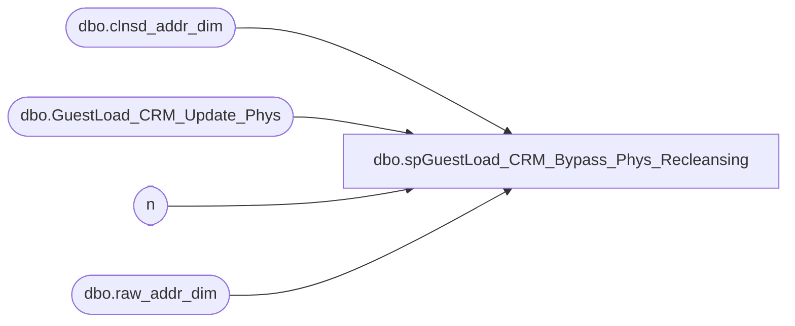

# dbo.spGuestLoad_CRM_Bypass_Phys_Recleansing

**Database:** dw  
**Server:** papamart  

## Architecture Diagram



## Table Dependencies

| Referenced Table |
|---|
| dbo.clnsd_addr_dim |
| dbo.GuestLoad_CRM_Update_Phys |
| n |
| dbo.raw_addr_dim |

## Stored Procedure Code

```sql
-- =============================================================================================================
-- Name: spGuestLoad_CRM_Bypass_Phys_Recleansing
--
-- Description:	
--		The problem is that when we update a CRM physical address, this causes the update date to be set and
--		will cause the record to come back down through the guest load the next day.
--
--		It also means that this is a new raw address that must be cleansed because we didn't find the proper
--		raw to cleansed match in raw_addr_dim.  
--
--		So, since we know this is a cleansed address, why not just through it into raw_addr_dim and point it
--		to itself?  This will cut down a lot of work.  Just imagine updating 500,000 crm addresses and having
--		them be cleansed at 20 rows per second.  We are talking of saving hours of work.
--
--		NOTE:  this only grabs addresses where the batch_id is null and should be run after the insert into 
--				the GuestLoad_CRM_Update_Phys table.  this will catch these new records before GaryM's
--				code processes them up to CRM.
--
-- Input:
--		@etl_log_id			int	
--			Current load to process
--
--		@etl_evnt_id		int	
--			Current load to process
--
-- Output: 
--
-- Dependencies: 
--
-- EXAMPLE:
--		exec dw.dbo.spGuestLoad_CRM_Bypass_Phys_Recleansing 123, 123
--
-- Revision History
--		Name:			Date:			Comments:
--		Dave Rice		3/29/2011		created
-- =============================================================================================================
CREATE PROCEDURE [dbo].[spGuestLoad_CRM_Bypass_Phys_Recleansing](@etl_log_id int, @etl_evnt_id int)
AS
BEGIN
-- SET NOCOUNT ON added to prevent extra result sets from
-- interfering with SELECT statements.
SET NOCOUNT ON

------select top 1 etl_log_id from dwstaging.dbo.load_rec_id_cntrl with (nolock)
--declare @etl_log_id int
--declare @etl_evnt_id int
--set @etl_log_id = 123
--set @etl_evnt_id = 123

-- pull any physical updates that are flowing up to CRM
IF (Object_ID('tempdb..#new_rad') IS NOT NULL) DROP TABLE #new_rad
select distinct
	cad.clnsd_addr_id,
	cast(null as integer) raw_addr_id,
	
	cad.addr_ln_1_txt addr_ln_1_txt,
	cad.apt_unit_nbr addr_ln_2_txt,
	cad.cty_nm,
	cad.st_prvnc_abbrv st_prvnc_txt,
	cad.pstl_cd + case when cad.pstl_pls_4_cd is not null then '-' + cad.pstl_pls_4_cd else '' end pstl_cd,
	cad.cntry_abbrv cntry_txt,
	case 
		when cad.cntry_abbrv = 'USA' then 'US'
		when cad.cntry_abbrv = 'GBR' then 'GB'
		when cad.cntry_abbrv = 'CAN' then 'CA'
		when cad.cntry_abbrv = 'CAF' then 'CA'
	end drvd_cntry_abbrv,

	case when cad.mail_stat_cd = 'OPT-IN' then 'Y' else 'N' end drvd_mail_stat_cd,

	getdate() ins_dt,
	getdate() updt_dt,
	getdate() beg_eff_dt,
	cast('1/1/3000' as datetime) end_eff_dt,
	@etl_log_id etl_log_id,
	@etl_evnt_id etl_evnt_id, 

	(binary_checksum(lower(cad.addr_ln_1_txt),lower(cad.apt_unit_nbr),NULL,lower(cad.cty_nm),lower(cad.pstl_cd + case when cad.pstl_pls_4_cd is not null then '-' + cad.pstl_pls_4_cd else '' end),lower(cad.st_prvnc_abbrv),lower(cad.cntry_abbrv))) [ADDR_CHKSUM_NEW],

	0 crm_snd_mail_cd,
	-- not sure about the opt-out code, looks like gary is not choosing 2 for opt-out
	case when cad.mail_stat_cd = 'OPT-IN' then 1 else 2 end crm_mail_opt_in_cd
into #new_rad
-- select count(*)
from dw.dbo.GuestLoad_CRM_Update_Phys p with (nolock)
	join dw.dbo.clnsd_addr_dim cad with (nolock)
	on cad.clnsd_addr_id = p.clnsd_addr_id
where batch_id is null
	and p.clnsd_addr_id is not null

--select batch_id, count(*)
--from dw.dbo.GuestLoad_CRM_Update_Phys p with (nolock)
--	join dw.dbo.clnsd_addr_dim cad with (nolock)
--	on cad.clnsd_addr_id = p.clnsd_addr_id
--where batch_id is not null
--	and p.clnsd_addr_id is not null
--group by batch_id
--order by batch_id
--
--select top 100 * from dbo.GuestLoad_CRM_Update_Batch_Dmail
--where batch_id = 70


-- pull all current raw addresses that match our generated chksum
IF (Object_ID('tempdb..#old_rad') IS NOT NULL) DROP TABLE #old_rad
select distinct rad.*
--select count(*)
into #old_rad
from #new_rad n
	join dw.dbo.raw_addr_dim rad
	on rad.addr_chksum = n.addr_chksum_new

-- find any existing raw addresses that already match our records
update n
set raw_addr_id = rad.raw_addr_id
from #new_rad n
	join #old_rad rad
	on rad.addr_chksum = n.addr_chksum_new
-- if this is a valid cleansed address then we better have things like addr_ln_1, postal_code, and country
-- if it's coming from CRM and going to CRM, then we better have valid optin/indicator fields
-- we don't care about the kiosk optin field
-- postal code better be the full postal + 4 for US
where n.addr_ln_1_txt = rad.addr_ln_1_txt
	and isnull(n.addr_ln_2_txt,'') = isnull(rad.addr_ln_2_txt,'')
	and isnull(n.cty_nm,'') = isnull(rad.cty_nm,'')
	and isnull(n.st_prvnc_txt,'') = isnull(rad.st_prvnc_txt,'')
	and n.pstl_cd = rad.pstl_cd
	and n.cntry_txt = rad.cntry_txt
	and n.drvd_cntry_abbrv = rad.drvd_cntry_abbrv
	and n.drvd_mail_stat_cd = rad.drvd_mail_stat_cd
	and n.crm_snd_mail_cd = rad.crm_snd_mail_cd
	and n.crm_mail_opt_in_cd = rad.crm_mail_opt_in_cd

IF (Object_ID('tempdb..#new_rad_insert') IS NOT NULL) DROP TABLE #new_rad_insert
create table #new_rad_insert (
	[RAW_ADDR_ID] [int] IDENTITY(1,1) NOT NULL,
	[new_RAW_ADDR_ID] [int] NULL,
	[CLNSD_ADDR_ID] [int] NULL,
	[ADDR_LN_1_TXT] [varchar](100) NULL,
	[ADDR_LN_2_TXT] [varchar](60) NULL,
	[APT_UNIT_NBR] [varchar](50) NULL,
	[CTY_NM] [varchar](50) NULL,
	[ST_PRVNC_TXT] [varchar](50) NULL,
	[PSTL_CD] [varchar](30) NULL,
	[CNTRY_TXT] [varchar](60) NULL,
	[DRVD_CNTRY_ABBRV] [varchar](5) NULL,
	[DRVD_MAIL_STAT_CD] [char](1) NULL,
	[ADDR_CHKSUM] [bigint] NULL,
	[INS_DT] [datetime] NOT NULL,
	[UPDT_DT] [datetime] NOT NULL,
	[BEG_EFF_DT] [datetime] NOT NULL,
	[END_EFF_DT] [datetime] NOT NULL,
	[ETL_LOG_ID] [int] NOT NULL,
	[ETL_EVNT_ID] [int] NOT NULL,
	[KSK_SNDR_SND_MAIL_CD] [varchar](10) NULL,
	[CRM_SND_MAIL_CD] [varchar](5) NULL,
	[CRM_MAIL_OPT_IN_CD] [varchar](5) NULL
)

insert into #new_rad_insert(
	CLNSD_ADDR_ID, ADDR_LN_1_TXT, ADDR_LN_2_TXT, CTY_NM, ST_PRVNC_TXT, PSTL_CD, CNTRY_TXT,
	DRVD_CNTRY_ABBRV, DRVD_MAIL_STAT_CD, ADDR_CHKSUM,
	INS_DT, UPDT_DT, BEG_EFF_DT, END_EFF_DT, ETL_LOG_ID, ETL_EVNT_ID, CRM_SND_MAIL_CD, CRM_MAIL_OPT_IN_CD
)
select 
	CLNSD_ADDR_ID, ADDR_LN_1_TXT, ADDR_LN_2_TXT, CTY_NM, ST_PRVNC_TXT, PSTL_CD, CNTRY_TXT,
	DRVD_CNTRY_ABBRV, DRVD_MAIL_STAT_CD, ADDR_CHKSUM_NEW,
	INS_DT, UPDT_DT, BEG_EFF_DT, END_EFF_DT, ETL_LOG_ID, ETL_EVNT_ID, CRM_SND_MAIL_CD, CRM_MAIL_OPT_IN_CD
from #new_rad
where raw_addr_id is null

-- set the new raw_addr_id
update #new_rad_insert
set new_RAW_ADDR_ID = raw_addr_id + (select max(raw_addr_id) + 1 from dw.dbo.raw_addr_dim with (nolock))

-- through the records in to raw_addr_dim
insert into dw.dbo.raw_addr_dim (
	RAW_ADDR_ID, CLNSD_ADDR_ID, ADDR_LN_1_TXT, ADDR_LN_2_TXT, CTY_NM, ST_PRVNC_TXT, PSTL_CD, CNTRY_TXT,
	DRVD_CNTRY_ABBRV, DRVD_MAIL_STAT_CD, ADDR_CHKSUM,
	INS_DT, UPDT_DT, BEG_EFF_DT, END_EFF_DT, ETL_LOG_ID, ETL_EVNT_ID, CRM_SND_MAIL_CD, CRM_MAIL_OPT_IN_CD)

select 
	new_RAW_ADDR_ID, CLNSD_ADDR_ID, ADDR_LN_1_TXT, ADDR_LN_2_TXT, CTY_NM, ST_PRVNC_TXT, PSTL_CD, CNTRY_TXT,
	DRVD_CNTRY_ABBRV, DRVD_MAIL_STAT_CD, ADDR_CHKSUM,
	INS_DT, UPDT_DT, BEG_EFF_DT, END_EFF_DT, ETL_LOG_ID, ETL_EVNT_ID, CRM_SND_MAIL_CD, CRM_MAIL_OPT_IN_CD
from #new_rad_insert

END
```

