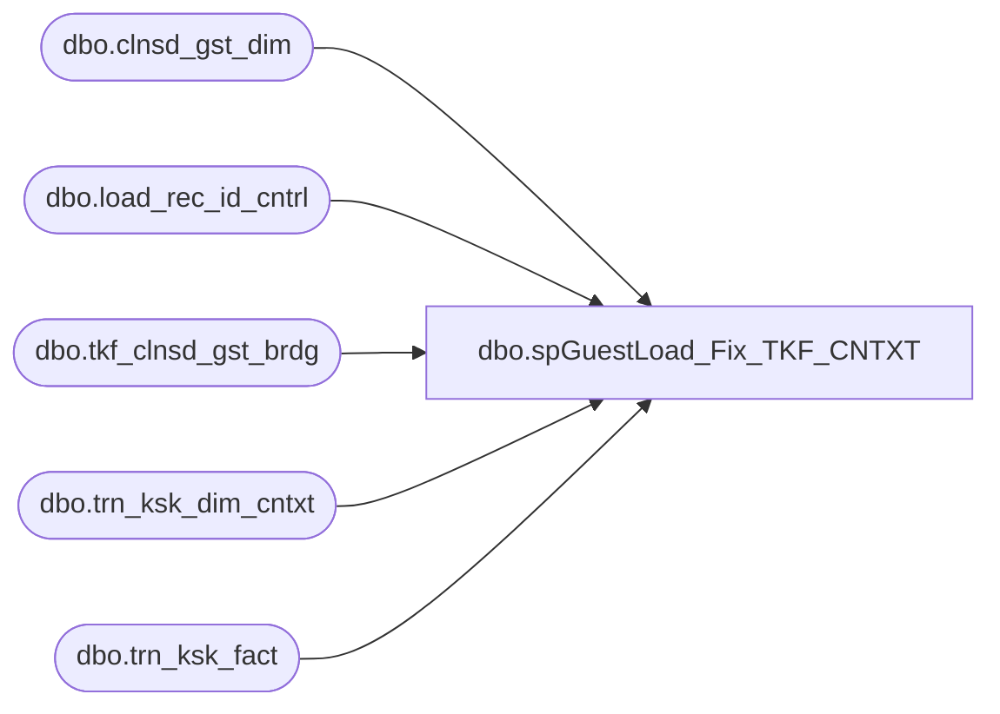

# dbo.spGuestLoad_Fix_TKF_CNTXT

**Database:** dw  
**Server:** papamart  

## Architecture Diagram



## Table Dependencies

| Referenced Table |
|---|
| dbo.clnsd_gst_dim |
| dbo.load_rec_id_cntrl |
| dbo.tkf_clnsd_gst_brdg |
| dbo.trn_ksk_dim_cntxt |
| dbo.trn_ksk_fact |

## Stored Procedure Code

```sql
CREATE PROCEDURE [dbo].[spGuestLoad_Fix_TKF_CNTXT](@etl_log_id int)
AS
-- =============================================================================================================
-- Name: spGuestLoad_Fix_TKF_CNTXT
--
-- Description:	
--		rows to trn_ksk_dim_cntxt are loaded as needed.  we did not try to compute every possible permutation of the columns,
--		so for each guest load, we only insert what is necessary and then we tie the tkf records to the contexts.
--		The issue is that things can change based on when the data is loaded and in what order.  so we have to look for missing
--		permutations.  The first tkf record of a guest might not really be the first record so we have to add the repeat version
--		of the context and then fix those guests records.
--
-- Input:
--		@etl_log_id				int	
--			last guest load to touch this, used for logging.  if truncing the table, any int will do
--
-- Output: 
--		data will be loaded into dw.dbo.trn_ksk_dim_cntxt and then the trn_ksk_fact will be updated
--
-- Dependencies: 
--
-- EXAMPLE:
--		exec dw.dbo.spGuestLoad_Fix_TKF_CNTXT -1
--
-- Revision History
--		Name:			Date:			Comments:
--		Dave Rice		7/19/2010		created
--		Mike Pelikan	2/21/2012		Added ISNULL(@etl_log_id, -1) logic for @etl_log_id insert into dw.dbo.TRN_KSK_DIM_CNTXT 
-- Debuging
--DECLARE @etl_log_id int
--SET @etl_log_id = NULL
---- =============================================================================================================
BEGIN

SET NOCOUNT ON


/*
the problem is that the kiosk records might be inserted out of order or even more confusing,
the guests might be merged

*/

IF (Object_ID('tempdb..#gst_min_date_cntxt') IS NOT NULL) DROP TABLE #gst_min_date_cntxt
create table #gst_min_date_cntxt (
	clnsd_gst_id integer,
	min_dt_id integer
)

IF (Object_ID('tempdb..#addr_min_date_cntxt') IS NOT NULL) DROP TABLE #addr_min_date_cntxt
create table #addr_min_date_cntxt (
	clnsd_addr_id integer,
	min_dt_id integer
)

if @etl_log_id is null
begin
	insert into #gst_min_date_cntxt(clnsd_gst_id, min_dt_id)
	select b.clnsd_gst_id, min(tkf.dt_id) min_dt_id
	from dw.dbo.tkf_clnsd_gst_brdg b with (nolock)
		join dw.dbo.trn_ksk_fact tkf with (nolock)
		on tkf.tkf_id = b.tkf_id
	group by b.clnsd_gst_id

	insert into #addr_min_date_cntxt(clnsd_addr_id, min_dt_id)
	select cgd.clnsd_addr_id, min(tkf.dt_id) min_dt_id
	from dw.dbo.tkf_clnsd_gst_brdg b with (nolock)
		join dw.dbo.trn_ksk_fact tkf with (nolock)
		on tkf.tkf_id = b.tkf_id
		join dw.dbo.clnsd_gst_dim cgd  with (nolock) 
		on cgd.clnsd_gst_id = b.clnsd_gst_id
	where cgd.clnsd_addr_id >= 0
	group by cgd.clnsd_addr_id
end
else
begin
	insert into #gst_min_date_cntxt(clnsd_gst_id, min_dt_id)
	select b.clnsd_gst_id, min(tkf.dt_id) min_dt_id
	from dwstaging.dbo.load_rec_id_cntrl lric with (nolock)
		join dw.dbo.tkf_clnsd_gst_brdg b with (nolock) 
		on b.clnsd_gst_id = lric.clnsd_gst_id
		join dw.dbo.trn_ksk_fact tkf with (nolock)
		on tkf.tkf_id = b.tkf_id
	where lric.etl_log_id = @etl_log_id
		and lric.clnsd_gst_id >= 0
	group by b.clnsd_gst_id

	insert into #addr_min_date_cntxt(clnsd_addr_id, min_dt_id)
	select lric.clnsd_addr_id, min(tkf.dt_id) min_dt_id
	from dwstaging.dbo.load_rec_id_cntrl lric with (nolock)
		join dw.dbo.clnsd_gst_dim cgd  with (nolock) 
		on cgd.clnsd_addr_id = lric.clnsd_addr_id
		join dw.dbo.tkf_clnsd_gst_brdg b with (nolock) 
		on b.clnsd_gst_id = cgd.clnsd_gst_id
		join dw.dbo.trn_ksk_fact tkf with (nolock)
		on tkf.tkf_id = b.tkf_id
	where lric.etl_log_id = @etl_log_id
		and cgd.clnsd_addr_id >= 0
	group by lric.clnsd_addr_id
end

-- need to run this twice because the first run will identify missing new/repeat contexts
declare @i as integer
set @i = 1
while @i <= 2
begin
	-- find any tkf records that have the trn_ksk_dim_cntxt wrong, these will have to be fixed
	IF (Object_ID('tempdb..#trn_ksk_fact_first_repeat_fix') IS NOT NULL) DROP TABLE #trn_ksk_fact_first_repeat_fix
	select *
	into #trn_ksk_fact_first_repeat_fix
	from (
		select tkf.tkf_id,
			case 
				when gmd.min_dt_id = dt_id and gst_vst_recur_cd = 'N' then 'N'
				when gmd.min_dt_id = dt_id and gst_vst_recur_cd != 'N' then 'N'
				when gmd.min_dt_id != dt_id and gst_vst_recur_cd = 'R' then 'R'
				when gmd.min_dt_id != dt_id and gst_vst_recur_cd != 'R' then 'R'
				else 'oops'
			end gst_fix,
			case 
				when amd.min_dt_id = dt_id and addr_vst_recur_cd = 'N' then 'N'
				when amd.min_dt_id = dt_id and addr_vst_recur_cd != 'N' then 'N'
				when amd.min_dt_id != dt_id and addr_vst_recur_cd = 'R' then 'R'
				when amd.min_dt_id != dt_id and addr_vst_recur_cd != 'R' then 'R'
				else 'oops'
			end addr_fix,
	--		c.trn_ksk_cntxt_id trn_ksk_cntxt_id_old,
	--
			gst_vst_recur_cd gst_vst_recur_cd_old, 
	--		gst_vst_recur_descr gst_vst_recur_descr_old,
	--
			addr_vst_recur_cd addr_vst_recur_cd_old, 
	--		addr_vst_recur_descr addr_vst_recur_descr_old,

			prty_trn_ind prty_trn_ind_old,
			gift_ind gift_ind_old,
			ksk_nbr ksk_nbr_old,
			ksk_lang_cd ksk_lang_cd_old

	--		gmd.min_dt_id gst_min_dt_id, amd.min_dt_id addr_min_dt_id, tkf.dt_id
		from dw.dbo.trn_ksk_fact tkf with (nolock)
			join dw.dbo.tkf_clnsd_gst_brdg b with (nolock)
			on b.tkf_id = tkf.tkf_id
			join dw.dbo.clnsd_gst_dim cgd with (nolock)
			on cgd.clnsd_gst_id = b.clnsd_gst_id
			join dw.dbo.trn_ksk_dim_cntxt c with (nolock)
			on c.trn_ksk_cntxt_id = tkf.trn_ksk_cntxt_id
			join #gst_min_date_cntxt gmd
			on gmd.clnsd_gst_id = b.clnsd_gst_id
			join #addr_min_date_cntxt amd
			on amd.clnsd_addr_id = cgd.clnsd_addr_id
		where b.clnsd_gst_id >= 0
		) d
		left join dw.dbo.trn_ksk_dim_cntxt c with (nolock)
		on c.gst_vst_recur_cd = d.gst_fix
		and c.gst_vst_recur_descr = case when d.gst_fix = 'N' then 'New' else 'Repeat' end
		and c.addr_vst_recur_cd = d.addr_fix	
		and c.addr_vst_recur_descr = case when d.addr_fix = 'N' then 'New' else 'Repeat' end
		and c.prty_trn_ind = d.prty_trn_ind_old
		and c.gift_ind = d.gift_ind_old
		and c.ksk_nbr = d.ksk_nbr_old
		and c.ksk_lang_cd = d.ksk_lang_cd_old
	where gst_fix != gst_vst_recur_cd_old
		or addr_fix != addr_vst_recur_cd_old

--	create index ix_#trn_ksk_fact_first_repeat_fix on #trn_ksk_fact_first_repeat_fix(tkf_id)

	if @i = 1
	begin
		-- do we have missing contexts????  if so, we need to add them and then rerun the above statement
		insert into dw.dbo.trn_ksk_dim_cntxt (gst_vst_recur_cd, gst_vst_recur_descr, addr_vst_recur_cd, addr_vst_recur_descr, 
			prty_trn_ind, gift_ind, ksk_nbr, ksk_lang_cd, ins_dt, etl_log_id, etl_evnt_id)
		select distinct 
			gst_fix, case when gst_fix = 'N' then 'New' else 'Repeat' end,  
			addr_fix, case when addr_fix = 'N' then 'New' else 'Repeat' end,  
			prty_trn_ind_old, gift_ind_old, ksk_nbr_old, ksk_lang_cd_old, getdate(), ISNULL(@etl_log_id, -1), 1 etl_evnt_id
		from #trn_ksk_fact_first_repeat_fix
		where trn_ksk_cntxt_id is null
	end
	else
	begin
		-- bypass the next loop
		set @i = @i + 1
	end

	set @i = @i + 1
end

if (select count(*) from #trn_ksk_fact_first_repeat_fix) > 0 
begin
	declare @j int
	declare @max int
	declare @inc int
	set @j = 0
	set @inc = 10000
	set @max = (select max(tkf_id) from #trn_ksk_fact_first_repeat_fix)
	--set @max = 1000

	while @j < @max+1
	begin 
		update dw.dbo.trn_ksk_fact
		set trn_ksk_cntxt_id = d.trn_ksk_cntxt_id
		from dw.dbo.trn_ksk_fact tkf
			join #trn_ksk_fact_first_repeat_fix d
			on d.tkf_id = tkf.tkf_id
		where d.tkf_id between @j and @j + @inc-1

		print cast(@j as varchar) + ' - ' + cast(@j + @inc-1 as varchar)

		set @j = @j + @inc 
	end
end

END
```

