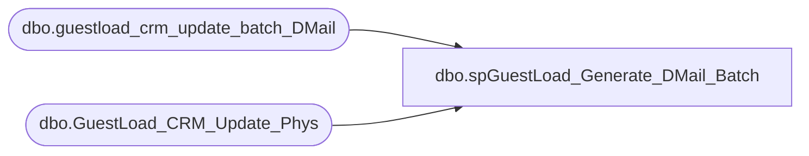

# dbo.spGuestLoad_Generate_DMail_Batch

**Database:** dw  
**Server:** papamart  

## Architecture Diagram



## Table Dependencies

| Referenced Table |
|---|
| dbo.guestload_crm_update_batch_DMail |
| dbo.GuestLoad_CRM_Update_Phys |

## Stored Procedure Code

```sql
-- =============================================================================================================
-- Name: spGuestLoad_Generate_DMail_Batch
--
-- Description:	
--		This procedure will start the process to migrate the DMail changes from the datawarehouse to CRM.
--		This procedure creates a batch record and then flags a number of records to be contained in that batch.
--
-- Input:
--		@numRecsToProcess			int	
--			Number of records to be contained in the batch
--
-- Output: 
--		The batch number
--
-- Dependencies: 
--
-- EXAMPLE:
--		? = exec dw.dbo.spGuestLoad_Generate_DMail_Batch
--
-- Revision History
--		Name:				Date:			Comments:
--		Gary Murrish		11/14/2013		Fixed to block 'blank' addresses
--		Gary Murrish		4/8/2011		Tweeks for ?Performance
--		Gary Murrish		2/25/2011		Ignore addresses where the old address lines 1 and 2 are blank
--		Gary Murrish		12/30/2010		created
-- =============================================================================================================
CREATE PROCEDURE [dbo].[spGuestLoad_Generate_DMail_Batch] 
	-- Add the parameters for the stored procedure here
    @numRecsToProcess int = 10
AS
BEGIN
	-- SET NOCOUNT ON added to prevent extra result sets from
	-- interfering with SELECT statements.
    SET NOCOUNT ON ;

	-- Construct the batch number
    DECLARE @thisBatch int
    INSERT INTO
        dw.dbo.guestload_crm_update_batch_DMail
        (
         INS_DT)
    VALUES
        (
         GETDATE())
    SELECT
        @thisBatch = SCOPE_IDENTITY()


	-- Eliminate all addresses where both address_line_1 and address_line _2 is empty
    UPDATE
        dw.dbo.GuestLoad_CRM_Update_Phys
    SET
        BATCH_ID = -1 * @thisBatch
    WHERE
    BATCH_ID IS NULL
    AND LTRIM(RTRIM(ISNULL(ADDR_LN_1_TXT_OLD, ''))) = ''
    AND LTRIM(RTRIM(ISNULL(ADDR_LN_2_TXT_OLD, ''))) = ''

	-- Eliminate all addresses where we are not told to do anything
    UPDATE
        dw.dbo.GuestLoad_CRM_Update_Phys
    SET
        BATCH_ID = -1 * @thisBatch
    WHERE
    BATCH_ID IS NULL
    AND CLEANSABLE IS null

	-- Eliminate all addresses where address_line_1  = 'AddressLine1'
    UPDATE
        dw.dbo.GuestLoad_CRM_Update_Phys
    SET
        BATCH_ID = -1 * @thisBatch
    WHERE
    BATCH_ID IS NULL
    AND LTRIM(RTRIM(ISNULL(ADDR_LN_1_TXT_OLD, ''))) = 'AddressLine1'
    

	-- Determine the addresses that will be consolidated into the batch
	--	they will be the oldest ones to be processed
	-- These are consolidated together because there may be more than one
	--	transaction for this address and they have to be processed together
    SELECT TOP (@numRecsToProcess)
        TRIG.CNTRY_TXT_OLD
       ,TRIG.ADDR_LN_1_TXT_OLD
       ,TRIG.ADDR_LN_2_TXT_OLD
       ,TRIG.PSTL_CD_OLD
    INTO
        #tmpToProcess
    FROM
        dbo.GuestLoad_CRM_Update_Phys TRIG WITH (NOLOCK)
    WHERE
    BATCH_ID = 0
    OR BATCH_ID IS NULL
    GROUP BY
        TRIG.CNTRY_TXT_OLD
           ,TRIG.ADDR_LN_1_TXT_OLD
           ,TRIG.ADDR_LN_2_TXT_OLD
           ,TRIG.PSTL_CD_OLD
    ORDER BY
        MIN(TRIG.INS_DT) 


	-- Flag the records that we will be processed in this batch
    UPDATE
        dw.dbo.GuestLoad_CRM_Update_Phys
    SET
        batch_id = @thisBatch
    FROM
        dw.dbo.GuestLoad_CRM_Update_Phys PHYS
        INNER JOIN #tmpToProcess TRIG
        ON ISNULL(PHYS.CNTRY_TXT_OLD, '') = ISNULL(TRIG.CNTRY_TXT_OLD, '')
        AND ISNULL(PHYS.ADDR_LN_1_TXT_OLD, '') = ISNULL(TRIG.ADDR_LN_1_TXT_OLD, '')
        AND ISNULL(PHYS.ADDR_LN_2_TXT_OLD, '') = ISNULL(TRIG.ADDR_LN_2_TXT_OLD, '')
        AND ISNULL(PHYS.PSTL_CD_OLD, '') = ISNULL(TRIG.PSTL_CD_OLD, '')
    WHERE
        (BATCH_ID = 0
        OR BATCH_ID IS NULL)

    DROP TABLE #tmpToProcess

    RETURN @thisBatch
END
```

